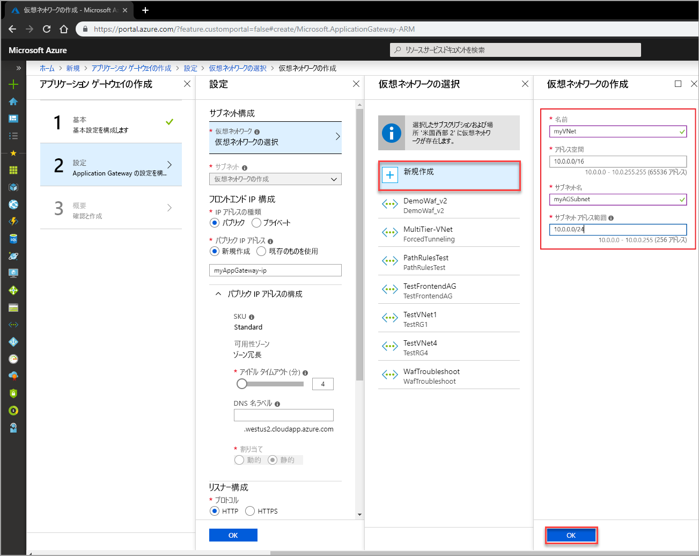
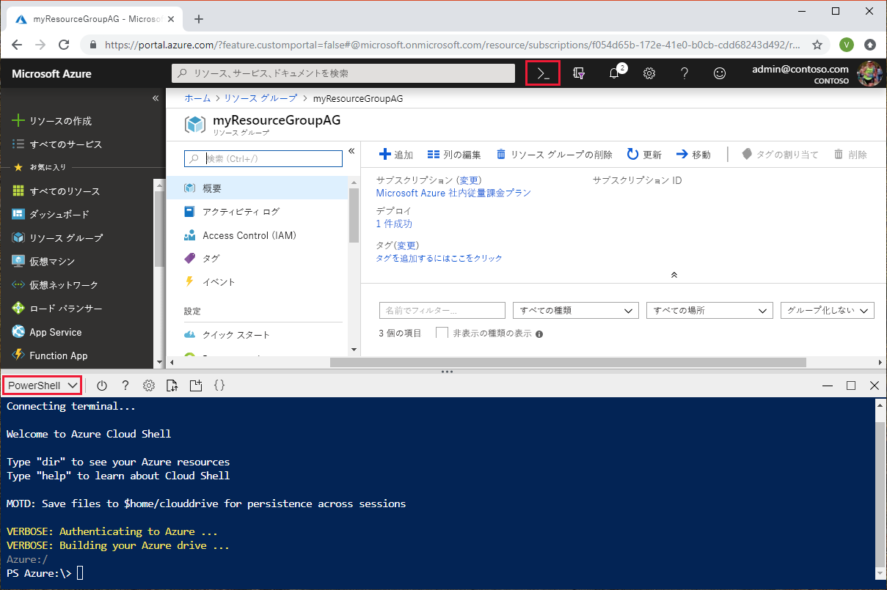
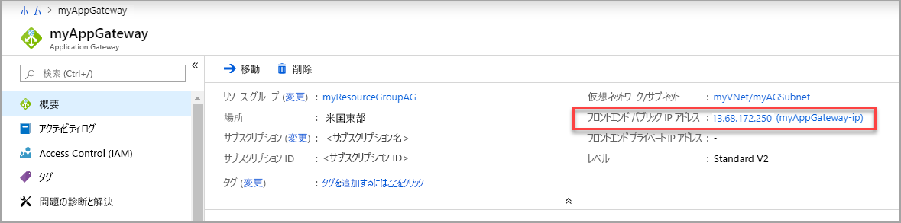

# <a name="quickstart-direct-web-traffic-with-azure-application-gateway---azure-portal"></a>クイック スタート: Azure Application Gateway による Web トラフィックのルーティング - Azure portal

Azure Application Gateway では、ポートにリスナーを割り当て、規則を作成し、バックエンド プールにリソースを追加することによって、アプリケーション Web トラフィックを特定のリソースにルーティングできます。

このクイック スタートでは、Azure Portal を使用して、そのバックエンド プール内の 2 つの仮想マシンで、アプリケーション ゲートウェイをすばやく作成する方法を示します。 さらに、それをテストし、正しく動作していることを確認します。

Azure サブスクリプションをお持ちでない場合は、開始する前に [無料アカウント](https://azure.microsoft.com/free/?WT.mc_id=A261C142F) を作成してください。

## <a name="sign-in-to-azure"></a>Azure へのサインイン

Azure Portal ([https://portal.azure.com](https://portal.azure.com)) にサインインします。

## <a name="create-an-application-gateway"></a>アプリケーション ゲートウェイの作成

作成したリソース間の通信には仮想ネットワークが必要です。 この例では 2 つのサブネットが作成されます。1 つはアプリケーション ゲートウェイ用で、もう 1 つはバックエンド サーバー用です。 仮想ネットワークは、アプリケーション ゲートウェイを作成するときに同時に作成できます。

1. Azure Portal の左上隅にある **[リソースの作成]** をクリックします。
2. **[ネットワーク]** をクリックし、注目のリストで **[アプリケーション ゲートウェイ]** をクリックします。

### <a name="basics"></a>基本

1. 次のアプリケーション ゲートウェイの値を入力します。

    - *myAppGateway* - アプリケーション ゲートウェイの名前です。
    - *myResourceGroupAG* - 新しいリソース グループの名前です。

    

2. 他の設定は既定値をそのまま使用し、**[OK]** をクリックします。

### <a name="settings"></a>設定

1. **[仮想ネットワークの選択]**、**[新規作成]** の順にクリックし、次の仮想ネットワークの値を入力します。

    - *myVNet* - 仮想ネットワークの名前です。
    - *10.0.0.0/16* - 仮想ネットワークのアドレス空間です。
    - *myAGSubnet* - サブネットの名前です。
    - *10.0.0.0/24* - サブネットのアドレス範囲です。

    

6. **[OK]** をクリックして [設定] ページに戻ります。
7. **[フロントエンド IP 構成]** で **[IP アドレスの種類]** が **[パブリック]** に設定されていること、および **[パブリック IP アドレス]** で **[新規作成]** が選択されていることを確認します。 パブリック IP アドレス名として「*myAGPublicIPAddress*」と入力します。 他の設定は既定値をそのまま使用し、**[OK]** をクリックします。

### <a name="summary"></a>まとめ

概要ページで設定を確認し、**[OK]** をクリックして、仮想ネットワーク、パブリック IP アドレス、およびアプリケーション ゲートウェイを作成します。 アプリケーション ゲートウェイの作成には数分かかる場合があります。 次のセクションに進む前に、デプロイが正常に完了するまで待機します。

## <a name="add-a-subnet"></a>サブネットの追加

1. 左側のメニューで **[すべてのリソース]** をクリックし、リソースの一覧で **[myVNet]** をクリックします。
2. **[サブネット]**、**[+ サブネット]** の順にクリックします。

    

3. サブネットの名前として「*myBackendSubnet*」を入力し、**[OK]** をクリックします。

## <a name="create-backend-servers"></a>バックエンド サーバーの作成

この例では、アプリケーション ゲートウェイのバックエンド サーバーとして使用する 2 つの仮想マシンを作成します。 また、IIS を仮想マシンにインストールして、アプリケーション ゲートウェイが正常に作成されたことを確認します。

### <a name="create-a-virtual-machine"></a>仮想マシンの作成

1. Azure Portal で、**[リソースの作成]** をクリックします。
2. **[コンピューティング]** をクリックし、注目のリストで **[Windows Server 2016 Datacenter]** を選択します。
3. 次の仮想マシンの値を入力します。

    - *myResourceGroupAG* - リソース グループです。
    - *myVM* - 仮想マシンの名前です。
    - *azureuser* - 管理者のユーザー名です。
    - *Azure123456!* 入力します。

   他の既定値をそのまま使用し、**[次へ: ディスク]** をクリックします。
4. 既定値をそのまま使用し、**[次へ: ネットワーク]** をクリックします。
5. 仮想ネットワークに対して **[myVNet]** が選択されていること、およびサブネットが **myBackendSubnet** であることを確認します。
6. 他の既定値をそのまま使用し、**[次へ: 管理]** をクリックします。
7. **[オフ]** をクリックして、ブート診断を無効にします。 他の既定値をそのまま使用し、**[確認および作成]** をクリックします。
8. 概要ページの設定を確認して、**[作成]** をクリックします。
9. 仮想マシンの作成が完了するのを待って先に進みます。

### <a name="install-iis"></a>IIS のインストール

1. 対話型シェルを開いて、**PowerShell** に設定されていることを確認します。

    

2. 次のコマンドを実行して、IIS を仮想マシンにインストールします。 

    ```azurepowershell-interactive
    Set-AzureRmVMExtension `
      -ResourceGroupName myResourceGroupAG `
      -ExtensionName IIS `
      -VMName myVM `
      -Publisher Microsoft.Compute `
      -ExtensionType CustomScriptExtension `
      -TypeHandlerVersion 1.4 `
      -SettingString '{"commandToExecute":"powershell Add-WindowsFeature Web-Server; powershell Add-Content -Path \"C:\\inetpub\\wwwroot\\Default.htm\" -Value $($env:computername)"}' `
      -Location EastUS
    ```

3. 2 番目の仮想マシンを作成し、終了したばかりの手順を使用して、IIS をインストールします。 その名前および AzureRmVMExtension の VMName として「*myVM2*」を入力します。

### <a name="add-backend-servers"></a>バックエンド サーバーの追加

1. **[すべてのリソース]**、**[myAppGateway]** の順にクリックします。
4. **[バックエンド プール]** をクリックします。 既定のプールがアプリケーション ゲートウェイで自動的に作成されます。 **[appGatewayBackendPool]** をクリックします。
5. **[ターゲット]** で、**[IP アドレスまたは FQDN]** をクリックし、**[仮想マシン]** を選択します。
6. **[仮想マシン]** で、仮想マシン (myVM と myVM2) とそれらに関連付けられたネットワーク インターフェイスを追加します。

    

6. **[Save]** をクリックします。

## <a name="test-the-application-gateway"></a>アプリケーション ゲートウェイのテスト

1. [概要] 画面で、アプリケーション ゲートウェイのパブリック IP アドレスを見つけます。 **[すべてのリソース]**、**[myAGPublicIPAddress]** の順にクリックします。

    

2. パブリック IP アドレスをコピーし、ブラウザーのアドレス バーに貼り付けます。

    

## <a name="clean-up-resources"></a>リソースのクリーンアップ

必要がなくなったら、リソース グループ、アプリケーション ゲートウェイ、およびすべての関連リソースを削除します。 これを行うには、アプリケーション ゲートウェイを含むリソース グループを選択し、**[削除]** をクリックします。

## <a name="next-steps"></a>次の手順

> [!div class="nextstepaction"]
> [Azure CLI を使用してアプリケーション ゲートウェイで Web トラフィックを管理する](./tutorial-manage-web-traffic-cli.md)
