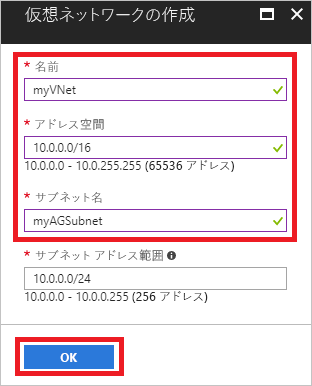
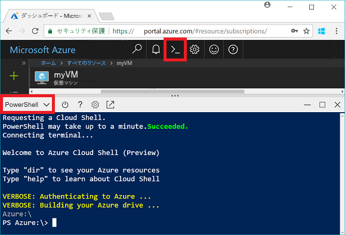
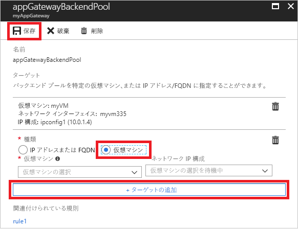

# <a name="quickstart-direct-web-traffic-with-azure-application-gateway---azure-portal"></a>クイック スタート - Azure Application Gateway による Web トラフィックのルーティング - Azure Portal

Azure Application Gateway では、ポートにリスナーを割り当て、ルールを作成し、バックエンド プールにリソースを追加することによって、アプリケーション Web トラフィックを特定のリソースにルーティングできます。

このクイック スタートでは、Azure Portal を使用して、そのバックエンド プール内の 2 つの仮想マシンで、アプリケーション ゲートウェイをすばやく作成する方法を示します。 さらに、それをテストし、正しく動作していることを確認します。

Azure サブスクリプションをお持ちでない場合は、開始する前に [無料アカウント](https://azure.microsoft.com/free/?WT.mc_id=A261C142F) を作成してください。

## <a name="log-in-to-azure"></a>Azure にログインする

Azure Portal ([http://portal.azure.com](http://portal.azure.com)) にログインする

## <a name="create-an-application-gateway"></a>アプリケーション ゲートウェイの作成

アプリケーション ゲートウェイが他のリソースと通信できるように仮想ネットワークを作成する必要があります。 仮想ネットワークは、アプリケーション ゲートウェイを作成するときに同時に作成できます。 この例では 2 つのサブネットが作成されます。1 つはアプリケーション ゲートウェイ用で、もう 1 つは仮想マシン用です。 

1. Azure Portal の左上隅にある **[リソースの作成]** をクリックします。
2. **[ネットワーク]** を選択し、注目のリストで **[Application Gateway]** を選択します。
3. 次のアプリケーション ゲートウェイの値を入力します。

    - *myAppGateway* - アプリケーション ゲートウェイの名前です。
    - *myResourceGroupAG* - 新しいリソース グループの名前です。

    

4. 他の設定は既定値をそのまま使用し、**[OK]** をクリックします。
5. **[仮想ネットワークの選択]** > **[新規作成]** の順にクリックし、仮想ネットワークに次の値を入力します。

    - *myVNet* - 仮想ネットワークの名前です。
    - *10.0.0.0/16* - 仮想ネットワークのアドレス空間です。
    - *myAGSubnet* - サブネットの名前です。
    - *10.0.0.0/24* - サブネットのアドレス空間です。

    

6. **[OK]** をクリックして、仮想ネットワークとサブネットを作成します。
6. **[パブリック IP アドレスの選択]**、 > **[新規作成]** の順にクリックし、パブリック IP アドレスの名前を入力します。 この例では、パブリック IP アドレスの名前は *myAGPublicIPAddress* にします。 他の設定は既定値をそのまま使用し、**[OK]** をクリックします。
8. リスナーの構成は既定値をそのまま使用し、Web アプリケーション ファイアウォールは無効のままにして、**[OK]** をクリックします。
9. 概要ページで設定を確認し、**[OK]** をクリックして、仮想ネットワーク、パブリック IP アドレス、およびアプリケーション ゲートウェイを作成します。 アプリケーション ゲートウェイの作成には最大 30 分かかる場合があります。デプロイが正常に終了するのを待ってから、次のセクションに進みます。

### <a name="add-a-subnet"></a>サブネットの追加

1. 左側のメニューで **[すべてのリソース]** をクリックし、リソースの一覧で **[myVNet]** をクリックします。
2. **[サブネット]** > **[サブネット]** の順にクリックします。

    

3. サブネットの名前として「*myBackendSubnet*」を入力し、**[OK]** をクリックします。

## <a name="create-backend-servers"></a>バックエンド サーバーの作成

この例では、アプリケーション ゲートウェイのバックエンド サーバーとして使用する 2 つの仮想マシンを作成します。 

### <a name="create-a-virtual-machine"></a>仮想マシンの作成

1. **[新規]** をクリックします。
2. **[Compute]** をクリックし、おすすめのリストで **[Windows Server 2016 Datacenter]** を選択します。
3. 次の仮想マシンの値を入力します。

    - *myVM* - 仮想マシンの名前です。
    - *azureuser* - 管理者のユーザー名です。
    - *Azure123456!* パスワードです。
    - **[既存のものを使用]**、*[myResourceGroupAG]* の順に選択します。

4. Click **OK**.
5. 仮想マシンのサイズとして **[DS1_V2]** を選択し、**[選択]** をクリックします。
6. 仮想ネットワークに対して **[myVNet]** が選択されていること、およびサブネットが **myBackendSubnet** であることを確認します。 
7. **[無効]** をクリックして、ブート診断を無効にします。
8. **[OK]** をクリックし、概要ページの設定を確認して、**[作成]** をクリックします。

### <a name="install-iis"></a>IIS のインストール

IIS を仮想マシンにインストールして、アプリケーション ゲートウェイが正常に作成されたことを確認します。

1. 対話型シェルを開いて、**PowerShell** に設定されていることを確認します。

    

2. 次のコマンドを実行して、IIS を仮想マシンにインストールします。 

    ```azurepowershell-interactive
    Set-AzureRmVMExtension `
      -ResourceGroupName myResourceGroupAG `
      -ExtensionName IIS `
      -VMName myVM `
      -Publisher Microsoft.Compute `
      -ExtensionType CustomScriptExtension `
      -TypeHandlerVersion 1.4 `
      -SettingString '{"commandToExecute":"powershell Add-WindowsFeature Web-Server; powershell Add-Content -Path \"C:\\inetpub\\wwwroot\\Default.htm\" -Value $($env:computername)"}' `
      -Location EastUS
    ```

3. 2 番目の仮想マシンを作成し、終了したばかりの手順を使用して、IIS をインストールします。 その名前および AzureRmVMExtension の VMName として「*myVM2*」を入力します。

### <a name="add-backend-servers"></a>バックエンド サーバーの追加

仮想マシンを作成したら、それらをアプリケーション ゲートウェイのバックエンド プールに追加する必要があります。

1. **[すべてのリソース]** > **[myAppGateway]** の順にクリックします。
2. **[バックエンド プール]** をクリックします。 既定のプールがアプリケーション ゲートウェイで自動的に作成されます。 **[appGatewayBackendPool]** をクリックします。
3. **[ターゲットの追加]** > **[仮想マシン]** の順にクリックし、*[myVM]* を選択します。 **[ターゲットの追加]** > **[仮想マシン]** の順に選択し、*[myVM2]* を選択します。

    

4. **[Save]** をクリックします。

## <a name="test-the-application-gateway"></a>アプリケーション ゲートウェイのテスト

アプリケーション ゲートウェイを作成するために IIS のインストールは必要はありませんが、このクイック スタートでは、アプリケーション ゲートウェイが正常に作成されたかどうかを確認するために、IIS をインストールしました。

1. [概要] 画面で、アプリケーション ゲートウェイのパブリック IP アドレスを見つけます。 **[すべてのリソース]** > **[myAGPublicIPAddress]** の順にクリックします。

    

2. パブリック IP アドレスをコピーし、ブラウザーのアドレス バーに貼り付けます。

    

ブラウザーを更新したら、他の VM の名前が表示されるはずです。

## <a name="clean-up-resources"></a>リソースのクリーンアップ

まずアプリケーション ゲートウェイによって作成されたリソースを調べ、必要がなくなったら、リソース グループ、アプリケーションゲートウェイ、およびすべての関連リソースを削除できます。 これを行うには、アプリケーション ゲートウェイを含むリソース グループを選択し、**[削除]** をクリックします。

## <a name="next-steps"></a>次の手順

> [!div class="nextstepaction"]
> [Azure CLI を使用してアプリケーション ゲートウェイで Web トラフィックを管理する](./tutorial-manage-web-traffic-cli.md)
