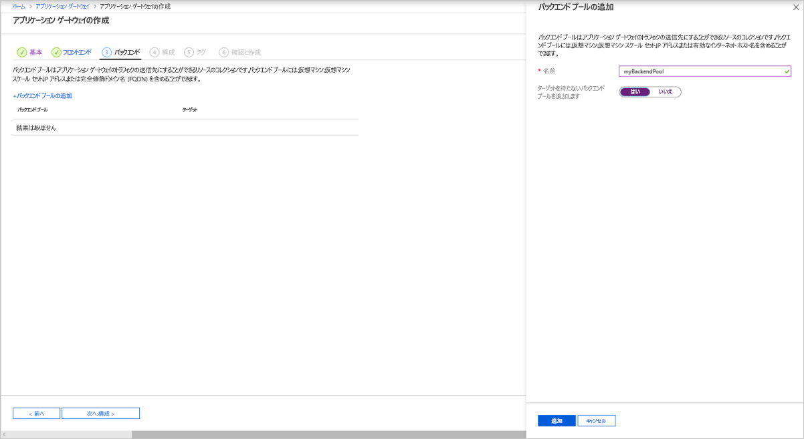
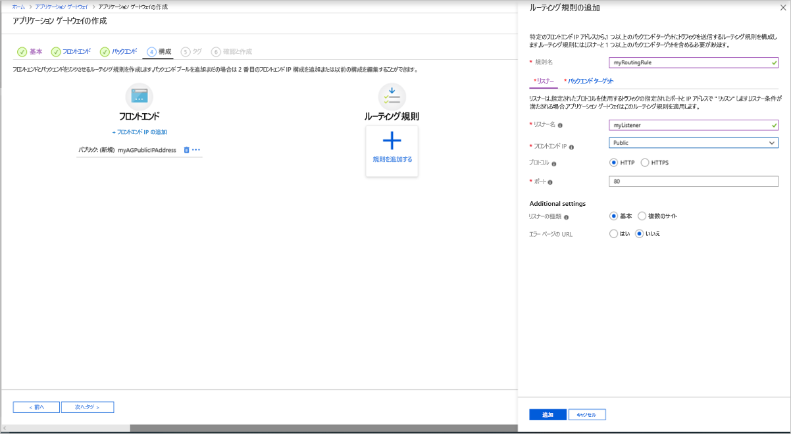
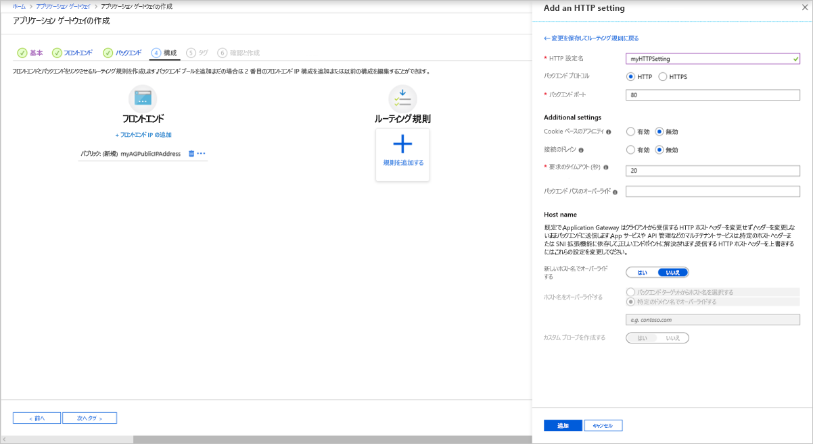
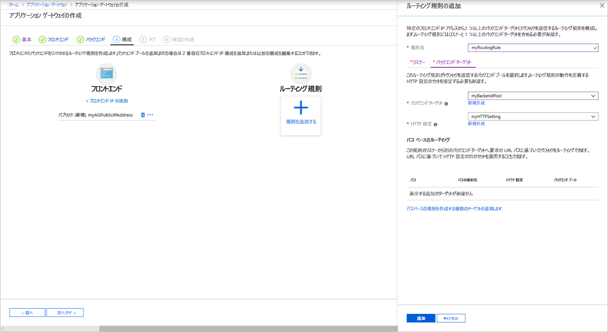

# <a name="quickstart-direct-web-traffic-with-azure-application-gateway---azure-portal"></a>クイック スタート:Azure Application Gateway による Web トラフィックのルーティング - Azure portal

このクイックスタートでは、Azure portal を使用してアプリケーション ゲートウェイを作成します。 さらに、それをテストし、正しく動作することを確認します。 

アプリケーション ゲートウェイは、アプリケーション Web トラフィックをバックエンド プール内の特定のリソースに転送します。 リスナーをポートに割り当て、ルールを作成し、リソースをバックエンド プールに追加します。 わかりやすくするために、この記事では、パブリック フロントエンド IP、アプリケーション ゲートウェイで単一サイトをホストするための基本リスナー、基本要求ルーティング規則、およびバックエンド プール内の 2 つの仮想マシンを使用する簡単な設定を使用します。

また、[Azure PowerShell](quick-create-powershell.md) または [Azure CLI](quick-create-cli.md) を使用してこのクイックスタートを完了することもできます。

[!INCLUDE [updated-for-az](../../includes/updated-for-az.md)]


## <a name="prerequisites"></a>前提条件

- アクティブなサブスクリプションが含まれる Azure アカウント。 [無料でアカウントを作成できます](https://azure.microsoft.com/free/?WT.mc_id=A261C142F)。

## <a name="sign-in-to-the-azure-portal"></a>Azure portal にサインインする

Azure アカウントで [Azure Portal](https://portal.azure.com) にサインインします。

## <a name="create-an-application-gateway"></a>アプリケーション ゲートウェイの作成

**[アプリケーションゲートウェイの作成]** ページのタブを使用して、アプリケーション ゲートウェイを作成します。

1. Azure portal メニュー上または **[ホーム]** ページから **[リソースの作成]** を選択します。 **[新規作成]** ウィンドウが表示されます。

2. **[ネットワーク]** を選択し、**おすすめ**のリストで **[Application Gateway]** を選択します。

### <a name="basics-tab"></a>[基本] タブ

1. **[基本]** タブで、次のアプリケーション ゲートウェイの設定に以下の値を入力します。

   - **[リソース グループ]** :リソース グループには、**myResourceGroupAG** を選択します。 存在しない場合は、 **[新規作成]** を選択して作成します。
   - **[アプリケーション ゲートウェイ名]** :アプリケーション ゲートウェイの名前として「*myAppGateway*」と入力します。

     

2. お客様が作成するリソースの間で Azure による通信が行われるには、仮想ネットワークが必要です。 新しい仮想ネットワークを作成することも、既存の仮想ネットワークを使用することもできます。 この例では、アプリケーション ゲートウェイの作成と同時に新しい仮想ネットワークを作成します。 Application Gateway インスタンスは、個別のサブネットに作成されます。 この例では 2 つのサブネットを作成します。1 つはアプリケーション ゲートウェイ用で、もう 1 つはバックエンド サーバー用です。

    **[仮想ネットワークの構成]** で、 **[新規作成]** を選択して新しい仮想ネットワークを作成します。 **[仮想ネットワークの作成]** ウィンドウが開いたら、次の値を入力して、仮想ネットワークと 2 つのサブネットを作成します。

    - **Name**:仮想ネットワークの名前として「*myVNet*」と入力します。

    - **[サブネット名]** (Application Gateway サブネット): **[サブネット]** グリッドには、 *[既定]* という名前のサブネットが表示されます。 このサブネットの名前を *myAGSubnet* に変更します。<br>アプリケーション ゲートウェイ サブネットには、アプリケーション ゲートウェイのみを含めることができます。 その他のリソースは許可されません。

    - **[サブネット名]** (バックエンド サーバー サブネット): **[サブネット]** グリッドの 2 行目で、 **[サブネット名]** 列に「*myBackendSubnet*」と入力します。

    - **[アドレス範囲]** (バックエンド サーバー サブネット): **[サブネット]** グリッドの 2 行目に、*myAGSubnet* のアドレス範囲と重複しないアドレス範囲を入力します。 たとえば、*myAGSubnet* のアドレス範囲が 10.0.0.0/24 の場合は、*myBackendSubnet* のアドレス範囲として「*10.0.1.0/24*」と入力します。

    **[OK]** を選択して **[仮想ネットワークの作成]** ウィンドウを閉じ、仮想ネットワークの設定を保存します。

     
    
3. **[基本]** タブで、その他の設定の既定値をそのまま使用し、 **[次へ:フロントエンド]** を選択します。

### <a name="frontends-tab"></a>[フロントエンド] タブ

1. **[フロントエンド]** タブで、 **[フロントエンド IP アドレスの種類]** が **[パブリック]** に設定されていることを確認します。 <br>ユース ケースに従って、フロントエンド IP を [パブリック] または [プライベート] に設定できます。 この例では、パブリック フロントエンド IP を選択します。
   > [!NOTE]
   > Application Gateway v2 SKU では、 **[パブリック]** フロントエンド IP 構成が存在する必要があります。 パブリックとプライベートの両方のフロントエンド IP 構成が存在していることはかまいませんが、プライベートのみのフロントエンド IP 構成 (ILB のみモード) は現在、v2 SKU では有効ではありません。 

2. **[パブリック IP アドレス]** として **[新規作成]** を選択し、パブリック IP アドレス名として「*myAGPublicIPAddress*」と入力し、 **[OK]** を選択します。 

     

3. **バックエンド** を選択します。

### <a name="backends-tab"></a>[バックエンド] タブ

バックエンド プールは、要求を処理するバックエンド サーバーに要求をルーティングするために使用されます。 バックエンド プールは、NIC、仮想マシン スケール セット、パブリック IP、内部 IP、完全修飾ドメイン名 (FQDN)、および Azure App Service などのマルチテナント バックエンドで構成できます。 この例では、アプリケーション ゲートウェイを使用して空のバックエンド プールを作成し、バックエンド ターゲットをバックエンド プールに追加します。

1. **[バックエンド]** タブで、 **[+ バックエンド プールの追加]** を選択します。

2. 開いた **[バックエンド プールの追加]** ウィンドウで、次の値を入力して空のバックエンド プールを作成します。

    - **Name**:バックエンド プールの名前として「*myBackendPool*」と入力します。
    - **[ターゲットを持たないバックエンド プールを追加します]** : **[はい]** を選択して、ターゲットを持たないバックエンド プールを作成します。 アプリケーション ゲートウェイを作成した後で、バックエンド ターゲットを追加します。

3. **[バックエンド プールの追加]** ウィンドウで、 **[追加]** を選択してバックエンド プールの構成を保存し、 **[バックエンド]** タブに戻ります。

     

4. **[バックエンド]** タブで、 **[次へ:構成]** を選択します。

### <a name="configuration-tab"></a>[構成] タブ

**[構成]** タブで、ルーティング規則を使用して作成したフロントエンドとバックエンド プールを接続します。

1. **[ルーティング規則]** 列で **[規則を追加する]** を選択します。

2. 開いた **[ルーティング規則の追加]** ウィンドウで、 **[規則名]** に「*myRoutingRule*」と入力します。

3. ルーティング規則にはリスナーが必要です。 **[ルーティング規則の追加]** ウィンドウ内の **[リスナー]** タブで、リスナーの次の値を入力します。

    - **[リスナー名]** :リスナーの名前として「*myListener*」と入力します。
    - **[フロントエンド IP]** : **[パブリック]** を選択して、フロントエンド用に作成したパブリック IP を選択します。
  
      **[リスナー]** タブで他の設定の既定値をそのまま使用し、 **[バックエンド ターゲット]** タブを選択して、ルーティング規則の残りの部分を構成します。

   

4. **[バックエンド ターゲット]** タブで、 **[バックエンド ターゲット]** の **[myBackendPool]** を選択します。

5. **[HTTP 設定]** には **[新規作成]** を選択して新しい HTTP 設定を作成します。 HTTP 設定によって、ルーティング規則の動作が決まります。 表示された **[HTTP 設定の追加]** ウィンドウで、 **[HTTP 設定名]** に「*myHTTPSetting*」と入力し、 **[バックエンド ポート]** に「*80*」と入力します。 **[HTTP 設定の追加]** ウィンドウで他の設定の既定値をそのまま使用し、 **[追加]** を選択して **[ルーティング規則の追加]** ウィンドウに戻ります。 

     

6. **[ルーティング規則の追加]** ウィンドウで **[追加]** を選択してルーティング規則を保存し、 **[構成]** タブに戻ります。

     

7. **タグ**、**次へ:確認と作成** をクリックします。

### <a name="review--create-tab"></a>[確認と作成] タブ

**[確認と作成 ]** タブの設定を確認し、 **[作成]** を選択して、仮想ネットワーク、パブリック IP アドレス、およびアプリケーションゲートウェイを作成します。 Azure によるアプリケーション ゲートウェイの作成には数分かかる場合があります。 次のセクションに進む前に、デプロイが正常に完了するまで待機します。

## <a name="add-backend-targets"></a>バックエンド ターゲットの追加

この例では、ターゲットのバックエンドとして仮想マシンを使用します。 既存の仮想マシンを使用することも、新しい仮想マシンを作成することもできます。 アプリケーション ゲートウェイのバックエンド サーバーとして 2 つの仮想マシンを作成します。

これを行うには、次を実行します。

1. バックエンド サーバーとして使用される 2 つの新しい VM (*myVM* と *myVM2*) を作成します。
2. IIS を仮想マシンにインストールして、アプリケーション ゲートウェイが正常に作成されたことを確認します。
3. バックエンド サーバーをバックエンド プールに追加します。

### <a name="create-a-virtual-machine"></a>仮想マシンの作成

1. Azure portal メニュー上または **[ホーム]** ページから **[リソースの作成]** を選択します。 **[新規作成]** ウィンドウが表示されます。
2. **[人気順]** の一覧で **[Windows Server 2016 Datacenter]** を選択します。 **[仮想マシンの作成]** ページが表示されます。<br>Application Gateway は、バックエンド プールで使用されているあらゆる種類の仮想マシンにトラフィックをルートできます。 この例では、Windows Server 2016 Datacenter を使用します。
3. **[基本]** タブで、次の仮想マシンの設定に以下の値を入力します。

    - **[リソース グループ]** :リソース グループ名には、**myResourceGroupAG** を選択します。
    - **[仮想マシン名]** : 仮想マシンの名前として「*myVM*」と入力します。
    - **[リージョン]** :アプリケーション ゲートウェイを作成したのと同じリージョンを選択します。
    - **[ユーザー名]** : 管理者のユーザー名に「*azureuser*」と入力します。
    - **パスワード**:パスワードを入力します。
4. 他の既定値をそのまま使用し、 **[Next: ディスク]** を選択します。  
5. **[ディスク]** タブの既定値をそのまま使用し、 **[Next: Networking]\(次へ : ネットワーク\)** を選択します。
6. **[ネットワーク]** タブで、 **[仮想ネットワーク]** に **myVNet** が選択されていること、および **[サブネット]** が **myBackendSubnet** に設定されていることを確認します。 他の既定値をそのまま使用し、 **[Next: 管理]** を選択します。<br>Application Gateway は、それが存在している仮想ネットワークの外部にあるインスタンスと通信できますが、IP 接続があることを確認する必要があります。
7. **[管理]** タブで、 **[ブート診断]** を **[オフ]** に設定します。 他の既定値をそのまま使用し、 **[確認および作成]** を選択します。
8. **[確認および作成]** タブで、設定を確認し、検証エラーを修正してから、 **[作成]** を選択します。
9. 仮想マシンの作成が完了するのを待って先に進みます。

### <a name="install-iis-for-testing"></a>テスト用の IIS のインストール

この例では、Azure がアプリケーション ゲートウェイを正常に作成したことを確認するためにのみ、仮想マシンに IIS をインストールします。

1. Azure PowerShell を開きます。 Azure portal の上部のナビゲーション バーで **[Cloud Shell]** を選択して、ドロップダウン リストで **[PowerShell]** を選択します。 

    

2. 次のコマンドを実行して、IIS を仮想マシンにインストールします。 必要に応じて、*Location* パラメーターを変更します。 

    ```azurepowershell-interactive
    Set-AzVMExtension `
      -ResourceGroupName myResourceGroupAG `
      -ExtensionName IIS `
      -VMName myVM `
      -Publisher Microsoft.Compute `
      -ExtensionType CustomScriptExtension `
      -TypeHandlerVersion 1.4 `
      -SettingString '{"commandToExecute":"powershell Add-WindowsFeature Web-Server; powershell Add-Content -Path \"C:\\inetpub\\wwwroot\\Default.htm\" -Value $($env:computername)"}' `
      -Location EastUS
    ```

3. 2 番目の仮想マシンを作成し、お客様が先ほど完了した手順を使用して IIS をインストールします。 仮想マシンの名前と、**Set-AzVMExtension** コマンドレットの **VMName** 設定には、*myVM2* を使用します。

### <a name="add-backend-servers-to-backend-pool"></a>バックエンド プールヘのバックエンド サーバーの追加

1. Azure portal メニューで **[すべてのリソース]** を選択するか、または *[すべてのリソース]* を検索して選択します。 次に、 **[myAppGateway]** を選択します。

2. 左側のメニューで **[バックエンド プール]** を選択します。

3. **[myBackendPool]** を選択します。

4. **[バックエンド ターゲット]** 、 **[ターゲットの種類]** の下のドロップダウン リストで **[仮想マシン]** を選択します。

5. **[ターゲット]** の下で、**myVM** と **myVM2** の仮想マシンを選択し、ドロップダウン リストからそれらに関連付けられているネットワーク インターフェイスを選択します。


   > [!div class="mx-imgBorder"]
   > 

6. **[保存]** を選択します。

7. デプロイが完了するまで待ってから次の手順に進んでください。

## <a name="test-the-application-gateway"></a>アプリケーション ゲートウェイのテスト

IIS はアプリケーション ゲートウェイを作成するのに必要ではありませんが、このクイックスタートでは、Azure によってアプリケーション ゲートウェイが正常に作成されたかどうかを確認するためにインストールしました。 IIS を使用してアプリケーション ゲートウェイをテストします。

1. アプリケーション ゲートウェイのパブリック IP アドレスをその **[概要]** ページで見つけます。 または、 **[すべてのリソース]** を選択し、検索ボックスに「*myAGPublicIPAddress*」と入力してから、検索結果でそれを選択することができます。 Azure によって、 **[概要]** ページにパブリック IP アドレスが表示されます。
2. パブリック IP アドレスをコピーし、お使いのブラウザーのアドレス バーに貼り付けて、その IP アドレスを開きます。
3. 応答を確認します。 有効な応答によって、アプリケーション ゲートウェイが正常に作成されたことが確認され、それによりバックエンドに正常に接続できます。

   

   ブラウザーを何度か更新すると、myVM と myVM2 の両方への接続が表示されます。

## <a name="clean-up-resources"></a>リソースをクリーンアップする

アプリケーション ゲートウェイと共に作成したリソースが不要になったら、リソース グループを削除します。 リソース グループを削除する際は、アプリケーション ゲートウェイと関連するすべてのリソースも削除します。

リソース グループを削除するには:

1. Azure portal メニューで **[リソース グループ]** を選択するか、または *[リソース グループ]* を検索して選択します。
2. **[リソース グループ]** ページで、リストの **myResourceGroupAG** を探して選択します。
3. **[リソース グループ] ページ**で、 **[リソース グループの削除]** を選択します。
4. **[TYPE THE RESOURCE GROUP NAME]\(リソース グループ名を入力してください\)** に「*myResourceGroupAG*」と入力し、 **[削除]** を選択します。

## <a name="next-steps"></a>次のステップ

> [!div class="nextstepaction"]
> [Azure CLI を使用してアプリケーション ゲートウェイで Web トラフィックを管理する](./tutorial-manage-web-traffic-cli.md)
