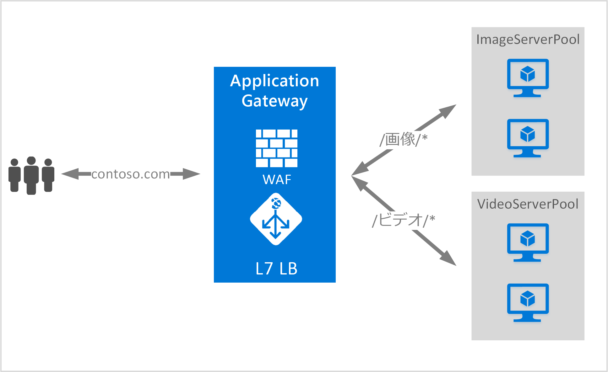

# <a name="url-path-based-routing-overview"></a>URL パス ベースのルーティングの概要

URL パス ベースのルーティングを使用すると、要求の URL パスに基づいてバックエンド サーバー プールにトラフィックをルーティングできます。 

1 つのシナリオとして、異なる種類のコンテンツの要求を、異なるバックエンド サーバー プールにルーティングします。

次の例では、Application Gateway は 3 つのバックエンド サーバー プールからの contoso.com のトラフィックを処理します (例: VideoServerPool、ImageServerPool、DefaultServerPool)。



http\://contoso.com/video/* に対する要求は VideoServerPool に、http\://contoso.com/images/* に対する要求は ImageServerPool に、それぞれルーティングされます。 一致するパス パターンがない場合は、DefaultServerPool が選択されます。

> [!IMPORTANT]
> 規則は、ポータルにおける表示順に処理されます。 基本リスナーを構成する前に、まずマルチサイト リスナーを構成することを強くお勧めします。  そうすることで、トラフィックが確実に適切なバックエンドにルーティングされます。 基本リスナーが先に表示されていて、なおかつ受信要求と一致した場合、そのリスナーによって要求が処理されます。

## <a name="urlpathmap-configuration-element"></a>UrlPathMap 構成要素

urlPathMap 要素は、パス パターンのバックエンド サーバー プールのマッピングへの指定に使用します。 次のコード例は、テンプレート ファイルの urlPathMap 要素のスニペットです。

```json
"urlPathMaps": [{
    "name": "{urlpathMapName}",
    "id": "/subscriptions/{subscriptionId}/../microsoft.network/applicationGateways/{gatewayName}/urlPathMaps/{urlpathMapName}",
    "properties": {
        "defaultBackendAddressPool": {
            "id": "/subscriptions/    {subscriptionId}/../microsoft.network/applicationGateways/{gatewayName}/backendAddressPools/{poolName1}"
        },
        "defaultBackendHttpSettings": {
            "id": "/subscriptions/{subscriptionId}/../microsoft.network/applicationGateways/{gatewayName}/backendHttpSettingsList/{settingname1}"
        },
        "pathRules": [{
            "name": "{pathRuleName}",
            "properties": {
                "paths": [
                    "{pathPattern}"
                ],
                "backendAddressPool": {
                    "id": "/subscriptions/{subscriptionId}/../microsoft.network/applicationGateways/{gatewayName}/backendAddressPools/{poolName2}"
                },
                "backendHttpsettings": {
                    "id": "/subscriptions/{subscriptionId}/../microsoft.network/applicationGateways/{gatewayName}/backendHttpsettingsList/{settingName2}"
                }
            }
        }]
    }
}]
```

### <a name="pathpattern"></a>PathPattern

PathPattern は照合するパス パターンの一覧です。 それぞれ / で始まる必要があり、"*" が許可されるのは末尾の "/" の後だけです。 パス照合に渡される文字列の最初の ? または # の後にテキストは含まれず、これらの文字はここでは許可されません。 それ以外の場合、URL で許可される文字はすべて PathPattern で許可されます。

Application Gateway v1 と v2 のいずれをデプロイしているかによって、サポートされるパターンは異なります。

#### <a name="v1"></a>v1

パス ルールでは大文字と小文字が区別されません。

|v1 のパス パターン  |サポートされているか  |
|---------|---------|
|`/images/*`     |はい|
|`/images*`     |×|
|`/images/*.jpg`     |×|
|`/*.jpg`     |×|
|`/Repos/*/Comments/*`     |×|
|`/CurrentUser/Comments/*`     |はい|

#### <a name="v2"></a>v2

パス ルールでは大文字と小文字が区別されません。

|v2 のパス パターン  |サポートされているか  |
|---------|---------|
|`/images/*`     |はい|
|`/images*`     |はい|
|`/images/*.jpg`     |×|
|`/*.jpg`     |×|
|`/Repos/*/Comments/*`     |×|
|`/CurrentUser/Comments/*`     |はい|

詳しくは、「 [Resource Manager template using URL-based routing (URL ベースのルーティングを使用した Resource Manager テンプレート)](https://azure.microsoft.com/documentation/templates/201-application-gateway-url-path-based-routing) 」をご覧ください。

## <a name="pathbasedrouting-rule"></a>PathBasedRouting ルール

タイプ PathBasedRouting の RequestRoutingRule は、リスナーを urlPathMap にバインドする際に使用します。 このリスナーで受け取られるすべての要求は、urlPathMap に指定されたポリシーに基づいてルーティングされます。
PathBasedRouting ルールのスニペット:

```json
"requestRoutingRules": [
    {

"name": "{ruleName}",
"id": "/subscriptions/{subscriptionId}/../microsoft.network/applicationGateways/{gatewayName}/requestRoutingRules/{ruleName}",
"properties": {
    "ruleType": "PathBasedRouting",
    "httpListener": {
        "id": "/subscriptions/{subscriptionId}/../microsoft.network/applicationGateways/{gatewayName}/httpListeners/<listenerName>"
    },
    "urlPathMap": {
        "id": "/subscriptions/{subscriptionId}/../microsoft.network/applicationGateways/{gatewayName}/ urlPathMaps/{urlpathMapName}"
    },

}
    }
]
```

## <a name="next-steps"></a>次の手順

URL ベースのコンテンツ ルーティングについて理解したら、 [URL ベースのルーティングを使用した Application Gateway の作成](create-url-route-portal.md) に関するセクションに移動して、URL ルーティング ルールを使ってアプリケーション ゲートウェイを作成します。
