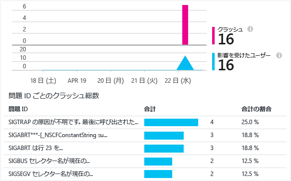

<properties
    pageTitle="Android アプリ向けの Application Insights | Microsoft Azure"
	description="Application Insights を使用して Android アプリの使用状況とパフォーマンスを分析します。"
	services="application-insights"
	documentationCenter="android"
	authors="alancameronwills"
	manager="ronmart"/>

<tags
    ms.service="application-insights"
	ms.workload="mobile"
	ms.tgt_pltfrm="mobile-android"
	ms.devlang="na"
	ms.topic="get-started-article"
	ms.date="04/28/2015"
	ms.author="awills"/>

# Android アプリ向けの Application Insights

Visual Studio の Application Insights を使用すると、使用状況、イベント、およびクラッシュに関してモバイル アプリケーションを監視できます。

## 必要条件

必要なものは次のとおりです。

* [Microsoft Azure](http://azure.com) のサブスクリプションWindows、XBox Live、またはその他の Microsoft クラウド サービスで所有している Microsoft アカウントを使用してサインインします。
* Android Studio
* Android SDK バージョン 9 以降。

## Application Insights リソースの作成

[Azure ポータル][portal]で、Application Insights の新しいリソースを作成します。Android のオプションを選択します。

![[新規]、[開発者向けサービス]、[Application Insights] の順に選択する](./media/app-insights-android/11-new.png)

表示されるブレードには、アプリケーションに関するパフォーマンスと使用状況データが表示されます。次に Azure にログインするときにこのブレードに戻るには、スタート画面でそのタイルを見つけてください。または、[参照] ボタンをクリックして、探します。

## Android Studio に Application Insights プラグインをインストールします

(まだインストールしていない場合)。

1.  Android Studio を起動し、プラグインを構成します。

    

2.  Application Insights の Android Studio プラグインを選択し、インストールします。

    

## <a name="sdk"></a>アプリケーションでの SDK のインストール


1.  **[ツール]**、**[Application Insights SDK を統合]** の順に選択します。

    

3.  サブスクリプション内でコンポーネントを作成します。

    

    Application Insights リソースから取得したインストルメンテーション キーを使用します。

4.  SDK をダウンロードし、プロジェクトと統合するには、Gradle を同期します。

    

    (詳細については、[[使い方] ページ](http://go.microsoft.com/fwlink/?LinkID=533220)を参照してください。)

この時点で、モジュール build.gradle に次の参照が追加され、`INTERNET` と `ACCESS_NETWORK_STATE` に対するアクセス許可とコンポーネントのインストルメンテーション キーを含むメタデータ タグがこのモジュールに追加されました。`AndroidManifest.xml`

```java

    dependencies {
    compile 'com.microsoft.azure:applicationinsights-android:+'
    }
```

```xml

    <manifest>
    <uses-permission android:name="android.permission.INTERNET" />
    <uses-permission android:name="android.permission.ACCESS_NETWORK_STATE" />

    <application>
        <meta-data
            android:name="com.microsoft.applicationinsights.instrumentationKey"
            android:value="${AI_INSTRUMENTATION_KEY}" />
    </application>
    </manifest>
```

#### 省略可能: コードでインストルメンテーション キーを設定

コードで、インストルメンテーション キーを設定することもできます。これにより、`AndroidManifest.xml` の設定が上書きされます。

```java

    ApplicationInsights.setup(this, "<YOUR-IKEY-GOES-HERE>");
    ApplicationInsights.start();
```


## SDK の使用

SDK を初期化し、テレメトリの追跡を開始します。

アプリのルート アクティビティに、次のインポートを追加します。

```java

     import com.microsoft.applicationinsights.library.ApplicationInsights;
```

アクティビティの `onCreate` コールバックに次のコードを追加します。

```java

    ApplicationInsights.setup(this.getApplicationContext(), this.getApplication());
    ApplicationInsights.start();
```

`ApplicationInsights.start()` が呼び出されると、SDK は Android のライフサイクル アクティビティと処理されていない例外の追跡を開始します。

> [AZURE.NOTE]アプリケーション ライフサイクル イベントは、Android SDK version 15 以上 (アイスクリームサンドイッチ以上) のみで収集されます。

さらに、カスタム イベント、トレース、メトリック、および処理された例外を収集できます。テレメトリを送信するには、[Application Insights API][api] のいずれかを使用します。

* その他のユーザーの操作には TrackEvent(eventName)。
* [診断ログの記録][diagnostic]には TrackTrace(logEvent)。
* Catch 句の TrackHandledException(exception)
* 特定のイベントに関連付けられていないメトリックの標準レポートをバックグラウンド タスクで送信するには TrackMetric(name, value)。

次のコードは、初期化と手動のテレメトリ収集の例です。

```java

    public class MyActivity extends Activity {

      @Override
      protected void onCreate(Bundle savedInstanceState) {

        ApplicationInsights.setup(this);
        //... other initialization code ...//
        ApplicationInsights.start();

        // track telemetry data
        TelemetryClient client = TelemetryClient.getInstance();
        HashMap<String, String> properties = new HashMap<String, String>();
        properties.put("property1", "my custom property");
        client.trackEvent("sample event", properties);
        client.trackTrace("sample trace");
        client.trackMetric("sample metric", 3);
        client.trackHandledException(new Exception("sample exception"));
      }
    }
```

## <a name="run"></a> プロジェクトの実行

テレメトリを生成するには、アプリケーションを実行します (Windows では、SHIFT キーを押しながら F10 キーを押し、OS X では CTRL キーを押しながら R キーを押します)。

## Application Insights でのデータの表示

http://portal.azure.com に戻り、Application Insights リソースを参照します。

**[検索]** をクリックして [[診断検索]][diagnostic] を開きます。ここには、最初のイベントが表示されます。何も表示されない場合は 1 ～ 2 分待機し、**[更新]** をクリックします。

![[診断検索] をクリックする](./media/app-insights-android/21-search.png)

アプリケーションを使用すると、データが [概要] ブレードに表示されます。

![[概要] ブレード](./media/app-insights-android/22-oview.png)

詳細情報を表示するグラフをクリックします。たとえば、クラッシュの場合は、次のようになります。




## <a name="usage"></a>次のステップ

[アプリの使用状況の追跡][track]

[診断検索][diagnostic]

[メトリックス エクスプローラー][metrics]

[トラブルシューティング][qna]


<!--Link references-->

[api]: app-insights-api-custom-events-metrics.md
[diagnostic]: app-insights-diagnostic-search.md
[metrics]: app-insights-metrics-explorer.md
[portal]: http://portal.azure.com/
[qna]: app-insights-troubleshoot-faq.md
[track]: app-insights-api-custom-events-metrics.md

<!---HONumber=August15_HO9-->