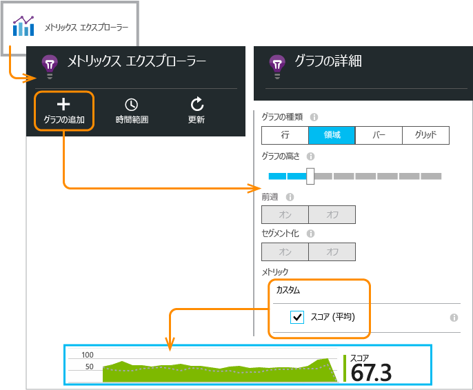

# <a name="application-insights-api-for-custom-events-and-metrics"></a>カスタムのイベントとメトリックのための Application Insights API


アプリケーションに数行のコードを挿入して、ユーザーの行動を調べたり、問題の診断に役立つ情報を取得したりすることができます。 デバイスとデスクトップ アプリケーション、Web クライアント、Web サーバーからテレメトリを送信できます。 [Azure Application Insights](app-insights-overview.md) コア テレメトリ API を使用すると、カスタムのイベントやメトリック、独自バージョンの標準テレメトリを送信できます。 この API は、Application Insights の標準のデータ コレクターで使用される API と同じものです。

## <a name="api-summary"></a>API の概要
この API は、いくつかの小さな違いは別として、すべてのプラットフォームで一様になっています。

| メソッド | 使用対象 |
| --- | --- |
| [`TrackPageView`](#page-views) |ページ、画面、ブレード、フォーム |
| [`TrackEvent`](#track-event) |ユーザー アクションとその他のイベント。 ユーザーの行動を追跡するために、またはパフォーマンスを監視するために使用されます。 |
| [`TrackMetric`](#track-metric) |キューの長さなど、特定のイベントに関連しないパフォーマンスを測定します。 |
| [`TrackException`](#track-exception) |診断用に例外を記録します。 他のイベントとの関連で例外の発生箇所を追跡し、スタック トレースを調べます。 |
| [`TrackRequest`](#track-request) |パフォーマンス分析用にサーバー要求の頻度と期間を記録します。 |
| [`TrackTrace`](#track-trace) |メッセージを記録し、診断に利用します。 サードパーティのログをキャプチャすることもできます。 |
| [`TrackDependency`](#track-dependency) |アプリが依存する外部コンポーネントへの呼び出しの実行時間と頻度を記録します。 |

これらのテレメトリの呼び出しのほとんどに [プロパティとメトリックをアタッチ](#properties) できます。

## <a name="prep"></a>開始する前に
次のことをまだ実行していない場合は、実行します。

* Application Insights SDK をプロジェクトに追加します。

  * [ASP.NET プロジェクト][greenbrown]
  * [Java プロジェクト][java]
  * [各 Web ページ のJavaScript][client]   
* デバイスまたは Web サーバー コードに次を追加します。

    *C#:* `using Microsoft.ApplicationInsights;`

    *Visual Basic:*`Imports Microsoft.ApplicationInsights`

    *Java:* `import com.microsoft.applicationinsights.TelemetryClient;`

## <a name="constructing-a-telemetryclient-instance"></a>TelemetryClient インスタンスの作成
TelemetryClient インスタンスを作成します (Web ページの JavaScript を除く)。

*C#*

    private TelemetryClient telemetry = new TelemetryClient();

*Visual Basic*

    Private Dim telemetry As New TelemetryClient

*Java*

    private TelemetryClient telemetry = new TelemetryClient();

TelemetryClient はスレッド セーフです。

アプリのモジュールごとに&1; つの TelemetryClient インスタンスを使用することをお勧めします。 たとえば、Web サービスで受信 HTTP 要求を報告する TelemetryClient インスタンスを使用し、ミドルウェア クラスでビジネス ロジック イベントを報告する別のインスタンスを使用します。 `TelemetryClient.Context.User.Id` などのプロパティを設定してユーザーとセッションを追跡したり、`TelemetryClient.Context.Device.Id` を設定してコンピューターを識別したりできます。 こうした情報は、インスタンスから送信されるすべてのイベントに付属します。

## <a name="trackevent"></a>TrackEvent
Application Insights の*カスタム イベント*はデータ ポイントであり、[メトリックス エクスプローラー][metrics]では集計カウントとして、[診断検索][diagnostic]では個々の発生として表示できます  (これは MVC にも他のフレームワークの "イベント" にも関連していません)。

TrackEvent 呼び出しをコードに挿入すると、ユーザーが特定の機能を使用する頻度や、特定の目標を達成する頻度、特定の種類の間違いを起こす頻度を測定できます。

たとえば、ゲーム アプリで、ユーザーが勝利したときにイベントを送信します。

*JavaScript*

    appInsights.trackEvent("WinGame");

*C#*

    telemetry.TrackEvent("WinGame");

*Visual Basic*

    telemetry.TrackEvent("WinGame")

*Java*

    telemetry.trackEvent("WinGame");


### <a name="view-your-events-in-the-azure-portal"></a>Azure ポータルでイベントを表示する
イベントの件数を表示するには、[[メトリックス エクスプローラー]](app-insights-metrics-explorer.md) ブレードを開き、新しいグラフを追加して **[イベント]** を選択します。  


さまざまなイベントの件数を比較するには、グラフの種類を **[グリッド]** に設定し、イベント名でグループ化します。


グリッドでイベント名をクリックすると、そのイベントの個々の発生の情報が表示されます。 任意のインスタンスをクリックすると、詳細が表示されます。


Search またはメトリックス エクスプローラーで特定のイベントを対象にするには、ブレードのフィルターを対象となるイベントの名前に設定します。

![[フィルター] を開き、イベント名を展開して、1 つ以上の値を選択する](./media/app-insights-api-custom-events-metrics/06-filter.png)

## <a name="trackmetric"></a>TrackMetric
TrackMetric を使用し、特定のイベントに関連付けられていないメトリックを送信します。 たとえば、一定の間隔でキューの長さを監視できます。

メトリックは、メトリックス エクスプローラーに統計グラフとして表示されます。 イベントとは異なり、診断検索で個々の発生について検索することはできません。

メトリック値は、0 以上でないと正しく表示されません。

*JavaScript*

    appInsights.trackMetric("Queue", queue.Length);

*C#*

    telemetry.TrackMetric("Queue", queue.Length);

*Visual Basic*

    telemetry.TrackMetric("Queue", queue.Length)

*Java*

    telemetry.trackMetric("Queue", queue.Length);

実際には、バックグラウンド スレッドでこれを行うことがあります。

*C#*

    private void Run() {
     var appInsights = new TelemetryClient();
     while (true) {
      Thread.Sleep(60000);
      appInsights.TrackMetric("Queue", queue.Length);
     }
    }


結果を表示するには、メトリックス エクスプローラーを開き、新しいグラフを追加します。 メトリックを表示するように設定します。

![新しいグラフを追加するかグラフを選択し、[カスタム] でメトリックを選択する](./media/app-insights-api-custom-events-metrics/03-track-custom.png)


## <a name="page-views"></a>ページ ビュー
デバイスまたは Web ページ アプリケーションでは、各画面または各ページが読み込まれた場合既定でページ ビュー テレメトリが送信されます。 ただし、これを変更し、ページ ビューを追跡する回数を増やしたり、変えたりできます。 たとえば、タブまたはブレードを表示するアプリケーションで、ユーザーが新しいブレードを開いたときに常にページを追跡できます。

![[概要] ブレードの使用状況レンズ](./media/app-insights-api-custom-events-metrics/appinsights-47usage-2.png)

ユーザーとセッションのデータはページ ビューとともにプロパティとして送信されます。そのため、ページ ビューのテレメトリがあれば、ユーザーとセッションのグラフがアクティブになります。

### <a name="custom-page-views"></a>カスタム ページ ビュー
*JavaScript*

    appInsights.trackPageView("tab1");

*C#*

    telemetry.TrackPageView("GameReviewPage");

*Visual Basic*

    telemetry.TrackPageView("GameReviewPage")


別々の HTML ページ内で複数のタブを使用している場合、URL を指定することもできます。

    appInsights.trackPageView("tab1", "http://fabrikam.com/page1.htm");

### <a name="timing-page-views"></a>ページ ビューのタイミング
既定では、**ページ ビューの読み込み時間**として報告される時間は、ブラウザーが要求を送信した時点からブラウザーのページ読み込みイベントが呼び出されるまで測定されます。

代わりに、次のいずれかを行うことができます。

* [trackPageView](https://github.com/Microsoft/ApplicationInsights-JS/blob/master/API-reference.md#trackpageview) の呼び出し `appInsights.trackPageView("tab1", null, null, null, durationInMilliseconds);` で明示的な時間を設定する。
* ページ ビューのタイミングの呼び出し (`startTrackPage` と `stopTrackPage`) を使用する。

*JavaScript*

    // To start timing a page:
    appInsights.startTrackPage("Page1");

...

    // To stop timing and log the page:
    appInsights.stopTrackPage("Page1", url, properties, measurements);

1 番目のパラメーターとして使用する名前により、開始呼び出しと停止呼び出しを関連付けます。 既定値は現在のページ名です。

メトリックス エクスプローラーに結果として表示されるページ読み込み時間は、開始呼び出しと停止呼び出しの時間間隔から求められます。 実際の時間間隔はユーザーが決定します。

## <a name="trackrequest"></a>TrackRequest
サーバー SDK では、TrackRequest を使用して HTTP 要求が記録されます。

Web サービス モジュールが実行されていない状況で要求をシミュレーションする場合に、これを自分で呼び出すこともできます。

*C#*

    // At start of processing this request:

    // Operation Id and Name are attached to all telemetry and help you identify
    // telemetry associated with one request:
    telemetry.Context.Operation.Id = Guid.NewGuid().ToString();
    telemetry.Context.Operation.Name = requestName;

    var stopwatch = System.Diagnostics.Stopwatch.StartNew();

    // ... process the request ...

    stopwatch.Stop();
    telemetry.TrackRequest(requestName, DateTime.Now,
       stopwatch.Elapsed,
       "200", true);  // Response code, success


## <a name="operation-context"></a>操作コンテキスト
テレメトリ項目に共通の操作 ID を割り当てることで、これらの項目をまとめて関連付けることができます。 標準の要求追跡モジュールでは、HTTP 要求の処理中に送信される例外や他のイベントに対してこの関連付けが行われます。 [Search](app-insights-diagnostic-search.md) および [Analytics](app-insights-analytics.md) では、ID を使用して、要求に関連付けられたイベントを簡単に見つけることができます。

ID を設定する最も簡単な方法は、次のパターンを使用して操作コンテキストを設定することです。

    // Establish an operation context and associated telemetry item:
    using (var operation = telemetry.StartOperation<RequestTelemetry>("operationName"))
    {
        // Telemetry sent in here will use the same operation ID.
        ...
        telemetry.TrackEvent(...); // or other Track* calls
        ...
        // Set properties of containing telemetry item--for example:
        operation.Telemetry.ResponseCode = "200";

        // Optional: explicitly send telemetry item:
        telemetry.StopOperation(operation);

    } // When operation is disposed, telemetry item is sent.

操作コンテキストの設定に合わせて、指定した種類のテレメトリ項目を `StartOperation` で作成します。 テレメトリ項目は、操作を破棄するか `StopOperation` を明示的に呼び出すと送信されます。 テレメトリの種類として `RequestTelemetry` を使用する場合、その継続時間は開始から停止までの間の一定の間隔に設定されます。

操作コンテキストを入れ子にすることはできません。 操作コンテキストが既にある場合は、含まれるすべての項目 (`StartOperation` で作成された項目を含む) に、その操作コンテキストの ID が関連付けられます。

検索では、操作コンテキストを使用して**関連項目**の一覧が作成されます。


## <a name="trackexception"></a>TrackException
次の目的で例外を Application Insights に送信します。

* 問題の頻度の指標として[例外の件数を数える][metrics]。
* [個々の発生を確認する][diagnostic]。

レポートにはスタック トレースが含まれます。

*C#*

    try
    {
        ...
    }
    catch (Exception ex)
    {
       telemetry.TrackException(ex);
    }

*JavaScript*

    try
    {
       ...
    }
    catch (ex)
    {
       appInsights.trackException(ex);
    }

SDK が多数の例外を自動的にキャッチするため、常に TrackException を明示的に呼び出す必要はありません。

* ASP.NET: [例外をキャッチするコードを記述します](app-insights-asp-net-exceptions.md)。
* J2EE: [例外は自動的にキャッチされます](app-insights-java-get-started.md#exceptions-and-request-failures)。
* JavaScript: 例外は自動的にキャッチされます。 自動コレクションを無効にする場合は、Web ページに挿入するコード スニペットに次の行を追加します。

    ```
    ({
      instrumentationKey: "your key"
      , disableExceptionTracking: true
    })
    ```

## <a name="tracktrace"></a>TrackTrace
TrackTrace を使用すると、Application Insights に "階層リンクの追跡" を送信して問題を診断できます。 診断データのチャンクを送信し、[診断検索][diagnostic]で検査できます。

[ログ アダプター][trace]は、この API を使用してポータルにサード パーティのログを送信します。

*C#*

    telemetry.TrackTrace(message, SeverityLevel.Warning, properties);


メッセージ コンテンツで検索できますが、(プロパティ値とは異なり) フィルター処理はできません。

`message` のサイズ制限は、プロパティの制限よりも非常に高くなっています。
TrackTrace の利点は、比較的長いデータをメッセージの中に配置できることです。 たとえば、メッセージ中で POST データをエンコードできます。  

加えて、メッセージに重大度レベルを追加することができます。 また他のテレメトリと同様、プロパティ値を追加することで、さまざまなトレースの組み合わせをフィルタリングしたり検索したりすることができます。 次に例を示します。

    var telemetry = new Microsoft.ApplicationInsights.TelemetryClient();
    telemetry.TrackTrace("Slow database response",
                   SeverityLevel.Warning,
                   new Dictionary<string,string> { {"database", db.ID} });

この後に [Search][diagnostic] で、特定のデータベースに関連し特定の重大度レベルを持つすべてのメッセージを簡単に抽出することができます。

## <a name="trackdependency"></a>TrackDependency
応答時間と外部コードの呼び出しの成功率を追跡するには、TrackDependency 呼び出しを使用します。 結果は、ポータルの依存関係グラフに表示されます。

```C#

            var success = false;
            var startTime = DateTime.UtcNow;
            var timer = System.Diagnostics.Stopwatch.StartNew();
            try
            {
                success = dependency.Call();
            }
            finally
            {
                timer.Stop();
                telemetry.TrackDependency("myDependency", "myCall", startTime, timer.Elapsed, success);
            }
```

サーバー SDK には、データベースや REST API などに対する依存関係の呼び出しを自動的に検出して追跡する[依存関係モジュール](app-insights-asp-net-dependencies.md)が含まれています。 このモジュールを機能させるには、サーバーにエージェントをインストールする必要があります。 この呼び出しは、自動追跡ではキャッチされない呼び出しを追跡する場合、またはエージェントをインストールしない場合に使用します。

標準の依存関係追跡モジュールを無効にするには、[ApplicationInsights.config](app-insights-configuration-with-applicationinsights-config.md) を編集して `DependencyCollector.DependencyTrackingTelemetryModule` への参照を削除します。

## <a name="flushing-data"></a>データのフラッシュ
通常、SDK は、ユーザーへの影響を最小限に抑えるために選択した時間帯にデータを送信します。 ただし、終了するアプリケーションで SDK を使用する場合などには、バッファーのフラッシュが必要になることがあります。

*C#*

    telemetry.Flush();

    // Allow some time for flushing before shutdown.
    System.Threading.Thread.Sleep(1000);

[サーバー テレメトリ チャネル](https://www.nuget.org/packages/Microsoft.ApplicationInsights.WindowsServer.TelemetryChannel/)の場合、この関数は非同期であることに注意してください。

## <a name="authenticated-users"></a>認証されたユーザー
Web アプリでは、ユーザーは (既定では) Cookie により識別されます。 ユーザーは、別のコンピューターまたはブラウザーからアプリにアクセスしたり、Cookie を削除した場合、複数回カウントされることがあります。

ユーザーがアプリにサインインしていれば、認証されたユーザーの ID をブラウザー コードに設定して、より正確な数値を取得できます。

*JavaScript*

```JS
    // Called when my app has identified the user.
    function Authenticated(signInId) {
      var validatedId = signInId.replace(/[,;=| ]+/g, "_");
      appInsights.setAuthenticatedUserContext(validatedId);
      ...
    }
```

ASP.NET Web MVC アプリケーションでの例:

*Razor*

        @if (Request.IsAuthenticated)
        {
            <script>
                appInsights.setAuthenticatedUserContext("@User.Identity.Name
                   .Replace("\\", "\\\\")"
                   .replace(/[,;=| ]+/g, "_"));
            </script>
        }

ユーザーの実際のサインイン名を使用する必要はありません。 必要なのは、そのユーザーに一意の ID であるということだけです。 ID には、スペースや `,;=|` を含めることはできません。

ユーザー ID はセッション Cookie にも設定され、サーバーに送信されます。 サーバー SDK がインストールされている場合、認証されたユーザーの ID は、クライアントおよびサーバー テレメトリの両方のコンテキスト プロパティの一部として送信されます。 送信後、フィルター処理や検索を行うことができます。

アカウントにアプリのグループ ユーザーがある場合、アカウントの識別子も渡すことができます (同じ文字制約が適用されます)。

      appInsights.setAuthenticatedUserContext(validatedId, accountId);

[メトリックス エクスプローラー](app-insights-metrics-explorer.md)で、**ユーザー、認証アカウント**、**ユーザー アカウント**をカウントするグラフを作成できます。

また、特定のユーザー名とアカウントを持つクライアント データ ポイントを[検索][diagnostic]することもできます。

## <a name="properties"></a>プロパティを使用したデータのフィルタリング、検索、セグメント化
プロパティと測定値をイベント (およびメトリック、ページ ビュー、その他のテレメトリ データ) に結び付けることができます。

*プロパティ* は、利用状況レポートでテレメトリをフィルター処理するのに使用できる文字列値です。 たとえば、アプリケーションで複数のゲームを提供する場合、各イベントにゲームの名前を結び付けることで人気のあるゲームを確認できます。

文字列の長さには 8,192 の制限があります。 (データの大きなチャンクを送信する場合は、[TrackTrace](#track-trace) のメッセージ パラメーターを使用します。)

*メトリックス*はグラフィカルに表示できる数値です。 たとえば、ゲーマーが達成するスコアに漸増があるかどうかを確認できます。 イベントともに送信されるプロパティ別にグラフをセグメント化し、ゲームごとの個別のグラフや積み重ねグラフを表示できます。

メトリック値は、0 以上でないと正しく表示されません。

使用できる [プロパティ、プロパティ値、およびメトリックの数には制限](#limits) があります。

*JavaScript*

    appInsights.trackEvent
      ("WinGame",
         // String properties:
         {Game: currentGame.name, Difficulty: currentGame.difficulty},
         // Numeric metrics:
         {Score: currentGame.score, Opponents: currentGame.opponentCount}
         );

    appInsights.trackPageView
        ("page name", "http://fabrikam.com/pageurl.html",
          // String properties:
         {Game: currentGame.name, Difficulty: currentGame.difficulty},
         // Numeric metrics:
         {Score: currentGame.score, Opponents: currentGame.opponentCount}
         );


*C#*

    // Set up some properties and metrics:
    var properties = new Dictionary <string, string>
       {{"game", currentGame.Name}, {"difficulty", currentGame.Difficulty}};
    var metrics = new Dictionary <string, double>
       {{"Score", currentGame.Score}, {"Opponents", currentGame.OpponentCount}};

    // Send the event:
    telemetry.TrackEvent("WinGame", properties, metrics);


*Visual Basic*

    ' Set up some properties:
    Dim properties = New Dictionary (Of String, String)
    properties.Add("game", currentGame.Name)
    properties.Add("difficulty", currentGame.Difficulty)

    Dim metrics = New Dictionary (Of String, Double)
    metrics.Add("Score", currentGame.Score)
    metrics.Add("Opponents", currentGame.OpponentCount)

    ' Send the event:
    telemetry.TrackEvent("WinGame", properties, metrics)


*Java*

    Map<String, String> properties = new HashMap<String, String>();
    properties.put("game", currentGame.getName());
    properties.put("difficulty", currentGame.getDifficulty());

    Map<String, Double> metrics = new HashMap<String, Double>();
    metrics.put("Score", currentGame.getScore());
    metrics.put("Opponents", currentGame.getOpponentCount());

    telemetry.trackEvent("WinGame", properties, metrics);


> [!NOTE]
> プロパティで個人を特定できる情報を記録しないように注意します。
>
>

*メトリックを使用した場合*、メトリックス エクスプ ローラーを開き、**カスタム** グループからメトリックを選択します。



> [!NOTE]
> メトリックが表示されない場合、または**カスタム**の見出しがない場合は、選択ブレードを閉じてやり直してください。 パイプラインを介したメトリックの集計が終了するまでには&1; 時間かかる場合があります。

*プロパティとメトリックを使用した場合*、プロパティ別にメトリックを分割します。


*診断検索では*、イベントのそれぞれの発生箇所のプロパティとメトリックを表示できます。

![インスタンスを選択し、[...] を選択する](./media/app-insights-api-custom-events-metrics/appinsights-23-customevents-4.png)

特定のプロパティ値を持つイベントを表示するには、**[検索]** フィールドを使用します。


[検索式の詳細については、こちらを参照してください][diagnostic]。

### <a name="alternative-way-to-set-properties-and-metrics"></a>プロパティとメトリックを設定する別の方法
個別のオブジェクトでイベントのパラメーターを集めたほうが便利であれば、そのようにできます。

    var event = new EventTelemetry();

    event.Name = "WinGame";
    event.Metrics["processingTime"] = stopwatch.Elapsed.TotalMilliseconds;
    event.Properties["game"] = currentGame.Name;
    event.Properties["difficulty"] = currentGame.Difficulty;
    event.Metrics["Score"] = currentGame.Score;
    event.Metrics["Opponents"] = currentGame.Opponents.Length;

    telemetry.TrackEvent(event);

> [!WARNING]
> Track*() を複数回呼び出すために、同じテレメトリ項目インスタンス (この例では `event`) を再利用しないでください。 再利用すると、正しくない構成でテレメトリが送信される場合があります。
>
>

## <a name="timed"></a> タイミング イベント
アクションの実行にかかる時間をグラフで示す必要が生じることがあります。 たとえば、ユーザーがゲームで選択肢について考える時間について調べるとします。 測定パラメーターを使用することでこの調査を行うことができます。

*C#*

    var stopwatch = System.Diagnostics.Stopwatch.StartNew();

    // ... perform the timed action ...

    stopwatch.Stop();

    var metrics = new Dictionary <string, double>
       {{"processingTime", stopwatch.Elapsed.TotalMilliseconds}};

    // Set up some properties:
    var properties = new Dictionary <string, string>
       {{"signalSource", currentSignalSource.Name}};

    // Send the event:
    telemetry.TrackEvent("SignalProcessed", properties, metrics);


## <a name="defaults"></a>カスタム テレメトリの既定のプロパティ
記述するカスタム イベントのいくつかに既定のプロパティ値を設定する必要がある場合、TelemetryClient インスタンスで設定できます。 既定値は、そのクライアントから送信されたすべてのテレメトリ項目に追加されます。

*C#*

    using Microsoft.ApplicationInsights.DataContracts;

    var gameTelemetry = new TelemetryClient();
    gameTelemetry.Context.Properties["Game"] = currentGame.Name;
    // Now all telemetry will automatically be sent with the context property:
    gameTelemetry.TrackEvent("WinGame");

*Visual Basic*

    Dim gameTelemetry = New TelemetryClient()
    gameTelemetry.Context.Properties("Game") = currentGame.Name
    ' Now all telemetry will automatically be sent with the context property:
    gameTelemetry.TrackEvent("WinGame")

*Java*

    import com.microsoft.applicationinsights.TelemetryClient;
    import com.microsoft.applicationinsights.TelemetryContext;
    ...


    TelemetryClient gameTelemetry = new TelemetryClient();
    TelemetryContext context = gameTelemetry.getContext();
    context.getProperties().put("Game", currentGame.Name);

    gameTelemetry.TrackEvent("WinGame");


個別のテレメトリの呼び出しはプロパティ ディクショナリの既定値を上書きできます。

*JavaScript Web クライアント*の場合、 [JavaScript テレメトリ初期化子](#js-initializer)を使用します。

標準コレクション モジュールのデータなど、*すべてのテレメトリにプロパティを追加する*には、[`ITelemetryInitializer` を実装します](app-insights-api-filtering-sampling.md#add-properties)。

## <a name="sampling-filtering-and-processing-telemetry"></a>テレメトリのサンプリング、フィルタリング、および処理
テレメトリを SDK からの送信前に処理するコードを記述することができます。 この処理では、HTTP 要求のコレクションや依存関係のコレクションなど、標準的なテレメトリ モジュールから送信されるデータも対象となります。

テレメトリに[プロパティを追加する](app-insights-api-filtering-sampling.md#add-properties)には、`ITelemetryInitializer` を実装します。 たとえば、バージョン番号や、他のプロパティから算出された値を追加できます。

`ITelemetryProcesor` を実装すると、テレメトリが SDK から送信される前に[フィルタリング](app-insights-api-filtering-sampling.md#filtering)によってテレメトリを変更または破棄することができます。 送信対象や破棄対象を指定できますが、メトリックへの影響を考慮する必要があります。 項目を破棄する方法によっては、関連する項目間を移動する機能が失われる可能性があります。

[サンプリング](app-insights-api-filtering-sampling.md)は、アプリからポータルに送信されるデータの量を減らすためのパッケージ化ソリューションです。 これにより、表示されるメトリックに影響をあたえることなくデータ量を削減できます。 また、サンプリングを行った場合でも、変わらずに例外、要求、ページ ビューなどの関連する項目間を移動して問題を診断できます。

[詳細情報](app-insights-api-filtering-sampling.md)。

## <a name="disabling-telemetry"></a>テレメトリの無効化
テレメトリの収集と送信を *動的に停止および開始* するには

*C#*

```C#

    using  Microsoft.ApplicationInsights.Extensibility;

    TelemetryConfiguration.Active.DisableTelemetry = true;
```

*選択済みの標準のコレクター* (パフォーマンス カウンター、HTTP 要求、依存関係など) を無効にするには、[ApplicationInsights.config][config] 内の該当する行を削除するか、またはコメントアウトします。 たとえば、独自の TrackRequest データを送信する場合にこれを行います。

## <a name="debug"></a>開発者モード
デバッグ中、結果をすぐに確認できるように、テレメトリをパイプラインから送信すると便利です。 テレメトリで問題を追跡する際に役立つ付加的なメッセージも取得できます。 アプリケーションの速度を低下させる可能性があるため、本稼働ではオフにしてください。

*C#*

    TelemetryConfiguration.Active.TelemetryChannel.DeveloperMode = true;

*Visual Basic*

    TelemetryConfiguration.Active.TelemetryChannel.DeveloperMode = True


## <a name="ikey"></a> 選択したカスタム テレメトリにインストルメンテーション キーを設定する
*C#*

    var telemetry = new TelemetryClient();
    telemetry.InstrumentationKey = "---my key---";
    // ...


## <a name="dynamic-ikey"></a> 動的なインストルメンテーション キー
開発、テスト、運用の各環境のテレメトリが混じらないようにするために、環境に応じて[個別の Application Insights リソースを作成][create]し、それぞれのキーを変更できます。

インストルメンテーション キーは構成ファイルから取得する代わりにコードで設定できます。 ASP.NET サービスの global.aspx.cs など、初期化メソッドでキーを設定します。

*C#*

    protected void Application_Start()
    {
      Microsoft.ApplicationInsights.Extensibility.
        TelemetryConfiguration.Active.InstrumentationKey =
          // - for example -
          WebConfigurationManager.Settings["ikey"];
      ...

*JavaScript*

    appInsights.config.instrumentationKey = myKey;


Web ページでは、スクリプトに一語一語コーディングするのではなく、Web サーバーの状態から設定することもできます。 たとえば、ASP.NET アプリで生成される Web ページでは次のように設定します。

*Razor の JavaScript*

    <script type="text/javascript">
    // Standard Application Insights webpage script:
    var appInsights = window.appInsights || function(config){ ...
    // Modify this part:
    }({instrumentationKey:  
      // Generate from server property:
      @Microsoft.ApplicationInsights.Extensibility.
         TelemetryConfiguration.Active.InstrumentationKey"
    }) // ...


## <a name="telemetrycontext"></a>TelemetryContext
TelemetryClient には、すべてのテレメトリ データとともに送信される値が含まれる Context プロパティが備わっています。 通常、標準のテレメトリ モジュールによって設定されますが、自分で設定することもできます。 次に例を示します。

    telemetry.Context.Operation.Name = "MyOperationName";

いずれかの値を自分で設定した場合は、その値と標準の値が混同されないように、[ApplicationInsights.config][config] から該当する行を削除することを検討します。

* **Component**: アプリそのバージョン。
* **Device**: アプリが実行されているデバイスに関するデータ  (Web アプリでは、テレメトリを送信するサーバーまたはクライアント デバイスのデータ)。
* **InstrumentationKey**: テレメトリが表示される Azure 内の Application Insights リソース。 通常、ApplicationInsights.config から取得されます。
* **Location**: デバイスの地理的な場所。
* **Operation**: Web アプリでは現在の HTTP 要求。 他の種類のアプリケーションでは、イベントをグループ化するために、これを設定できます。
  * **Id**: 診断検索でイベントを調べるときに関連項目を見つけることができるように、さまざまなイベントを関連付けるために生成される値。
  * **名前**: 識別子。通常は HTTP 要求の URL です。
  * **SyntheticSource**: null 値または空ではない場合に、要求元がロボットまたは Web テストとして識別されたことを示す文字列。 既定で、これはメトリックス エクスプローラーでの計算から除外されます。
* **Properties**: すべてのテレメトリ データとともに送信されるプロパティ。 個々 の Track* 呼び出しでオーバーライドできます。
* **Session**: ユーザーのセッション。 ID は生成された値に設定されますが、ユーザーがしばらくの間アクティブでない場合には変更されます。
* **User**: ユーザー情報。

## <a name="limits"></a>制限
[!INCLUDE [application-insights-limits](../../includes/application-insights-limits.md)]

データ速度の上限に達するのを回避するには、[サンプリング](app-insights-sampling.md)を使用します。

データの保持期間を確認する方法については、[データの保持とプライバシー][data]に関するページを参照してください。

## <a name="reference-docs"></a>リファレンス ドキュメント
* [ASP.NET リファレンス](https://msdn.microsoft.com/library/dn817570.aspx)
* [Java リファレンス](http://dl.windowsazure.com/applicationinsights/javadoc/)
* [JavaScript リファレンス](https://github.com/Microsoft/ApplicationInsights-JS/blob/master/API-reference.md)
* [Android SDK](https://github.com/Microsoft/ApplicationInsights-Android)
* [iOS SDK](https://github.com/Microsoft/ApplicationInsights-iOS)

## <a name="sdk-code"></a>SDK コード
* [ASP.NET コア SDK](https://github.com/Microsoft/ApplicationInsights-dotnet)
* [ASP.NET 5](https://github.com/Microsoft/ApplicationInsights-aspnet5)
* [Windows Server パッケージ](https://github.com/Microsoft/applicationInsights-dotnet-server)
* [Java SDK](https://github.com/Microsoft/ApplicationInsights-Java)
* [JavaScript SDK](https://github.com/Microsoft/ApplicationInsights-JS)
* [すべてのプラットフォーム](https://github.com/Microsoft?utf8=%E2%9C%93&query=applicationInsights)

## <a name="questions"></a>疑問がある場合
* *Track_() の呼び出しでは、どのような例外がスローされることがありますか。*

    なし。 try catch 句で例外をラップする必要はありません。 SDK で問題が発生すると、デバッグ コンソール出力のメッセージが記録されます。メッセージがスルーされる場合は、診断検索にも記録されます。
* *ポータルからデータを取得する REST API はありますか。*

    はい、[データ アクセス API](https://dev.applicationinsights.io/) があります。 データを抽出する別の方法としては、[Analytics から Power BI へのエクスポート](app-insights-export-power-bi.md)や[連続エクスポート](app-insights-export-telemetry.md)などがあります。

## <a name="next"></a>次のステップ
* [イベントおよびログを検索する][diagnostic]

* [サンプルとチュートリアル](app-insights-code-samples.md)

* [Troubleshooting][qna]

<!--Link references-->

[client]: app-insights-javascript.md
[config]: app-insights-configuration-with-applicationinsights-config.md
[create]: app-insights-create-new-resource.md
[data]: app-insights-data-retention-privacy.md
[diagnostic]: app-insights-diagnostic-search.md
[exceptions]: app-insights-asp-net-exceptions.md
[greenbrown]: app-insights-asp-net.md
[java]: app-insights-java-get-started.md
[metrics]: app-insights-metrics-explorer.md
[qna]: app-insights-troubleshoot-faq.md
[trace]: app-insights-search-diagnostic-logs.md

