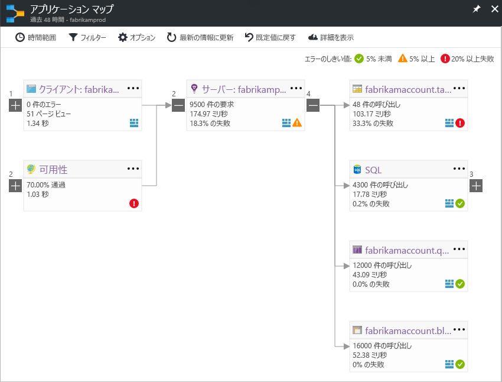

# Application Insights のアプリケーション マップ
[Azure Application Insights](app-insights-overview.md) のアプリケーション マップは、アプリケーション コンポーネントにおける依存関係のレイアウトを視覚的に表したものです。 負荷やパフォーマンス、エラー、アラートといった KPI がコンポーネントごとに表示されるので、パフォーマンスの問題やエラーの原因となっているコンポーネントを容易に検出することができます。 任意のコンポーネントをクリックして、さらに詳しい診断結果 (Application Insights イベントなど) にアクセスすることができます。 アプリで Azure サービスを使用している場合は、Azure 診断 (SQL Database アドバイザーのアドバイス情報など) をクリックすることもできます。

アプリケーション マップは他のグラフと同様、Azure ダッシュボードにピン留めし、すべての機能を利用することができます。 

## アプリケーション マップを開く
アプリケーション マップは、対象アプリケーションの概要ブレードから開きます。

マップには次の情報が表示されます。

* 可用性テスト
* クライアント側コンポーネント (JavaScript SDK で監視)
* サーバー側のコンポーネント
* クライアント コンポーネントとサーバー コンポーネントの依存関係

依存関係リンク グループは、展開したり折りたたんだりすることができます。

特定の種類 (SQL、HTTP など) の依存関係が多数存在する場合、それらがグループ化されて表示される場合があります。 

## 問題の特定
それぞれのノードには、関連するパフォーマンス指標 (対応するコンポーネントの負荷、パフォーマンス、エラー率など) が表示されます。 

問題のリスクは、警告アイコンによって強調表示されます。 オレンジ色の警告は、要求、ページ ビュー、依存関係の呼び出しにおけるエラーの存在を意味します。 赤色は、エラー率が 5% を超えていることを示します。 このしきい値を調整する場合は、[オプション] を開きます。

アクティブな警告も表示されます。 

SQL Azure を使用している場合、パフォーマンスを高める方法についての推奨事項が存在するときにアイコンが表示されます。 

アイコンをクリックすると、詳しい情報にアクセスできます。

## 診断のリンク
マップ上の各ノードには、診断を目的としたリンクが表示されます。 表示されるオプションは、ノードの種類によって異なります。

Azure でホストされるコンポーネントの場合、そのコンポーネントに直接アクセスするためのリンクがオプションに含まれます。

## フィルターと時間範囲
既定では、選択した時間範囲に関して入手できるすべてのデータがマップに集約されます。 ただしフィルターを適用することで、表示内容を特定の操作名や依存関係に限定することができます。

* 操作名: ページ ビューのほか、サーバー側の要求の種類が表示対象となります。 このオプションでは、選択した操作に限定して、サーバー/クライアント側ノードの KPI がマップに表示されます。 その特定の操作のコンテキストで呼び出された依存関係が表示されます。
* 依存関係のベース名: AJAX ブラウザーの依存関係とサーバー側の依存関係が表示対象となります。 TrackDependency API を使ってカスタムの依存関係のテレメトリを報告対象にしている場合、それらもここに表示されます。 マップに表示する依存関係は選択できます。 現時点では、この選択によって、サーバー側の要求やクライアント側のページ ビューはフィルタリングされません。

## フィルターの保存
適用したフィルターを保存するには、フィルタリングされたビューを [ダッシュボード](app-insights-dashboards.md)にピン留めします。

## エンド ツー エンドのシステム アプリケーション マップ

アプリケーションに複数のコンポーネントがある場合 (Web アプリに加え、バックエンド サービスなど)、統合されたアプリ マップにこれらすべてを表示できます。

アプリ マップは、現在のリソース グループ内のすべての Application Insights リソースを探して、サーバー ノードを検出します。 また、現在のリソース グループ内の Application Insights リソースによって追跡されている依存関係の呼び出しをフォローすることでサーバー ノードを検出します。

### 設定

> [!NOTE] 
> エンド ツー エンドのシステム マップ アプリはプレビュー段階です。 SDK の特別なバージョンでコンポーネントをインストルメント化する必要があり、特別な URL を使用してアプリ マップを表示する必要があります。 [エンド ツー エンドのシステム アプリ マップを設定する方法をご覧ください](https://github.com/Microsoft/ApplicationInsights-Home/blob/master/app-insights-app-map-preview.md)。

## ビデオ

> [!VIDEO https://channel9.msdn.com/events/Connect/2016/112/player] 

## フィードバック
[ご意見やご感想は、ポータルのフィードバック オプションからお寄せください](app-insights-get-dev-support.md)。

## 次のステップ

* [Azure ポータル](https://portal.azure.com)
