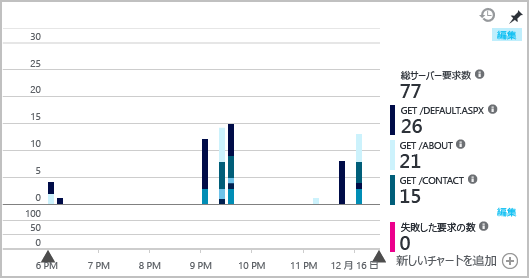
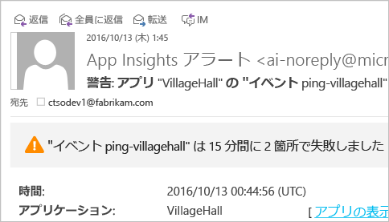
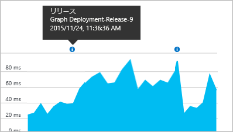

# <a name="set-up-application-insights-for-your-aspnet-website"></a>ASP.NET Web サイトに Application Insights を設定する
[Azure Application Insights](app-insights-overview.md) を利用すると実行中のアプリケーションを監視でき、[パフォーマンスの問題や例外の検出と診断](app-insights-detect-triage-diagnose.md)に役立ちます。 また、[アプリの使用方法の把握](app-insights-overview-usage.md)にも役立ちます。 独自のオンプレミス IIS サーバーやクラウドの VM でホストされているアプリに対してだけでなく、Azure App Service の Web Apps 機能に対しても機能します。

## <a name="before-you-start"></a>開始する前に
必要なもの:

* Visual Studio 2013 Update 3 以降。 より新しいバージョンが適しています。
* [Microsoft Azure](http://azure.com) サブスクリプション。 チームまたは組織で Azure サブスクリプションを取得している場合、所有者は [Microsoft アカウント](http://live.com)を使用してあなたを追加できます。

関心をお持ちの場合は、他にも次のようなトピックをご覧いただけます。

* [実行時の Web アプリのインストルメント化](app-insights-monitor-performance-live-website-now.md)
* [Azure Cloud Services](app-insights-cloudservices.md)

## <a name="ide"></a>手順 1: Application Insights SDK を追加する

ソリューション エクスプローラーで Web アプリのプロジェクトを右クリックし、**[追加]** を選択して、**[Application Insights Telemetry...]** または **[Application Insights の構成]** を選択します。

![[追加] と [Application Insights Telemetry...] が強調表示された、ソリューション エクスプローラーのスクリーンショット](./media/app-insights-asp-net/appinsights-03-addExisting.png)

(Visual Studio 2015 でも、[新しいプロジェクト] ダイアログに、Application Insights を追加するオプションがあります。)

Application Insights の構成ページに進みます。

![[アプリを Application Insights に登録します] ページのスクリーンショット](./media/app-insights-asp-net/visual-studio-register-dialog.png)

1. Azure へのアクセスに使用するアカウントとサブスクリプションを選択します。
2. Azure のリソースを選択します。このリソースのデータをアプリに表示します。 通常は、各アプリに対して個別のリソースを作成します。 データを格納するリソース グループまたは場所を設定するには、**[設定の構成]** をクリックします。 リソース グループは、データへのアクセスの制御に使用されます。 たとえば、同じシステムの一部を構成する複数のアプリがある場合、そのアプリに関する Application Insights のデータを同じリソース グループ内に配置することができます。
3. Application Insights では、一定の量までのテレメトリが無料で提供されます。 課金されないようにするために、ボリューム上限を設定することができます。 リソースが作成された後、ポータルで **[機能と価格設定]**、**[データ管理]**、**[日次ボリューム上限]** の順に開いて選択内容を変更することができます。
4. **[登録]** をクリックして、Web アプリ向けに Application Insights を構成します。 デバッグ時と、アプリを発行した後に、[Azure Portal](https://portal.azure.com) にテレメトリが送信されます。
5. 代わりに、単純にアプリに Application Insights SDK を追加することもできます。 この場合、デバッグ中に、Visual Studio でテレメトリを表示することができます。 この構成ページには後で戻ってくることができます。また、アプリがデプロイされ、[実行時のテレメトリが有効にされる](app-insights-monitor-performance-live-website-now.md)まで待つこともできます。


## <a name="run"></a>手順 2: アプリを実行する
F5 キーを押して、アプリを実行します。 ある程度のテレメトリを生成するために、複数のページを開きます。

Visual Studio で、ログに記録されたイベントの数が表示されます。

![Visual Studio のスクリーンショット。 デバッグ中に表示される [Application Insights] ボタン。](./media/app-insights-asp-net/54.png)

## <a name="step-3-see-your-telemetry-in-visual-studio-or-application-insights"></a>手順 3: Visual Studio または Application Insights でテレメトリを参照する
Visual Studio または Application Insights Web ポータルで、テレメトリを確認できます。

**Visual Studio の場合**、[Application Insights] ウィンドウを開きます。 **[Application Insights]** ボタンをクリックするか、ソリューション エクスプローラーでプロジェクトを右クリックし、**[Application Insights]** を選択してから **[ライブ テレメトリの検索]** をクリックします。

Visual Studio の [Application Insights の検索] ウィンドウの **[Data from Debug session (デバッグ セッションからのデータ)]** ビューで、アプリのサーバー側で生成されたテレメトリを確認します。 フィルターを試したり、任意のイベントをクリックして詳細を表示したりしてみましょう。

![[Application Insights] ウィンドウの [Data from Debug session (デバッグ セッションからのデータ)] ビューのスクリーンショット。](./media/app-insights-asp-net/55.png)

> [!NOTE]
> データが何も表示されない場合は、時間の範囲が正しいかどうかを確認し、検索アイコンをクリックします。

[Visual Studio の Application Insights ツールの詳細については、こちらを参照してください](app-insights-visual-studio.md)。

<a name="monitor"></a>
### <a name="the-application-insights-web-portal"></a>Application Insights Web ポータル
SDK のみをインストールする場合を除き、**Application Insights Web ポータル**でもテレメトリを確認できます。 ポータルには、Visual Studio より多くのグラフ、分析ツール、ダッシュボードが用意されています。

Application Insights リソースを開きます。 [Azure Portal](https://portal.azure.com/) にサインインすると、そこに表示されます。または、Visual Studio でプロジェクトを右クリックし、メニューから表示します。


> [!NOTE]
> アクセス エラーが発生した場合、Microsoft 資格情報のセットを複数持っており、正しくないセットでサインインしている可能性があります。 ポータルでサインアウトし、もう一度サインインしてください。

ポータルを開くと、アプリのテレメトリが表示されます。


詳細を表示するには、任意のタイルまたはグラフをクリックします。

### <a name="more-details-in-the-application-insights-web-portal"></a>Application Insights Web ポータル内の詳細情報
ポータル内で詳細情報を確認する方法の例は次のとおりです。

* [**ライブ メトリック ストリーム**](app-insights-live-stream.md)には、ほぼ瞬時にテレメトリが表示されます。

    ![ポータルのスクリーンショット。 [概要] ブレードで [ライブ ストリーム] をクリックする](./media/app-insights-asp-net/livestream.png)

    アプリの実行と同時に [ライブ メトリックス ストリーム] を開いて、接続を許可します。

    ライブ メトリック ストリームでは、送信後&1; 分間だけ、テレメトリが表示されます。 それより前の履歴を調査するには、検索、メトリックス エクスプローラー、Analytics を使用してください。 データがこれらの場所に表示されるまでに数分かかる場合があります。

* [**[検索]**](app-insights-diagnostic-search.md) では、要求、例外、ページ ビューなど、個々のイベントが表示されます。 イベントの種類、語句の一致、およびプロパティ値でフィルター処理することができます。 イベントをクリックすると、そのプロパティと関連イベントが表示されます。

    ![ポータルのスクリーンショット。 [概要] ブレードで [検索] をクリック。](./media/app-insights-asp-net/search.png)

 * 開発モードでは、多くの依存関係 (AJAX) イベントが表示されることがあります。 これらは、ブラウザーとサーバー エミュレーター間の同期です。 これらを非表示にするには、**[依存関係]** フィルターをクリックします。
* 要求や失敗率などの[**集計メトリック**](app-insights-metrics-explorer.md)は、グラフに表示されます。 グラフをクリックすると、詳細を含むブレードが開きます。 グラフの **[編集]** タグをクリックすると、フィルターとサイズを設定できます。

    

[Azure ポータルでの Application Insights の使用方法の詳細については、こちらを参照してください](app-insights-dashboards.md)。

## <a name="step-4-publish-your-app"></a>手順 4: アプリを発行する
IIS サーバーまたは Azure にアプリを発行します。 [ライブ メトリック ストリーム](app-insights-metrics-explorer.md#live-metrics-stream) を観察して、必要な処理がすべて滞りなく実行されていることを確認してください。

Application Insights ポータルにはテレメトリが蓄積されており、メトリックを監視したり、目的のテレメトリを検索したり、[ダッシュボード](app-insights-dashboards.md)を設定したりすることができます。 強力な [Analytics クエリ言語](app-insights-analytics.md)を使って使用状況やパフォーマンスを分析したり、特定のイベントを見つけたりすることができます。

[Visual Studio](app-insights-visual-studio.md) から各種ツール (診断検索、[傾向](app-insights-visual-studio-trends.md)など) を使って継続的にテレメトリを分析することもできます。

> [!NOTE]
> アプリから送信されたテレメトリの量が[スロットル制限](app-insights-pricing.md#limits-summary)に近づくと、自動[サンプリング](app-insights-sampling.md)がオンに変わります。 アプリから送信されるテレメトリの量をサンプリングによって抑えながら、診断に利用できる相関性のあるデータを維持することができます。
>
>

## <a name="land"></a>Application Insights を追加するコマンドを実行するとどうなりますか?
Application Insights によって、アプリのテレメトリが (Azure でホストされている) Application Insights ポータルに送信されます。


つまり、コマンドによって実行された操作は次の&3; つです。

1. プロジェクトに Application Insights Web SDK NuGet パッケージが追加されます。 Visual Studio で表示するには、プロジェクトを右クリックし、**[NuGet パッケージの管理]** を選択します。
2. [Azure Portal](https://portal.azure.com/) に Application Insights のリソースが作成されます。 ここにデータが表示されます。 リソースを識別する "*インストルメンテーション キー*" を取得します。
3. `ApplicationInsights.config`にインストルメンテーション キーを挿入し、SDK がポータルにテレメトリを送信できるようにする。

必要な場合は、[ASP.NET 4](app-insights-windows-services.md) または [ASP.NET Core](https://github.com/Microsoft/ApplicationInsights-aspnetcore/wiki/Getting-Started) 向けにこれらの手順を手動で実行することもできます。

### <a name="upgrade-to-future-sdk-versions"></a>新しいバージョンの SDK にアップグレードする
[SDK の新しいリリース](https://github.com/Microsoft/ApplicationInsights-dotnet-server/releases)にアップグレードするには、**NuGet パッケージ マネージャー**をもう一度開き、インストールされているパッケージに対してフィルターを実行します。 **[Microsoft.ApplicationInsights.Web]**、**[アップグレード]** の順に選択します。

ApplicationInsights.config をカスタマイズしている場合は、アップグレードする前にコピーを保存しておきます。 その後、新しいバージョンに変更をマージします。

## <a name="add-more-telemetry"></a>テレメトリをさらに追加
追加できるその他の種類のテレメトリは次のとおりです。
### <a name="dependencies-exceptions-and-performance-counters"></a>依存関係、例外、パフォーマンス カウンター

Web アプリに関する追加のテレメトリを取得するために、各 IIS サーバー コンピューターに [Status Monitor をインストール](http://go.microsoft.com/fwlink/?LinkId=506648)します。 既にインストールされている場合は、何もする必要はありません。 (実行時にアプリの監視を開始するために、既に Status Monitor を使用している場合があります。)

ビルド時の SDK に加えて Status Monitor を使用すると、より完全なテレメトリのセットを取得できます。これには以下が含まれます。

* [パフォーマンス カウンター](app-insights-performance-counters.md): アプリに関連する CPU、メモリ、ディスクなどのパフォーマンス カウンターです。
* [例外](app-insights-asp-net-exceptions.md): 一部の例外の詳細なテレメトリです。
* [依存関係](app-insights-asp-net-dependencies.md): 戻り値を含みます。

### <a name="webpages-and-single-page-apps"></a>Web ページおよび単一ページ アプリ
1. ページ ビュー、読み込み時間、ブラウザーの例外、AJAX 呼び出しのパフォーマンス、ユーザーとセッションの数に関するデータを表示するために、Web ページに [JavaScript スニペットを追加](app-insights-javascript.md)します。 これらは、[ブラウザー] ブレードと [使用状況] ブレードに表示されます。
2. ユーザー アクションのカウント、時間の計測、または測定を行う[カスタム イベントのコードを記述](app-insights-api-custom-events-metrics.md)します。


### <a name="diagnostic-code"></a>診断コード
問題が発生した場合に備えて 診断に役立つコードをアプリに挿入する場合は、いくつかのオプションがあります。

* [ログ トレースのキャプチャ](app-insights-asp-net-trace-logs.md): 既に Log4N、NLog、または System.Diagnostics.Trace を使用してトレース イベントをログに記録している場合、出力を Application Insights に送信できます。 この出力は、要求と関連付けて検索、分析できます。
* [カスタム イベントとメトリック](app-insights-api-custom-events-metrics.md): サーバーまたは Web ページ コードで TrackEvent() と TrackMetric() を使用します。
* [テレメトリに追加のプロパティをタグ付けします](app-insights-api-filtering-sampling.md#add-properties)。

[検索](app-insights-diagnostic-search.md)を使用して、特定のイベントを検索して関連付け、[Analytics](app-insights-analytics.md) でより強力なクエリを実行します。

## <a name="alerts"></a>アラート
率先してアプリに問題があるかどうかを確認します

* [可用性テスト](app-insights-monitor-web-app-availability.md): サイトが Web で表示できることを確認するために、テストを作成します。
* [スマート診断](app-insights-proactive-diagnostics.md): これらのテストは自動的に実行されます。セットアップするために何かをする必要はありません。 アプリの要求が失敗する割合が異常な場合に通知します。
* [メトリック アラート](app-insights-alerts.md): メトリックがしきい値を超えた場合に警告するように設定します。 メトリック アラートはカスタム メトリックで設定し、コード化してアプリに組み込むことができます。

既定では、アラート通知は Azure サブスクリプションの所有者に送信されます。



## <a name="version-and-release-tracking"></a>バージョンおよびリリースの追跡
アプリケーションのバージョンを追跡するには、Microsoft Build Engine プロセスによって `buildinfo.config` が生成されたことを確認してください。 .csproj ファイルに、次のコードを追加します。  

```XML

    <PropertyGroup>
      <GenerateBuildInfoConfigFile>true</GenerateBuildInfoConfigFile>    <IncludeServerNameInBuildInfo>true</IncludeServerNameInBuildInfo>
    </PropertyGroup>
```

ビルド情報がある場合、Application Insights Web モジュールは、 **アプリケーションのバージョン** をプロパティとしてテレメトリのすべての項目に自動的に追加します。 これにより、[診断の検索](app-insights-diagnostic-search.md)を実行するとき、または[メトリックを調べる](app-insights-metrics-explorer.md)ときに、バージョンによってフィルター処理できます。

ただし、Visual Studio での開発者向けのビルドではなく、Microsoft Build Engine でのみビルド バージョン番号が生成されることに注意してください。

### <a name="release-annotations"></a>リリース注釈
Visual Studio Team Services を使用する場合は、新しいバージョンをリリースするたびに、グラフに[注釈マーカーを追加](app-insights-annotations.md)できます。 このマーカーは、次の図のように表示されます。



## <a name="video"></a>ビデオ

> [!VIDEO https://channel9.msdn.com/events/Connect/2016/100/player]

## <a name="next-steps"></a>次のステップ
**[Visual Studio での Application Insights の操作](app-insights-visual-studio.md)**<br/>テレメトリ、診断検索、コードのドリル スルーを使用したデバッグについて説明しています。

**[Application Insights ポータルの操作](app-insights-dashboards.md)**<br/> ダッシュボード、強力な診断および分析ツール、アラート、アプリケーションのリアルタイム依存関係マップ、テレメトリのエクスポートについて説明しています。

