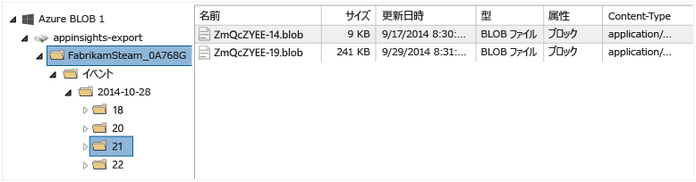
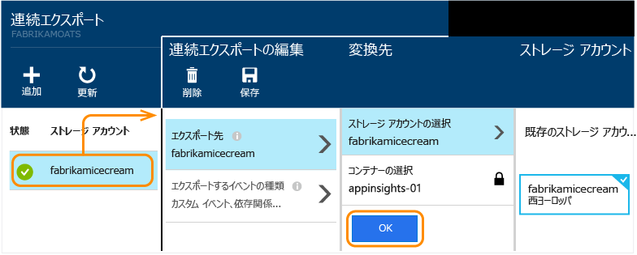

# Application Insights からのテレメトリのエクスポート
標準的なリテンション期間より長くテレメトリを残しておきたい、 または特別な方法でテレメトリを処理したい、 そのようなケースには、連続エクスポートが最適です。 Application Insights ポータルに表示されるイベントは、JSON 形式で Microsoft Azure のストレージにエクスポートできます。 そこからデータをダウンロードしたり、データを処理するためのコードを自由に記述したりできます。  

連続エクスポートは[エンタープライズ料金モデル](http://azure.microsoft.com/pricing/details/application-insights/)で使用できます。

連続エクスポートをセットアップする前に、次の代替手段を検討してください。

* [[エクスポート] ボタン](app-insights-metrics-explorer.md#export-to-excel) を使用すると、テーブルやグラフを Excel のスプレッドシートに転送できます。 

* [Analytics](app-insights-analytics.md) にはテレメトリ用の強力なクエリ言語があり、結果をエクスポートすることもできます。
* [Power BI でデータを探索](app-insights-export-power-bi.md)する場合は、連続エクスポートを使用せずに実行できます。
* [データ アクセス REST API](https://dev.applicationinsights.io/) を使用すると、テレメトリにプログラムでアクセスすることができます。 

連続エクスポートによってストレージ (必要な期間の保持が可能) にコピーされたデータは、通常の[リテンション期間](app-insights-data-retention-privacy.md)が過ぎるまで引き続き Application Insights で使用できます。 

## ストレージ アカウントの作成
"クラシック" ストレージ アカウントがない場合は、ここで作成します。

1. [Azure ポータル](https://portal.azure.com)で、サブスクリプションのストレージ アカウントを作成します。
   
    ![Azure ポータルで、[新規]、[データ]、[Storage] の順に選択します](./media/app-insights-export-telemetry/030.png)
2. コンテナーを作成します。
   
    ![新しいストレージで、[コンテナー] を選択し、[コンテナー] タイルをクリックし、[追加] を選択します](./media/app-insights-export-telemetry/040.png)

Application Insights のリソースとは異なるリージョンでストレージを作成すると、[データ転送に関する料金](https://azure.microsoft.com/pricing/details/bandwidth/)が発生する可能性があります。

##  連続エクスポートの設定
Application Insights ポータルのアプリケーションの概要ブレードで、[連続エクスポート] を開きます。 

![下へスクロールし、[連続エクスポート] をクリックします](./media/app-insights-export-telemetry/01-export.png)

連続エクスポートを追加し、エクスポートするイベントの種類を選択します。

![[追加]、[エクスポート先]、[ストレージ アカウント] の順にクリックし、新しいストアを作成するかまたは既存のストアを使用するかを選択します。](./media/app-insights-export-telemetry/02-add.png)

データの保存先となる [Azure ストレージ アカウント](../storage/storage-introduction.md)を選択または作成します。

![[イベントの種類の選択] をクリックします](./media/app-insights-export-telemetry/03-types.png)

エクスポートが作成されると、処理が開始されます  (エクスポートを作成した後に到着したデータのみが取得されます)。 

BLOB でデータが表示されるまで、約 1 時間の遅延が発生する可能性があります。

後でイベントの種類を変更する場合は、単にエクスポートを編集します。

![[イベントの種類の選択] をクリックします](./media/app-insights-export-telemetry/05-edit.png)

ストリームを停止するには、[無効] をクリックします。 もう一度 [有効] をクリックすると、新しいデータでストリームが再開されます。 エクスポートが無効な場合、ポータルに到着したデータは取得されません。

ストリームを完全に停止するには、エクスポートを削除します。 エクスポートを削除しても、ストレージのデータは削除されません。

#### エクスポートを追加または変更できない
* エクスポートを追加または変更するには、所有者、共同作成者、または Application Insights 共同作成者のアクセス権が必要になります。 ロールについては、[こちら][roles]をご覧ください。

##  取得されるイベント
エクスポートされたデータは、お客様のアプリケーションから受け取った未加工のテレメトリですが、クライアントの IP アドレスから計算された位置データが追加されます。 

[サンプリング](app-insights-sampling.md) によって破棄されたデータは、エクスポートされるデータに含まれません。

他の計算メトリックは含まれません。 たとえば、平均 CPU 使用率はエクスポートされませんが、平均の計算に使用された未加工のテレメトリはエクスポートされます。

データには、セットアップ済みのすべての [利用可能な Web テスト](app-insights-monitor-web-app-availability.md) の結果も含まれます。 

> [!NOTE]
> **サンプリング。**  アプリケーションが送信するデータ量が多く、Application Insights SDK for ASP.NET バージョン 2.0.0-beta3 以降を使用している場合は、アダプティブ サンプリング機能が動作して、テレメトリの一定の割合のみが送信される可能性があります。 [サンプリングの詳細については、こちらを参照してください。](app-insights-sampling.md)
> 
> 

##  データの確認
ポータルでストレージを直接検査することができます。 **[参照]** をクリックしてストレージ アカウントを選択し、**[コンテナー]** を開きます。

Visual Studio で Azure ストレージを検査するには、**[表示]**、**[Cloud Explorer]** の順に開きます  (このメニュー コマンドがない場合は、Azure SDK をインストールする必要があります。**[新しいプロジェクト]** ダイアログを開き、[Visual C#]、[クラウド] の順に展開して、**[Microsoft Azure SDK for .NET の取得]** を選択します)。

BLOB ストアを開くと、BLOB ファイルのセットを含むコンテナーが表示されます。 各ファイルの URI は、Application Insights のリソース名、そのインストルメンテーション キー、テレメトリの種類/日付/時刻から派生します  (リソース名はすべて小文字になり、インストルメンテーション キーのダッシュは省略されます)。

日付と時刻は UTC 形式で表され、テレメトリが生成された時間ではなく、ストアに格納された日時を示します。 そのため、データをダウンロードするコードを記述する場合は、直線的にデータ内を移動できます。

パスの形式を以下に示します。

    $"{applicationName}_{instrumentationKey}/{type}/{blobDeliveryTimeUtc:yyyy-MM-dd}/{ blobDeliveryTimeUtc:HH}/{blobId}_{blobCreationTimeUtc:yyyyMMdd_HHmmss}.blob"

Where 

* `blobCreationTimeUtc` は、BLOB が内部ステージング ストレージで作成された日時です。
* `blobDeliveryTimeUtc` は、BLOB がエクスポート先のストレージにコピーされた日時です。

##  データ形式
* それぞれの Blob は、"\n" で区切られた複数の行を含むテキスト ファイルです。 約 30 秒の間に処理されたテレメトリが含まれています。
* 各行は、要求やページ表示などのテレメトリ データ ポイントを表します。
* それぞれの行は、書式設定されていない JSON ドキュメントです。 詳細を確認する場合は、Visual Studio でファイルを開き、[編集]、[詳細]、[フォーマット ファイル] の順に選択します。

時間の長さはティック単位で表記されます。10,000 ティックが 1 ミリ秒です。 たとえば、これらの値は、ブラウザーから要求を送信するのに 1 ミリ秒、要求を受信するのに 3 ミリ秒、ブラウザーでページを処理するのに 1.8 秒の時間がかかったことを示しています。

    "sendRequest": {"value": 10000.0},
    "receiveRequest": {"value": 30000.0},
    "clientProcess": {"value": 17970000.0}

[データ モデルについては、プロパティの型と値のリファレンスで詳しく説明されています。](app-insights-export-data-model.md)

## データの処理
小規模な処理では、データを分解してスプレッドシートに読み込んだ後で他の処理を実行するコードを記述できます。 For example:

    private IEnumerable<T> DeserializeMany<T>(string folderName)
    {
      var files = Directory.EnumerateFiles(folderName, "*.blob", SearchOption.AllDirectories);
      foreach (var file in files)
      {
         using (var fileReader = File.OpenText(file))
         {
            string fileContent = fileReader.ReadToEnd();
            IEnumerable<string> entities = fileContent.Split('\n').Where(s => !string.IsNullOrWhiteSpace(s));
            foreach (var entity in entities)
            {
                yield return JsonConvert.DeserializeObject<T>(entity);
            }
         }
      }
    }

大規模なコード サンプルについては、[worker ロールの使用][exportasa]に関する記事をご覧ください。

## 古いデータの削除
必要に応じて古いデータを削除するなどしてストレージ容量を管理する責任があることに注意してください。 

## ストレージ キーを再生成する場合
ストレージのキーを変更した場合、連続エクスポートは動作しなくなります。 Azure アカウントに通知が表示されます。 

[連続エクスポート] ブレードを開き、エクスポートを編集します。 エクスポート先の編集画面では、同じストレージを選択したままにします。 [OK] をクリックして確定します。

連続エクスポートが再開されます。

## エクスポート サンプル
* [worker ロールを使用して SQL にエクスポートする][exportcode]
* [Stream Analytics を使用して SQL にエクスポートする][exportasa]
* [Stream Analytics のサンプル 2](app-insights-export-stream-analytics.md)

大規模な処理の場合は、 [HDInsight](https://azure.microsoft.com/services/hdinsight/) (クラウドの Hadoop クラスター) を検討してください。 HDInsight はビッグ データの管理と分析を行うためのさまざまなテクノロジを備えており、Application Insights からエクスポートされたデータの処理に使用できます。

## Q & A
* *グラフを 1 回だけダウンロードしたいのですが。*  
  
    はい、できます。 ブレードの上部にある、 [[データのエクスポート]](app-insights-metrics-explorer.md#export-to-excel)をクリックします。
* *エクスポートを設定したのにストアにデータがありません。*
  
    エクスポートを設定した時点以降に Application Insights がアプリからテレメトリを受信していますか。 取得されるのは新しいデータのみです。
* *エクスポートを設定しようとしたところ、アクセスが拒否されました。*
  
    アカウントが組織によって所有されている場合は、所有者または共同作成者グループのメンバーである必要があります。
* *自分のオンプレミスのストアに直接エクスポートできますか。* 
  
    いいえ、できません。 現在のところ、エクスポート エンジンは、Azure Storage でのみ動作します。  
* *ストアに格納できるデータの量に制限はありますか。* 
  
    いいえ。 データのプッシュ配信は、エクスポートが削除されるまで続行されます。 Blob Storage の制限に達した場合は配信が停止されますが、その制限には非常に大きな値が設定されています。 使用するストレージの量を管理するのはお客様です。  
* *ストレージに表示される BLOB の数を教えてください。*
  
  * エクスポートに選択した各データの種類ごとに、1 つの新しい BLOB が 1 分ごとに作成されます (データを使用できる場合)。 
  * さらに、トラフィック負荷の高いアプリケーションでは、追加のパーティション単位が割り当てられます。 この場合、各単位で 1 分ごとに 1 つの BLOB が作成されます。
* *ストレージのキーを再生成した後、またはコンテナーの名前を変更した後、エクスポートが動作しません。*
  
    エクスポートを編集し、[エクスポート先] ブレードを開きます。 以前と同じストレージが選択されていることを確認し、[OK] をクリックして確定します。 エクスポートが再開されます。 変更を加えたのが数日前のことであれば、データは失われません。
* *エクスポートを一時停止できますか。*
  
    はい。 [無効] をクリックします。

## コード サンプル
* [worker ロールを使用してエクスポートされた JSON を解析する][exportcode]
* [Stream Analytics のサンプル](app-insights-export-stream-analytics.md)
* [Stream Analytics を使用して SQL にエクスポートする][exportasa]
* [データ モデルについては、プロパティの型と値のリファレンスで詳しく説明されています。](app-insights-export-data-model.md)

<!--Link references-->

[exportcode]: app-insights-code-sample-export-telemetry-sql-database.md
[exportasa]: app-insights-code-sample-export-sql-stream-analytics.md
[roles]: app-insights-resources-roles-access-control.md

<!--HONumber=Nov16_HO3-->

