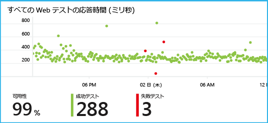

# <a name="get-started-with-application-insights-with-java-in-eclipse"></a>Eclipse で Java 用に Application Insights を使う
Application Insights SDK は、利用状況とパフォーマンスを分析できるようにするために、Java Web アプリケーションからテレメトリを送信します。 Application Insights 用 Eclipse プラグインは、プロジェクトに SDK を自動的にインストールします。これにより、すぐに使用可能なテレメトリに加えて、カスタムのテレメトリの作成に使用できる API が提供されます。   

## <a name="prerequisites"></a>前提条件
現在、プラグインは、Eclipse のMaven プロジェクトと動的 Web プロジェクトに対応しています 
([他の種類の Java プロジェクトに Application Insights を追加します][java])。

必要なものは次のとおりです。

* Oracle JRE 1.6 以降。
* [Microsoft Azure](https://azure.microsoft.com/) サブスクリプション。
* [Eclipse IDE for Java EE Developers](http://www.eclipse.org/downloads/)Indigo 以降。
* Windows 7 以降または Windows Server 2008 以降。

## <a name="install-the-sdk-on-eclipse-one-time"></a>Eclipse に SDK をインストールする (1 回限り)
この操作は、コンピューターごとに&1; 回行う必要があります。 この手順では、SDK を各動的 Web プロジェクトに追加できるツールキットをインストールします。

1. Eclipse で、[Help]、[Install New Software] の順にクリックします。

    ![[Help]、[Install New Software]](./media/app-insights-java-eclipse/0-plugin.png)
2. SDK は、http://dl.microsoft.com/eclipse の [Azure Toolkit] の下にあります。
3. **[Contact all update sites]**

    ![Application Insights SDK の場合、[Contact all update sites] チェック ボックスをオフにします](./media/app-insights-java-eclipse/1-plugin.png)

Java プロジェクトごとに、残りの手順に従います。

## <a name="create-an-application-insights-resource-in-azure"></a>Azure で Application Insights のリソースを作成する
1. [Azure ポータル](https://portal.azure.com)にサインインします。
2. 新しい Application Insights リソースを作成します。 アプリケーションの種類を [Java Web アプリケーション] に設定します。  

    ![[+] をクリックし、[Application Insights] を選択します](./media/app-insights-java-eclipse/01-create.png)  

4. 新しいリソースのインストルメンテーション キーを見つけます。 このキーは、後でコード プロジェクトに貼り付けます。  

    ![新しいリソース概要で、[プロパティ] をクリックし、インストルメンテーション キーをコピーします](./media/app-insights-java-eclipse/03-key.png)  

## <a name="add-application-insights-to-your-project"></a>アプリケーションの正常性と利用状況の監視
1. Web プロジェクトのコンテキスト メニューから Application Insights を追加します。

    ![新しいリソース概要で、[プロパティ] をクリックし、インストルメンテーション キーをコピーします](./media/app-insights-java-eclipse/02-context-menu.png)
2. Azure ポータルで入手したインストルメンテーション キーを貼り付けます。

    ![新しいリソース概要で、[プロパティ] をクリックし、インストルメンテーション キーをコピーします](./media/app-insights-java-eclipse/03-ikey.png)

このキーは、テレメトリのすべての項目と共に送信され、リソース内にこれを表示するように Application Insights に指示します。

## <a name="run-the-application-and-see-metrics"></a>アプリケーションを実行してメトリックを表示する
アプリケーションを実行します。

Microsoft Azure の Application Insights リソースに戻ります。

HTTP 要求データが概要ブレードに表示されます  (表示されない場合は、数秒待ってから [最新の情報に更新] をクリックします)。


任意のグラフをクリックして、より詳細なメトリックを表示します。


[メトリックの詳細についてはこちらをご覧ください。][metrics]

要求のプロパティを表示すると、その要求に関連付けられているテレメトリ イベント (要求や例外など) が表示されます。


## <a name="client-side-telemetry"></a>クライアント側のテレメトリ
クイック スタートブレードで、[マイ Web ページを監視するためのコードを取得する] をクリックします。


HTML ファイルの先頭にコード スニペットを挿入します。

#### <a name="view-client-side-data"></a>クライアント側のデータの表示
更新された Web ページを開いて使用します。 1 ～&2; 分待ってから、Application Insights に戻り、[使用状況] ブレードを開きます  ([概要] ブレードで下へスクロールし、[使用状況] をクリックします)。

[使用状況] ブレードに、ページ ビュー、ユーザー、セッションのメトリックが表示されます。


[クライアント側のテレメトリの設定方法の詳細についてはこちら。][usage]

## <a name="publish-your-application"></a>アプリケーションの発行
次に、サーバーにアプリを発行してユーザーがアプリを使用できるようにし、ポータルに表示されるテレメトリを監視します。

* アプリケーションがこれらのポートにテレメトリを送信できるようにファイアウォールが設定されていることを確認します。

  * dc.services.visualstudio.com:443
  * dc.services.visualstudio.com:80
  * f5.services.visualstudio.com:443
  * f5.services.visualstudio.com:80
* Windows サーバーに次のものをインストールします。

  * [Microsoft Visual C++ 再頒布可能パッケージ](http://www.microsoft.com/download/details.aspx?id=40784)

    (これにより、パフォーマンス カウンターが有効になります。)

## <a name="exceptions-and-request-failures"></a>例外と要求エラー
未処理の例外は、自動的に収集されます。


その他の例外に関するデータを収集するには&2; つのオプションがあります。

* [TrackException への呼び出しをコードに挿入](app-insights-api-custom-events-metrics.md#trackexception)します。
* [Java エージェントをサーバーにインストール](app-insights-java-agent.md)します。 監視するメソッドを指定します。

## <a name="monitor-method-calls-and-external-dependencies"></a>メソッドの呼び出しと外部依存関係の監視
[Java エージェントをインストール](app-insights-java-agent.md) して、JDBC を通じて指定された内部メソッドと実行された呼び出しをタイミング データと共にログに記録します。

## <a name="performance-counters"></a>パフォーマンス カウンター
[概要] ブレードで下にスクロールし、**[サーバー]** タイルをクリックします。 一連のパフォーマンス カウンターが表示されます。

![下にスクロールして [サーバー] タイルをクリック](./media/app-insights-java-eclipse/11-perf-counters.png)

### <a name="customize-performance-counter-collection"></a>パフォーマンス カウンター コレクションをカスタマイズする
パフォーマンス カウンターの標準セットのコレクションを無効にするには、ApplicationInsights.xml ファイルのルート ノードの下に次のコードを追加します。

```XML

    <PerformanceCounters>
       <UseBuiltIn>False</UseBuiltIn>
    </PerformanceCounters>
```

### <a name="collect-additional-performance-counters"></a>追加のパフォーマンス カウンターを収集する
収集する追加のパフォーマンス カウンターを指定できます。

#### <a name="jmx-counters-exposed-by-the-java-virtual-machine"></a>JMX カウンター (Java 仮想マシンによって公開されます)

```XML

    <PerformanceCounters>
      <Jmx>
        <Add objectName="java.lang:type=ClassLoading" attribute="TotalLoadedClassCount" displayName="Loaded Class Count"/>
        <Add objectName="java.lang:type=Memory" attribute="HeapMemoryUsage.used" displayName="Heap Memory Usage-used" type="composite"/>
      </Jmx>
    </PerformanceCounters>
```

* `displayName` - Application Insights ポータルに表示される名前。
* `objectName` - JMX オブジェクトの名前。
* `attribute` - 取得する JMX オブジェクト名の属性
* `type` (オプション) - JMX オブジェクトの属性の型。
  * 既定値: int、long などの単純型。
  * `composite`: パフォーマンス カウンター データは、"Attribute.Data" 形式です。
  * `tabular`: パフォーマンス カウンター データは、テーブル行形式です。

#### <a name="windows-performance-counters"></a>Windows パフォーマンス カウンター
それぞれの [Windows パフォーマンス カウンター](https://msdn.microsoft.com/library/windows/desktop/aa373083.aspx) は、(フィールドがクラスのメンバーであるのと同様に) カテゴリのメンバーです。 カテゴリについては、グローバルに設定することも、数字または名前付きインスタンスを設定することもできます。

```XML

    <PerformanceCounters>
      <Windows>
        <Add displayName="Process User Time" categoryName="Process" counterName="%User Time" instanceName="__SELF__" />
        <Add displayName="Bytes Printed per Second" categoryName="Print Queue" counterName="Bytes Printed/sec" instanceName="Fax" />
      </Windows>
    </PerformanceCounters>
```

* displayName - Application Insights ポータルに表示される名前。
* categoryName - このパフォーマンス カウンターが関連付けられているパフォーマンス カウンターのカテゴリ (パフォーマンス オブジェクト)。
* counterName - パフォーマンス カウンターの名前。
* instanceName - パフォーマンス カウンター カテゴリ インスタンスの名前、または空の文字列 ("") (カテゴリにインスタンスが&1; つ含まれている場合)。 categoryName が Process であり、アプリが実行されている現在の JVM プロセスからパフォーマンス カウンターを収集する場合は、 `"__SELF__"`を指定します。

パフォーマンス カウンターは、[メトリックス エクスプローラー][metrics]でカスタム メトリックとして表示されます。


### <a name="unix-performance-counters"></a>Unix パフォーマンス カウンター
* [Application Insights プラグインを使用して collectd をインストール](app-insights-java-collectd.md) し、さまざまな種類のシステムとネットワークに関するデータを取得します。

## <a name="availability-web-tests"></a>可用性 Web テスト
Application Insights では、Web サイトを定期的にテストして、Web サイトが正常に動作および応答していることを確認できます。 [設定するには][availability]、下へスクロールして [可用性] をクリックします。

![下にスクロール、[可用性] をクリック、[Web テストを追加]](./media/app-insights-java-eclipse/31-config-web-test.png)

応答時間のグラフが表示されます。また、サイトがダウンしている場合はメールによる通知を受け取ります。



可用性 Web テストの詳細については、[こちら][availability]をご覧ください。

## <a name="diagnostic-logs"></a>診断ログ
トレース用に Logback または Log4J (v1.2 または v2.0) を使用している場合は、トレース ログを自動的に Application Insights に送信して、Application Insights でトレース ログを探索および検索できます。

[診断ログの詳細についてはこちら][javalogs]

## <a name="custom-telemetry"></a>カスタムのテレメトリ
Java Web アプリケーションに数行のコードを挿入して、ユーザーの行動を調べたり、問題の診断に役立つ情報を取得したりすることができます。

コードは、Web ページの JavaScript とサーバー側 Java のどちらにも挿入できます。

[カスタム テレメトリの詳細についてはこちら][track]

## <a name="next-steps"></a>次のステップ
#### <a name="detect-and-diagnose-issues"></a>問題の検出と診断
* [Web クライアントのテレメトリを追加][usage]して、Web クライアントからパフォーマンス テレメトリを取得します。
* [Web テストを設定][availability]して、アプリケーションが動作していて応答できることを確認します。
* 問題の診断に役立つ情報を得るには、[イベントおよびログを検索][diagnostic]します。
* [Log4J または Logback トレースをキャプチャします][javalogs]

#### <a name="track-usage"></a>利用状況を追跡する
* [Web クライアント テレメトリを追加][usage]して、ビューや基本的なユーザー メトリックを監視します。
* [カスタム イベントおよびメトリックを追跡][track]して、クライアント側とサーバー側でアプリケーションの利用状況を確認します。

<!--Link references-->

[availability]: app-insights-monitor-web-app-availability.md
[diagnostic]: app-insights-diagnostic-search.md
[java]: app-insights-java-get-started.md
[javalogs]: app-insights-java-trace-logs.md
[metrics]: app-insights-metrics-explorer.md
[track]: app-insights-api-custom-events-metrics.md
[usage]: app-insights-web-track-usage.md

