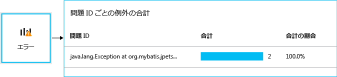
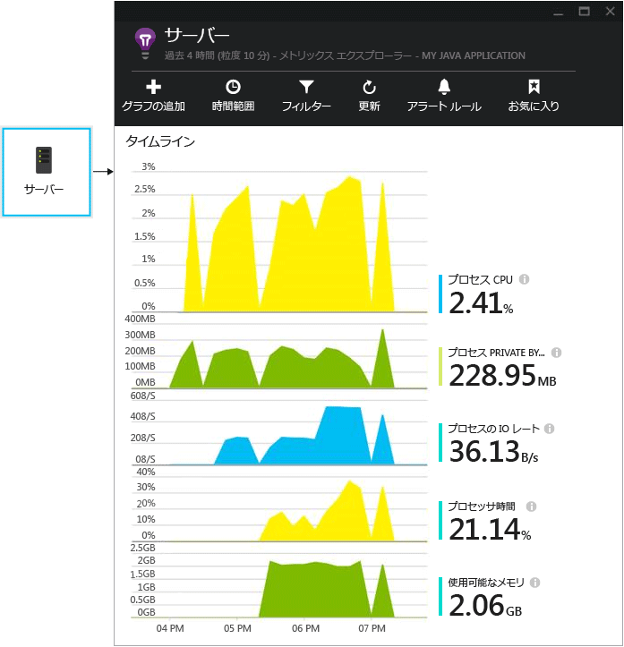
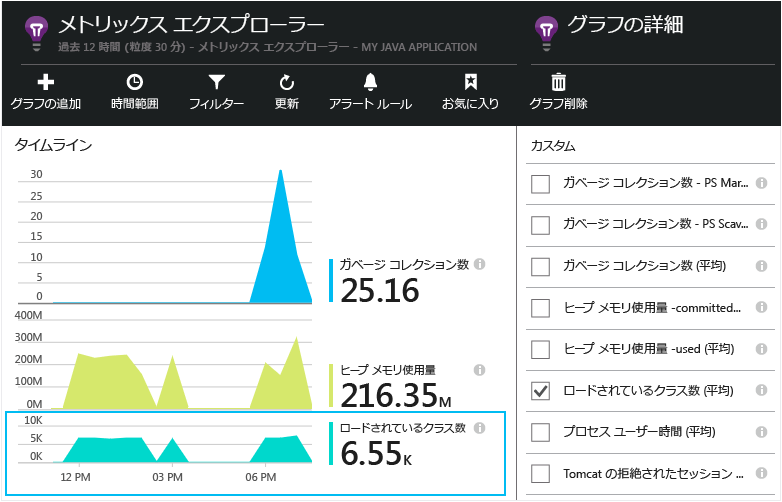

# <a name="get-started-with-application-insights-in-a-java-web-project"></a>Java Web プロジェクトで Application Insights を使う


[Application Insights](https://azure.microsoft.com/services/application-insights/) は、ライブ アプリケーションのパフォーマンスと使用状況を把握するのに役立つ、Web 開発者向けの拡張可能な分析サービスです。 [パフォーマンスの問題や例外を検出および診断](app-insights-detect-triage-diagnose.md)したり、アプリケーションで何が実行されているかを追跡する[コードを記述][api]したりすることができます。


Application Insights は、Linux、Unix、Windows で動作する Java アプリをサポートします。

必要なもの:

* Oracle JRE 1.6 以降、または Zulu JRE 1.6 以降
* [Microsoft Azure](https://azure.microsoft.com/) サブスクリプション。

*既にライブの Web アプリがある場合、代替手順に従って [Web サーバーで実行時に SDK を追加](app-insights-java-live.md)できます。これによってコードのリビルドを回避できますが、ユーザーの利用状況を追跡するためにコードを記述することができなくなります。*

## <a name="1-get-an-application-insights-instrumentation-key"></a>1.Application Insights のインストルメンテーション キーを取得する
1. [Microsoft Azure ポータル](https://portal.azure.com)にサインインします。
2. Application Insights リソースを作成します。 アプリケーションの種類を [Java Web アプリケーション] に設定します。

    ![名前を入力し、[Java Web アプリケーション] を選択した後、[作成] をクリックします](./media/app-insights-java-get-started/02-create.png)
3. 新しいリソースのインストルメンテーション キーを見つけます。 このキーは、後でコード プロジェクトに貼り付けます。

    ![新しいリソース概要で、[プロパティ] をクリックし、インストルメンテーション キーをコピーします](./media/app-insights-java-get-started/03-key.png)

## <a name="2-add-the-application-insights-sdk-for-java-to-your-project"></a>2.Application Insights SDK for Java をプロジェクトに追加する
*プロジェクトに適した方法を選択してください。*

#### <a name="if-youre-using-eclipse-to-create-a-maven-or-dynamic-web-project-"></a>Eclipse を使用して Maven または動的 Web プロジェクトを作成している場合:
[Application Insights SDK for Java プラグイン][eclipse]を使用します。

#### <a name="if-youre-using-maven"></a>Maven を使用している場合:
プロジェクトが既に Maven を使用してビルドする設定になっている場合は、pom.xml ファイルに次のコードをマージします。

次に、バイナリがダウンロードされるように、プロジェクトの依存関係を更新します。

```XML

    <repositories>
       <repository>
          <id>central</id>
          <name>Central</name>
          <url>http://repo1.maven.org/maven2</url>
       </repository>
    </repositories>

    <dependencies>
      <dependency>
        <groupId>com.microsoft.azure</groupId>
        <artifactId>applicationinsights-web</artifactId>
        <!-- or applicationinsights-core for bare API -->
        <version>[1.0,)</version>
      </dependency>
    </dependencies>
```

* *ビルド エラーやチェックサム検証エラーが発生した場合は、* 特定のバージョンを試してください (例: `<version>1.0.n</version>`)。 最新バージョンは、[SDK リリース ノート](https://github.com/Microsoft/ApplicationInsights-Java#release-notes)または [Maven アーティファクト](http://search.maven.org/#search%7Cga%7C1%7Capplicationinsights)で確認できます。
* *新しい SDK に更新する必要がありますか?* プロジェクトの依存関係を更新します。

#### <a name="if-youre-using-gradle"></a>Gradle を使用している場合:
プロジェクトが既に Gradle を使用してビルドする設定になっている場合は、build.gradle ファイルに次のコードをマージします。

次に、バイナリがダウンロードされるように、プロジェクトの依存関係を更新します。

```JSON

    repositories {
      mavenCentral()
    }

    dependencies {
      compile group: 'com.microsoft.azure', name: 'applicationinsights-web', version: '1.+'
      // or applicationinsights-core for bare API
    }
```

* *ビルド エラーまたはチェックサムの検証エラーが発生する場合は、特定のバージョンを試してください:* `version:'1.0.n'`。 *[SDK リリース ノート](https://github.com/Microsoft/ApplicationInsights-Java#release-notes)にサインインします。*
* *新しい SDK に更新するには*
  * プロジェクトの依存関係を更新します。

#### <a name="otherwise-"></a>それ以外の場合:
SDK を手動で追加する:

1. [Application Insights SDK for Java](https://aka.ms/aijavasdk)をダウンロードします。
2. zip ファイルからバイナリを抽出し、プロジェクトに追加します。

### <a name="questions"></a>疑問がある場合...
* *zip 内の `-core` コンポーネントと `-web` コンポーネントの関係について*

  * `applicationinsights-core` は最小限の API を提供します。 このコンポーネントは常に必要です。
  * `applicationinsights-web` HTTP 要求数と応答時間を追跡するメトリックを提供します。 このテレメトリを自動的に収集しない場合、このコンポーネントは省略できます。 たとえば、独自に記述する場合です。
* *変更が発行されたときに SDK を更新するには*

  * 最新の [Application Insights SDK for Java](https://aka.ms/qqkaq6) をダウンロードして、古いものと置き換えます。
  * 変更は [SDK リリース ノート](https://github.com/Microsoft/ApplicationInsights-Java#release-notes)に記載されます。

## <a name="3-add-an-application-insights-xml-file"></a>3.Application Insights の xml ファイルを追加する
ApplicationInsights.xml をプロジェクトのリソース フォルダーに追加するか、プロジェクトのデプロイメント クラス パスに追加されていることを確認します。 次の XML をファイルにコピーします。

インストルメンテーション キーについては、Azure ポータルで入手したキーを使用してください。

```XML

    <?xml version="1.0" encoding="utf-8"?>
    <ApplicationInsights xmlns="http://schemas.microsoft.com/ApplicationInsights/2013/Settings" schemaVersion="2014-05-30">


      <!-- The key from the portal: -->

      <InstrumentationKey>** Your instrumentation key **</InstrumentationKey>


      <!-- HTTP request component (not required for bare API) -->

      <TelemetryModules>
        <Add type="com.microsoft.applicationinsights.web.extensibility.modules.WebRequestTrackingTelemetryModule"/>
        <Add type="com.microsoft.applicationinsights.web.extensibility.modules.WebSessionTrackingTelemetryModule"/>
        <Add type="com.microsoft.applicationinsights.web.extensibility.modules.WebUserTrackingTelemetryModule"/>
      </TelemetryModules>

      <!-- Events correlation (not required for bare API) -->
      <!-- These initializers add context data to each event -->

      <TelemetryInitializers>
        <Add   type="com.microsoft.applicationinsights.web.extensibility.initializers.WebOperationIdTelemetryInitializer"/>
        <Add type="com.microsoft.applicationinsights.web.extensibility.initializers.WebOperationNameTelemetryInitializer"/>
        <Add type="com.microsoft.applicationinsights.web.extensibility.initializers.WebSessionTelemetryInitializer"/>
        <Add type="com.microsoft.applicationinsights.web.extensibility.initializers.WebUserTelemetryInitializer"/>
        <Add type="com.microsoft.applicationinsights.web.extensibility.initializers.WebUserAgentTelemetryInitializer"/>

      </TelemetryInitializers>
    </ApplicationInsights>
```


* インストルメンテーション キーは、テレメトリのすべての項目と共に送信されます。インストルメンテーション キーを受け取った Application Insights は、リソース内にこのキーを表示します。
* HTTP 要求コンポーネントはオプションです。 このコンポーネントは、要求と応答時間に関するテレメトリをポータルに自動的に送信します。
* イベントの関連付けは、HTTP 要求コンポーネントに対する追加の操作です。 この操作では、サーバーで受信した各要求に識別子を割り当てた後、この識別子をテレメトリのすべての項目に "Operation.Id" プロパティとして追加します。 これにより、[診断検索][diagnostic]でフィルターを設定して、テレメトリを各要求に関連付けることができます。
* Application Insights キーは Azure ポータルからシステム プロパティ (-DAPPLICATION_INSIGHTS_IKEY=your_ikey) として動的に渡されることがあります。 定義されたプロパティがない場合、Azure App Settings で環境変数 (APPLICATION_INSIGHTS_IKEY) がチェックされます。 プロパティが両方とも定義されていない場合、ApplicationInsights.xml の既定の InstrumentationKey が使用されます。 このシーケンスは、さまざまな環境のさまざまな InstrumentationKeys を動的に管理するのに役立ちます。

### <a name="alternative-ways-to-set-the-instrumentation-key"></a>インストルメンテーション キーの他の設定方法
Application Insights SDK は、次の順序でキーを探します。

1. システムのプロパティ: -DAPPLICATION_INSIGHTS_IKEY=your_ikey
2. 環境変数: APPLICATION_INSIGHTS_IKEY
3. 構成ファイル: ApplicationInsights.xml

これは [コードで設定する](app-insights-api-custom-events-metrics.md#ikey)こともできます。

```Java

    telemetryClient.InstrumentationKey = "...";
```

## <a name="4-add-an-http-filter"></a>4.HTTP フィルターを追加する
最後の構成手順では、HTTP 要求コンポーネントが各 Web 要求をログに記録できるようにします  (単に最小限の API が必要な場合はこの手順を行う必要はありません)。

プロジェクトの web.xml ファイルを見つけて開きます。アプリケーション フィルターが構成されている web-app ノードの下に次のコードをマージします。

最も正確な結果を得るためには、他のすべてのフィルターの前にこのフィルターをマップする必要があります。

```XML

    <filter>
      <filter-name>ApplicationInsightsWebFilter</filter-name>
      <filter-class>
        com.microsoft.applicationinsights.web.internal.WebRequestTrackingFilter
      </filter-class>
    </filter>
    <filter-mapping>
       <filter-name>ApplicationInsightsWebFilter</filter-name>
       <url-pattern>/*</url-pattern>
    </filter-mapping>
```

#### <a name="if-youre-using-spring-web-mvc-31-or-later"></a>Spring Web MVC 3.1 以降を使用している場合
Application Insights パッケージを含めるように、*-servlet.xml で次の要素を編集します。

```XML

    <context:component-scan base-package=" com.springapp.mvc, com.microsoft.applicationinsights.web.spring"/>

    <mvc:interceptors>
        <mvc:interceptor>
            <mvc:mapping path="/**"/>
            <bean class="com.microsoft.applicationinsights.web.spring.RequestNameHandlerInterceptorAdapter" />
        </mvc:interceptor>
    </mvc:interceptors>
```

#### <a name="if-youre-using-struts-2"></a>Struts 2 を使用している場合
次の項目を Struts 構成ファイルに追加します (通常は、struts.xml または struts-default.xml)。

```XML

     <interceptors>
       <interceptor name="ApplicationInsightsRequestNameInterceptor" class="com.microsoft.applicationinsights.web.struts.RequestNameInterceptor" />
     </interceptors>
     <default-interceptor-ref name="ApplicationInsightsRequestNameInterceptor" />
```

(既定のスタックにインターセプターが定義されている場合は、単にインターセプターをそのスタックに追加できます)。

## <a name="5-run-your-application"></a>5.アプリケーションを実行する
開発用コンピューターでデバッグ モードで実行するか、サーバーに発行します。

## <a name="6-view-your-telemetry-in-application-insights"></a>6.Application Insights でのテレメトリを表示する
[Microsoft Azure ポータル](https://portal.azure.com)の Application Insights リソースに戻ります。

HTTP 要求データが概要ブレードに表示されます  (表示されない場合は、数秒待ってから [最新の情報に更新] をクリックします)。


[メトリックの詳細についてはこちらをご覧ください。][metrics]

任意のグラフをクリックして、より詳細な集計メトリックを表示します。


> Application Insights では、MVC アプリケーションの HTTP 要求の形式として、 `VERB controller/action`が想定されます。 たとえば、`GET Home/Product/f9anuh81`、`GET Home/Product/2dffwrf5`、`GET Home/Product/sdf96vws` は、`GET Home/Product` にグループ化されます。 このグループ化により、要求数や要求の平均実行時間など、要求の意味のある集計を行うことができます。
>
>

### <a name="instance-data"></a>インスタンス データ
個々のインスタンスを表示するには、特定の要求の種類をクリックします。

Application Insights には、2 種類のデータが表示されます。1 つは、格納され、平均、カウント、合計として表示される集計データです。もう&1; つは、HTTP 要求、例外、ページ ビュー、またはカスタム イベントの個々のレポートであるインスタンス データです。

要求のプロパティを表示すると、その要求に関連付けられているテレメトリ イベント (要求や例外など) が表示されます。


### <a name="analytics-powerful-query-language"></a>Analytics: 強力なクエリ言語
より多くのデータが蓄積されると、データを集計するためのクエリと、個々のインスタンスを検索するためのクエリの両方を実行できます。  [Analytics](app-insights-analytics.md) は、パフォーマンスと使用状況を把握したり、診断を行ったりするための強力なツールです。


## <a name="7-install-your-app-on-the-server"></a>7.サーバーへのアプリのインストール
次に、サーバーにアプリを発行してユーザーがアプリを使用できるようにし、ポータルに表示されるテレメトリを監視します。

* アプリケーションがこれらのポートにテレメトリを送信できるようにファイアウォールが設定されていることを確認します。

  * dc.services.visualstudio.com:443
  * f5.services.visualstudio.com:443

* 送信トラフィックをファイアウォール経由でルーティングする必要がある場合は、システム プロパティの `http.proxyHost` と `http.proxyPort` を定義します。

* Windows サーバーに次のものをインストールします。

  * [Microsoft Visual C++ 再頒布可能パッケージ](http://www.microsoft.com/download/details.aspx?id=40784)

    (このコンポーネントにより、パフォーマンス カウンターが有効になります。)


## <a name="exceptions-and-request-failures"></a>例外と要求エラー
未処理の例外は、自動的に収集されます。



その他の例外に関するデータを収集するには&2; つのオプションがあります。

* [TrackException への呼び出しをコードに挿入します][apiexceptions]。
* [Java エージェントをサーバーにインストール](app-insights-java-agent.md)します。 監視するメソッドを指定します。

## <a name="monitor-method-calls-and-external-dependencies"></a>メソッドの呼び出しと外部依存関係の監視
[Java エージェントをインストール](app-insights-java-agent.md) して、JDBC を通じて指定された内部メソッドと実行された呼び出しをタイミング データと共にログに記録します。

## <a name="performance-counters"></a>パフォーマンス カウンター
**[設定]**、**[サーバー]** の順に開くと、一連のパフォーマンス カウンターが表示されます。



### <a name="customize-performance-counter-collection"></a>パフォーマンス カウンター コレクションをカスタマイズする
パフォーマンス カウンターの標準セットのコレクションを無効にするには、ApplicationInsights.xml ファイルのルート ノードの下に次のコードを追加します。

```XML
    <PerformanceCounters>
       <UseBuiltIn>False</UseBuiltIn>
    </PerformanceCounters>
```

### <a name="collect-additional-performance-counters"></a>追加のパフォーマンス カウンターを収集する
収集する追加のパフォーマンス カウンターを指定できます。

#### <a name="jmx-counters-exposed-by-the-java-virtual-machine"></a>JMX カウンター (Java 仮想マシンによって公開されます)

```XML
    <PerformanceCounters>
      <Jmx>
        <Add objectName="java.lang:type=ClassLoading" attribute="TotalLoadedClassCount" displayName="Loaded Class Count"/>
        <Add objectName="java.lang:type=Memory" attribute="HeapMemoryUsage.used" displayName="Heap Memory Usage-used" type="composite"/>
      </Jmx>
    </PerformanceCounters>
```

* `displayName` - Application Insights ポータルに表示される名前。
* `objectName` - JMX オブジェクトの名前。
* `attribute` - 取得する JMX オブジェクト名の属性
* `type` (オプション) - JMX オブジェクトの属性の型。
  * 既定値: int、long などの単純型。
  * `composite`: パフォーマンス カウンター データは、"Attribute.Data" 形式です。
  * `tabular`: パフォーマンス カウンター データは、テーブル行形式です。

#### <a name="windows-performance-counters"></a>Windows パフォーマンス カウンター
それぞれの [Windows パフォーマンス カウンター](https://msdn.microsoft.com/library/windows/desktop/aa373083.aspx) は、(フィールドがクラスのメンバーであるのと同様に) カテゴリのメンバーです。 カテゴリについては、グローバルに設定することも、数字または名前付きインスタンスを設定することもできます。

```XML
    <PerformanceCounters>
      <Windows>
        <Add displayName="Process User Time" categoryName="Process" counterName="%User Time" instanceName="__SELF__" />
        <Add displayName="Bytes Printed per Second" categoryName="Print Queue" counterName="Bytes Printed/sec" instanceName="Fax" />
      </Windows>
    </PerformanceCounters>
```

* displayName - Application Insights ポータルに表示される名前。
* categoryName - このパフォーマンス カウンターが関連付けられているパフォーマンス カウンターのカテゴリ (パフォーマンス オブジェクト)。
* counterName - パフォーマンス カウンターの名前。
* instanceName - パフォーマンス カウンター カテゴリ インスタンスの名前、または空の文字列 ("") (カテゴリにインスタンスが&1; つ含まれている場合)。 categoryName が Process であり、アプリが実行されている現在の JVM プロセスからパフォーマンス カウンターを収集する場合は、 `"__SELF__"`を指定します。

パフォーマンス カウンターは、[メトリックス エクスプローラー][metrics]でカスタム メトリックとして表示されます。



### <a name="unix-performance-counters"></a>Unix パフォーマンス カウンター
* [Application Insights プラグインを使用して collectd をインストール](app-insights-java-collectd.md) し、さまざまな種類のシステムとネットワークに関するデータを取得します。

## <a name="get-user-and-session-data"></a>ユーザーとセッションのデータを取得する
Web サーバーからテレメトリを送信しようとしているところです。 ここで、アプリケーションの状態を完全に把握するために、監視を追加することもできます。

* [Web ページにテレメトリを追加][usage]して、ページ ビューやユーザー メトリックを監視します。
* [Web テストを設定][availability]して、アプリケーションが動作していて応答できることを確認します。

## <a name="capture-log-traces"></a>ログ トレースをキャプチャする
Application Insights を使用すると、Log4J、Logback、またはその他のログ フレームワークのログをさまざまな側面から分析できます。 ログは、HTTP 要求やその他のテレメトリに関連付けることができます。 方法については、[こちら][javalogs]をご覧ください。

## <a name="send-your-own-telemetry"></a>独自のテレメトリを送信する
SDK をインストールすると、API を使用して独自のテレメトリを送信できるようになります。

* アプリケーションのユーザーの行動を把握するには、[カスタム イベントおよびメトリックを追跡][api]します。
* 問題の診断に役立つ情報を得るには、[イベントおよびログを検索][diagnostic]します。

## <a name="availability-web-tests"></a>可用性 Web テスト
Application Insights では、Web サイトを定期的にテストして、Web サイトが正常に動作および応答していることを確認できます。 [設定するには][availability]、[Web テスト] をクリックします。


応答時間のグラフが表示されます。また、サイトがダウンしている場合はメールによる通知を受け取ります。


可用性 Web テストの詳細については、[こちら][availability]をご覧ください。

## <a name="questions-problems"></a>疑問がある場合 問題が発生した場合
[Java のトラブルシューティング](app-insights-java-troubleshoot.md)

## <a name="video"></a>ビデオ

> [!VIDEO https://channel9.msdn.com/events/Connect/2016/100/player]

## <a name="next-steps"></a>次のステップ
* [依存関係の呼び出しを監視する](app-insights-java-agent.md)
* [Unix パフォーマンス カウンターを監視する](app-insights-java-collectd.md)
* [Web ページに監視機能](app-insights-javascript.md)を追加して、ページの読み込み時間、AJAX 呼び出し、ブラウザーの例外を監視する
* [カスタム テレメトリ](app-insights-api-custom-events-metrics.md)を書き込んで、ブラウザーまたはサーバーでの使用状況を追跡する
* システムを監視するために、[ダッシュボード](app-insights-dashboards.md)を作成して重要なグラフをまとめる
* [Analytics](app-insights-analytics.md) を使用して、アプリからのテレメトリに対して強力なクエリを実行する
* 詳細については、 [Java デベロッパー センター](/develop/java/)を参照してください。

<!--Link references-->

[api]: app-insights-api-custom-events-metrics.md
[apiexceptions]: app-insights-api-custom-events-metrics.md#trackexception
[availability]: app-insights-monitor-web-app-availability.md
[diagnostic]: app-insights-diagnostic-search.md
[eclipse]: app-insights-java-eclipse.md
[javalogs]: app-insights-java-trace-logs.md
[metrics]: app-insights-metrics-explorer.md
[usage]: app-insights-web-track-usage.md

