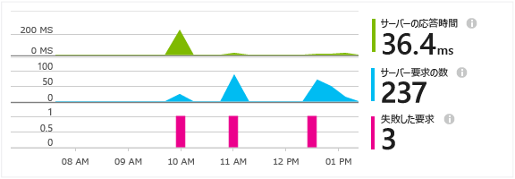
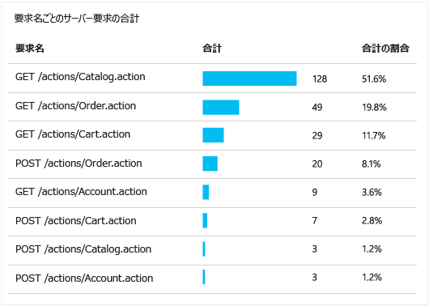
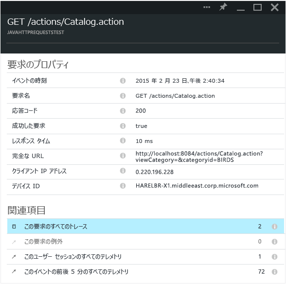

<properties 
	pageTitle="Java Web アプリケーションでの HTTP 要求の追跡" 
	description="Application Insights を使用すると、Java Web アプリケーションのパフォーマンスを測定できます。" 
	services="application-insights" 
    documentationCenter=""
	authors="alancameronwills" 
	manager="keboyd"/>

<tags 
	ms.service="application-insights" 
	ms.workload="tbd" 
	ms.tgt_pltfrm="ibiza" 
	ms.devlang="na" 
	ms.topic="article" 
	ms.date="05/26/2015" 
	ms.author="awills"/>
 
# Java Web アプリケーションでの HTTP 要求の追跡

Java Web アプリケーションを実行している場合、要求されたリソース、失敗した要求、応答時間など、アプリケーションに送信された HTTP 要求に関する情報をすべて Application Insights ポータルに表示できます。

[Application Insights SDK for Java][java] をインストールしていない場合はインストールします。

## プロジェクトへのバイナリの追加

*プロジェクトに適した方法を選択してください。*

### Maven を使用している場合:

プロジェクトが既に Maven を使用してビルドする設定になっている場合は、pom.xml ファイルに次のコード スニペットをマージします。

次に、バイナリがダウンロードされるように、プロジェクトの依存関係を更新します。

    <dependencies>
      <dependency>
        <groupId>com.microsoft.azure</groupId>
        <artifactId>applicationinsights-web</artifactId>
        <version>[0.9,)</version>
      </dependency>
    </dependencies>

### Gradle を使用している場合:

プロジェクトが既に Gradle を使用してビルドする設定になっている場合は、build.gradle ファイルに次のコード スニペットをマージします。

次に、バイナリがダウンロードされるように、プロジェクトの依存関係を更新します。

    dependencies {
      compile group: 'com.microsoft.azure', name: 'applicationinsights-web', version: '0.9.+'
    }

## プロジェクトへの Application Insights HTTP フィルターの追加

プロジェクトの web.xml ファイルを見つけて開きます。アプリケーション フィルターが構成されている web-app ノードの下に次のコード スニペットをマージします。

最も正確な結果を得るためには、他のすべてのフィルターの前にこのフィルターをマップする必要があります。

    <filter>
      <filter-name>ApplicationInsightsWebFilter</filter-name>
      <filter-class>
        com.microsoft.applicationinsights.web.internal.WebRequestTrackingFilter
      </filter-class>
    </filter>
    <filter-mapping>
       <filter-name>ApplicationInsightsWebFilter</filter-name>
       <url-pattern>/*</url-pattern>
    </filter-mapping>

## プロジェクトへの HTTP モジュールの追加

プロジェクトで ApplicationInsights.xml ファイルを見つけて開き、<TelemetryModules> 要素の下にある次のコード スニペットをマージします。

このファイル内に <TelemetryModules> 要素が存在しない場合は、<ApplicationInsights> 要素の下に 1 つ追加します。

    <TelemetryModules>
      <Add type="com.microsoft.applicationinsights.web.extensibility.modules.WebRequestTrackingTelemetryModule"/>
      <Add type="com.microsoft.applicationinsights.web.extensibility.modules.WebSessionTrackingTelemetryModule"/>
      <Add type="com.microsoft.applicationinsights.web.extensibility.modules.WebUserTrackingTelemetryModule"/>
    </TelemetryModules>

## イベントの相関関係のテレメトリ初期化子の追加

イベントの相関関係では、各テレメトリ イベントに結び付けられた操作 ID プロパティを使用して、1 つの HTTP 要求とその要求の処理中に送信されたすべてのテレメトリ イベントを関連付けることができます。これによって、HTTP 要求とこの要求から呼び出されたすべてのイベントをまとめて調べることができ、問題の診断とトラブルシューティングが容易になります。

プロジェクトで ApplicationInsights.xml ファイルを見つけて開き、<TelemetryInitializers> 要素の下にある次のコード スニペットをマージします。

このファイル内に < TelemetryInitializers> 要素が存在しない場合は、<ApplicationInsights> 要素の下に 1 つ追加します。

    <TelemetryInitializers>
     <Add  type="com.microsoft.applicationinsights.web.extensibility.initializers.WebOperationIdTelemetryInitializer"/>
     <Add type="com.microsoft.applicationinsights.web.extensibility.initializers.WebOperationNameTelemetryInitializer"/>
     <Add type="com.microsoft.applicationinsights.web.extensibility.initializers.WebSessionTelemetryInitializer"/>
     <Add type="com.microsoft.applicationinsights.web.extensibility.initializers.WebUserTelemetryInitializer"/>
     <Add type="com.microsoft.applicationinsights.web.extensibility.initializers.WebUserAgentTelemetryInitializer"/>
    </TelemetryInitializers>

## Application Insights での要求情報の表示

アプリケーションを実行します。

Microsoft Azure の Application Insights リソースに戻ります。

HTTP 要求データが概要ブレードに表示されます (表示されない場合は、数秒待ってから [最新の情報に更新] をクリックします)。

 

任意のグラフをクリックして、より詳細なメトリックを表示します。

[メトリックの詳細についてはこちらをご覧ください。][metrics]

 

要求のプロパティを表示すると、その要求に関連付けられているテレメトリ イベント (要求や例外など) が表示されます。
 

## 次のステップ

* 問題の診断に役立つ情報を得るには、[イベントおよびログを検索][diagnostic]します。
* [Log4J または Logback トレースをキャプチャします。][javalogs]

<!--Link references-->

[diagnostic]: app-insights-diagnostic-search.md
[java]: app-insights-java-get-started.md
[javalogs]: app-insights-java-trace-logs.md
[metrics]: app-insights-metrics-explorer.md

 

<!---HONumber=Oct15_HO3-->