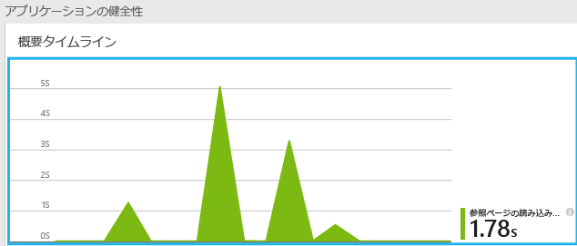
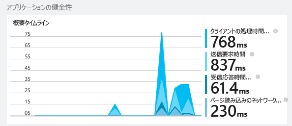
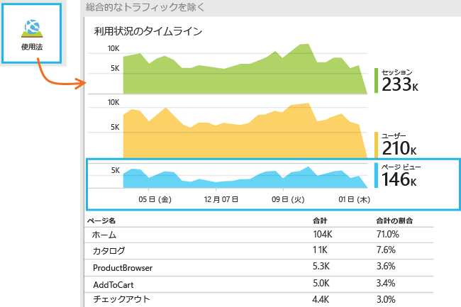
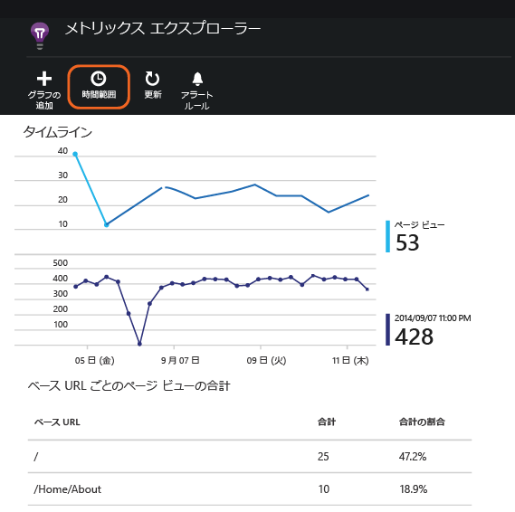
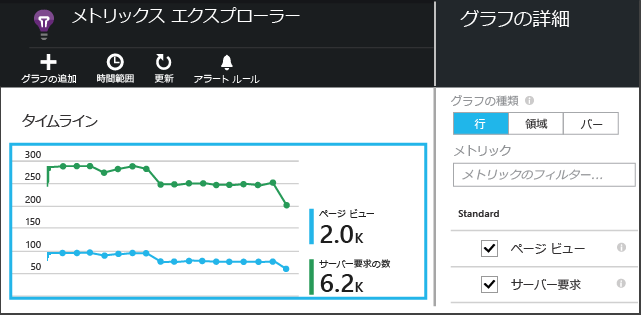

<properties 
	pageTitle="JavaScript Web アプリのための Application Insights" 
	description="ページ ビューとセッション数、Web クライアントのデータを取得し、使用パターンを追跡します。JavaScript Web ページの例外とパフォーマンスの問題を検出します。" 
	services="application-insights" 
    documentationCenter=""
	authors="alancameronwills" 
	manager="douge"/>

<tags 
	ms.service="application-insights" 
	ms.workload="tbd" 
	ms.tgt_pltfrm="ibiza" 
	ms.devlang="na" 
	ms.topic="article" 
	ms.date="07/10/2015" 
	ms.author="awills"/>
 
# JavaScript Web アプリのための Application Insights

[AZURE.INCLUDE [app-insights-selector-get-started](../../includes/app-insights-selector-get-started.md)]

Web ページのパフォーマンスと使用状況について調べます。Visual Studio Application Insights をページに追加すれば、利用者の数、再訪問の頻度、最も利用されているページがわかります。読み込み時間と例外のレポートも与えられます。いくつかの[カスタム イベントとメトリック][track]を追加すると、最も人気のある機能や最も一般的なミスを詳細に分析し、ユーザーが満足するようにページを調整できます。

![[新規]、[開発者向けサービス]、[Application Insights] の順に選択する。](./media/app-insights-javascript/16-page-views.png)

[ASP.NET][greenbrown] または [Java][java] Web アプリにサーバー利用統計情報を既に設定している場合、クライアントとサーバーの両方の角度からの画像が与えられます。この 2 つのストリームは Application Insights ポータルで統合されます。

## Application Insights リソースの作成

Application Insights リソースは、ページのパフォーマンスと使用状況に関するデータが表示される場所です。(Web サーバーからデータを集めるなどの目的で、既にリソースを作成している場合、この手順を省略します。)

[Azure ポータル](http://portal.azure.com)で、新しい Application Insights リソースを作成します。

![[新規]、[開発者向けサービス]、[Application Insights] の順に選択する。](./media/app-insights-javascript/01-create.png)

*質問がございますか?* [リソースの作成に関する詳細はここにあります][new]。

## アプリや Web ページに SDK スクリプトを追加する

クイック スタートで、Web ページのスクリプトを取得します。

追跡するすべてのページの &lt;/head&gt; タグの直前に、スクリプトを挿入します。Web サイトにマスター ページがある場合は、そこにスクリプトを配置できます。次に例を示します。

* ASP.NET MVC プロジェクトで、View\\Shared\\\_Layout.cshtml にスクリプトを配置します。
* SharePoint サイトのコントロール パネルで、[[サイト設定 / マスター ページ](app-insights-sharepoint.md)] を開きます。

このスクリプトには、Application Insights リソースにデータを転送するインストルメンテーション キーが含まれています。

*(よく知られている Web ページ フレームワークを使用している場合、Application Insights アダプターを探してください。たとえば、[AngularJS モジュール](http://ngmodules.org/modules/angular-appinsights)があります。)*

 
## アプリを実行する

Web アプリを実行し、しばらくの間、利用統計情報を生成し、少し待ちます。F5 キーを使って開発用コンピューターで実行するか、公開し、ユーザーに利用させることができます。

Web アプリが Application Insights に送信している利用統計情報を確認する場合、ブラウザーのデバッグ ツールを使用します (多くのブラウザーで F12 です)。データは dc.services.visualstudio.com に送信されます。

## データを調査する

アプリケーションの概要ブレードでは、最上部の近くにグラフがあり、ブラウザーにページを読み込むときの平均時間が表示されます。

*まだデータが表示されませんか? ページの上部にある **[更新]** をクリックします。まだは何も表示されませんか? 「[トラブルシューティング][qna]」を参照してください。*

そのグラフをクリックすると、さらに詳しいグラフになって表示されます。

これは積み重ねグラフであり、合計ページ読み込み時間を [W3C が定義する標準のタイミング](http://www.w3.org/TR/navigation-timing/#processing-model)に分解します。

通常、*ネットワーク接続*時間は予想より短くなることに注意してください。これは、ブラウザーからサーバーに送信されるすべての要求の平均であるためです。個別の要求の多くは接続時間が 0 です。サーバーへの接続が既にアクティブになっているためです。

### ページ別のパフォーマンス

詳細ブレードのさらに下に、ページ URL で分割されたグリッドがあります。

時間の経過と共に変化するページのパフォーマンスを表示する場合は、グリッドをダブルクリックし、グラフの種類を変更します。

## クライアント使用状況の概要

概要ブレードに戻り、使用状況をクリックします。

* **ユーザー:** グラフの時間範囲内で変化する一意のユーザーの数。(戻ってくるユーザーを識別するために Cookie が使用されます)。
* **セッション:** ユーザーが 30 分間何の要求も出さないと、セッションがカウントされます。
* **ページ ビュー**: trackPageView() の呼び出し数をカウントします。通常、各 Web ページで 1 回呼び出されます。

### クリックして詳細を表示する

グラフをクリックすると、詳細が表示されます。グラフの時間範囲を変更できます。

グラフをクリックして表示するメトリックを選択するか、新しいグラフを追加して表示するメトリックを選択します。

> [AZURE.NOTE]メトリックは、いくつかの組み合わせでしか表示できないことがあります。メトリックを選択すると、互換性のないメトリックは無効になります。

## ページ カウントのカスタマイズ

既定では、ページ カウントは新しいページがクライアント ブラウザーに読み込まれるたびに行われます。ただし、ページ ビューを別の場合にもカウントできます。たとえば、ページの内容がタブに表示され、ユーザーがタブを切り替えるときに対象ページをカウントしたい場合があります。またはページ内の JavaScript コードが、ブラウザーの URL を変更することなく新しいコンテンツを読み込む場合もあります。

次のような JavaScript 呼び出しをクライアント コードの適切な箇所に挿入します。

    appInsights.trackPageView(myPageName);

ページ名には、同じ文字を URL として含めることできますが、「#」または「?」の後の文字はすべて無視されます。

## 個別のページ ビュー イベントを調査する

通常、Application Insights がページ ビューの利用統計情報を分析し、お客様に対して表示されるのは、すべてのユーザーに関して平均した累積レポートのみです。ただし、デバッグのために個別のページ ビュー イベントを調べることもできます。

[診断検索] ブレードで、[フィルター] を [ページ ビュー] に設定します。

いずれかのイベントをクリックして、詳細を表示します。詳細ページで、[...] をクリックしてさらに詳しい情報を表示します。

> [AZURE.NOTE][検索][diagnostic]を利用する場合、単語全体が一致しなければならないことに注意してください。「Abou」と「bout」は「About」に一致しませんが、「Abou\*」は一致します。検索語をワイルドカードで始めることもできません。たとえば、「\*bou」を検索しても「About」とは一致しません。

> [診断検索の詳細][diagnostic]

### ページ ビュー プロパティ

* **ページ ビュー時間** ページの読み込みや、スクリプト実行の開始にかかる時間です。具体的には、ページ読み込みの開始から trackPageView の実行までの間隔です。スクリプトの初期化後、trackPageView をその定位置から移動した場合、別の値が反映されます。 

## 使用状況の追跡 (カスタム)

アプリケーションで、ユーザーが何をするのかを知る必要がありますか。 クライアントとサーバーのコードに呼び出しを挿入すると、Application Insights に独自の利用統計情報を送信できます。たとえば、注文を作成したが完了していないユーザーの数、最も頻繁に発生する検証エラー、またはゲームの平均スコアを確認できます。

* [カスタム イベントとメトリックの API の詳細情報][track]。
* [API リファレンス](https://github.com/Microsoft/ApplicationInsights-JS/blob/master/API-reference.md)

## サーバーの利用統計情報

これをまだ実行していない場合、サーバーから情報を入手し、そのデータをクライアント側のデータと共に表示できます。サーバーのパフォーマンスを評価し、問題を診断できます。

* [Application Insights を ASP.NET アプリに追加する][greenbrown]
* [Application Insights を Java Web アプリに追加する][java]

##  動画: 使用状況の追跡

> [AZURE.VIDEO tracking-usage-with-application-insights]

## 次のステップ

[カスタム イベントとメトリックを使用した利用状況の追跡][track]

<!--Link references-->

[diagnostic]: app-insights-diagnostic-search.md
[greenbrown]: app-insights-start-monitoring-app-health-usage.md
[java]: app-insights-java-get-started.md
[new]: app-insights-create-new-resource.md
[qna]: app-insights-troubleshoot-faq.md
[track]: app-insights-api-custom-events-metrics.md

 

<!---HONumber=July15_HO5-->