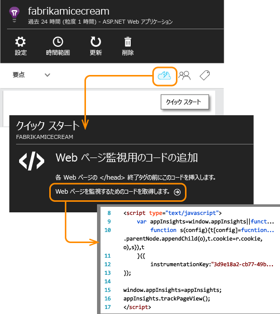
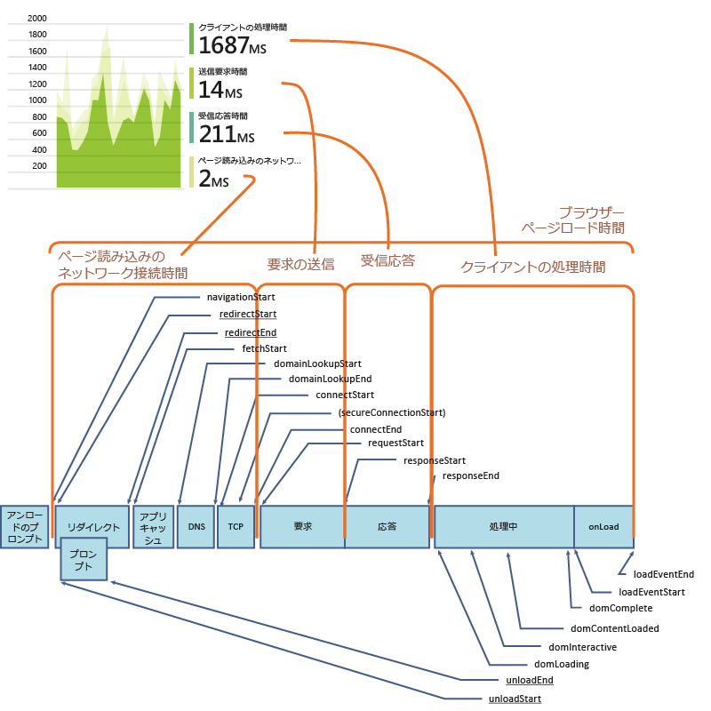
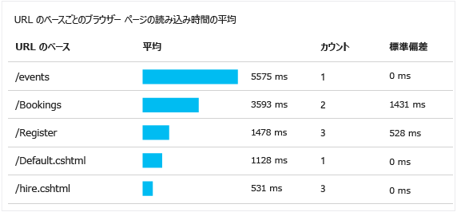
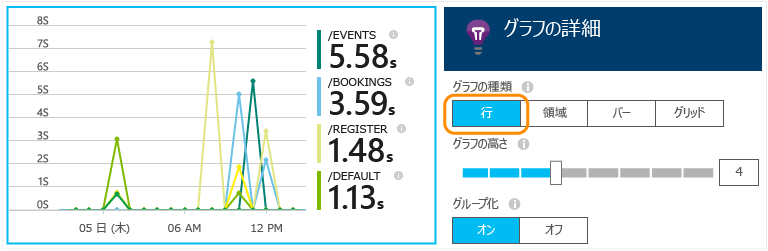
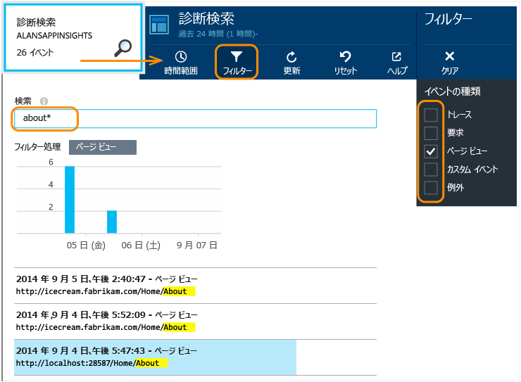

# <a name="application-insights-for-web-pages"></a>Web ページ向けの Application Insights
Web ページまたはアプリのパフォーマンスと使用状況について調べます。 [Application Insights](app-insights-overview.md) をページ スクリプトに追加すると、ページの読み込みと AJAX 呼び出しのタイミング、ブラウザーの例外や AJAX エラーの数と詳細、ユーザー数とセッション数を取得できます。 いずれの情報も、ページ、クライアントの OS とブラウザー バージョン、geo ロケーションなどのディメンションごとにセグメント化することができます。 エラーの数やページ読み込みの遅延に基づくアラートを設定することもできます。 また、JavaScript コードにトレースの呼び出しを挿入することで、Web ページ アプリケーションのさまざまな機能がどのように使用されているかを追跡できます。

短い JavaScript コードを追加するだけで、Application Insights をあらゆる Web ページで使用できます。 Web サービスが [Java](app-insights-java-get-started.md) または [ASP.NET](app-insights-asp-net.md) の場合、サーバーとクライアントのテレメトリを統合できます。

![portal.azure.com でアプリのリソースを開き、[ブラウザー] をクリックする](./media/app-insights-javascript/03.png)

使用を開始するには、 [Microsoft Azure](https://azure.com)のサブスクリプションが必要です。 所属する部署がサブスクリプションを所有している場合、あなたの Microsoft アカウントをサブスクリプションに追加するようその所有者に依頼してください。

## <a name="set-up-application-insights-for-your-web-page"></a>Web ページに Application Insights を設定する
次のように、Web ページにローダー コード スニペットを追加します。

### <a name="open-or-create-application-insights-resource"></a>Application Insights リソースを開くまたは作成する
Application Insights リソースは、ページのパフォーマンスと使用状況に関するデータが表示される場所です。 

[Azure Portal](https://portal.azure.com) にサインインします。

アプリのサーバー側の監視を既に設定している場合は、既にリソースがあります。

![[参照]、[開発者向けサービス]、[Application Insights] の順に選択する](./media/app-insights-javascript/01-find.png)

リソースがない場合は、次の手順で作成します。

![[新規]、[開発者向けサービス]、[Application Insights] の順に選択する。](./media/app-insights-javascript/01-create.png)

*質問がございますか?* [リソースの作成に関する詳細はここにあります](app-insights-create-new-resource.md)のサブスクリプションが必要です。

### <a name="add-the-sdk-script-to-your-app-or-web-pages"></a>アプリや Web ページに SDK スクリプトを追加する
クイック スタートで、Web ページのスクリプトを取得します。



> [!NOTE]
> "*作業の開始*" エクスペリエンスは、Application Insights リソースの作成時に選んだアプリケーションの種類によって異なります。 実際のアプリに関して、先ほどのスクリーンショットで紹介したようなスクリプトが存在しない場合は、次のスクリプトを使用してください。

```HTML
<!-- 
To collect user behavior analytics about your application, 
insert the following script into each page you want to track.
Place this code immediately before the closing </head> tag,
and before any other scripts. Your first data will appear 
automatically in just a few seconds.
-->
<script type="text/javascript">
var appInsights=window.appInsights||function(a){
  function b(a){c[a]=function(){var b=arguments;c.queue.push(function(){c[a].apply(c,b)})}}var c={config:a},d=document,e=window;setTimeout(function(){var b=d.createElement("script");b.src=a.url||"https://az416426.vo.msecnd.net/scripts/a/ai.0.js",d.getElementsByTagName("script")[0].parentNode.appendChild(b)});try{c.cookie=d.cookie}catch(a){}c.queue=[];for(var f=["Event","Exception","Metric","PageView","Trace","Dependency"];f.length;)b("track"+f.pop());if(b("setAuthenticatedUserContext"),b("clearAuthenticatedUserContext"),b("startTrackEvent"),b("stopTrackEvent"),b("startTrackPage"),b("stopTrackPage"),b("flush"),!a.disableExceptionTracking){f="onerror",b("_"+f);var g=e[f];e[f]=function(a,b,d,e,h){var i=g&&g(a,b,d,e,h);return!0!==i&&c["_"+f](a,b,d,e,h),i}}return c
  }({
      instrumentationKey:"<your instrumentation key>"
  });
  
window.appInsights=appInsights,appInsights.queue&&0===appInsights.queue.length&&appInsights.trackPageView();
</script>
```

追跡するすべてのページの `</head>` タグの直前にスクリプトを挿入します。Web サイトにマスター ページがある場合は、そこにスクリプトを配置できます。 例: 

* ASP.NET MVC プロジェクトで、 `View\Shared\_Layout.cshtml`
* SharePoint サイトのコントロール パネルで、[ [サイト設定 / マスター ページ](app-insights-sharepoint.md)] を開きます。

このスクリプトには、Application Insights リソースにデータを転送するインストルメンテーション キーが含まれています。 

([スクリプトの詳細については、こちらを参照してください。](http://apmtips.com/blog/2015/03/18/javascript-snippet-explained/))

*(よく知られている Web ページ フレームワークを使用している場合、Application Insights アダプターを探してください。たとえば、[AngularJS モジュール ](http://ngmodules.org/modules/angular-appinsights) があります。*

## <a name="detailed-configuration"></a>詳細な構成
独自に設定できる [パラメーター](https://github.com/Microsoft/ApplicationInsights-JS/blob/master/API-reference.md#config) はいくつか存在しますが、ほとんどの場合、その必要はありません。 たとえば、(トラフィック削減目的で) ページ ビューごとに行われる Ajax 呼び出しの数の報告を無効にすることや、制限することができます。 また、バッチ処理を行わずにテレメトリをパイプラインに迅速に移動するようにデバッグ モードを設定することもできます。

これらのパラメーターを設定するには、コード スニペットから次の行を探し、その後ろにコンマ区切りで項目を追加します。

    })({
      instrumentationKey: "..."
      // Insert here
    });

[利用できるパラメーター](https://github.com/Microsoft/ApplicationInsights-JS/blob/master/API-reference.md#config) の例を次に示します。

    // Send telemetry immediately without batching.
    // Remember to remove this when no longer required, as it
    // can affect browser performance.
    enableDebug: boolean,

    // Don't log browser exceptions.
    disableExceptionTracking: boolean,

    // Don't log ajax calls.
    disableAjaxTracking: boolean,

    // Limit number of Ajax calls logged, to reduce traffic.
    maxAjaxCallsPerView: 10, // default is 500

    // Time page load up to execution of first trackPageView().
    overridePageViewDuration: boolean,

    // Set dynamically for an authenticated user.
    accountId: string,

## <a name="run"></a>アプリを実行する
Web アプリを実行し、しばらくの間、利用統計情報を生成し、少し待ちます。 **F5** キーを使って開発用コンピューターで実行するか、公開し、ユーザーに利用させることができます。

Web アプリが Application Insights に送信している利用統計情報を確認する場合、ブラウザーのデバッグ ツールを使用します (多くのブラウザーで**F12** です)。 データは dc.services.visualstudio.com に送信されます。

## <a name="explore-your-browser-performance-data"></a>ブラウザーのパフォーマンス データを調査する
ユーザーのブラウザーから集計したパフォーマンス データを表示するには、[ブラウザー] ブレードを開きます。


まだデータが表示されませんか?  ページの上部にある **[更新]** をクリックします。 まだ何も表示されませんか? [トラブルシューティング](app-insights-troubleshoot-faq.md)に関するページを参照します。

[ブラウザー] ブレードは、あらかじめ設定されたフィルターと一連のグラフで構成された [メトリックス エクスプローラーのブレード](app-insights-metrics-explorer.md) です。 時間範囲、フィルター、グラフの構成を必要に応じて編集し、その結果をお気に入りとして保存することができます。 **[既定値に戻す]** をクリックすると、元のブレード構成に戻ります。

## <a name="page-load-performance"></a>ページ読み込みのパフォーマンス
最上部には、ページの読み込み時間をセグメント化したグラフが表示されます。 グラフ全体の高さは、ユーザーのブラウザーでアプリからページを読み込んで表示するのにかかった平均時間を表します。 時間の測定範囲は、ブラウザーが初期 HTTP 要求を送信してから、すべての同時読み込みイベントが処理されるまでとなります (レイアウトと実行中のスクリプトを含む)。 AJAX 呼び出しからの Web パーツ読み込みといった非同期タスクは含まれません。

このグラフでは、ページ読み込み時間の合計が、 [W3C で定義されている標準的なタイミング](http://www.w3.org/TR/navigation-timing/#processing-model)に合わせてセグメント化されています。 



多くの場合、"*ネットワーク接続*" 時間は予想よりも短くなることに注意してください。これは、ブラウザーからサーバーに送信されるすべての要求の平均であるためです。 個別の要求の多くは接続時間が 0 です。サーバーへの接続が既にアクティブになっているためです。

### <a name="slow-loading"></a>読み込みに時間がかかる
ページの読み込みに時間がかかる問題は、エンド ユーザーの満足度を下げる大きな要因の 1 つです。 グラフからページの読み込みに時間がかかっていることがわかれば、診断調査を簡単に行うことができます。

このグラフは、対象アプリにおける全ページ読み込みの平均時間を示しています。 問題が特定のページに限定されているかどうかは、ブレードの下の方にある、ページの URL ごとにセグメント化されたグリッドで確認できます。



ページ ビュー カウントと標準偏差に注目してください。 このページ カウントがごく小さければ、この問題はさほど多くのユーザーに影響していません。 標準偏差が大きい (平均値そのものに匹敵するなど) ことは、個々の測定値にばらつきが多いことを示しています。

**特定の URL やページ ビューを拡大します。** いずれかのページ名をクリックすると、その URL だけを表示するようにブラウザー グラフがフィルタリングされてブレードが表示されます。そこからさらに、特定のページ ビューの情報だけを表示することもできます。


[`...`] をクリックすると、該当するイベントの一連のプロパティがすべて表示されます。また、AJAX 呼び出しや関連するイベントを詳しく調査することもできます。 AJAX 呼び出しが同期処理で実行されている場合、呼び出しに時間がかかると、ページ読み込み時間全体に影響します。 関連するイベントとしては、同じ URL に対するサーバー要求があります (Web サーバーに対して Application Insights を設定した場合)。

**時間経過に伴うページ パフォーマンス。** 特定の時間帯にピークを迎えているかどうかを確認するには、[ブラウザー] ブレードに戻って、[ページ ビューの読み込み時間] グリッドを折れ線グラフに変更します。



**セグメント化の基準となるディメンションの変更。** ページ読み込み速度の低下が、特定のブラウザーやクライアント OS、特定地域のユーザーに集中している可能性があります。 新しいグラフを追加し、 **[グループ化]** で適宜ディメンションを変えながら試してください。


## <a name="ajax-performance"></a>AJAX パフォーマンス
Web ページの AJAX 呼び出しが適切に実行されていることを確認します。 Ajax 呼び出しは、非同期的にページの一部を読み込む目的でよく使用されます。 ページ全体としては即座に読み込まれていても、最初に空の Web パーツが表示され、データが表示されるまでに時間がかかっているようだと、ユーザーはストレスを感じる可能性があります。

Web ページからの AJAX 呼び出しは、[ブラウザー] ブレードに依存関係として表示されます。

ブレードの上部には、集計グラフが表示されます。


詳細なグリッドは下の方に表示されます。


いずれかの行をクリックすると、詳しい情報が表示されます。

> [!NOTE]
> ブレードで [ブラウザー] フィルターを削除した場合、サーバーと AJAX の両方の依存関係がこれらのグラフの対象となります。 フィルターを再構成するには [既定値に戻す] をクリックしてください。
> 
> 

**AJAX 呼び出しエラーを詳しく調査するには** 、下にスクロールして [Dependency failures (依存関係の障害)] グリッドを表示し、特定の行をクリックしてその内容を表示します。


[ `...` ] をクリックすると、AJAX 呼び出しの全テレメトリが表示されます。

### <a name="no-ajax-calls-reported"></a>AJAX 呼び出しが報告されない場合
AJAX 呼び出しには、Web ページのスクリプトから実行されるすべての HTTP/HTTPS 呼び出しが含まれます。 これらが表示されない場合は、コード スニペットで `disableAjaxTracking` または `maxAjaxCallsPerView` [パラメーター](https://github.com/Microsoft/ApplicationInsights-JS/blob/master/API-reference.md#config)が設定されていないことを確認してください。

## <a name="browser-exceptions"></a>ブラウザーの例外
[ブラウザー] ブレードには、例外の集計グラフが表示されるほか、例外の種類を示すグリッドがブレードの下の方に表示されます。


ブラウザーの例外がまったく表示されない場合は、コード スニペットで `disableExceptionTracking` [パラメーター](https://github.com/Microsoft/ApplicationInsights-JS/blob/master/API-reference.md#config)が設定されていないかどうかを確認してください。

## <a name="inspect-individual-page-view-events"></a>個別のページ ビュー イベントを調査する

通常、Application Insights がページ ビューの利用統計情報を分析し、お客様に対して表示されるのは、すべてのユーザーに関して平均した累積レポートのみです。 ただし、デバッグのために個別のページ ビュー イベントを調べることもできます。

[診断検索] ブレードで、[フィルター] を [ページ ビュー] に設定します。



いずれかのイベントをクリックして、詳細を表示します。 詳細ページで、[...] をクリックしてさらに詳しい情報を表示します。

> [!NOTE]
> [Search](app-insights-diagnostic-search.md) を使用する場合は、単語全体と一致しなければならないことに注意してください。たとえば、"Abou" や "bout" は "About" と一致しません。
> 
> 

強力な [Log Analytics クエリ言語](https://docs.microsoft.com/azure/application-insights/app-insights-analytics-tour#browser-timings-table)を使って、ページ ビューを検索することもできます。

### <a name="page-view-properties"></a>ページ ビュー プロパティ
* **ページ ビュー時間** 
  
  * 既定では、クライアント要求から完全な読み込みまでの、ページの読み込みにかかる時間です (補助ファイルを含みますが、Ajax 呼び出しなどの非同期タスクは含まれません)。 
  * [ページ構成](#detailed-configuration)で `overridePageViewDuration` を設定した場合は、クライアント要求から最初に `trackPageView` が実行されるまでの間隔です。 スクリプトの初期化後、trackPageView をその定位置から移動した場合、別の値が反映されます。
  * `overridePageViewDuration` が設定され、期間引数が `trackPageView()` 呼び出しで指定される場合は、その引数の値が代わりに使用されます。 

## <a name="custom-page-counts"></a>ページ カウントのカスタマイズ
既定では、ページ カウントは新しいページがクライアント ブラウザーに読み込まれるたびに行われます。  ただし、ページ ビューを別の場合にもカウントできます。 たとえば、ページの内容がタブに表示され、ユーザーがタブを切り替えるときに対象ページをカウントしたい場合があります。 またはページ内の JavaScript コードが、ブラウザーの URL を変更することなく新しいコンテンツを読み込む場合もあります。

次のような JavaScript 呼び出しをクライアント コードの適切な箇所に挿入します。

    appInsights.trackPageView(myPageName);

ページ名には、同じ文字を URL として含めることができますが、"#" または "?" の後の文字はすべて無視されます。

## <a name="usage-tracking"></a>使用状況の追跡
アプリケーションで、ユーザーが何をするのかを知る必要がありますか。

* [ユーザー動作分析ツールの詳細情報](app-insights-web-track-usage.md)
* [カスタム イベントとメトリックの API の詳細情報](app-insights-api-custom-events-metrics.md)。

## <a name="video"></a> ビデオ


> [!VIDEO https://channel9.msdn.com/events/Connect/2016/100/player]


## <a name="next"></a> 次のステップ
* [利用状況を追跡する](app-insights-web-track-usage.md)
* [カスタム イベントとメトリックス](app-insights-api-custom-events-metrics.md)
* [ビルド - 測定 - 学習](app-insights-web-track-usage.md)

