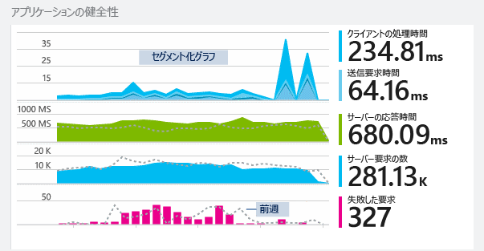
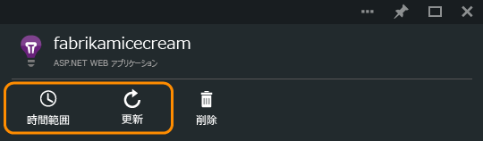
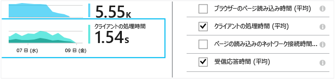
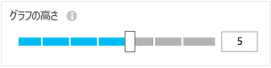
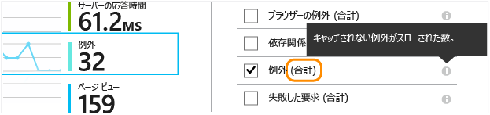
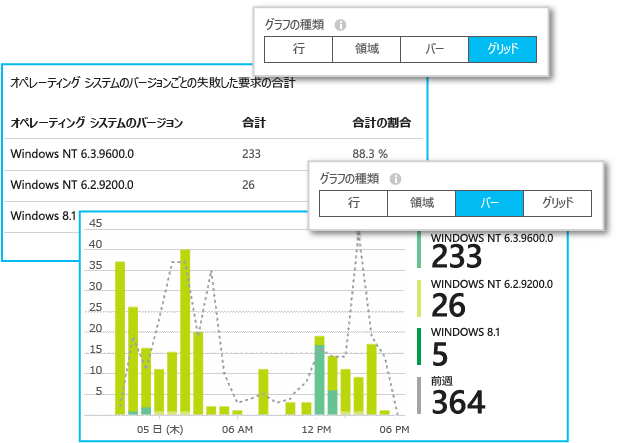
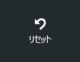

# Application Insights を使用したメトリックの探索
[Application Insights][start] のメトリックとは、アプリケーションからのテレメトリとして送信される測定値とイベントの数を表します。 メトリックは、パフォーマンスの問題を検出し、アプリケーションの利用に関する傾向を把握するのに役立ちます。 さまざまな標準メトリックが用意されているほか、独自にカスタムのメトリックとイベントを作成することもできます。

メトリックとイベントの数は、合計、平均、カウントなどの集計値のグラフに表示されます。

グラフのサンプル セットを次に示します。

Application Insights ポータルでは、あらゆる場所でメトリック グラフが使用されます。 多くの場合、これらはカスタマイズ可能で、ブレードには複数のグラフを追加できます。 概要ブレードから順番にクリックして、 ("サーバー" などのタイトルが付いた) より詳細なグラフに進んだり、**[メトリックス エクスプローラー]** をクリックして新しいブレードを開き、カスタム グラフを作成したりすることもできます。

## 時間範囲
任意のブレードのグラフまたはグリッドで使用される時間範囲を変更できます。

想定しているデータがまだ表示されていない場合は、[最新の情報に更新] をクリックします。 グラフは周期的に自動で更新されますが、時間範囲が広い場合、更新間隔も長くなります。 データが分析パイプラインを介してグラフとして表示されるまでに時間がかかる場合があります。

グラフの一部を拡大するには、グラフ上でドラッグします。

グラフを元に戻すには、[Undo Zoom (ズームを元に戻す)] ボタンをクリックします。

## 粒度とポイント値
グラフ上にマウス ポインターを置くと、そのポイントのメトリックの値が表示されます。

特定のポイントのメトリックの値は、先行するサンプリング間隔の集計です。

サンプリング間隔または "粒度" は、ブレードの上部に表示されます。

[時間範囲] ブレードで粒度を調整できます。

使用できる粒度は、選択した時間範囲によって異なります。 明示的な粒度は、時間範囲の "自動" 粒度の代替手段です。

## グラフおよびグリッドの編集
新しいグラフをブレードに追加するには:

![メトリックス エクスプローラーで、[グラフの追加] を選択します](./media/app-insights-metrics-explorer/04-add.png)

表示内容を編集する既存のグラフまたは新しいグラフで **[編集]** を選択します。

1 つのグラフに複数のメトリックを表示できますが、一緒に表示できるメトリックの組み合わせに関して制限があります。 1 つのメトリックを選択するとすぐに、他の特定のメトリックが無効になります。

アプリに[カスタム メトリック][track]を組み込んでいる場合 (TrackMetric と TrackEvent の呼び出し) は、これらのメトリックがここに表示されます。

## データの分割
プロパティによりメトリックを分割して、クライアントと他のオペレーティング システムでのページ ビューの比較などを行えます。

グラフまたはグリッドを選択します。[グループ化] をオンにし、グループ化のために使用するプロパティを選択します。

![[グループ化] をオンにし、[グループ化] でプロパティを選択します](./media/app-insights-metrics-explorer/15-segment.png)

> [!NOTE]
> グループ化を使用すると、面グラフや棒グラフで積み上げ表示を指定できます。 これは、集計方法が "合計" である場合に適しています。 集計の種類が "平均値" の場合は、表示タイプを "行" または "グリッド" にします。
>
>

アプリに組み込んだ[カスタム メトリック][track]がプロパティ値を持つ場合は、この一覧でそのプロパティを選択できます。

分割されたデータを表示するのにグラフが小さすぎる場合は、 高さを調整することができます。

## 集計タイプ
既定でグラフの横にある凡例は、通常、グラフの期間における集計値を示します。 グラフ上にマウス ポインターを置くと、その時点での値が表示されます。

グラフの各データ ポイントは、前のサンプリング間隔または "粒度" で受信したデータ値の集計です。 粒度はブレードの上部に表示され、グラフの全体的な時間スケールに応じて異なります。

メトリックは、次のようなさまざまな方法で集計できます。

* **カウント** は、サンプリング間隔の間に受信したイベントの数です。 要求などのイベントに使用されます。 グラフの高さの変化は、イベントの発生率の変化を示します。 サンプリング間隔を変更すると、数値が変わることに注意してください。
* **合計** は、サンプリング間隔 (グラフの期間) 中に受信したすべてのデータ ポイントの値を合計します。
* **平均** は、合計を、間隔中に受信したデータ ポイントの数で除算します。
* **一意の** 数は、ユーザーとアカウントの数に使用されます。 サンプリング間隔中 (グラフの期間中)、数値はその期間のさまざまなユーザーの数を示します。
* **%** - 各集計の割合バージョンは、セグメント化されたグラフでのみ使用されます。 合計は常に 100% となり、グラフには、合計に含まれるさまざまなコンポーネントの相対的寄与率が示されます。

    

### 集計タイプの変更

新しいグラフを作成したとき、またはすべてのメトリックを選択解除したときに、各メトリックの既定の方法が表示されます。

## Y 軸の固定 
既定では、グラフの Y 軸にはゼロからデータ範囲の最大値までが表示され、クォンタム値が視覚的に示されますが。 値の変化を、クォンタムを超えて視覚的に調査する必要が出てくることもあります。 このようなカスタマイズでは、Y 軸の範囲の編集機能を使用して、Y 軸の最小値または最大値を必要な場所に固定します。
"詳細設定" のチェックボックスをオンにすると、Y 軸の範囲の設定が表示されます

!["詳細設定" をクリックし、[カスタム] の範囲を選択して、最小値と最大値を指定します](./media/app-insights-metrics-explorer/y-axis-range.png)

## データのフィルター選択
選択したプロパティ値のセットのメトリックのみを表示するには:

![[フィルター] をクリックした後、プロパティを展開し、目的の値にチェック マークを付けます](./media/app-insights-metrics-explorer/19-filter.png)

特定のプロパティの値を選択しない場合、すべての値を選択するのと同じ意味になり、そのプロパティに基づくフィルターはオフになります。

各プロパティ値の横に表示されるイベントの数に注意してください。 あるプロパティの値を選択すると、その他のプロパティの値の横に表示される数値が調整されます。

フィルターは、ブレードのすべてのグラフに適用されます。 グラフごとに異なるフィルターを適用する場合は、それぞれ異なるメトリック ブレードを作成して保存します。 その場合、グラフを並べて表示できるように、各ブレードのグラフをダッシュボードに固定できます。

### Bot と Web テストのトラフィックの除外
**[実際のトラフィックまたは合成トラフィック]** フィルターを使用し、**[実際]** チェック ボックスをオンにします。

**[人工トラフィックのソース]** フィルターを適用することもできます。

### プロパティをフィルター一覧に追加するには
自分が選んだカテゴリでテレメトリをフィルターしたい場合があります。 たとえば、ユーザーをさまざまなカテゴリに分類している場合、それらのカテゴリでデータをセグメント化するとします。

[独自のプロパティを作成](app-insights-api-custom-events-metrics.md#properties)します。 さまざまな SDK モジュールによって送信される標準テレメトリも含め、すべてのテレメトリで表示されるように、 [テレメトリ初期化子](app-insights-api-custom-events-metrics.md#defaults) でそのプロパティを設定します。

## グラフの種類の編集
グリッドとグラフを切り替えることができます。

## メトリック ブレードの保存
作成したグラフはお気に入りとして保存できます。 組織のアカウントを使用している場合は、これを他のチーム メンバーと共有するかどうかを選択できます。

![[お気に入り] を選択します](./media/app-insights-metrics-explorer/21-favorite-save.png)

このブレードをもう一度表示するには、 **概要ブレードに移動** し、[お気に入り] を開きます。

![概要ブレードで [お気に入り] を選択します](./media/app-insights-metrics-explorer/22-favorite-get.png)

相対的な時間範囲を選択して保存した場合、ブレードは最新のメトリックで更新されます。 絶対的な時間範囲を選択した場合は、毎回同じデータが表示されます。

## ブレードのリセット
ブレードを編集した後で元の保存済みセットに戻すには、[リセット] をクリックします。

## Live Metrics Stream

テレメトリの他の即時ビューを見るには、[Live Stream](app-insights-live-stream.md) を開きます。 集計処理のため、ほとんどのメトリックは表示に数分かかります。 これに対し、ライブ メトリックは待ち時間が短くなるように最適化されています。 

## アラートの設定
すべてのメトリックの異常な値を電子メールで通知するには、アラートを追加します。 アカウント管理者または特定の電子メール アドレスのいずれかに電子メールを送信することを選択できます。

![メトリックス エクスプローラーで、[アラート ルール]、[アラートの追加] の順に選択します](./media/app-insights-metrics-explorer/appinsights-413setMetricAlert.png)

[アラートの詳細についてはこちらをご覧ください][alerts]。

## 連続エクスポート
データを外部で処理できるように連続してエクスポートする場合は、 [連続エクスポート](app-insights-export-telemetry.md)の使用を検討してください。

### Power BI
機能がより豊富なビューでデータを表示する場合は、 [Power BI にエクスポート](https://blogs.msdn.com/b/powerbi/archive/2015/11/04/explore-your-application-insights-data-with-power-bi.aspx)することができます。

## Analytics
[Analytics](app-insights-analytics.md) は、強力なクエリ言語を使用してテレメトリを分析する汎用性に優れた方法です。 メトリックの結果を組み合わせたり計算したりする場合や、アプリの最近のパフォーマンスを詳しく調べる場合は、Analytics を使用します。 

メトリックのグラフで Analytics アイコンをクリックすると、同等の Analytics クエリを直接取得することができます。

## トラブルシューティング
*グラフにデータが表示されない。*

* フィルターは、ブレードのすべてのグラフに適用されます。 あるグラフに注目するときに、別のグラフですべてのデータを除外するフィルターを設定していないことを確認します。

    グラフごとに異なるフィルターを設定する場合は、それぞれ異なるブレードでグラフを作成し、個別のお気に入りとして保存します。 その場合、グラフを並べて表示できるように、グラフをダッシュボードに固定できます。
* メトリックで定義されていないプロパティでグラフをグループ化すると、グラフに何も表示されなくなります。 "group by" をクリアするか、別のグループ化プロパティを選択してみます。
* パフォーマンス データ (CPU、IO レートなど) は、Java Web サービス、Windows デスクトップ アプリ、[IIS Web アプリおよびサービス (Status Monitor がインストールされている場合)](app-insights-monitor-performance-live-website-now.md)、[Azure Cloud Services](app-insights-overview.md) で使用できます。 Azure Web サイトでは利用できません。

## ビデオ

> [!VIDEO https://channel9.msdn.com/events/Connect/2016/112/player]

## 次の手順
* [Application Insights による使用状況の監視](app-insights-usage-overview.md)
* [診断検索の使用](app-insights-diagnostic-search.md)

<!--Link references-->

[alerts]: app-insights-alerts.md
[start]: app-insights-overview.md
[track]: app-insights-api-custom-events-metrics.md
