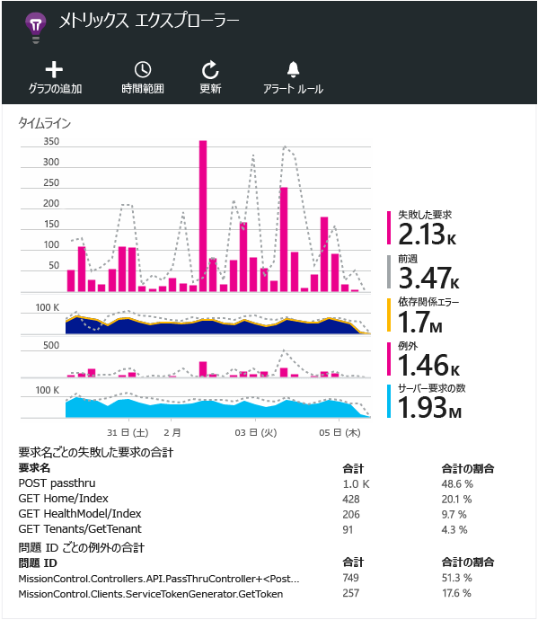

<properties 
	pageTitle="Application Insights を使用したメトリックの探索" 
	description="内部設置型または Microsoft Azure Web アプリケーションの使用状況、可用性、パフォーマンスを Application Insights で分析します。" 
	services="application-insights" 
    documentationCenter=""
	authors="alancameronwills" 
	manager="douge"/>

<tags 
	ms.service="application-insights" 
	ms.workload="tbd" 
	ms.tgt_pltfrm="ibiza" 
	ms.devlang="na" 
	ms.topic="article" 
	ms.date="07/14/2015" 
	ms.author="awills"/>
 
# Application Insights を使用したメトリックの探索

[Application Insights][start] のメトリックとは、アプリケーションからのテレメトリとして送信される測定値とイベントの数を表します。メトリックは、パフォーマンスの問題を検出し、アプリケーションの利用に関する傾向を把握するのに役立ちます。さまざまな標準メトリックが用意されているほか、独自にカスタムのメトリックとイベントを作成することもできます。

メトリックとイベントの数は、合計、平均、カウントなどの集計値のグラフに表示されます。

たとえば、Application Insights を Web アプリケーションに追加した場合、概要の上部に次のような情報が表示されます。

一部のグラフは分割されています。あるポイントのグラフ全体の高さは、表示されているメトリックの合計を示します。既定では、凡例は、最大数量を示します。

点線は、1 週間前のメトリックの値を示します。

## 時間範囲

任意のブレードのほとんどのグラフまたはグリッドで使用される時間範囲を変更することができます。

想定しているデータがまだ表示されていない場合は、[最新の情報に更新] をクリックします。グラフは自動的に更新されません。リリース モードでは、データが分析パイプラインを介してグラフとして表示されるまでに時間がかかる場合があります。

概要ブレードでグラフの一部をドラッグすると、その部分が拡大された新しいグラフが表示されます。

## 粒度とポイント値

グラフ上にマウス ポインターを置くと、そのポイントのメトリックの値が表示されます。

特定のポイントのメトリックの値は、先行するサンプリング間隔の集計です。

サンプリング間隔または "粒度" は、ブレードの上部に表示されます。

[時間範囲] ブレードで粒度を調整できます。

使用できる粒度は、選択した時間範囲によって異なります。明示的な粒度は、時間範囲の "自動" 粒度の代替手段です。

## メトリックス エクスプローラー

概要ブレード上の任意のグラフをクリックすると、関連するグラフとグリッドのより詳細なセットが表示されます。これらのグラフとグリッドを編集して、興味の対象となる細部にフォーカスを当てることができます。

たとえば、Web アプリの失敗した要求のグラフをクリックします。

## 数値の意味

既定では、グラフの横にある凡例は、グラフの期間における集計値を示します。

グラフの各データ ポイントは、先行するサンプリング間隔または "粒度" で受信したデータ値の集計でもあります。粒度はブレードの上部に表示され、グラフの全体的な時間スケールに応じて異なります。

集計方法は、メトリックによって異なります。

 * 応答時間などのメトリックの場合、値は、グラフの期間における**平均**を示します。
 * 失敗した要求などのイベントの数の場合、集計値は、期間における数の**合計**を示します。
 * ユーザーの数の場合、集計値は、期間における**一意の**ユーザーの数を示します (ユーザーが期間中に複数回追跡された場合は、1 回だけカウントされます)。

値が合計値、平均値、または一意の値のどれであるかを調べるには、グラフをクリックし、下へスクロールして選択した値を表示します。メトリックの簡単な説明も表示されます。

 

## グラフおよびグリッドの編集

新しいグラフをブレードに追加するには:

![メトリックス エクスプローラーで、[グラフの追加] を選択します](./media/app-insights-metrics-explorer/04-add.png)

表示内容を編集する既存のグラフまたは新しいグラフを選択します。

1 つのグラフに複数のメトリックを表示できますが、一緒に表示できるメトリックの組み合わせに関して制限があります。1 つのメトリックを選択するとすぐに、他の特定のメトリックが無効になります。

アプリに[カスタム メトリック][track]を組み込んでいる場合 (TrackMetric と TrackEvent の呼び出し) は、これらのメトリックがここに表示されます。

## データの分割

グラフまたはグリッドを選択します。[グループ化] をオンにし、グループ化のために使用するプロパティを選択します。

![[グループ化] をオンにし、[グループ化] でプロパティを選択します](./media/app-insights-metrics-explorer/15-segment.png)

アプリに組み込んだ[カスタム メトリック][track]がプロパティ値を持つ場合は、この一覧でそのプロパティを選択できます。

分割されたデータを表示するのにグラフが小さすぎる場合は、 高さを調整することができます。

## データのフィルター選択

選択したプロパティ値のセットのメトリックのみを表示するには:

![[フィルター] をクリックした後、プロパティを展開し、目的の値にチェック マークを付けます](./media/app-insights-metrics-explorer/19-filter.png)

特定のプロパティの値を選択しない場合、すべての値を選択するのと同じ意味になり、そのプロパティに基づくフィルターはオフになります。

各プロパティ値の横に表示されるイベント数に注目してください。あるプロパティの値を選択すると、その他のプロパティの値の横に表示される数値が調整されます。

## Bot と Web テストのトラフィックの除外

**[実トラフィックまたは人工トラフィック]** フィルターを使用し、**[実トラフィック]** にチェック マークを付けます。

**[人工トラフィックのソース]** フィルターを適用することもできます。

## グラフの種類の編集

グリッドとグラフを切り替えることができます。

## メトリック ブレードの保存

作成したグラフはお気に入りとして保存できます。組織のアカウントを使用している場合は、これを他のチーム メンバーと共有するかどうかを選択できます。

![[お気に入り] を選択します](./media/app-insights-metrics-explorer/21-favorite-save.png)

このブレードをもう一度表示するには、**概要ブレードに移動**し、[お気に入り] を開きます。

![概要ブレードで [お気に入り] を選択します](./media/app-insights-metrics-explorer/22-favorite-get.png)

相対的な時間範囲を選択して保存した場合、ブレードは最新のメトリックで更新されます。絶対的な時間範囲を選択した場合は、毎回同じデータが表示されます。

## ブレードのリセット

ブレードを編集した後で元の保存済みセットに戻すには、[リセット] をクリックします。

## アラートの設定

すべてのメトリックの異常な値を電子メールで通知するには、アラートを追加します。アカウント管理者または特定の電子メール アドレスのいずれかに電子メールを送信することを選択できます。

![メトリックス エクスプローラーで、[アラート ルール]、[アラートの追加] の順に選択します](./media/app-insights-metrics-explorer/appinsights-413setMetricAlert.png)

[アラートの詳細についてはこちらをご覧ください][alerts]。

## Excel へのエクスポート

メトリックス エクスプローラーに表示されるメトリック データを Excel ファイルにエクスポートできます。ポータルに示すように、エクスポートされたデータには、すべてのグラフとテーブルからのデータが含まれています。

![メトリックス エクスプローラーで、[アラート ルール]、[アラートの追加] の順に選択します](./media/app-insights-metrics-explorer/31-export.png)

各グラフやテーブルのデータが Excel ファイルの別のワークシートにエクスポートされます。

表示されている内容がエクスポートされます。エクスポートするデータの範囲を変更する場合は、時間の範囲またはフィルターを変更します。テーブルの場合で、**[さらに読み込む]** が表示されている場合は、それをクリックしてから [エクスポート] をクリックすると、より多くのデータをエクスポートできます。

*現時点では、Internet Explorer と Chrome でのみエクスポートできます。その他のブラウザーについてもサポートの追加に向けて対処していおります。*

データを外部で処理できるよう、連続してエクスポートする場合は、[連続エクスポート](app-insights-export-telemetry.md)の使用を検討してください。

## 次のステップ

* [Application Insights による使用状況の監視](app-insights-overview-usage.md)
* [診断検索の使用](app-insights-diagnostic-search.md)

<!--Link references-->

[alerts]: app-insights-alerts.md
[start]: app-insights-get-started.md
[track]: app-insights-custom-events-metrics-api.md

 

<!---HONumber=July15_HO3-->