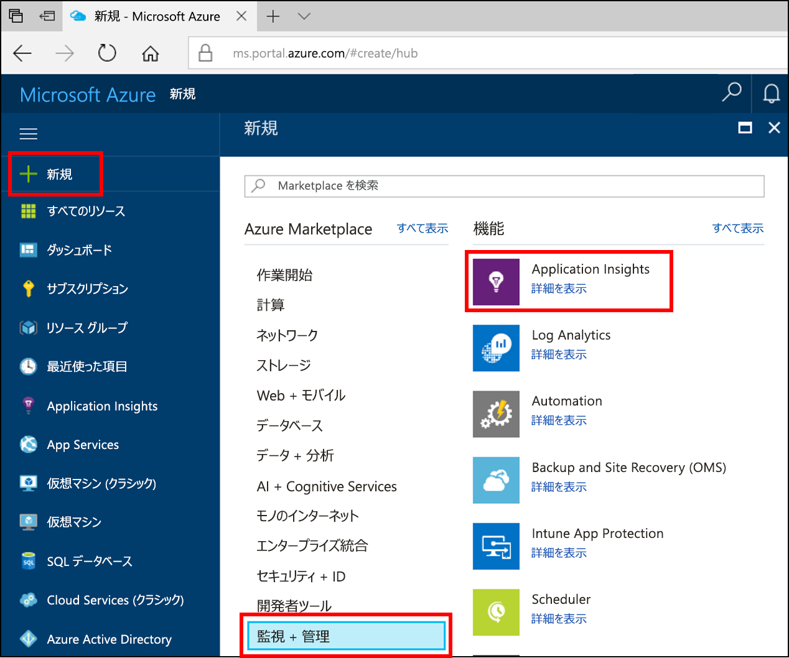
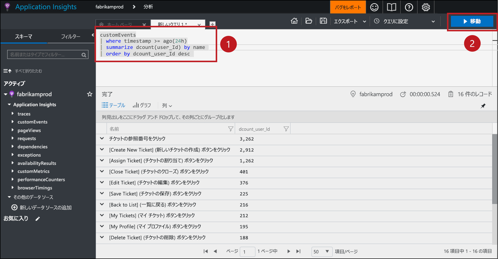

# <a name="start-analyzing-your-mobile-app-with-app-center-and-application-insights"></a>App Center と Application Insights によるモバイル アプリの分析の開始

このクイックスタート ガイドでは、アプリの App Center インスタンスを Application Insights に接続する手順を説明します。 Application Insights を使用すると、App Center の [Analytics](https://docs.microsoft.com/mobile-center/analytics/) サービスで提供されているツールよりも強力なツールを利用して、テレメトリのクエリ、セグメント化、フィルター、分析を実行できます。

## <a name="prerequisites"></a>前提条件

このクイック スタートを完了するには、次のものが必要です。

- Azure サブスクリプション。
- iOS、Android、Xamarin、Universal Windows、または React Native アプリ。
 
Azure サブスクリプションをお持ちでない場合は、開始する前に[無料](https://azure.microsoft.com/free/)アカウントを作成してください。

## <a name="onboard-to-app-center"></a>App Center へのオンボード

モバイル アプリで Application Insights を使用する前に、アプリを [App Center](https://docs.microsoft.com/mobile-center/) にオンボードする必要があります。 Application Insights は、モバイル アプリから直接テレメトリを受信しません。 その代わりに、アプリが App Center にカスタム イベント テレメトリを送信します。 App Center は、イベントを受信すると、これらのカスタム イベントのコピーを Application Insights に継続的にエクスポートします。

アプリをオンボードするには、アプリでサポートされている各プラットフォームの App Center クイックスタートに従ってください。 プラットフォームごとに個別の App Center インスタンスを作成します。

* [iOS](https://docs.microsoft.com/mobile-center/sdk/getting-started/ios)
* [Android](https://docs.microsoft.com/mobile-center/sdk/getting-started/android)
* [Xamarin](https://docs.microsoft.com/mobile-center/sdk/getting-started/xamarin)
* [ユニバーサル Windows](https://docs.microsoft.com/mobile-center/sdk/getting-started/uwp)
* [React Native](https://docs.microsoft.com/mobile-center/sdk/getting-started/react-native)

## <a name="track-events-in-your-app"></a>アプリでのイベントの追跡

アプリを App Center にオンボードしたら、App Center SDK を使用して、カスタム イベント テレメトリを送信するようにアプリを変更する必要があります。 カスタム イベントは、Application Insights にエクスポートされる唯一の種類の App Center テレメトリです。

iOS アプリからカスタム イベントを送信するには、App Center SDK の `trackEvent` または `trackEvent:withProperties` メソッドを使用します。 詳しくは、[iOS アプリからのイベントの追跡](https://docs.microsoft.com/mobile-center/sdk/analytics/ios)に関するページをご覧ください。

```Swift
MSAnalytics.trackEvent("Video clicked")
```

Android アプリからカスタム イベントを送信するには、App Center SDK の `trackEvent` メソッドを使用します。 詳しくは、[Android アプリからのイベントの追跡](https://docs.microsoft.com/mobile-center/sdk/analytics/android)に関するページをご覧ください。

```Java
Analytics.trackEvent("Video clicked")
```

その他のアプリ プラットフォームからカスタム イベントを送信するには、それらの App Center SDK の `trackEvent` メソッドを使用します。

カスタム イベントが受信されていることを確認するには、App Center で **[イベント]** タブの **[Analytics]** セクションに移動します。 アプリから送信されたイベントが表示されるまでに、数分かかる場合があります。

## <a name="create-an-application-insights-resource"></a>Application Insights リソースの作成

アプリからカスタム イベントが送信され、App Center で受信されるようになったら、Azure Portal で App Center 型の Application Insights リソースを作成する必要があります。

1. [Azure Portal](https://portal.azure.com/) にログインします。
2. **[リソースの作成]** > **[監視 + 管理]** > **[Application Insights]** の順に選択します。

    

    構成ボックスが表示されます。 下の表を使用して、入力フィールドに入力します。

    | 設定        |  値           | [説明]  |
   | ------------- |:-------------|:-----|
   | **名前**      | グローバルに一意の値 (例: "myApp-iOS") | 監視しているアプリを識別する名前 |
   | **アプリケーションの種類** | App Center アプリケーション | 監視しているアプリの種類 |
   | **リソース グループ**     | 新しいリソース グループ、またはメニューから選択した既存のリソース グループ | 新しい Application Insights リソースの作成先のリソース グループ |
   | **場所** | メニューから選択した場所 | 近くにある場所か、アプリがホストされている場所の近くを選択します。 |

3. **Create** をクリックしてください。

アプリが複数のプラットフォーム (iOS、Android など) をサポートしている場合は、プラットフォームごとに個別の Application Insights リソースを作成することをお勧めします。

## <a name="export-to-application-insights"></a>Application Insights へのエクスポート

新しい Application Insights リソースの **[概要]** の上部にある **[基本]** セクションで、このリソースのインストルメンテーション キーをコピーします。

アプリの App Center インスタンスで:

1. **[設定]** ページで **[エクスポート]** をクリックします。
2. **[新しいエクスポート]**、**[Application Insights]** の順に選択し、**[カスタマイズ]** をクリックします。
3. Application Insights のインストルメンテーション キーをボックスに貼り付けます。
4. 作成した Application Insights リソースを含む Azure サブスクリプションの使用量の増加に同意します。 Application Insights リソースごとに、1 か月に受信したデータの最初の 1 GB が無料となります。 詳しくは、[Application Insights の価格](https://azure.microsoft.com/pricing/details/application-insights/)に関する記事をご覧ください。

アプリがサポートしているプラットフォームごとに、このプロセスを繰り返します。

[エクスポート](https://docs.microsoft.com/mobile-center/analytics/export)の設定が完了すると、App Center が受信した各カスタム イベントが Application Insights にコピーされるようになります。 イベントが Application Insights に到達するまでに数分かかるため、すぐに表示されない場合は、少し待ってから詳細な診断を行ってください。

最初の接続時は、より多くのデータが得られるように、App Center 内の過去 48 時間のカスタム イベントが Application Insights に自動的にエクスポートされます。

## <a name="start-monitoring-your-app"></a>アプリの監視の開始

Application Insights は、App Center で提供されている分析ツールよりも高度な、アプリからのカスタム イベント テレメトリのクエリ、セグメント化、フィルター、分析を行うことができます。

1. **カスタム イベント テレメトリのクエリ。** Application Insights の **[概要]** ページから、**[Analytics]** を選択します。 

   ![Application Insights の [Analytics] ボタン](./media/app-insights-mobile-center-quickstart/analytics.png)

   Application Insights リソースに関連付けられている Application Insights の Analytics ポータルが開きます。 Analytics ポータルでは Log Analytics クエリ言語を使用してデータを直接クエリできるので、アプリとそのユーザーに関する任意の複雑な質問をすることができます。
   
   Analytics ポータルで新しいタブを開き、次のクエリを貼り付けます。 このクエリは、過去 24 時間にアプリから各カスタム イベントを送信した個別ユーザーの数を、これらの数を基準として並べ替えて返します。

   ```AIQL
   customEvents
   | where timestamp >= ago(24h)
   | summarize dcount(user_Id) by name 
   | order by dcount_user_Id desc 
   ```

   

   1. テキスト エディターでクエリの任意の場所をクリックして、クエリを選択します。
   2. **[実行]** をクリックしてクエリを実行します。 

   詳しくは、[Application Insights Analytics](app-insights-analytics.md)に関するページおよび [Log Analytics クエリ言語](https://docs.loganalytics.io/docs/Language-Reference)に関するページをご覧ください。


2. **カスタム イベント テレメトリのセグメント化とフィルター。** Application Insights の **[概要]** ページで、目次の **[ユーザー]** を選択します。

   ![[ユーザー] ツールのアイコン](./media/app-insights-mobile-center-quickstart/users-icon.png)

   [ユーザー] ツールは、特定のボタンのクリック、特定の画面の閲覧、または App Center SDK を使用してイベントとして追跡している他のアクションを実行したアプリ ユーザーの数を表示します。 App Center イベントをセグメント化およびフィルターする方法を探していた場合は、[ユーザー] ツールが最適な選択肢となります。

   ![[ユーザー] ツール](./media/app-insights-mobile-center-quickstart/users.png) 

   たとえば、**[次で分割]** ドロップダウン メニューで **[国または地域]** を選択して、利用状況を地理別にセグメント化できます。

3. **アプリのコンバージョン、リテンション、ナビゲーションのパターンの分析。** Application Insights の **[概要]** ページで、目次の **[ユーザー フロー]** を選択します。

   ![[ユーザー フロー] ツール](./media/app-insights-mobile-center-quickstart/user-flows.png)

   [ユーザー フロー] ツールは、特定の開始イベントの後にユーザーがどのようなイベントを送信するかを視覚化します。 これは、ユーザーがアプリ内をどのように移動しているかの全体像を把握するのに便利です。 また、多くのユーザーがアプリから離脱している場所や、何度も同じアクションを繰り返している場所を特定できます。

   Application Insights には、[ユーザー フロー] 以外にも、特定の質問に答えるためのユーザー行動分析ツールがいくつか用意されています。

   * **[じょうご]**: コンバージョン レートを分析および監視します。
   * **[リテンション期間]**: アプリが時間の経過と共にどの程度ユーザーを保持できているかを分析します。
   * **[Workbooks]**: 視覚化とテキストを共有可能なレポートに結合します。
   * **[コーホート]**: 特定のユーザーまたはイベントのグループに名前を付けて保存し、他の分析ツールから簡単に参照できるようにします。

## <a name="clean-up-resources"></a>リソースのクリーンアップ

App Center での Application Insights の使用を続行しない場合は、App Center でエクスポートをオフにして、Application Insights リソースを削除します。 これにより、Application Insights でこのリソースに対する課金が行われなくなります。

App Center でエクスポートをオフにするには:

1. App Center で **[設定]** に移動し、**[エクスポート]** を選択します。
2. 削除する Application Insights のエクスポートをクリックし、下部にある **[エクスポートの削除]** をクリックして確認します。

Application Insights リソースを削除するには、次の手順に従います。

1. Azure Portal の左側のメニューで、**[リソース グループ]** をクリックし、Application Insights リソースが作成されたリソース グループを選択します。
2. 削除する Application Insights リソースを開きます。 リソースの上部のメニューで、**[削除]** をクリックして確認します。 これにより、Application Insights にエクスポートされたデータのコピーが完全に削除されます。

## <a name="next-steps"></a>次の手順

> [!div class="nextstepaction"]
> [どのようにお客様がアプリを使用しているかを理解します](app-insights-usage-overview.md)