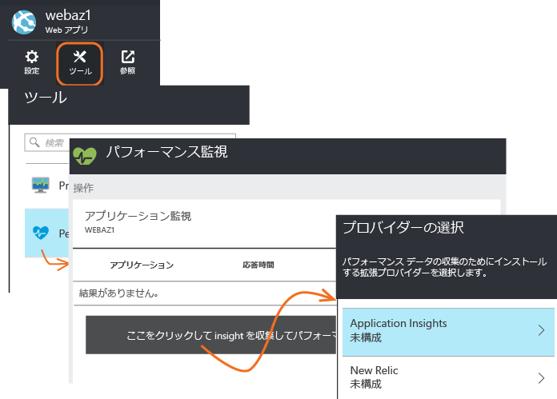

<properties
	pageTitle="実行中の IIS Web サイトのパフォーマンスの問題の診断 | Microsoft Azure"
	description="Web サイトを再デプロイせずにそのパフォーマンスを監視します。依存関係のテレメトリを取得するには、スタンドアロンで使用するか、Application Insights SDK と併用します。"
	services="application-insights"
    documentationCenter=".net"
	authors="alancameronwills"
	manager="douge"/>

<tags
	ms.service="application-insights"
	ms.workload="tbd"
	ms.tgt_pltfrm="ibiza"
	ms.devlang="na"
	ms.topic="get-started-article"
	ms.date="08/24/2016"
	ms.author="awills"/>

# Application Insights を使用した実行時の Web アプリのインストルメント化

*Application Insights はプレビュー段階です。*

Visual Studio Application Insights を使用すれば、ライブ Web アプリをインストルメント化できます。その際、コードに変更を加えたり、再デプロイしたりする必要はありません。オンプレミスの IIS サーバーにアプリがホストされている場合は、Status Monitor をインストールします。アプリが Azure Web アプリであったり、Azure VM で実行されていたりする場合は、Application Insights 拡張機能をインストールできます (ライブ [J2EE Web アプリ](app-insights-java-live.md)と [Azure Cloud Services](app-insights-cloudservices.md) のインストルメント化については、個別の記事もあります)。

Application Insights を .NET Web アプリケーションに適用する方法には、次の 3 つがあります。

* **ビルド時:** Web アプリ コードに [Application Insights SDK を追加][greenbrown]します。
* **実行時:** 後述するように、コードのリビルドと再デプロイを行うことなく、サーバー上の Web アプリをインストルメント化します。
* **両方:** SDK を Web アプリ コードの中にビルドします。また、実行時の拡張機能を適用します。両方のオプションの長所を活かせます。

各方法の特徴について概要を次に示します。

||ビルド時|実行時|
|---|---|---|
|要求と例外|はい|はい|
|[より詳細な例外](app-insights-asp-net-exceptions.md)||はい|
|[依存関係の診断](app-insights-asp-net-dependencies.md)|はい (.NET 4.6 以降)|はい|
|[システム パフォーマンス カウンター](app-insights-web-monitor-performance.md#system-performance-counters)||IIS または Azure Cloud Services (Azure Web アプリは除く)|
|[カスタム テレメトリの API][api]|はい||
|[トレース ログ統合](app-insights-asp-net-trace-logs.md)|はい||
|[ページ ビューとユーザー データ](app-insights-javascript.md)|はい||
|コードのリビルドは不要|いいえ||

## 実行時の Web アプリのインストルメント化

[Microsoft Azure](http://azure.com) サブスクリプションが必要です。

### アプリが IIS サーバーでホストされている場合

1. IIS Web サーバーで、管理者の資格情報を使用してサインインします。
2. [Status Monitor インストーラー](http://go.microsoft.com/fwlink/?LinkId=506648)をダウンロードし、実行します。
4. インストール ウィザードで、Microsoft Azure にサインインします。

    

    *接続エラーが発生した場合は、 「[トラブルシューティング](#troubleshooting)」を参照してください。*

5. 監視するインストール済みの Web アプリケーションまたは Web サイトを選択し、Application Insights ポータルで結果を表示するときに使用するリソースを構成します。

    

    通常は、新しいリソースと[リソース グループ][roles]を構成します。

    サイトの [Web テスト][availability]や [Web クライアントの監視][client]を既に設定している場合は、既存のリソースを使用します。

6. IIS を再起動します。

    ![ダイアログの上部にある [再起動] を選択します。](./media/app-insights-monitor-performance-live-website-now/appinsights-036-restart.png)

    少しの間、Web サービスが中断されます。

6. 監視対象の Web アプリに ApplicationInsights.config が挿入されます。

    

   これ以外にも、web.config にいくつかの変更が加えられます。

#### 後で (再) 構成する

ウィザードを完了した後、いつでも必要に応じてエージェントを再構成できます。この方法は、エージェントをインストールした際の初期設定に問題があった場合にも使用できます。

### アプリが Azure Web アプリとして実行されている場合

1. [Azure ポータル](https://portal.azure.com)で、種類が ASP.NET である Application Insights リソースを作成します。このリソースが、アプリケーションのテレメトリが格納、分析、表示される場所になります。

    
     
2. 次に、対象の Azure Web アプリの制御ブレードを開き、**[ツール]、[パフォーマンス監視]** の順に開いて Application Insights 拡張機能を追加します。　

    

    先ほど作成した Application Insights リソースを選択します。

### Azure Cloud Services プロジェクトの場合

[スクリプトを Web ロールと worker ロールに追加](app-insights-cloudservices.md)します。

## パフォーマンス テレメトリの表示

[Azure ポータル](https://portal.azure.com)にサインインし、Application Insights を参照して、作成したリソースを開きます。

![[参照]、[Application Insights] の順に選択し、アプリを選択します。](./media/app-insights-monitor-performance-live-website-now/appinsights-08openApp.png)

パフォーマンス ブレードを開くと、要求、応答時間、依存関係などのデータが表示されます。

グラフをクリックすると、より詳細なビューが開きます。

[編集、再配置、保存](app-insights-metrics-explorer.md)が行えるほか、グラフまたはブレード全体を[ダッシュボード](app-insights-dashboards.md)にピン留めできます。

## 依存関係

依存関係の期間のグラフには、アプリからの外部コンポーネント (データベース、REST API、Azure BLOB ストレージなど) の呼び出しに要した時間が示されます。

さまざまな依存関係の呼び出しでグラフをセグメント化するには、グラフを編集し、[グループ化] を有効にして、[依存関係]、[依存関係の種類]、または [依存関係パフォーマンス] でグループ化します。

## パフォーマンス カウンター 

(Azure Web Apps 用ではありません。) 概要ブレードで [サーバー] をクリックすると、CPU 占有率やメモリ使用量などのサーバー パフォーマンス カウンターのグラフが表示されます。

サーバー インスタンスが複数ある場合、グラフを編集してロール インスタンスでグループ化します。

[SDK によって報告されるパフォーマンス カウンターのセットを変更](app-insights-configuration-with-applicationinsights-config.md#nuget-package-3)することもできます。

## 例外

特定の例外 (過去 7 日間) をドリルダウンし、スタック トレースとコンテキスト データを取得できます。

## サンプリング

アプリケーションが送信するデータ量が多く、Application Insights SDK for ASP.NET バージョン 2.0.0-beta3 以降を使用している場合は、アダプティブ サンプリング機能が動作して、テレメトリの一定の割合のみが送信される可能性があります。[サンプリングの詳細についてはこちらを参照してください。](app-insights-sampling.md)

## トラブルシューティング

### 接続エラー

Status Monitor が動作するように、サーバーのファイアウォールで[いくつかの送信ポート](app-insights-ip-addresses.md#outgoing-ports)を開く必要があります。

### テレメトリが見つかりませんか?

  * サイトを使用してデータを生成します。
  * データが到着するまで数分待ち、**[最新の情報に更新]** をクリックします。
  * 診断検索 ([検索] タイル) を開き、個々のイベントを表示します。グラフに集計データが表示される前であっても、大抵の場合、イベントは診断検索に表示されます。
  * Status Monitor を開き、左ウィンドウ枠でアプリケーションを選択します。「通知の構成」セクションに、このアプリケーションの診断メッセージがあるかどうかを確認します。

  

  * ファイアウォールで、上に一覧したポートを介した送信トラフィックが許可されていることを確認します。
  * サーバーに「権限が不十分」であるという内容のメッセージが表示される場合、次を実行してください。
    * IIS マネージャーで、アプリケーション プールを選択し、**[詳細設定]** を開きます。**[プロセス モデル]** に表示されている ID をメモします。
    * コンピューターの管理コントロール パネルで、この ID をパフォーマンス モニター ユーザー グループに追加します。
  * MMA/SCOM がサーバーにインストールされている場合、一部のバージョンで競合が発生することがあります。SCOM と Status Monitor の両方をアンインストールし、最新バージョンを再度インストールしてください。
  * [トラブルシューティング][qna]に関するページを参照します。

## システム要件

サーバー上の Application Insights Status Monitor をサポートする OS:

- Windows Server 2008
- Windows Server 2008 R2
- Windows Server 2012
- Windows Server 2012 R2

最新の SP、.NET Framework 4.0 と 4.5

クライアント側: .NET Framework 4.0 と 4.5 がインストールされた Windows 7、8、8.1

IIS のサポート: IIS 7、7.5、8、8.5 (IIS は必須)。

## PowerShell でのオートメーション

監視の開始と停止は、PowerShell を使って実行できます。

最初に Application Insights モジュールをインポートします。

`Import-Module 'C:\Program Files\Microsoft Application Insights\Status Monitor\PowerShell\Microsoft.Diagnostics.Agent.StatusMonitor.PowerShell.dll'`

監視されているアプリを特定します。

`Get-ApplicationInsightsMonitoringStatus [-Name appName]`

* `-Name` (省略可能) Web アプリの名前。
* この IIS サーバーに存在する各 Web アプリ (または指定されたアプリ) について、Application Insights の監視ステータスを表示します。

* 各アプリの `ApplicationInsightsApplication` を返します。
 * `SdkState==EnabledAfterDeployment`: アプリは監視中です。Status Monitor ツールまたは `Start-ApplicationInsightsMonitoring` によって実行時にインストルメント化されました。
 * `SdkState==Disabled`: アプリは Application Insights 用にインストルメント化されていません。過去に一度もインストルメント化されたことがないか、Status Monitor ツールまたは `Stop-ApplicationInsightsMonitoring` によって実行時の監視が無効に設定されています。
 * `SdkState==EnabledByCodeInstrumentation`: アプリは、ソース コードに SDK を追加することによってインストルメント化されています。SDK は更新することも停止することもできません。
 * `SdkVersion` は、このアプリの監視に使用されているバージョンを示します。
 * `LatestAvailableSdkVersion` は、現在 NuGet ギャラリーで入手できるバージョンを示します。このバージョンにアプリをアップグレードするには、`Update-ApplicationInsightsMonitoring` を使用します。

`Start-ApplicationInsightsMonitoring -Name appName -InstrumentationKey 00000000-000-000-000-0000000`

* `-Name` IIS に存在するアプリの名前。
* `-InstrumentationKey` 結果を表示する Application Insights リソースの ikey。

* このコマンドレットが作用するのは、まだインストルメント化されていないアプリ (SdkState==NotInstrumented) だけです。

    SDK をコードに追加することによってビルド時に、または過去にこのコマンドレットを使用して実行時に既にインストルメント化されているアプリには作用しません。

    アプリをインストルメント化するときに使用される SDK バージョンは、このサーバーに最近ダウンロードされたバージョンとなります。

    最新バージョンをダウンロードするには、Update-ApplicationInsightsVersion を使用してください。

* 成功すると `ApplicationInsightsApplication` が返されます。失敗した場合、トレースが stderr に出力されます。

    
          Name                      : Default Web Site/WebApp1
          InstrumentationKey        : 00000000-0000-0000-0000-000000000000
          ProfilerState             : ApplicationInsights
          SdkState                  : EnabledAfterDeployment
          SdkVersion                : 1.2.1
          LatestAvailableSdkVersion : 1.2.3

`Stop-ApplicationInsightsMonitoring [-Name appName | -All]`

* `-Name` IIS に存在するアプリの名前。
* `-All` この IIS サーバーに存在する、ステータスが `SdkState==EnabledAfterDeployment` であるすべてのアプリの監視を停止します。

* 指定されたアプリの監視を停止し、インストルメンテーションを解除します。実行時に Status Monitoring ツールまたは Start-ApplicationInsightsApplication を使用してインストルメント化されたアプリ (`SdkState==EnabledAfterDeployment`) に対してのみ正しく動作します。

* ApplicationInsightsApplication が返されます。

`Update-ApplicationInsightsMonitoring -Name appName [-InstrumentationKey "0000000-0000-000-000-0000"`

* `-Name`: IIS に存在する Web アプリの名前。
* `-InstrumentationKey` (省略可能)。 アプリのテレメトリの送信先となるリソースを変更する場合に使用します。
* このコマンドレットの機能を次に示します。
 * 最近このマシンにダウンロードされた SDK バージョンに、指定されたアプリをアップグレードします (`SdkState==EnabledAfterDeployment` の場合にのみ機能します)。
 * インストルメンテーション キーが指定された場合、そのキーを持ったリソースにテレメトリを送信するよう、指定されたアプリを再構成します (`SdkState != Disabled` の場合に機能します)。

`Update-ApplicationInsightsVersion`

* 最新の Application Insights SDK をサーバーにダウンロードします。

## Azure テンプレート

Web アプリが Azure に存在するとき、Azure Resource Manager テンプレートを使用してリソースを作成する場合、resources ノードに次のコードを追加することで Application Insights を構成できます。

    {
      resources: [
        /* Create Application Insights resource */
        {
          "apiVersion": "2015-05-01",
          "type": "microsoft.insights/components",
          "name": "nameOfAIAppResource",
          "location": "centralus",
          "kind": "web",
          "properties": { "ApplicationId": "nameOfAIAppResource" },
          "dependsOn": [
            "[concat('Microsoft.Web/sites/', myWebAppName)]"
          ]
        }
       ]
     } 

* `nameOfAIAppResource` - Application Insights リソースの名前。
* `myWebAppName` - Web アプリの ID。

## 次のステップ

* サイトがライブの状態であることを確認するには、[Web テストを作成][availability]します。
* 問題の診断に役立つ情報を得るには、[イベントおよびログを検索][diagnostic]します。
* Web ページ コードからの例外を参照してトレースの呼び出しを挿入するには、[Web クライアント テレメトリを追加][usage]します。
* トレースとログの呼び出しをサーバー コードで挿入するには、[Application Insights SDK を Web サービス コードに追加][greenbrown]します。

<!--Link references-->

[api]: app-insights-api-custom-events-metrics.md
[availability]: app-insights-monitor-web-app-availability.md
[client]: app-insights-javascript.md
[diagnostic]: app-insights-diagnostic-search.md
[greenbrown]: app-insights-asp-net.md
[qna]: app-insights-troubleshoot-faq.md
[roles]: app-insights-resources-roles-access-control.md
[usage]: app-insights-web-track-usage.md

<!---HONumber=AcomDC_0907_2016-->