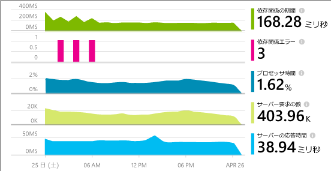
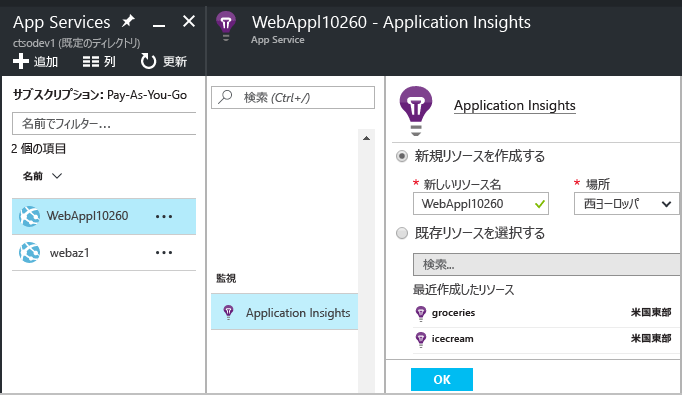
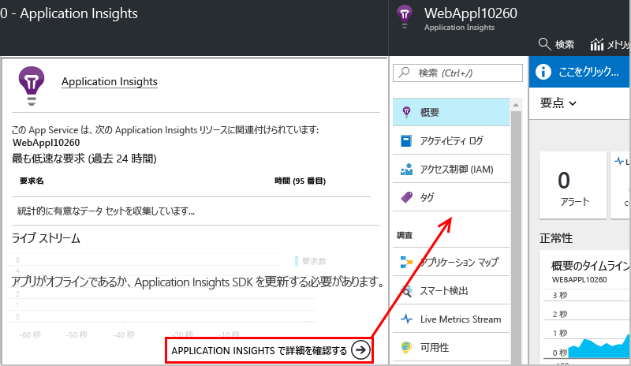
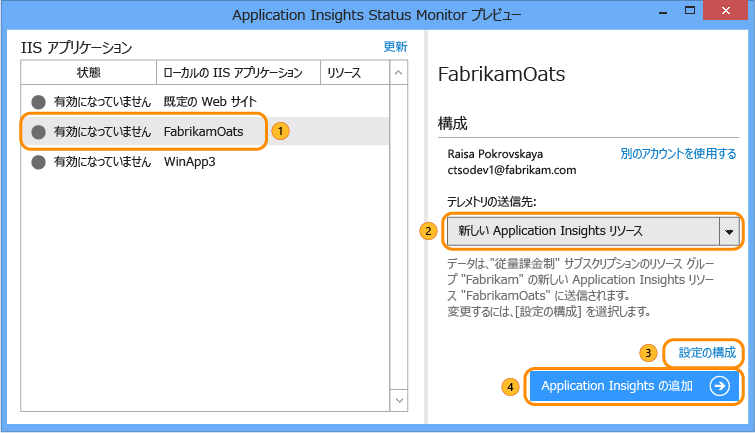
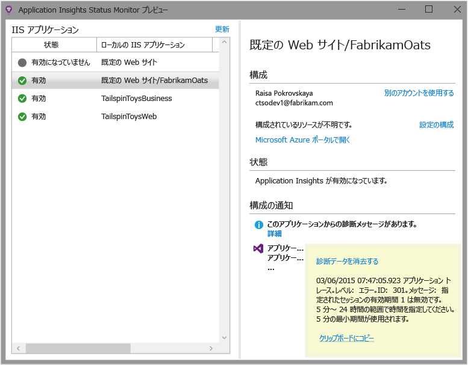

# Application Insights を使用した実行時の Web アプリのインストルメント化

Azure Application Insights を使用すれば、ライブ Web アプリケーションをインストルメント化できます。その際、コードに変更を加えたり、再デプロイしたりする必要はありません。 オンプレミスの IIS サーバーでアプリがホストされている場合は、Status Monitor をインストールします。 アプリが Azure Web アプリの場合や Azure VM で実行されている場合は、Azure コントロール パネルから Application Insights の監視を有効にすることができます  ([ライブ J2EE Web アプリ](app-insights-java-live.md)と [Azure Cloud Services](app-insights-cloudservices.md) のインストルメント化については、個別の記事もあります)。[Microsoft Azure](http://azure.com) サブスクリプションが必要です。

Application Insights を .NET Web アプリケーションに適用する方法には、次の&3; つがあります。

* **ビルド時**: Web アプリ コードに [Application Insights SDK を追加][greenbrown]します。
* **実行時:** 後述するように、コードのリビルドと再デプロイを行うことなく、サーバー上の Web アプリをインストルメント化します。
* **両方:** SDK を Web アプリ コードの中にビルドします。また、実行時の拡張機能を適用します。 両方のオプションの長所を活かせます。

各方法の特徴について概要を次に示します。

|  | ビルド時 | 実行時 |
| --- | --- | --- |
| 要求と例外 |はい |はい |
| [より詳細な例外](app-insights-asp-net-exceptions.md) | |はい |
| [依存関係の診断](app-insights-asp-net-dependencies.md) |.NET 4.6 以降 (詳細レベルは低い) |はい。全詳細: 結果コード、SQL コマンド テキスト、HTTP 動詞|
| [システム パフォーマンス カウンター](app-insights-performance-counters.md) |はい |はい |
| [カスタム テレメトリの API][api] |はい | |
| [トレース ログ統合](app-insights-asp-net-trace-logs.md) |はい | |
| [ページ ビューとユーザー データ](app-insights-javascript.md) |はい | |
| コードのリビルドは不要 |いいえ | |

## ライブ Azure Web アプリの監視

アプリケーションが Azure Web サービスとして実行されている場合、監視を有効にする方法は以下のとおりです。

* Azure のアプリのコントロール パネルで [Application Insights] を選択します。

    
* Application Insights の概要ページを開いているときに、下部にある Application Insights リソースをすべて開くリンクをクリックします。

    

[クラウドと VM アプリの監視](app-insights-azure.md)

## ライブ IIS Web アプリの監視

アプリが IIS サーバーでホストされている場合は、Status Monitor を使用して Application Insights を有効にします。

1. IIS Web サーバーで、管理者の資格情報を使用してサインインします。
2. Application Insights Status Monitor がまだインストールされていない場合は、[Status Monitor インストーラー](http://go.microsoft.com/fwlink/?LinkId=506648)をダウンロードして実行します (または [Web Platform Installer](https://www.microsoft.com/web/downloads/platform.aspx) を実行し、Application Insights Status Monitor を検索します)。
3. Status Monitor で、監視するインストール済みの Web アプリケーションまたは Web サイトを選択します。 Azure の資格情報でサインインします。

    Application Insights ポータルで結果を表示するときに使用するリソースを構成します。 (通常は、新しいリソースを作成するのが最良です。 このアプリに対して [Web テスト][availability]や [クライアントの監視][client]を既に設定している場合は、既存のリソースを選択します。) 

    

4. IIS を再起動します。

    ![ダイアログの上部にある [再起動] を選択します。](./media/app-insights-monitor-performance-live-website-now/appinsights-036-restart.png)

    少しの間、Web サービスが中断されます。

## 監視オプションのカスタマイズ

Application Insights を有効にすると、Web アプリに DLL と ApplicationInsights.config が追加されます。 [この .config ファイルを編集](app-insights-configuration-with-applicationinsights-config.md)して、一部のオプションを変更できます。

## アプリを再発行するときに、Application Insights を再度有効にしてください。

アプリを再発行する前に、[Visual Studio でコードに Application Insights を追加する][greenbrown]ことを検討してください。 より詳細なテレメトリが得られ、カスタム テレメトリを記述できるようになります。

コードに Application Insights を追加せずに再発行する場合は、デプロイ プロセスによって発行済み Web サイトから DLL と ApplicationInsights.config が削除される可能性があることに注意してください。 そのため、次のようになります。

1. ApplicationInsights.config を編集した場合は、アプリを再発行する前に ApplicationInsights.config のコピーを作成します。
2. アプリを再発行します。
3. Application Insights の監視を再度有効にします。 (Azure Web アプリのコントロール パネルまたは IIS ホストの Status Monitor のいずれか適切な方法を使用します)。
4. .config ファイルで実行した編集を再開します。

## Application Insights のランタイム構成のトラブルシューティング

### 接続できない テレメトリが見つかりませんか?

* Status Monitor が動作するように、サーバーのファイアウォールで、[必要ないくつかの送信ポート](app-insights-ip-addresses.md#outgoing-ports)を開きます。

* Status Monitor を開き、左ウィンドウ枠でアプリケーションを選択します。 「通知の構成」セクションに、このアプリケーションの診断メッセージがあるかどうかを確認します。

  
* サーバーに「権限が不十分」であるという内容のメッセージが表示される場合、次を実行してください。
  * IIS マネージャーで、アプリケーション プールを選択し、**[詳細設定]** を開きます。**[プロセス モデル]** に表示されている ID をメモします。
  * コンピューターの管理コントロール パネルで、この ID をパフォーマンス モニター ユーザー グループに追加します。
* MMA/SCOM (Systems Center Operations Manager) がサーバーにインストールされている場合、一部のバージョンで競合が発生することがあります。 SCOM と Status Monitor の両方をアンインストールし、最新バージョンを再度インストールしてください。
* [トラブルシューティング][qna]に関するページを参照してください。

## システム要件
サーバー上の Application Insights Status Monitor をサポートする OS:

* Windows Server 2008
* Windows Server 2008 R2
* Windows Server 2012
* Windows Server 2012 R2
* Windows Server 2016

最新の SP、.NET Framework 4.5

クライアント側: .NET Framework 4.5 がインストールされた Windows 7、8、8.1、10

IIS のサポート: IIS 7、7.5、8、8.5 (IIS は必須)。

## PowerShell でのオートメーション
監視の開始と停止は、IIS サーバーで PowerShell を使って実行できます。

最初に Application Insights モジュールをインポートします。

`Import-Module 'C:\Program Files\Microsoft Application Insights\Status Monitor\PowerShell\Microsoft.Diagnostics.Agent.StatusMonitor.PowerShell.dll'`

監視されているアプリを特定します。

`Get-ApplicationInsightsMonitoringStatus [-Name appName]`

* `-Name` (省略可能) Web アプリの名前。
* この IIS サーバーに存在する各 Web アプリ (または指定されたアプリ) について、Application Insights の監視ステータスを表示します。
* 各アプリの `ApplicationInsightsApplication` を返します。

  * `SdkState==EnabledAfterDeployment`: アプリは監視中です。Status Monitor ツールまたは `Start-ApplicationInsightsMonitoring` によって実行時にインストルメント化されました。
  * `SdkState==Disabled`: アプリは Application Insights 用にインストルメント化されていません。 過去に一度もインストルメント化されたことがないか、Status Monitor ツールまたは `Stop-ApplicationInsightsMonitoring`によって実行時の監視が無効に設定されています。
  * `SdkState==EnabledByCodeInstrumentation`: アプリは、ソース コードに SDK を追加することによってインストルメント化されています。 SDK は更新することも停止することもできません。
  * `SdkVersion` は、このアプリの監視に使用されているバージョンを示します。
  * `LatestAvailableSdkVersion`は、現在 NuGet ギャラリーで入手できるバージョンを示します。 このバージョンにアプリをアップグレードするには、 `Update-ApplicationInsightsMonitoring`を使用します。

`Start-ApplicationInsightsMonitoring -Name appName -InstrumentationKey 00000000-000-000-000-0000000`

* `-Name` IIS に存在するアプリの名前。
* `-InstrumentationKey` 結果を表示する Application Insights リソースの ikey。
* このコマンドレットが作用するのは、まだインストルメント化されていないアプリ (SdkState==NotInstrumented) だけです。

    このコマンドレットは、既にインストルメント化されたアプリには作用しません。 SDK をコードに追加することによってビルド時にインストルメント化されたアプリか、過去にこのコマンドレットを使用したことによって実行時にインストルメント化されたアプリかは問題ではありません。

    アプリをインストルメント化するときに使用される SDK バージョンは、このサーバーに最近ダウンロードされたバージョンとなります。

    最新バージョンをダウンロードするには、Update-ApplicationInsightsVersion を使用してください。
* 成功すると `ApplicationInsightsApplication` が返されます。 失敗した場合、トレースが stderr に出力されます。

          Name                      : Default Web Site/WebApp1
          InstrumentationKey        : 00000000-0000-0000-0000-000000000000
          ProfilerState             : ApplicationInsights
          SdkState                  : EnabledAfterDeployment
          SdkVersion                : 1.2.1
          LatestAvailableSdkVersion : 1.2.3

`Stop-ApplicationInsightsMonitoring [-Name appName | -All]`

* `-Name` IIS に存在するアプリの名前。
* `-All` この IIS サーバーに存在する、ステータスが `SdkState==EnabledAfterDeployment` であるすべてのアプリの監視を停止します。
* 指定されたアプリの監視を停止し、インストルメンテーションを解除します。 実行時に Status Monitoring ツールまたは Start-ApplicationInsightsApplication を使用してインストルメント化されたアプリに対してのみ正しく動作します。 (`SdkState==EnabledAfterDeployment`)
* ApplicationInsightsApplication が返されます。

`Update-ApplicationInsightsMonitoring -Name appName [-InstrumentationKey "0000000-0000-000-000-0000"`

* `-Name`: IIS に存在する Web アプリの名前。
* `-InstrumentationKey` (省略可能)。アプリのテレメトリの送信先となるリソースを変更する場合に使用します。
* このコマンドレットの機能を次に示します。
  * 最近このマシンにダウンロードされた SDK バージョンに、指定されたアプリをアップグレードします  (`SdkState==EnabledAfterDeployment` の場合にのみ機能します)。
  * インストルメンテーション キーが指定された場合、そのキーを持ったリソースにテレメトリを送信するよう、指定されたアプリを再構成します  (`SdkState != Disabled` の場合に機能します)。

`Update-ApplicationInsightsVersion`

* 最新の Application Insights SDK をサーバーにダウンロードします。

## ビデオ

> [!VIDEO https://channel9.msdn.com/events/Connect/2016/100/player]

## 次のステップ

テレメトリの表示:

* パフォーマンスと使用状況を監視するための[メトリックを探索](app-insights-metrics-explorer.md)します
* 問題を診断するための[イベントとログを検索][diagnostic]します
* より高度なクエリのために [Analytics](app-insights-analytics.md) を使用します
* [ダッシュボードを作成](app-insights-dashboards.md)します

テレメトリの追加:

* サイトがライブの状態であることを確認するには、[Web テストを作成][availability]します。
* Web ページ コードからの例外を参照してトレースの呼び出しを挿入するには、[Web クライアント テレメトリ][usage]を追加します。
* トレースとログの呼び出しを挿入するには、[Application Insights SDK をコードに追加][greenbrown]します。

<!--Link references-->

[api]: app-insights-api-custom-events-metrics.md
[availability]: app-insights-monitor-web-app-availability.md
[client]: app-insights-javascript.md
[diagnostic]: app-insights-diagnostic-search.md
[greenbrown]: app-insights-asp-net.md
[qna]: app-insights-troubleshoot-faq.md
[roles]: app-insights-resources-roles-access-control.md
[usage]: app-insights-web-track-usage.md

