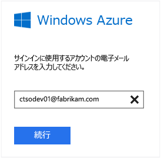
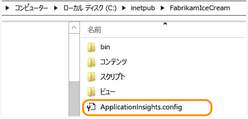
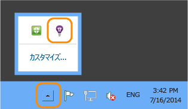
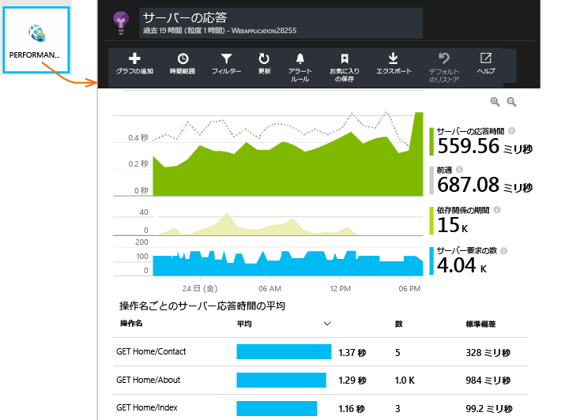
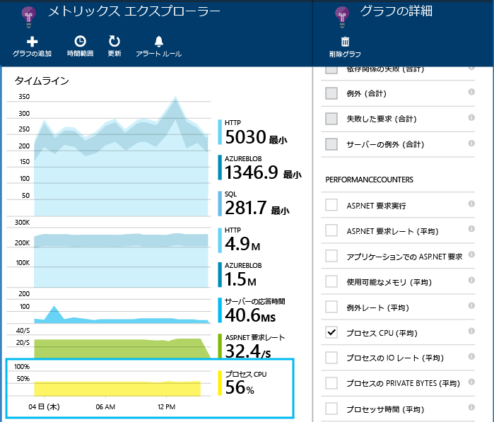
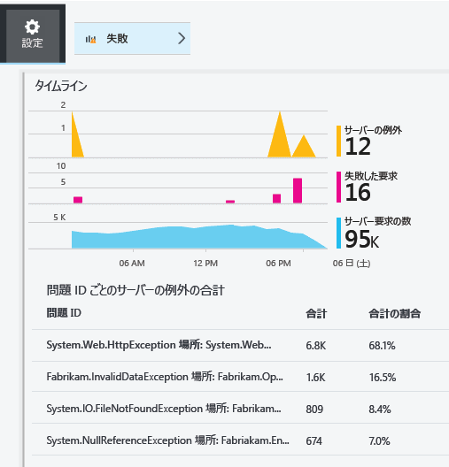

<properties
	pageTitle="実行中の IIS Web サイトのパフォーマンスの問題の診断 | Microsoft Azure"
	description="Web サイトを再デプロイせずにそのパフォーマンスを監視します。依存関係のテレメトリを取得するには、スタンドアロンで使用するか、Application Insights SDK と併用します。"
	services="application-insights"
    documentationCenter=".net"
	authors="alancameronwills"
	manager="douge"/>

<tags
	ms.service="application-insights"
	ms.workload="tbd"
	ms.tgt_pltfrm="ibiza"
	ms.devlang="na"
	ms.topic="get-started-article"
	ms.date="03/01/2016"
	ms.author="awills"/>

# Application Insights Status Monitor をインストールして Web サイトのパフォーマンスを監視する

*Application Insights はプレビュー段階です。*

Visual Studio Application Insights の Status Monitor により、ASP.NET アプリケーションの例外やパフォーマンスの問題を診断できます。

> [AZURE.TIP] [ライブ J2EE Web アプリ](app-insights-java-live.md)と [Azure Cloud Services](app-insights-cloudservices.md) のインストルメント化に関する個別の記事があります。

Application Insights を IIS Web アプリケーションに適用するには、次の 3 つの方法があります。

* **ビルド時:** Web アプリ コードに [Application Insights SDK を追加][greenbrown]します。次の機能が使用可能になります。
 * さまざまな標準診断と使用状況のテレメトリ。
 * [Application Insights API][api] を使用すると、独自のテレメトリを作成して、詳しい使用状況を追跡したり、問題を診断したりできます。
* **実行時:** Status Monitor を使用して、サーバー上の Web アプリをインストルメント化します。
 * 既に実行されている Web アプリの監視。リビルドや再パブリッシュの必要はありません。
 * さまざまな標準診断と使用状況のテレメトリ。
 * 依存関係の診断 &#151; アプリが、データベース、REST API、その他のサービスなどの他のコンポーネントを使用して発生している障害やパフォーマンスが低下している箇所を特定します。
 * テレメトリに関する問題のトラブルシューティング。
* **両方:** SDK を Web アプリ コードにコンパイルし、Web サーバー上で Status Monitor を実行します。両方の長所を活用できます。
 * 標準診断と使用状況のテレメトリ。
 * 依存関係の診断。
 * API を使用してカスタム テレメトリを作成できます。
 * SDK とテレメトリに関する問題のトラブルシューティング。

## Application Insights Status Monitor のインストール

[Microsoft Azure](http://azure.com) サブスクリプションが必要です。

### アプリが IIS サーバーで実行されている場合

1. IIS Web サーバーで、管理者の資格情報を使用してログインします。
2. [Status Monitor インストーラー](http://go.microsoft.com/fwlink/?LinkId=506648)をダウンロードし、実行します。
4. インストール ウィザードで、Microsoft Azure にサインインします。

    

    *接続エラーが発生した場合は、 「[トラブルシューティング](#troubleshooting)」を参照してください。*

5. 監視するインストール済みの Web アプリケーションまたは Web サイトを選択し、Application Insights ポータルで結果を表示するときに使用するリソースを構成します。

    

    通常は、新しいリソースと[リソース グループ][roles]を構成します。

    サイトの [Web テスト][availability]や [Web クライアントの監視][client]を既に設定している場合は、既存のリソースを使用します。

6. IIS を再起動します。

    ![ダイアログの上部にある [再起動] を選択します。](./media/app-insights-monitor-performance-live-website-now/appinsights-036-restart.png)

    少しの間、Web サービスが中断されます。

6. 監視対象の Web アプリに ApplicationInsights.config が挿入されます。

    

   これ以外にも、web.config にいくつかの変更が加えられます。

#### 後で (再) 構成する

ウィザードを完了した後、いつでも必要に応じてエージェントを再構成できます。この方法は、エージェントをインストールした際の初期設定に問題があった場合にも使用できます。

### アプリが Azure Web アプリとして実行されている場合

Azure の Web アプリのコントロール パネルで、Application Insights 拡張機能を追加します。

![Web アプリで、[設定]、[拡張機能]、[追加]、[Application Insights] の順に選択する](./media/app-insights-monitor-performance-live-website-now/05-extend.png)

### Azure Cloud Services プロジェクトの場合

[スクリプトを Web ロールとworker ロールに追加](app-insights-cloudservices.md)します。

## パフォーマンス テレメトリの表示

[Azure ポータル](https://portal.azure.com)にサインインし、Application Insights を参照して、作成したリソースを開きます。

![[参照]、[Application Insights] の順に選択し、アプリを選択します。](./media/app-insights-monitor-performance-live-website-now/appinsights-08openApp.png)

パフォーマンス ブレードを開くと、要求、応答時間、依存関係などのデータが表示されます。

クリックして表示内容の詳細を調整するか、新しいグラフを追加します。

## 依存関係

依存関係の期間のグラフには、アプリからの外部コンポーネント (データベース、REST API、Azure BLOB ストレージなど) の呼び出しに要した時間が示されます。

さまざまな依存関係の呼び出しでグラフをセグメント化するには、グラフを選択し、[グループ化] を有効にして、[依存関係]、[依存関係の種類]、または [依存関係のパフォーマンス] を選択します。

グラフをフィルターして、特定の依存関係、種類、またはパフォーマンスのバケットを確認することもできます。[フィルター] をクリックします。

## パフォーマンス カウンター

(Azure Web Apps 用ではありません。) 概要ブレードで [サーバー] をクリックすると、CPU 占有率やメモリ使用量などのサーバー パフォーマンス カウンターのグラフが表示されます。

新しいグラフを追加するか、任意のグラフをクリックして表示内容を変更します。

[SDK によって報告されるパフォーマンス カウンターのセットを変更](app-insights-configuration-with-applicationinsights-config.md#nuget-package-3)することもできます。

## 例外

特定の例外 (過去 7 日間) をドリルダウンし、スタック トレースとコンテキスト データを取得できます。

## サンプリング

アプリケーションが送信するデータ量が多く、Application Insights SDK for ASP.NET バージョン 2.0.0-beta3 以降を使用している場合は、アダプティブ サンプリング機能が動作して、テレメトリの一定の割合のみが送信される可能性があります。[サンプリングの詳細についてはこちらを参照してください。](app-insights-sampling.md)

## トラブルシューティング

### 接続エラー

Status Monitor が動作するように、サーバーのファイアウォールでいくつかの送信ポートを開く必要があります。

+ テレメトリ - 次のものは常に必要です。
 +	`dc.services.visualstudio.com:80`
 +	`dc.services.visualstudio.com:443`
 +	`dc.applicationinsights.microsoft.com`
+ 構成 - 変更を加える場合にのみ必要です。
 -	`management.core.windows.net:443`
 -	`management.azure.com:443`
 -	`login.windows.net:443`
 -	`login.microsoftonline.com:443`
 -	`secure.addcdn.microsoftonline-p.com:443`
 -	`auth.gfx.ms:443`
 -	`login.live.com:443`
+ インストール
 +	`packages.nuget.org:443`
 +	`appinsightsstatusmonitor.blob.core.windows.net:80`

この一覧は時々変更される場合があります。

### テレメトリが見つかりませんか?

  * サイトを使用してデータを生成します。
  * データが到着するまで数分待ち、**[最新の情報に更新]** をクリックします。
  * 診断検索 ([検索] タイル) を開き、個々のイベントを表示します。グラフに集計データが表示される前であっても、大抵の場合、イベントは診断検索に表示されます。
  * Status Monitor を開き、左ウィンドウ枠でアプリケーションを選択します。「通知の構成」セクションに、このアプリケーションの診断メッセージがあるかどうかを確認します。

  

  * ファイアウォールで、上に一覧したポートを介した送信トラフィックが許可されていることを確認します。
  * サーバーに「権限が不十分」であるという内容のメッセージが表示される場合、次を実行してください。
    * IIS マネージャーで、アプリケーション プールを選択し、**[詳細設定]** を開きます。**[プロセス モデル]** に表示されている ID をメモします。
    * コンピューターの管理コントロール パネルで、この ID をパフォーマンス モニター ユーザー グループに追加します。
  * MMA/SCOM がサーバーにインストールされている場合、一部のバージョンで競合が発生することがあります。SCOM と Status Monitor の両方をアンインストールし、最新バージョンを再度インストールしてください。
  * [トラブルシューティング][qna]に関するページを参照します。

## システム要件

サーバー上の Application Insights Status Monitor をサポートする OS:

- Windows Server 2008
- Windows Server 2008 R2
- Windows Server 2012
- Windows Server 2012 R2

最新の SP、.NET Framework 4.0 と 4.5

クライアント側: .NET Framework 4.0 と 4.5 がインストールされた Windows 7、8、8.1

IIS のサポート: IIS 7、7.5、8、8.5 (IIS は必須)。

## 次のステップ

* サイトがライブの状態であることを確認するには、[Web テストを作成][availability]します。
* 問題の診断に役立つ情報を得るには、[イベントおよびログを検索][diagnostic]します。
* Web ページ コードからの例外を参照してトレースの呼び出しを挿入するには、[Web クライアント テレメトリを追加][usage]します。
* トレースとログの呼び出しをサーバー コードで挿入するには、[Application Insights SDK を Web サービス コードに追加][greenbrown]します。

## ビデオ

#### パフォーマンスの監視

[AZURE.VIDEO app-insights-performance-monitoring]

<!--Link references-->

[api]: app-insights-api-custom-events-metrics.md
[availability]: app-insights-monitor-web-app-availability.md
[client]: app-insights-javascript.md
[diagnostic]: app-insights-diagnostic-search.md
[greenbrown]: app-insights-asp-net.md
[qna]: app-insights-troubleshoot-faq.md
[roles]: app-insights-resources-roles-access-control.md
[usage]: app-insights-web-track-usage.md

<!----HONumber=AcomDC_0302_2016-->