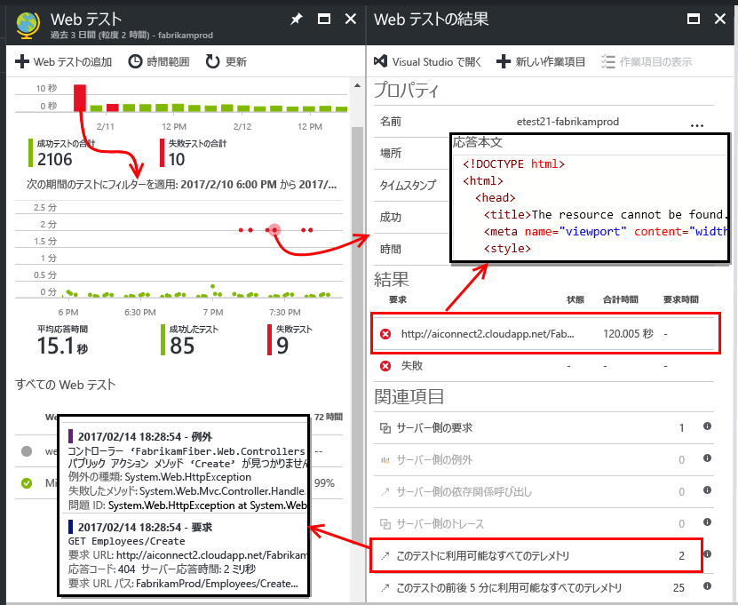
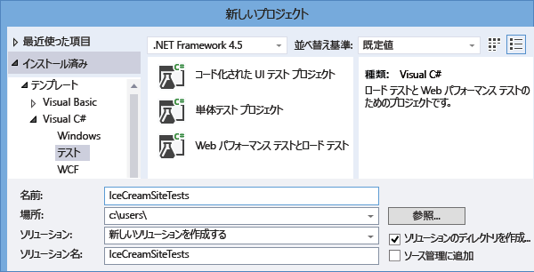
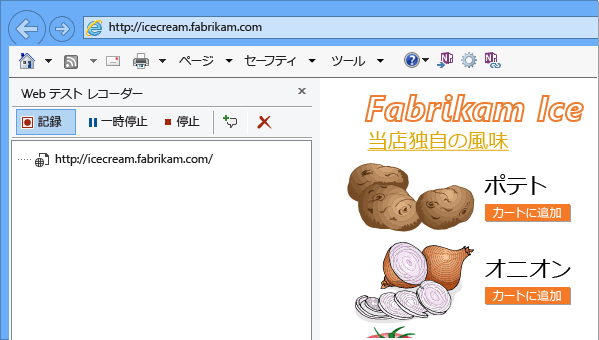
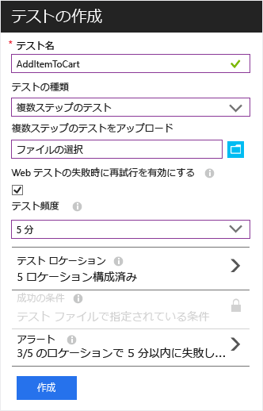

# Web サイトの可用性と応答性の監視
サーバーに Web アプリまたは Web サイトをデプロイした後、Web テストを設定して Web アプリまたは Web サイトの可用性と応答性を監視できます。 [ Application Insights](app-insights-overview.md) は、世界各地の複数のポイントから定期的にアプリケーションに Web 要求を送信します。 アプリケーションがまったく応答しなくなったりアプリケーションの応答が遅くなったりした場合は、Application Insights からその旨が通知されます。

Web テストは、パブリック インターネットからアクセスできる任意の HTTP または HTTPS のエンドポイントに対して設定できます。 テストする Web サイトには何も追加する必要はありません。 自社のサイトにも何も追加せずに、使用する REST API サービスをテストできます。

Web テストには次の&2; 種類があります。

* [URL の Ping テスト](#create): Azure ポータルで作成できる簡単なテストです。
* [複数ステップ Web テスト](#multi-step-web-tests): Visual Studio Enterprise で作成してポータルにアップロードします。

アプリケーション リソースごとに最大 10 個の Web テストを作成できます。

## 1.テスト レポートのリソースを作成する
このアプリケーションに対する [Application Insights リソースの設定][start]が既に終わっていて、同じ場所で可用性レポートを表示する場合は、この手順をスキップします。

[Microsoft Azure](http://azure.com) にサインアップして、[Azure Portal](https://portal.azure.com) に移動し、Application Insights のリソースを作成します。

![[新規] > [Application Insights]
](./media/app-insights-monitor-web-app-availability/11-new-app.png)

**[すべてのリソース]** をクリックして新しいリソースの概要ブレードを開きます。

## 2.URL の Ping テストを作成する
Application Insights のリソースで、可用性のタイルを見つけます。 これをクリックして、アプリケーションの Web テスト ブレードを開き、Web テストを追加します。

* **URL** はパブリック インターネットから認識できる必要があります。 これにはクエリ文字列を含めることができます。したがって、たとえば限られた範囲でデータベースを実行できます。 URL が解決されてリダイレクトする場合、それに続いて最大で 10 個リダイレクトを使用できます。
* **[従属要求の解析]**: 画像、スクリプト、スタイル ファイル、およびその他のページのリソースがテストの一環として要求されます。記録される応答時間にはこれらの時間が含まれます。 テスト全体のタイムアウト時間内にこれらすべてのリソースを正常にダウンロードできない場合、テストは失敗します。
* **[Web テストが失敗した場合に再試行を有効にします]**: テストに失敗すると、少し間を置いてテストを再試行します。 エラーは試行が&3; 回連続で失敗した場合にのみ報告されます。 その後、後続のテストが通常のテスト間隔で実行されます。 再試行は、次の成功まで一時的に中断されます。 このルールがテスト場所ごとに独立して適用されます。 (この設定をお勧めします。 再試行の際に平均でエラーの約 80% がなくなります)
* **[テスト間隔]**: 各テストの場所からテストを実行する頻度を設定します。 間隔が&5; 分で、テストの場所が&5; か所の場合、サイトは平均すると毎分テストされることになります。
* **テストの場所** とは、指定された URL にサーバーが Web 要求を送信する送信元の場所です。 Web サイトで発生している問題とネットワークの問題とを区別できるように、複数の場所を選択してください。 最大 16 個の場所を選択できます。
* **成功の基準**:

    **[テストのタイムアウト]**: この値を引き下げると、応答が遅い場合に警告されます。 テストは、この期間内にサイトから応答が返されない場合に、エラーとしてカウントされます。 **[従属要求の解析]**をオンにした場合、すべての画像、スタイル ファイル、スクリプト、その他依存するリソースがこの期間内に受信される必要があります。

    **[HTTP 応答]**: 成功としてカウントされる、返される状態コード。 200 は、通常の Web ページが返されたことを示すコードです。

    **[コンテンツの一致]**: "ようこそ!" のような、文字列。 それぞれの応答に大文字小文字を区別した完全一致があるかどうかをテストします。 文字列は、(ワイルドカードを含まない) プレーン文字列である必要があります。 ページ コンテンツが変更された場合は、この文字列も更新する必要がある可能性があることに注意してください。
* **アラート** は、既定では、エラーが&3; つの場所で&5; 分を超えて存在する場合に送信されます。 エラーが&1; つの場所で発生している場合は、サイトでの問題ではなく、ネットワークの問題である可能性が高くなります。 ただし、しきい値は上げ下げでき、電子メールの送信先を変更することもできます。

    アラートが発生したときに呼び出される [webhook](../monitoring-and-diagnostics/insights-webhooks-alerts.md) を設定できます。 (ただし、現時点でクエリ パラメーターはプロパティとしては渡されないという点に注意してください)。

### 他の URL のテスト
さらにテストを追加します。 たとえば、ホーム ページをテストするのに加えて、検索用の URL をテストしてデータベースが稼働していることを確認できます。

## 3.Web テストの結果を確認する
1、2 分後、結果が Web テスト ブレードに表示されます。

その期間のより詳しいビューを表示するには、概要グラフの棒をクリックします。

これらのグラフでは、このアプリケーションのすべての Web テストの結果が結合されます。

## エラーが発生する場合
赤い点をクリックします。

Web テスト結果から次の操作を実行できます。

* サーバーから受信した応答を調べる。
* 失敗した要求インスタンスの処理中に、サーバー アプリによって送信されたテレメトリを開く。
* 懸案や作業の項目を Git または VSTS に記録して問題を追跡する。 バグには、このイベントへのリンクが含まれます。
* Visual Studio で Web テスト結果を開く。

*問題がないように見えるのに、エラーとして報告されました。* イメージ、スクリプト、スタイル シート、およびページによって読み込まれるその他のファイルすべてを確認してください。 これらのいずれかにエラーがある場合、メインの html ページの読み込みに問題がない場合でも、テストはエラーとして報告されます。

"*関連項目がない*" 場合は、 [サンプリング](app-insights-sampling.md)が操作中の可能性があります。

## 複数手順の Web テスト
URL の順序に関連するシナリオを監視することができます。 たとえば、販売 Web サイトを監視している場合は、ショッピング カートに商品を正しく追加できるかどうかをテストできます。

> [!NOTE] 
> 複数ステップ Web テストは課金対象です。 [価格の詳細](http://azure.microsoft.com/pricing/details/application-insights/)のページをご覧ください。
> 

複数手順のテストを作成するには、Visual Studio Enterprise を使用してシナリオを記録してから、その記録を Application Insights にアップロードします。 Application Insights は周期的にそのシナリオを再生し、応答を確認します。

コード化された機能をテストで使用できないことに注意してください。シナリオの手順は、.webtest ファイルにスクリプトとして含まれる必要があります。

#### 1.シナリオを記録する
Web セッションを記録するには、Visual Studio Enterprise を使用します。

1. Web パフォーマンス テストのプロジェクトを作成します。

    

 * "*"Web パフォーマンスとロード テスト プロジェクト" テンプレートが表示されない場合*" は、 Visual Studio Enterprise を閉じます。 **Visual Studio インストーラー**を開き、Visual Studio Enterprise のインストールを変更します。 **[個別のコンポーネント]** で **[Web パフォーマンスとロード テスト ツール]** を選択します。

2. .webtest ファイルを開き、記録を開始します。

    ![.webtest ファイルを開き、[記録] をクリックします。](./media/app-insights-monitor-web-app-availability/appinsights-71webtest-multi-vs-start.png)
3. テストでシミュレートする必要のあるユーザー操作を実行します。Web サイトを開いたり、買い物カゴに商品を追加したりしてください。 次に、テストを停止します。

    

    長いシナリオは作成しないでください。 ここでは、100 ステップおよび 2 分が上限です。
4. テストを編集します。

   * 受信したテキストと応答コードを確認するための検証を追加します。
   * 余分な操作を削除します。 画像を求める依存要求、または広告あるいは追跡サイトへの依存要求を削除することも可能です。

     テスト スクリプトの編集が行えるだけです。カスタム コードの追加や他の Web テストの呼び出しはできません。 テストにループを挿入しないでください。 標準的な Web テスト プラグインを使用することができます。
5. 動作を確認するには、Visual Studio でテストを実行します。

    Web テスト ランナーは、web ブラウザーを開き、記録したアクションを繰り返します。 予想どおりに動作するかどうかを確認します。

    ![Visual Studio で .webtest ファイルを開き、[実行] をクリックします。](./media/app-insights-monitor-web-app-availability/appinsights-71webtest-multi-vs-run.png)

#### 2.Web テストを Application Insights にアップロードする
1. Application Insights ポータルで、新しい Web テストを作成します。

    ![Web テスト ブレードで、[追加] を選択します。](./media/app-insights-monitor-web-app-availability/16-another-test.png)
2. 複数手順のテストを選択し、.webtest ファイルをアップロードします。

    

    ping テストについても同様に、テストの場所、頻度、アラートのパラメーターを設定してください。

単一 URL のテストと同じように、テストの結果とエラーを表示します。

失敗の一般的な理由は、テストの実行時間が長すぎることです。 テストの実行は、2 分未満にする必要があります。

テストが正常に完了するには、スクリプト、スタイル シート、画像など、ページのすべてのリソースが正しく読み込まれる必要があることに注意してください。

Web テスト全体が .webtest ファイルに含まれる必要があります。コード化された機能をテストで使用することはできません。

### 複数手順のテストに対する時間とランダムな数の組み込み
外部からフィードされる株価など、時間に依存するデータを取得するツールをテストするとします。 Web テストを記録するときに、特定の時刻を使用する必要があります。ただし、その時刻は、StartTime と EndTime というテストのパラメーターとして設定しました。

テストを実行するときに、EndTime を現在の時刻に、StartTime を 15 分前に常に設定する必要があるとします。

時刻をパラメーター化するためには、Web テスト プラグインを使用します。

1. 目的の各変数のパラメーター値に対して Web テスト プラグインを追加します。 Web テスト ツールバーで、 **[Web テスト プラグインを追加]**を選択します。

    ![[Web テスト プラグインを追加] を選択し、種類を選択します。](./media/app-insights-monitor-web-app-availability/appinsights-72webtest-plugins.png)

    この例では、日時プラグインというインスタンスを&2; つ使用します。 1 つのインスタンスが "15 分前" 用、もう&1; つは "現在" 用です。
2. 各プラグインのプロパティを開きます。 名前を付け、現在の時刻を使用するように設定します。 いずれかのプロパティに、「Add Minutes = -15」を設定します。

    ![[名前]、[現在の時刻を使用する]、[分の追加] の各項目を設定します。](./media/app-insights-monitor-web-app-availability/appinsights-72webtest-plugin-parameters.png)
3. Web テスト パラメーターで、{{プラグイン名}} を使用して、プラグイン名を参照します。

    

ここでテストをポータルにアップロードします。 テストを実行するたびに動的な値を使用します。

## サインインの処理
ユーザーがアプリにサインインする場合、サインインの背後にあるページをテストできるように、サインインをシミュレートするためのさまざまなオプションがあります。 使用する方法は、アプリで提供されるセキュリティの種類によって異なります。

どの場合も、アプリケーションでテスト目的のみのアカウントを作成する必要があります。 可能であれば、実際のユーザーが Web テストの影響を受けないように、このテスト アカウントのアクセス許可を制限します。

### 単純なユーザー名とパスワード
通常の方法で Web テストを記録します。 まず Cookie を削除します。

### SAML 認証
Web テストに使用できる SAML プラグインを使用します。

### クライアント シークレット
アプリにクライアント シークレットを含むサインイン ルートがある場合は、それを使用します。 クライアント シークレット サインインを提供するサービスの例として、Azure Active Directory (AAD) が挙げられます。 AAD の場合、クライアント シークレットはアプリ キーです。

アプリ キーを使用した Azure Web アプリのサンプル Web テストを次に示します。

1. クライアント シークレット (AppKey) を使用して AAD からトークンを取得します。
2. 応答からベアラー トークンを抽出します。
3. 承認ヘッダーにベアラー トークンを使用して API を呼び出します。

Web テストが実際のクライアントであること、つまり、独自のアプリが AAD に登録されていることを確認し、clientId と appkey を使用します。 テスト対象のサービスの独自のアプリも AAD に登録されている場合: Web テストの "リソース" フィールドにはこのアプリの appID URI が反映されます。

### オープン認証
オープン認証の例としては、Microsoft または Google アカウントを使用したサインインが挙げられます。 OAuth を使用する多くのアプリがクライアント シークレットに代わる機能を提供しているため、その可能性を調査することが最初の方法です。

テストで OAuth を使用してサインインする必要がある場合に、一般的な方法を次に示します。

* Fiddler などのツールを使用して、Web ブラウザー、認証サイト、アプリケーション間のトラフィックを調べます。
* 異なるコンピューターやブラウザーを使用するか、または長い間隔 (トークンを期限切れにさせる) で複数のサインインを実行します。
* 異なるセッションを比較して、認証サイトから返され、次にサインイン後にアプリケーション サーバーに渡されるトークンを識別します。
* Visual Studio を使用して Web テストを記録します。
* トークンをパラメーター化し、トークンが認証システムから返されたときに、パラメーターを設定し、サイトへのクエリでそれを使用します
  (Visual Studio は、テストのパラメーター化を試みますが、トークンを正しくパラメーター化しません)。

##  テストの編集または無効化
個々のテストを開くと、テストを編集したり無効にしたりできます。

たとえば、サービスのメンテナンスを行うときは Web テストを無効にします。

## パフォーマンス テスト
Web サイトに対してロード テストを実行できます。 可用性テストと同じように、世界各地の複数のポイントから単純な要求または複数手順の要求を送信できます。 可用性テストとは異なり、複数の同時ユーザーをシミュレートするために、多数の要求が送信されます。

[概要] ブレードで、**[設定]**、**[Performance Tests (パフォーマンス テスト)]** の順に開きます。 テストを作成するときに、Visual Studio Team Services アカウントへの接続を求められるか、Visual Studio Team Services アカウントを作成します。

テストが完了すると、応答時間と成功率が表示されます。

## Automation
* [PowerShell スクリプトにより、Web テストを自動的に設定](app-insights-powershell.md#add-an-availability-test) する。
* アラートが発生したときに呼び出される [webhook](../monitoring-and-diagnostics/insights-webhooks-alerts.md) を設定する。

## 疑問がある場合は、 問題が発生した場合
* *Web テストからコードを呼び出すことはできますか。*

    いいえ。 テストの手順は、.webtest ファイルに含まれている必要があります。 他の Web テストの呼び出しまたはループの使用は許可されていません。 ただし、役に立つさまざまなプラグインがあります。
* *HTTPS はサポートされていますか。*

    TLS 1.1 と TLS 1.2 がサポートされています。
* *"Web テスト" と "可用性テスト" に違いはありますか。*

    この&2; つの用語は同じ意味で使用されています。
* *ファイアウォールの内側で稼働している内部サーバーに対して可用性テストを使用したいと考えています。*

    [Web テスト エージェントの IP アドレス](app-insights-ip-addresses.md)からの要求を許可するようにファイアウォールを構成してください。
* *複数手順の Web テストのアップロードが失敗します。*

    300 K のサイズ制限があります。

    ループはサポートされていません。

    他の Web テストへの参照はサポートされていません。

    データ ソースはサポートされていません。
* *複数手順のテストが完了しません。*

    1 テストあたりの要求は 100 個に制限されています。

    実行時間が&2; 分を超えると、テストは停止します。
* *クライアント証明書でテストを実行するにはどうすればよいですか。*

    申し訳ありませんが、それはサポートされていません。

## ビデオ
> [!VIDEO https://channel9.msdn.com/Series/Application-Insights-on-Azure-Preview-Portal/Monitoring-Availability-with-Application-Insights/player]
>
>

## 次のステップ
[診断ログを検索する][diagnostic]

[Troubleshooting][qna]

[Web テスト エージェントの IP アドレス](app-insights-ip-addresses.md)

<!--Link references-->

[azure-availability]: ../insights-create-web-tests.md
[diagnostic]: app-insights-diagnostic-search.md
[qna]: app-insights-troubleshoot-faq.md
[start]: app-insights-overview.md

