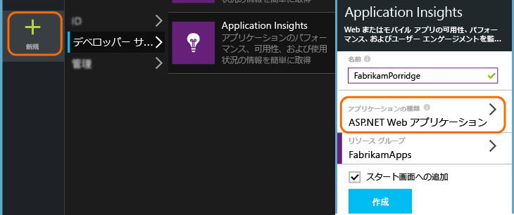
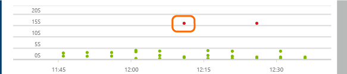
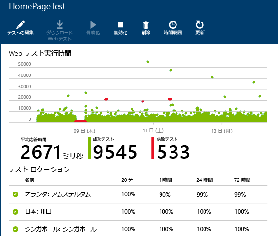
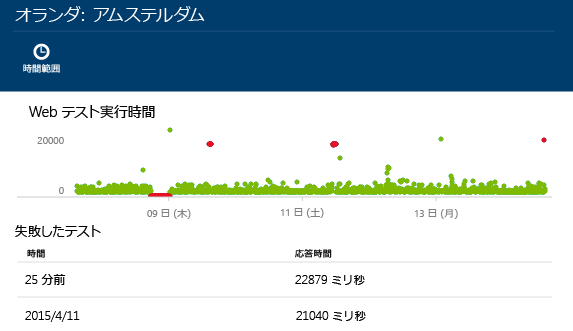

<properties
	pageTitle="Web サイトの可用性と応答性の監視 | Microsoft Azure"
	description="Application Insights で Web テストを設定します。Web サイトが使用できなくなったり、応答速度が低下したりした場合に、アラートを受け取ります。"
	services="application-insights"
    documentationCenter=""
	authors="alancameronwills"
	manager="douge"/>

<tags
	ms.service="application-insights"
	ms.workload="tbd"
	ms.tgt_pltfrm="ibiza"
	ms.devlang="na"
	ms.topic="get-started-article"
	ms.date="11/04/2015"
	ms.author="awills"/>

# Web サイトの可用性と応答性の監視

Web アプリケーションをデプロイした後、Web テストを設定して Web アプリケーションの可用性と応答性を監視できます。Application Insights は、世界各地の複数のポイントから定期的に Web 要求を送信します。アプリケーションの応答が遅くなったりアプリケーションがまったく応答しなくなったりした場合は、Application Insights からその旨が通知されます。

Web テストは、パブリック インターネットからアクセスできる任意の HTTP または HTTPS のエンドポイントに対して設定できます。

Web テストには次の 2 種類があります。

* [URL の Ping テスト](#set-up-a-url-ping-test): Azure ポータルで作成できる簡単なテストです。
* [複数手順の Web テスト](#multi-step-web-tests): Visual Studio Ultimate または Visual Studio Enterprise で作成してポータルにアップロードします。

## URL の Ping テストを設定します。

### 1.新しいリソースを作成するかどうかの判断

このアプリケーションに対する [Application Insights リソースの設定][start]が既に終わっていて、同じ場所で可用性データを表示する場合は、この手順をスキップします。

[Microsoft Azure](http://azure.com) にサインアップして、[Azure ポータル](https://portal.azure.com)に移動し、新しい Application Insights のリソースを作成します。

新しいリソースの概要ブレードが開きます。[Azure ポータル](https://portal.azure.com)で **[参照]** をクリックすると、いつでもここを見ることができます。

### 2.Web テストを作成する

Application Insights のリソースで、可用性のタイルを見つけます。これをクリックして、アプリケーションの Web テスト ブレードを開き、Web テストを追加します。

- **URL** はパブリック インターネットから認識できる必要があります。これにはクエリ文字列を含めることができます。したがって、たとえば限られた範囲でデータベースを実行できます。URL が解決されてリダイレクトする場合、それに続いて最大で 10 個リダイレクトを使用できます。
- **[依存する要求の解析]**: 画像、スクリプト、スタイル ファイルなど、ページのリソースがテストの一環として要求されます。テスト全体のタイムアウト時間内にこれらすべてのリソースを正常にダウンロードできない場合、テストは失敗します。
- **[Web テストが失敗した場合に再試行を有効にします]**: テストに失敗すると、少し間を置いてテストを再試行します。エラーは試行が 3 回連続で失敗した場合にのみ報告されます。その後、後続のテストが通常のテスト間隔で実行されます。再試行は、次の成功まで一時的に中断されます。このルールがテスト場所ごとに独立して適用されます。(この設定をお勧めします。再試行の際に平均でエラーの約 80% がなくなります)
- **[テスト間隔]**: 各テストの場所からテストを実行する頻度を設定します。間隔が 5 分で、テストの場所が 5 か所の場合、サイトは平均すると毎分テストされることになります。
- **テストの場所**とは、指定された URL にサーバーが Web 要求を送信する送信元の場所です。Web サイトで発生している問題とネットワークの問題とを区別できるように、複数の場所を選択してください。最大 16 個の場所を選択できます。

- **成功の基準**:

    **[テストのタイムアウト]**: これを引き下げると、応答が遅い場合に警告されます。テストは、この期間内にサイトから応答が返されない場合に、エラーとしてカウントされます。**[依存する要求の解析]** をオンにした場合、すべての画像、スタイル ファイル、スクリプト、その他依存するリソースがこの期間内に受信される必要があります。

    **[HTTP 応答]**: 成功としてカウントされる、返される状態コード。200 は、通常の Web ページが返されたことを示すコードです。

    **コンテンツの一致**。"ようこそ!" のような、文字列。 すべての返信に表示されるかどうかをテストします。文字列は、(ワイルドカードを含まない) プレーン文字列である必要があります。ページ コンテンツが変更された場合は、この文字列も更新する必要がある可能性があることに注意してください。

- **アラート** は、既定では、エラーが 3 つの場所で 5 分を超えて存在する場合に送信されます。エラーが 1 つの場所で発生している場合は、サイトでの問題ではなく、ネットワークの問題である可能性が高くなります。ただし、しきい値は上げ下げでき、電子メールの送信先を変更することもできます。

#### 他の URL のテスト

さらにテストを追加します。たとえば、ホーム ページをテストするのに加えて、検索用の URL をテストしてデータベースが稼働していることを確認できます。

### 3.可用性レポートを表示する

1 ～ 2 分後に、可用性/Web テスト ブレードで **[更新]** をクリックします(自動的には更新されません)。

その期間のより詳しいビューを表示するには、上部の概要グラフの棒をクリックします。

これらのグラフでは、このアプリケーションのすべての Web テストの結果が結合されます。

#### Web ページのコンポーネント

Web ページのイメージ、スタイル シート、スクリプトとその他の静的なコンポーネントは、テストの一部として要求されます。

記録される応答時間は、すべてのコンポーネントの読み込みが完了するまでの所要時間です。

読み込みに失敗したコンポーネントがある場合は、テストには失敗というマークが付けられます。

## エラーが発生する場合

赤い点をクリックします。

または、下にスクロールし、成功が 100% に満たないテストをクリックします。

ここに、そのテストの結果が表示されています。

複数の場所からテストが実行されています&#151;結果が 100% 未満のいずれかの場所を選択します。

**失敗したテスト**まで下へスクロールし、結果を選択します。

その結果をクリックしてポータルで評価し、失敗した理由をご確認ください。

代わりに、結果ファイルをダウンロードして Visual Studio で詳しく調べることもできます。

*問題がないように見えるのに、エラーとして報告されました。* イメージ、スクリプト、スタイル シート、およびページによって読み込まれるその他のファイルすべてをご確認ください。これらのいずれかにエラーがある場合、メインの html ページの読み込みに問題がない場合でも、テストはエラーとして報告されます。

## 複数手順の Web テスト

URL の順序に関連するシナリオを監視することができます。たとえば、販売 Web サイトを監視している場合は、ショッピング カートに商品を正しく追加できるかどうかをテストできます。

複数手順のテストを作成するには、Visual Studio を使用してシナリオを記録してから、その記録を Application Insights にアップロードします。Application Insights は周期的にそのシナリオを再生し、応答を確認します。

コード化された機能をテストで使用できないことに注意してください。シナリオの手順は、.webtest ファイルにスクリプトとして含まれる必要があります。

#### 1\.シナリオを記録する

Web セッションを記録するには、Visual Studio Enterprise または Ultimate を使用します。

1. Web パフォーマンス テストのプロジェクトを作成します。

    

2. .webtest ファイルを開き、記録を開始します。

    ![.webtest ファイルを開き、[記録] をクリックします。](./media/app-insights-monitor-web-app-availability/appinsights-71webtest-multi-vs-start.png)

3. テストでシミュレートする必要のあるユーザー操作を実行します。Web サイトを開いたり、買い物カゴに商品を追加したりしてください。次に、テストを停止します。

    

    長いシナリオは作成しないでください。ここでは、100 ステップおよび 2 分が上限です。

4. テストを編集します。
 - 受信したテキストと応答コードを確認するための検証を追加します。
 - 余分な操作を削除します。画像を求める依存要求、または広告あるいは追跡サイトへの依存要求を削除することも可能です。

    テスト スクリプトの編集が行えるだけです。カスタム コードの追加や他の Web テストの呼び出しはできません。テストにループを挿入しないでください。標準的な Web テスト プラグインを使用することができます。

5. 動作を確認するには、Visual Studio でテストを実行します。

    Web テスト ランナーは、web ブラウザーを開き、記録したアクションを繰り返します。予想どおりに動作するかどうかを確認します。

    ![Visual Studio で .webtest ファイルを開き、[実行] をクリックします。](./media/app-insights-monitor-web-app-availability/appinsights-71webtest-multi-vs-run.png)

#### 2\.Web テストを Application Insights にアップロードする

1. Application Insights ポータルで、新しい Web テストを作成します。

    ![Web テスト ブレードで、[追加] を選択します。](./media/app-insights-monitor-web-app-availability/16-another-test.png)

2. 複数手順のテストを選択し、.webtest ファイルをアップロードします。

    

    ping テストについても同様に、テストの場所、頻度、アラートのパラメーターを設定してください。

単一 URL のテストと同じように、テストの結果とエラーを表示します。

失敗の一般的な理由は、テストの実行時間が長すぎることです。テストの実行は、2 分未満にする必要があります。

テストが正常に完了するには、スクリプト、スタイル シート、イメージなど、ページのすべてのリソースが正しく読み込まれる必要があることに注意してください。

Web テスト全体が .webtest ファイルに含まれる必要があります。コード化された機能をテストで使用することはできません。

### 複数手順のテストに対する時間とランダムな数の組み込み

外部からフィードされる株価など、時間に依存するデータを取得するツールをテストするとします。Web テストを記録するときに、特定の時刻を使用する必要があります。ただし、その時刻は、StartTime と EndTime というテストのパラメーターとして設定しました。

テストを実行するときに、EndTime を現在の時刻に、StartTime を 15 分前に常に設定する必要があるとします。

そのためには、Web テスト プラグインを使用します。

1. 目的の各変数のパラメーター値に対して Web テスト プラグインを追加します。Web テスト ツールバーで、**[Web テスト プラグインを追加]** を選択します。

    ![[Web テスト プラグインを追加] を選択し、種類を選択します。](./media/app-insights-monitor-web-app-availability/appinsights-72webtest-plugins.png)

    この例では、日時プラグインというインスタンスを 2 つ使用します。1 つのインスタンスが "15 分前" 用、もう 1 つは "現在" 用です。

2. 各プラグインのプロパティを開きます。名前を付け、現在の時刻を使用するように設定します。いずれかのプロパティに、「Add Minutes = -15」を設定します。

    ![[名前]、[現在の時刻を使用する]、[分の追加] の各項目を設定します。](./media/app-insights-monitor-web-app-availability/appinsights-72webtest-plugin-parameters.png)

3. Web テスト パラメーターで、{{プラグイン名}} を使用して、プラグイン名を参照します。

    

ここでテストをポータルにアップロードします。テストを実行するたびに、動的な値が使用されます。

##  テストの編集または無効化

個々のテストを開くと、テストを編集したり無効にしたりできます。

たとえば、サービスのメンテナンスを行うときは Web テストを無効にします。

## 疑問がある場合 問題が発生した場合

* *Web テストからコードを呼び出すことはできますか。*

    いいえ。テストの手順は、.webtest ファイルに含まれている必要があります。他の Web テストの呼び出しまたはループの使用は許可されていません。ただし、役に立つさまざまなプラグインがあります。

* *HTTPS はサポートされていますか。*

    現時点では、SSL 3.0 と TLS 1.0 がサポートされています。

* *"Web テスト" と "可用性テスト" に違いはありますか。*

    この 2 つの用語は同じ意味で使用されています。

## ビデオ

> [AZURE.VIDEO monitoring-availability-with-application-insights]

## 次のステップ

[診断ログを検索する][diagnostic]

[トラブルシューティング][qna]

<!--Link references-->

[azure-availability]: ../insights-create-web-tests.md
[diagnostic]: app-insights-diagnostic-search.md
[qna]: app-insights-troubleshoot-faq.md
[start]: app-insights-overview.md

<!---HONumber=Nov15_HO2-->