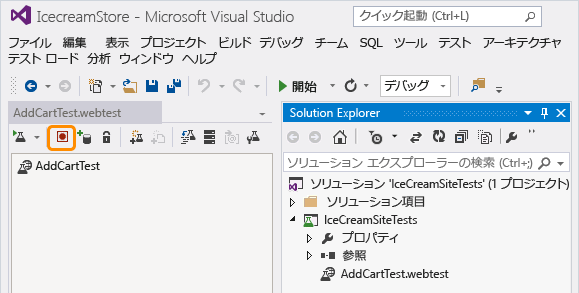
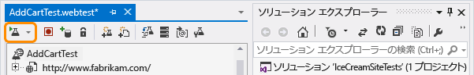
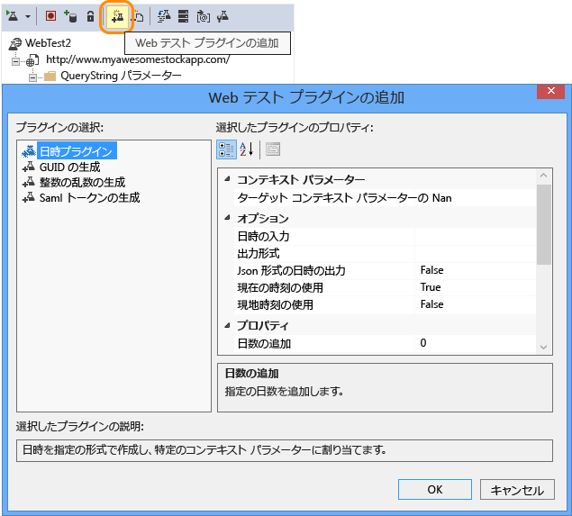
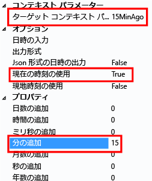

<properties 
	pageTitle="Web サイトの可用性と応答性の監視" 
	description="Application Insights で Web テストを設定します。Web サイトが使用できなくなったり、応答速度が低下したりした場合に、アラートを受け取ります。" 
	services="application-insights" 
documentationCenter=""
	authors="alancameronwills" 
	manager="kamrani"/>

<tags 
	ms.service="application-insights" 
	ms.workload="tbd" 
	ms.tgt_pltfrm="ibiza" 
	ms.devlang="na" 
	ms.topic="article" 
	ms.date="01/27/2015" 
	ms.author="awills"/>
 
# Web サイトの可用性と応答性の監視

Web アプリケーションをデプロイした後、Web テストを設定して Web アプリケーションの可用性と応答性を監視できます。Application Insights は、世界各地の複数のポイントから定期的に Web 要求を送信します。アプリケーションの応答が遅くなったりアプリケーションがまったく応答しなくなったりした場合は、Application Insights からその旨が通知されます。

Web テストは、パブリック インターネットからアクセスできる任意の HTTP エンドポイントに対して設定できます。

*Azure の Web サイトですか。[Web サイト ブレード ][azurewebtest]* に Web テストを作成します。

1. [新しいリソースを作成するかどうかの判断](#create)
1. [Web テストの設定](#setup)
1. [結果の表示](#monitor)
2. [エラーが発生する場合](#failures)
2. [複数手順の Web テスト](#multistep)
1. [テストの編集または無効化](#edit)

 [ビデオ](#video)
 [次のステップ](#next)

## Web テストの設定

### 1. 新しいリソースを作成するかどうかの判断

このアプリケーションに対して既に [Application Insights リソースを設定][start]し、同じ場所で可用性データを表示する場合は、この手順をスキップします。

[Microsoft Azure](http://azure.com) にサインアップして、[プレビュー ポータル](https://portal.azure.com)に移動し、新しい Application Insights のリソースを作成します。 

### 2. Web テストを作成する

アプリケーションの概要のブレードで、Webtests タイルをクリックします。 

*既にいくつかの Web テストがあるでしょうか。Webtests タイルをクリックし、[Web テストを追加] を選択します。*

テストの詳細を設定します。

- **この URL** はパブリック インターネットから認識できる必要があります。これにはクエリ文字列を含めることができます。したがって、たとえば限られた範囲でデータベースを実行できます。URL が解決されてリダイレクトする場合、それに続いて最大で 10 個リダイレクトを使用できます。

- **テストの場所**とは、指定された URL に Web 要求を送信する Application Insights のサーバーの場所です。Web サイトで発生している問題とネットワークで発生している問題とを区別できるように、2 ～ 3 か所を選択してください。4 つ以上の場所は選択できません。

- **成功の条件**:
    **HTTP のリターン コード:**通常、200 です。 

"ようこそ!" のような、    **コンテンツの一致文字列**。すべての返信に表示されるかどうかをテストします。文字列は、(ワイルドカードを含まない) プレーン文字列である必要があります。ページ コンテンツが変更された場合は、この文字列も更新する必要がある可能性があることに注意してください。

- **アラート**: 既定では、15 分間の間にエラーが繰り返し発生する場合にアラートが送信されます。また、感度をさらに高める、または低くすることができます。通知先の電子メール アドレスを変更することもできます。

#### 他の URL のテスト

テストする URL は必要に応じて追加できます。たとえば、ホーム ページをテストするのに加えて、検索用の URL をテストしてデータベースが稼動していることを確認できます。

### 3 可用性レポートを表示する

1 ～ 2 分後に、概要のブレードで [更新] をクリックします (このリリースでは、ブレードは自動的に更新されません)。

概要のブレードの表には、このアプリケーションのすべての Web テストの結果が結合されます。

#### ページのコンポーネント

イメージ、スタイル シート、スクリプトとその他の静的なコンポーネントは、テストの一部として要求されます。  

記録される応答時間は、すべてのコンポーネントの読み込みが完了するまでの所要時間です。

読み込みに失敗したコンポーネントがある場合は、テストには失敗というマークが付けられます。

## エラーが発生する場合

Webtests ブレードをクリックして、テストごとに別々の結果を表示します。

特定の Web テストを開きます。

**失敗したテスト**まで下へスクロールし、結果を選択します。

結果には、エラーの原因が示されています。

詳細を調べるには、結果ファイルをダウンロードして Visual Studio で内容を確認します。

##複数手順の Web テスト

URL の順序に関連するシナリオを監視することができます。たとえば、販売 Web サイトを監視している場合は、ショッピング カートに商品を正しく追加できるかどうかをテストできます。 

複数手順のテストを作成するには、Visual Studio を使用してシナリオを記録してから、その記録を Application Insights にアップロードします。Application Insights は周期的にそのシナリオを再生し、応答を確認します。

#### 1. シナリオを記録する

Web セッションを記録するには、Visual Studio Ultimate を使用します。

1. Web パフォーマンス テストのプロジェクトを作成します。
    
2. .webtest ファイルを開き、記録を開始します。
    
3. テストでシミュレートするユーザー アクションを実行します。Web サイトを開き、たとえばカートに商品を追加します。次に、テストを停止します。 
    
    長いシナリオは作成しないでください。ここでは、100 ステップおよび 2 分が上限です。
4. 動作を確認するには、Visual Studio でテストを実行します。
    Web テスト ランナーは、web ブラウザーを開き、記録したアクションを繰り返します。予想どおりに動作するかどうかを確認します  
    
 

(Web テストのコードには、ループを挿入しないでください。)

#### 2. Web テストを Application Insights にアップロードする

Application Insights ポータルで、新しい Web テストを作成します。

複数手順のテストを選択し、.webtest ファイルをアップロードします。

単一 URL のテストと同じように、テストの結果とエラーを表示します。 

失敗の一般的な理由は、テストの実行時間が長すぎることです。テストの実行は、2 分未満にする必要があります。

### 複数手順のテストに対する時間とランダムな数の組み込み

外部からフィードされる株価など、時間に依存するデータを取得するツールをテストするとします。Web テストを記録するときに、特定の時刻を使用する必要があります。ただし、その時刻は、StartTime と EndTime というテストのパラメーターとして設定しました。

テストを実行するときに、常に EndTime を現在の時刻にして、StartTime を 15 分前にする必要があります。

そのためには、Web テスト プラグインを使用します。

1. 目的の各変数のパラメーター値に対して Web テスト プラグインを追加します。Web テスト ツール バーで、**[Web テスト プラグインを追加]** を選択します。

    

    この例では、Date Time Plug-in の 2 つのインスタンスを使用します。1 つのインスタンスが "15 分前" 用、もう 1 つは "現在" 用です。 

2. 各プラグインのプロパティを開きます。名前を付けて、現在の時刻を使用するように設定します。いずれかのプロパティに、「Add Minutes = -15」を設定します。

    

3. Web テスト パラメーターで、{{プラグイン名}} を使用して、プラグイン名を参照します。

    

ここでテストをポータルにアップロードします。テストを実行するたびに、動的な値が使用されます。

##  テストの編集または無効化

個々のテストを開くと、テストを編集したり無効にしたりできます。

たとえば、サービスのメンテナンスを行うときは Web テストを無効にします。

## ビデオ

> [AZURE.VIDEO monitoring-availability-with-application-insights]

## 次のステップ

[診断ログを検索する][diagnostic]

[トラブルシューティング][qna]

[AZURE.INCLUDE [app-insights-learn-more](../../includes/app-insights-learn-more.md)]

[azurewebtest]: ../insights-create-web-tests/

<!--HONumber=46--> 
 
