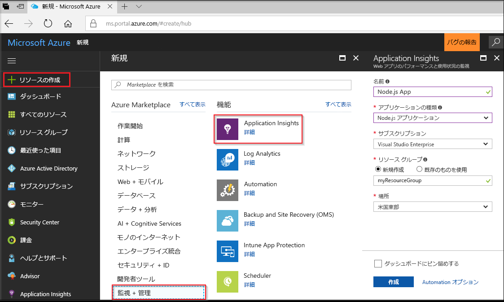
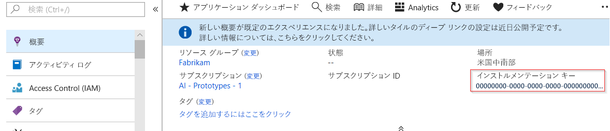
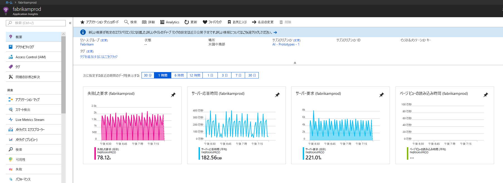
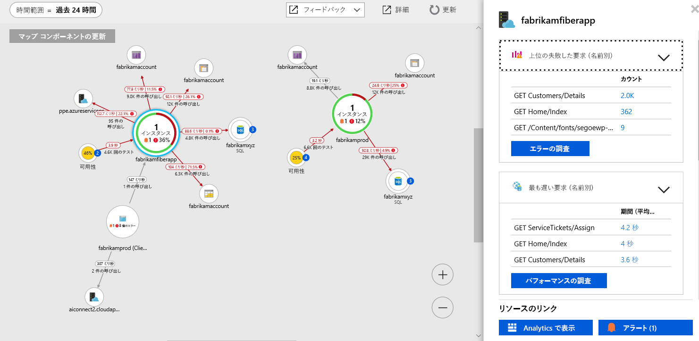
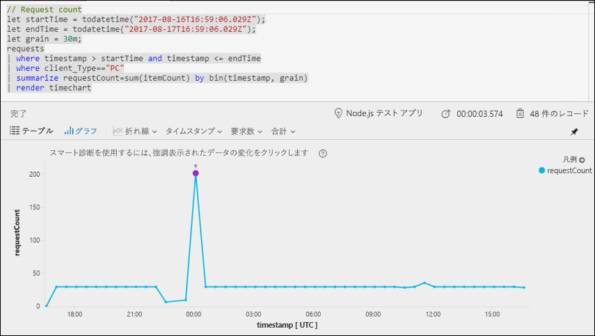
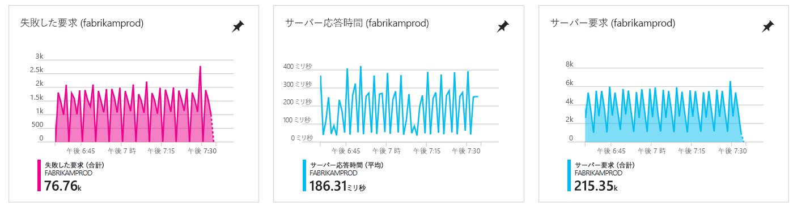
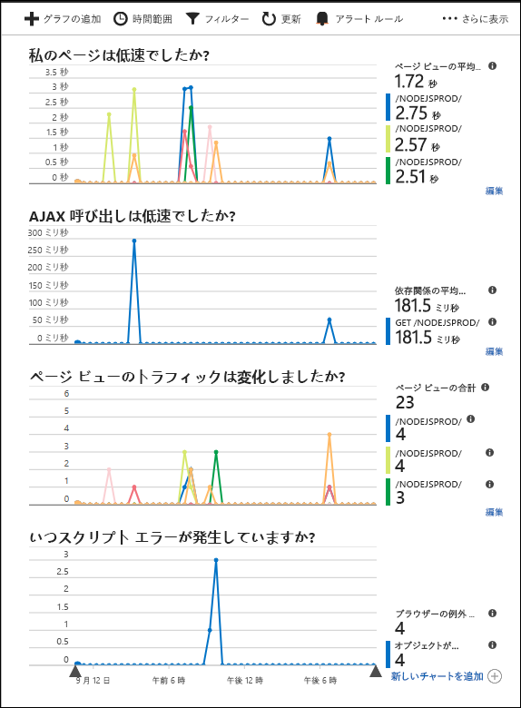

# <a name="start-monitoring-your-nodejs-web-application"></a>Node.js Web アプリケーションの監視を開始する

Azure Application Insights を使うと、Web アプリケーションの可用性、パフォーマンス、利用状況を簡単に監視できます。 アプリケーションのエラーを、ユーザーからの報告を待つことなく、迅速に特定して診断することもできます。 バージョン 0.20 以降の SDK リリースでは、MongoDB、MySQL、Redis を含む一般的なサードパーティ製パッケージを監視できます。

このクイック スタートでは、バージョン 0.22 の Application Insights SDK for Node.js を既存の Node.js Web アプリケーションに追加する方法を説明します。

## <a name="prerequisites"></a>前提条件

このクイック スタートを完了するには、以下が必要です。

- Azure サブスクリプションと既存の Node.js Web アプリケーションが必要です。

Node.js Web アプリケーションがない場合は、[Node.js Web アプリを作成するためのクイックスタート](https://docs.microsoft.com/azure/app-service/app-service-web-get-started-nodejs)に従って作成できます。

Azure サブスクリプションをお持ちでない場合は、開始する前に[無料](https://azure.microsoft.com/free/)アカウントを作成してください。

## <a name="log-in-to-the-azure-portal"></a>Azure Portal にログインする

[Azure Portal](https://portal.azure.com/) にログインします。

## <a name="enable-application-insights"></a>Application Insights を有効にする

Application Insights は、オンプレミスとクラウドのどちらで実行されているかに関係なく、インターネットに接続された任意のアプリケーションからテレメトリ データを収集できます。 このデータの表示を開始するには、次の手順を実行します。

1. **[リソースの作成]** > **[監視 + 管理]** > **[Application Insights]** の順に選択します。

   

   構成ボックスが表示されたら、次の表を使用して入力フィールドに入力します。

    | 設定        | 値           | [説明]  |
   | ------------- |:-------------|:-----|
   | **名前**      | グローバルに一意の値 | 監視しているアプリを識別する名前 |
   | **アプリケーションの種類** | Node.js アプリケーション | 監視しているアプリの種類 |
   | **リソース グループ**     | myResourceGroup      | App Insights データをホストする新しいリソース グループの名前 |
   | **場所** | 米国東部 | 近くにある場所か、アプリがホストされている場所の近くを選択します。 |

2. **Create** をクリックしてください。

## <a name="configure-app-insights-sdk"></a>App Insights SDK を構成する

1. **[概要]** > **[Essentials]** を選択し、アプリケーションの**インストルメンテーション キー**をコピーします。

   

2. Application Insights SDK for Node.js をアプリケーションに追加します。 アプリのルート フォルダーから次のものを実行します。

   ```bash
   npm install applicationinsights --save
   ```

3. アプリの最初の .js ファイルを編集し、スクリプトの最上部の下に 2 つの行を追加します。 [Node.js のクイック スタート アプリ](https://docs.microsoft.com/azure/app-service/app-service-web-get-started-nodejs)を使用している場合は、index.js ファイルを変更します。 &lt;instrumentation_key&gt; をアプリケーションのインストルメンテーション キーに置き換えます。 

   ```JavaScript
   const appInsights = require('applicationinsights');
   appInsights.setup('<instrumentation_key>').start();
   ```

4. アプリを再起動します。

> [!NOTE]
> データがポータルに表示されるようになるまで、3 ～ 5 分かかります。 このアプリがトラフィックの少ないテスト アプリである場合、ほとんどのメトリックはアクティブな要求や操作が発生している場合にのみキャプチャされることに留意してください。

## <a name="start-monitoring-in-the-azure-portal"></a>Azure Portal で監視を開始する

1. Azure Portal で、インストルメンテーション キーを取得した Application Insights の**概要**ページを再度開き、現在実行中のアプリケーションに関する詳細情報を表示できます。

   

2. **[App map (アプリ マップ)]** をクリックして、アプリケーション コンポーネント間の依存関係の視覚的レイアウトを取得します。 各コンポーネントには、負荷、パフォーマンス、障害、アラートなどの KPI が表示されます。

   

3. **[アプリ分析]** アイコンをクリックし、![[アプリケーション マップ]](./media/app-insights-nodejs-quick-start/006.png) アイコンをクリックします。  これにより、Application Insights で収集されたすべてのデータを分析するための多機能なクエリ言語を利用可能な **Application Insights Analytics** が開きます。 この場合は、要求の数をグラフとして描画するクエリが生成されます。 自分でクエリを作成して他のデータを分析することができます。

   

4. **[概要]** ページに戻って KPI グラフを観察します。  このダッシュ ボードでは、着信要求の数、要求の期間、発生したエラーなど、アプリケーションの正常性に関する統計情報が提供されます。 

   

   **[ページ ビューの読み込み時間]** グラフに**クライアント側のテレメトリ** データを入力できるようにするには、このスクリプトを追跡する各ページに追加します。

   ```HTML
   <!-- 
   To collect user behavior analytics tools about your application, 
   insert the following script into each page you want to track.
   Place this code immediately before the closing </head> tag,
   and before any other scripts. Your first data will appear 
   automatically in just a few seconds.
   -->
   <script type="text/javascript">
     var appInsights=window.appInsights||function(config){
       function i(config){t[config]=function(){var i=arguments;t.queue.push(function(){t[config].apply(t,i)})}}var t={config:config},u=document,e=window,o="script",s="AuthenticatedUserContext",h="start",c="stop",l="Track",a=l+"Event",v=l+"Page",y=u.createElement(o),r,f;y.src=config.url||"https://az416426.vo.msecnd.net/scripts/a/ai.0.js";u.getElementsByTagName(o)[0].parentNode.appendChild(y);try{t.cookie=u.cookie}catch(p){}for(t.queue=[],t.version="1.0",r=["Event","Exception","Metric","PageView","Trace","Dependency"];r.length;)i("track"+r.pop());return i("set"+s),i("clear"+s),i(h+a),i(c+a),i(h+v),i(c+v),i("flush"),config.disableExceptionTracking||(r="onerror",i("_"+r),f=e[r],e[r]=function(config,i,u,e,o){var s=f&&f(config,i,u,e,o);return s!==!0&&t["_"+r](config,i,u,e,o),s}),t
       }({
           instrumentationKey:"<insert instrumentation key>"
       });
       
       window.appInsights=appInsights;
       appInsights.trackPageView();
   </script>
   ```

5. **[調査]** ヘッダーの下にある **[ブラウザー]** をクリックします。 ここで、アプリ ページのパフォーマンスに関連するメトリックを見つけます。 **[Add new chart (新しいグラフを追加)]** をクリックして追加のカスタム ビューを作成したり、**[編集]** を選択して既存のグラフの種類、高さ、カラー パレット、グループ化、およびメトリックを変更したりできます。

   

Node.js の監視に関する詳細については、[App Insights Node.js の追加ドキュメント](app-insights-nodejs.md)を参照してください。

## <a name="clean-up-resources"></a>リソースのクリーンアップ

引き続きクイック スタートまたはチュートリアルの作業を行う場合は、このクイック スタートで作成したリソースをクリーンアップしないでください。 これ以上作業を行わない場合は、以下の手順に従い、このクイック スタートで作成したすべてのリソースを Azure Portal で削除してください。

1. Azure Portal の左側のメニューから、**[リソース グループ]**、**[myResourceGroup]** の順にクリックします。
2. リソース グループのページで **[削除]** をクリックし、テキスト ボックスに「**myResourceGroup**」と入力してから **[削除]** をクリックします。

## <a name="next-steps"></a>次の手順

> [!div class="nextstepaction"]
> [パフォーマンスの問題の特定と診断](https://docs.microsoft.com/azure/application-insights/app-insights-analytics)
