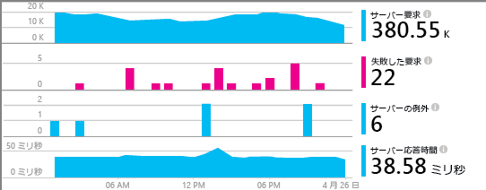
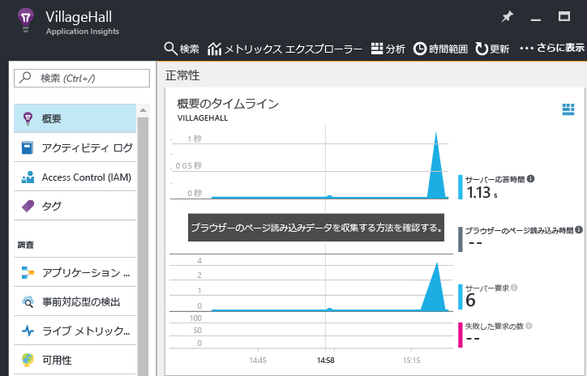

# <a name="monitor-your-nodejs-services-and-apps-with-application-insights"></a>Application Insights を使用して Node.js サービスとアプリを監視する

[Azure Application Insights](app-insights-overview.md) では、[パフォーマンスなどの問題を検出し、迅速に診断](app-insights-detect-triage-diagnose.md)できるように、デプロイしたバックエンド サービスとコンポーネントを監視します。 Application Insights は、自社のデータセンターや、Azure VM、Web アプリ、さらには他のパブリック クラウドにホストされた Node.js サービスに対して使用できます。

監視データを受信、保存、探索するためには、ご使用のコードに SDK を追加し、対応する Application Insights リソースを Azure で設定します。 そのリソースに対して SDK からデータが送信され、詳細な分析と探索が行えるようになります。

Node.js SDK では、受信と発信 HTTP 要求、例外のほか、システムのいくつかのメトリックを自動的に監視できます。 さらに、バージョン 0.20 以降の SDK では、MongoDB、MySQL、Redis など、一般的なサードパーティ製パッケージを監視することもできます。 受信 HTTP 要求に関連するすべてのイベントは、トラブルシューティングを迅速に行えるように関連付けられます。

TelemetryClient API を使用して手動でインストルメント化すれば、ご使用のアプリとシステムのその他の側面も監視できます。 TelemetryClient API については、この記事の後半でさらに詳しく説明します。



## <a name="get-started"></a>作業開始

アプリまたはサービスの監視を設定するには、次の作業を完了します。

### <a name="prerequisites"></a>前提条件

開始する前に、Azure サブスクリプションがあることを確認するか、[無償で新しい Azure サブスクリプションを取得][azure-free-offer]してください。 組織に Azure サブスクリプションが既にある場合は、管理者が[これらの手順][add-aad-user]に従って、あなたを追加できます。

[azure-free-offer]: https://azure.microsoft.com/free/
[add-aad-user]: https://docs.microsoft.com/azure/active-directory/active-directory-users-create-azure-portal


### <a name="resource"></a>Application Insights リソースを設定する


1. [Azure Portal][portal] にサインインします。
2. **[リソースの作成]** > **[開発者ツール]** > **[Application Insights]** の順に選択します。 このリソースには、テレメトリ データを受信するためのエンドポイント、そのデータのストレージ、保存済みのレポートとダッシュボード、ルールとアラートの構成などが含まれています。

  

3. リソース作成ページの **[アプリケーションの種類]** ボックスで **[Node.js アプリケーション]** を選択します。 アプリの種類によって、作成される既定のダッシュボードとレポートが決まります  (どの Application Insights リソースでも、あらゆる言語およびプラットフォームからデータを収集できます)。

  

### <a name="sdk"></a> Node.js SDK の設定

アプリでデータを収集できるように、アプリに SDK を追加します。 

1. リソースのインストルメンテーション キー (*ikey*) を Azure Portal からコピーします。 Application Insights では、この ikey を使用して、対象の Azure リソースにデータをマッピングします。 SDK で ikey を使用するためには、その ikey を環境変数またはコードの中で指定する必要があります。  

  

2. package.json を使用して、Node.js SDK ライブラリをアプリの依存関係に追加します。 アプリのルート フォルダーから次を実行します。

  ```bash
  npm install applicationinsights --save
  ```

3. コードでライブラリを明示的に読み込みます。 インストルメンテーションは、SDK によって他の多数のライブラリに挿入されます。そのため、ライブラリはできる限り早く (`require` ステートメントよりも前に) 読み込むようにしてください。 

  最初の .js ファイルの先頭に、次のコードを追加します。 `setup` メソッドでは、ikey (および Azure リソース) をすべての追跡項目で既定で使用するよう構成します。

  ```javascript
  const appInsights = require("applicationinsights");
  appInsights.setup("<instrumentation_key>");
  appInsights.start();
  ```
   
  ikey は、`setup()` または `new appInsights.TelemetryClient()` に手動で渡す代わりに、APPINSIGHTS\_INSTRUMENTATIONKEY 環境変数を使用して渡すこともできます。 この方法では、コミットされたソース コードに ikey を含めず、異なる環境に合わせて異なる ikey を指定できます。

  その他の構成方法については、以降のセクションを参照してください。

  `appInsights.defaultClient.config.disableAppInsights = true` を設定すると、テレメトリを送信することなく SDK を試すことができます。

### <a name="monitor"></a> アプリを監視する

SDK は、Node.js ランタイムおよび一般的なサードパーティ モジュールに関するテレメトリを自動的に収集します。 アプリケーションを使用して、そうしたデータを生成します。

次に、[Azure Portal][portal] で、先ほど作成した Application Insights リソースに移動します。 **[概要のタイムライン]** に、いくつかの最初のデータ ポイントが現れます。 さらに詳しいデータを表示するには、グラフ内の別のコンポーネントを選択してください。



対象のアプリに関して検出されたトポロジを表示するには、**[アプリケーション マップ]** ボタンを選択します。 マップ内のコンポーネントを選択すると、詳しい情報が表示されます。


アプリについてさらに詳しい情報を把握したり、問題のトラブルシューティングを行ったりするには、**[調査]** セクションに用意されているその他のビューを選択してください。

![[調査] セクション](./media/app-insights-nodejs/07-appinsights_investigate_blades.png)

#### <a name="no-data"></a>データが表示されない場合

SDK では送信するデータをバッチ処理するため、ポータルに項目が表示されるまでに遅延が発生する場合があります。 リソースのデータが表示されない場合は、次の対処方法を試してください。

* 引き続きアプリケーションを使用します。 操作を実行して、テレメトリをさらに生成します。
* ポータルのリソース ビューで **[最新の情報に更新]** をクリックします。 グラフは定期的に自動で更新されますが、手動で更新を強制することで最新の情報が直ちに表示されます。
* [必要な送信ポート](app-insights-ip-addresses.md)が開いていることを確認します。
* [[検索]](app-insights-diagnostic-search.md) を使用して特定のイベントを探します。
* [よくあるご質問][FAQ]を確認します。


## <a name="sdk-configuration"></a>SDK の構成

次のコード例では、SDK の構成方法と既定値を紹介しています。

サービスのイベントを完全に関連付けるには、必ず `.setAutoDependencyCorrelation(true)` を設定します。 このオプションを設定することにより、Node.js の非同期コールバック全体のコンテキストを SDK で追跡できます。

```javascript
const appInsights = require("applicationinsights");
appInsights.setup("<instrumentation_key>")
    .setAutoDependencyCorrelation(true)
    .setAutoCollectRequests(true)
    .setAutoCollectPerformance(true)
    .setAutoCollectExceptions(true)
    .setAutoCollectDependencies(true)
    .setAutoCollectConsole(true)
    .setUseDiskRetryCaching(true)
    .start();
```

## <a name="telemetryclient-api"></a>TelemetryClient API

TelemetryClient API の詳細な説明については、「[カスタムのイベントとメトリックのための Application Insights API](app-insights-api-custom-events-metrics.md)」を参照してください。

Application Insights の Node.js SDK を使用して、任意の要求、イベント、メトリック、または例外を追跡できます。 次のコード サンプルで、使用できるいくつかの API を紹介します。

```javascript
let appInsights = require("applicationinsights");
appInsights.setup().start(); // assuming ikey is in env var
let client = appInsights.defaultClient;

client.trackEvent({name: "my custom event", properties: {customProperty: "custom property value"}});
client.trackException({exception: new Error("handled exceptions can be logged with this method")});
client.trackMetric({name: "custom metric", value: 3});
client.trackTrace({message: "trace message"});
client.trackDependency({target:"http://dbname", name:"select customers proc", data:"SELECT * FROM Customers", duration:231, resultCode:0, success: true, dependencyTypeName: "ZSQL"});
client.trackRequest({name:"GET /customers", url:"http://myserver/customers", duration:309, resultCode:200, success:true});

let http = require("http");
http.createServer( (req, res) => {
  client.trackNodeHttpRequest({request: req, response: res}); // Place at the beginning of your request handler
});
```

### <a name="track-your-dependencies"></a>依存関係を追跡する

依存関係を追跡するには、次のコードを使用します。

```javascript
let appInsights = require("applicationinsights");
let client = appInsights.defaultClient;

var success = false;
let startTime = Date.now();
// Execute dependency call here...
let duration = Date.now() - startTime;
success = true;

client.trackDependency({dependencyTypeName: "dependency name", name: "command name", duration: duration, success: success});
```

### <a name="add-a-custom-property-to-all-events"></a>すべてのイベントにカスタム プロパティを追加する

すべてのイベントにカスタム プロパティを追加するには、次のコードを使用します。

```javascript
appInsights.defaultClient.commonProperties = {
    environment: process.env.SOME_ENV_VARIABLE
};
```

### <a name="track-http-get-requests"></a>HTTP GET 要求を追跡する

HTTP GET 要求を追跡するには、次のコードを使用します。

```javascript
var server = http.createServer((req, res) => {
    if ( req.method === "GET" ) {
            appInsights.defaultClient.trackNodeHttpRequest({request: req, response: res});
    }
    // Other work here...
    res.end();
});
```

### <a name="track-server-startup-time"></a>サーバーの起動時間を追跡する

サーバーの起動時間を追跡するには、次のコードを使用します。

```javascript
let start = Date.now();
server.on("listening", () => {
    let duration = Date.now() - start;
    appInsights.defaultClient.trackMetric({name: "server startup time", value: duration});
});
```

## <a name="next-steps"></a>次の手順

* [ポータル内でテレメトリを監視する](app-insights-dashboards.md)
* [テレメトリに関する分析クエリを記述する](../azure-monitor/log-query/get-started-portal.md)

<!--references-->

[portal]: https://portal.azure.com/
[FAQ]: app-insights-troubleshoot-faq.md

