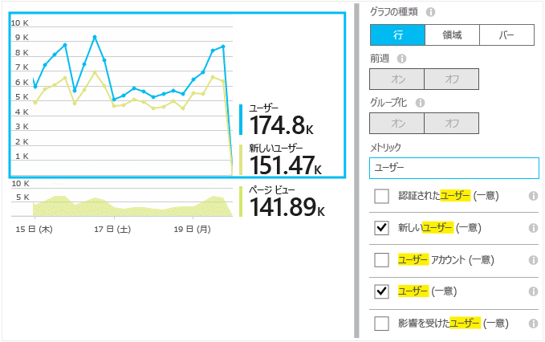
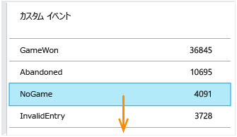
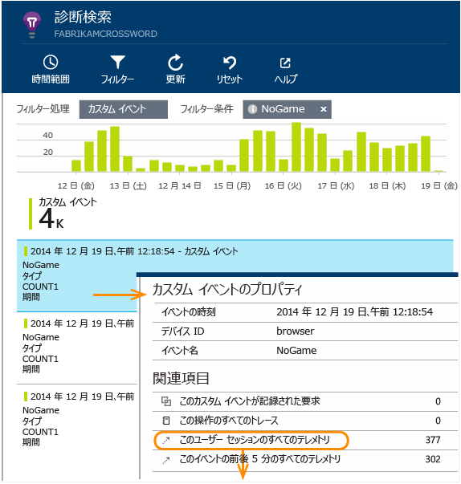
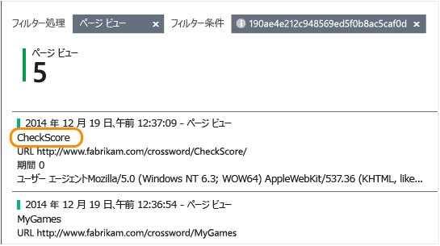

# Application Insights による利用状況分析
ユーザーによるアプリケーションの使用状況を把握することで、ユーザーにとって最も重要なシナリオに重点を置いて開発作業を行うことができ、実現するのが簡単またはより困難であるとユーザーが捉えている目標を理解することができます。

Application Insights を使用すると、アプリケーションの利用状況を明確に把握できるため、ユーザー エクスペリエンスの向上やビジネス目標の達成に役立ちます。

Application Insights は、スタンドアロン アプリ (iOS、Android Windows) でも、Web アプリ (.NET または J2EE でホストされた) でも機能します。 

## アプリケーションの正常性と利用状況の監視
作業を開始するには、[Microsoft Azure](https://azure.com) のアカウントを取得します  (従量課金制のみ、試験段階の一定量には課金されません)。

[Azure ポータル](https://portal.azure.com)で、Application Insights のリソースを作成します。 アプリに関する使用状況とパフォーマンス データはここに表示されます。

![Azure で、[新規]、[開発者向けサービス]、[Application Insights] の順にクリックします。](./media/app-insights-overview-usage/01-create.png)

**アプリがデバイス アプリの場合** 、Application Insights SDK をプロジェクトに追加します。 実際の手順は、 [IDE とプラットフォーム](app-insights-platforms.md)によって異なります。 Windows アプリの場合、Visual Studio でプロジェクトを右クリックし、[Application Insights の追加] を選択します。

**Web アプリの場合、** クイック スタート ブレードを開き、Web ページに追加するコード スニペットを取得します。 このスニペットを使用して再発行します。

![クイック スタートを開き、[Web ページを監視するコードを取得する] をクリックします。 マスター Web ページの先頭にスクリプトをコピーします。](./media/app-insights-overview-usage/02-monitor-web-page.png)

また、[ASP.NET](app-insights-asp-net.md) または [J2EE](app-insights-java-get-started.md) サーバー コードに Application Insights を追加して、クライアントとサーバーの両方からテレメトリを組み合わせることもできます。

### プロジェクトを実行し、最初の結果を確認します。
数分間、デバッグ モードでプロジェクトを実行してから [Azure ポータル](https://portal.azure.com) に移動し、Application Insights でプロジェクト リソースを参照します。

![Azure で、[参照]、[Application Insights] の順にクリックして、目的のプロジェクトを選択します。](./media/app-insights-overview-usage/00-start.png)

アプリを発行してさらに多くのテレメトリを取得し、このアプリを使ってユーザーが何を行っているのかを確認します。

## すぐに利用できる分析
[ページ ビュー] タイルをクリックして、利用状況の詳細を表示します。

![Azure で、[参照]、[Application Insights]、プロジェクトの順に選択し、[ページ ビュー] タイルまで下へスクロールします](./media/app-insights-overview-usage/01-overview.png)

グラフ上の空白部分にマウス ポインターを移動すると、特定のポイントにおける数が表示されます。 それ以外の場合は、特定の期間にわたって集計された値 (平均、合計、期間における一意のユーザーの数など) が表示されます。

Web アプリケーションでは、ユーザーは Cookie を使用してカウントされます。 複数のブラウザーを使用しているユーザー、Cookie を消去しているユーザー、またはプライバシー機能を使用しているユーザーは、複数回カウントされます。

Web セッションは、非アクティブな状態が 30 分続いた後でカウントされます。 電話やその他のデバイス上のセッションは、数秒にわたってアプリが中断されるとカウントされます。

任意のグラフをクリックすると、より詳細な情報が表示されます。 次に例を示します。

![概要ブレードで、[セッション] グラフをクリックします](./media/app-insights-overview-usage/02-sessions.png)

(この例は Web サイトの例ですが、デバイスで実行されるアプリの場合も同じようなグラフが表示されます)。

前の週と比較して、変化していることがあるかどうかを調べることができます。

![1 つのメトリックを表示するグラフを選択し、[前の週] をオンにします](./media/app-insights-overview-usage/021-prior.png)

2 つのメトリック (たとえば、ユーザーと新しいユーザー) を比較することもできます。

プロパティ (ブラウザー、オペレーティング システム、市区町村など) に基づいてデータをグループ化 (分割) できます。

![1 つのメトリックを表示するグラフを選択します。[グループ] をオンにし、プロパティを選択します](./media/app-insights-overview-usage/03-browsers.png)

## ページ利用状況
[ページ ビュー] タイルをクリックすると、最も人気のあるページの内訳が表示されます。

![概要ブレードで、[ページ ビュー] グラフをクリックします](./media/app-insights-overview-usage/05-games.png)

上の例はゲーム Web サイトの情報を示しています。 この情報から、次のことがすぐにわかります。

* 利用状況はこの 1 週間改善されていません。 おそらく、検索エンジンの最適化について検討する必要があります。
* ホーム ページよりもゲーム ページの閲覧人数がはるかに少なくなっています。 アクセスした人がゲームをプレイしたくなるような魅力なホーム ページにしましょう。
* "Crossword" は最も人気のあるゲームです。 このゲームに優先的に新しいアイデアと改良を加える必要があります。

## カスタムの追跡
それぞれのゲームを別個の Web ページで実装する代わりに、ほとんどの機能が Web ページの JavaScript としてコーディングされた同じ単一ページ アプリにこれらのゲームをすべてリファクタリングするとします。 これにより、ユーザーは、ゲームをすばやく切り替えたり、1 ページ上に複数のゲームを表示したりできます。

ただし、Application Insights では、各ゲームが開かれた回数をログに記録する際、ゲームが個別の Web ページにある場合とまったく同じ方法で行います。 これを実現するのは簡単です。新しい "ページ" が開かれたことを記録する JavaScript コードにテレメトリ モジュールの呼び出しを挿入するだけです。

    telemetryClient.trackPageView(game.Name);

## カスタム イベント
テレメトリは、アプリケーションの利用状況を把握するためにさまざまな方法で使用できます。 ただし、ページ ビューとメッセージを一緒にしたくない場合があります。 その場合は、カスタム イベントを使用します。 カスタム イベントは、デバイスのアプリ、Web ページ、または Web サーバーから送信できます。

(JavaScript)

    telemetryClient.trackEvent("GameEnd");

(C#)

    var tc = new Microsoft.ApplicationInsights.TelemetryClient();
    tc.TrackEvent("GameEnd");

(VB)

    Dim tc = New Microsoft.ApplicationInsights.TelemetryClient()
    tc.TrackEvent("GameEnd")

最もよく使用されるカスタム イベントは、概要ブレードに示されます。

![概要ブレードで、下へスクロールし、[カスタム イベント] をクリックします。](./media/app-insights-overview-usage/04-events.png)

テーブルの先頭をクリックすると、イベントの合計数が表示されます。 イベント名などのさまざまな属性によって、グラフを分割することができます。

![1 つのメトリックのみを示すグラフを選択します。 [グループ] をオンにします。 プロパティを選択します。 使用できないプロパティもあります。](./media/app-insights-overview-usage/06-eventsSegment.png)

タイムラインには、変化を他のメトリックやイベントに関連付けることができるという便利な機能があります。 たとえば、プレイするゲームが多くなると、破棄されたゲームも多くなると予想されます。 しかし、破棄されたゲーム数の増加率には偏りがあります。そこで、高い負荷が原因となってユーザーが許容できない問題が発生しているかどうかを確認してみましょう。

## 特定のイベントのドリルダウン
一般的なセッションの状況についてより深く理解するためには、特定の種類のイベントが含まれている特定のユーザー セッションに注目します。

この例では、ユーザーが実際にゲームを開始することなくログアウトした場合に呼び出されるカスタム イベント "NoGame" をコーディングしました。 なぜユーザーはゲームを開始せずにログアウトするのでしょうか。 おそらく、発生した特定のイベントをいくつかドリルダウンすると、手がかりが得られます。

アプリから受信したカスタム イベントは、概要ブレードに名前別に表示されます。

目的のイベントをクリックし、最近の特定の発生箇所を選択します。

ここで、この特定の NoGame イベントが発生したセッションのすべてのテレメトリを見てみましょう。

![[セッションのすべてのテレメトリ] をクリックします](./media/app-insights-overview-usage/09-relatedTelemetry.png)

例外はありません。ここから、ユーザーのプレイを妨げるような障害が発生していないことがわかります。

このセッションのページ ビューを除くすべての種類のテレメトリをフィルターで除外できます。

ここから、このユーザーは最新のスコアを確認するためにのみログオンしたことがわかります。 スコアの確認を簡単にするユーザー ストーリーの作成を検討することが必要である可能性があります  (加えて、この特定のストーリーが発生したことを報告するカスタム イベントを実装する必要があります)。

## プロパティを使用してデータをフィルター処理、検索、および分割する
イベントには任意のタグと数値をアタッチできます。

クライアント側の JavaScript

    appInsights.trackEvent("WinGame",
        // String properties:
        {Game: currentGame.name, Difficulty: currentGame.difficulty},
        // Numeric measurements:
        {Score: currentGame.score, Opponents: currentGame.opponentCount}
    );

サーバー側の C#

    // Set up some properties:
    var properties = new Dictionary <string, string>
        {{"game", currentGame.Name}, {"difficulty", currentGame.Difficulty}};
    var measurements = new Dictionary <string, double>
        {{"Score", currentGame.Score}, {"Opponents", currentGame.OpponentCount}};

    // Send the event:
    telemetry.TrackEvent("WinGame", properties, measurements);

サーバー側の VB

    ' Set up some properties:
    Dim properties = New Dictionary (Of String, String)
    properties.Add("game", currentGame.Name)
    properties.Add("difficulty", currentGame.Difficulty)

    Dim measurements = New Dictionary (Of String, Double)
    measurements.Add("Score", currentGame.Score)
    measurements.Add("Opponents", currentGame.OpponentCount)

    ' Send the event:
    telemetry.TrackEvent("WinGame", properties, measurements)

次のようにページ ビューを同じ方法でプロパティに結び付けます。

クライアント側の JavaScript

    appInsights.trackPageView("Win",
        {Game: currentGame.Name},
        {Score: currentGame.Score});

診断検索で、イベントのそれぞれの発生箇所をクリックしてプロパティを表示します。

![イベントの一覧で、イベントを開き、[...] をクリックして その他のプロパティを表示します](./media/app-insights-overview-usage/11-details.png)

[検索] ボックスを使用して、特定のプロパティ値を持つイベントを表示します。

![[検索] ボックスに値を入力します](./media/app-insights-overview-usage/12-searchEvents.png)

## A | B テスト
ある機能のどちらのバージョンが成功するかわからない場合は、その両方をリリースして、それぞれを異なるユーザーが利用できるようにします。 各バージョンの成功の度合いを測定してから、統合したバージョンに移行します。

この手法では、アプリの各バージョンから送信されるすべてのテレメトリに異なるタグをアタッチします。 これは、アクティブな TelemetryContext のプロパティを定義することで実行できます。 このような既定のプロパティは、カスタム メッセージだけでなく、標準のテレメトリも同様に、アプリケーションから送信されるすべてのテレメトリ メッセージに追加されます。

Application Insights ポータルでは、タグに基づいてデータをフィルター選択およびグループ化 (分割) して、異なるバージョンを比較できます。

サーバー側の C#

    using Microsoft.ApplicationInsights.DataContracts;

    var context = new TelemetryContext();
    context.Properties["Game"] = currentGame.Name;
    var telemetry = new TelemetryClient(context);
    // Now all telemetry will automatically be sent with the context property:
    telemetry.TrackEvent("WinGame");

サーバー側の VB

    Dim context = New TelemetryContext
    context.Properties("Game") = currentGame.Name
    Dim telemetry = New TelemetryClient(context)
    ' Now all telemetry will automatically be sent with the context property:
    telemetry.TrackEvent("WinGame")

個々のテレメトリは、既定値を無視することができます。

すべての新しい TelemetryClients が自動的にコンテキストを使用できるように、汎用の初期化子を設定できます。

    // Telemetry initializer class
    public class MyTelemetryInitializer : ITelemetryInitializer
    {
        public void Initialize (ITelemetry telemetry)
        {
            telemetry.Properties["AppVersion"] = "v2.1";
        }
    }

アプリ初期化子 (Global.asax.cs など) 内:

    protected void Application_Start()
    {
        // ...
        TelemetryConfiguration.Active.TelemetryInitializers
        .Add(new MyTelemetryInitializer());
    }

## ビルド、評価、学習
分析は、単に問題の解決に役立つだけのものではなく、開発サイクルの重要な部分を構成します。 いくつかのヒントを次に示します。

* アプリケーションの主なメトリックを決定する。 できるだけ多くのユーザーにプレイしてもらいたいのか、それとも、少数のユーザーに十分満足してもらえればいいのか。 アクセス数と売り上げのどちらを最重要視するのか、を検討します。
* 各ストーリーの評価を計画する。 新しいユーザー ストーリーや機能の概要を作成する場合、または既存のユーザー ストーリーや機能の更新を計画する場合は、変更の成功を評価する方法について必ず検討してください。 コーディングの開始前に、"成功した場合に、メトリックにどのような影響があるか。 新しいイベントを追跡する必要があるか」 を考えます。
  当然ながら、機能が実装されたら、分析に目を向け、その結果に基づいて行動するようにしてください。
* 他のメトリックを重要なメトリックに関連付ける。 たとえば、"お気に入り" 機能を追加した場合は、ユーザーがお気に入りを追加する頻度を確認することになるでしょう。 しかし、ユーザーがお気に入りに再びアクセスする頻度を知る方が、おそらくより興味深い結果が得られるでしょう。 さらに、最も重要なのは、お気に入りを使用する顧客が最終的により多くの製品を購入してくれるかどうかです。
* カナリア テストを実行する。 新しい機能を一部のユーザーのみに表示できるようにする機能スイッチをセットアップします。 Application Insights を使用して、その新しい機能が予想どおりに使用されているかどうかを確認してください。 調整後に、対象ユーザーの範囲を広げてリリースします。
* ユーザーと会話をする。 分析は、それだけでは不十分ですが、良好な顧客関係を保つための補完的役割を果たします。

## 詳細情報
* [Application Insights を使用した検出、トリアージ、診断](app-insights-detect-triage-diagnose.md)
* [さまざまなプラットフォームで Application Insights を使ってみる](app-insights-detect-triage-diagnose.md)

## ビデオ
> [!VIDEO https://channel9.msdn.com/Series/ConnectOn-Demand/231/player]
> 
> 

<!--HONumber=Dec16_HO1-->

