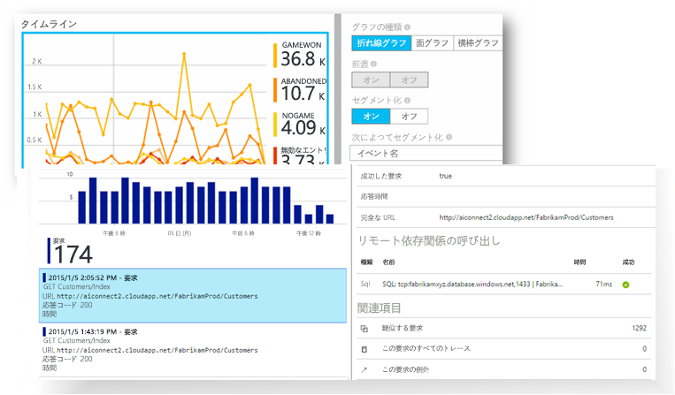
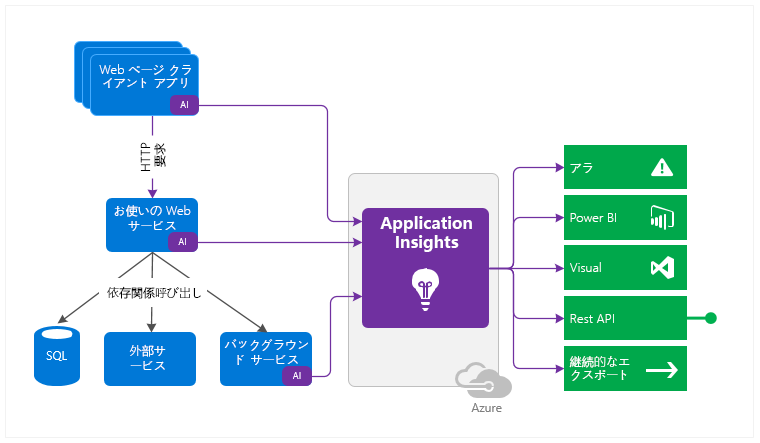
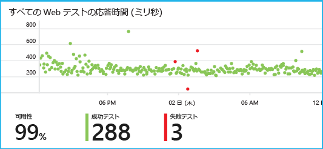
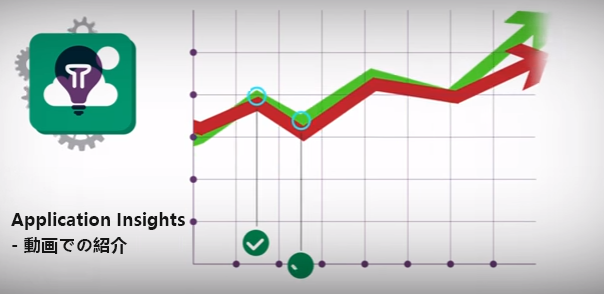

<properties 
	pageTitle="Application Insights のチュートリアル | Microsoft Azure" 
	description="ライブ Web アプリケーションの使用状況とパフォーマンスを追跡します。問題を検出し、優先順位を付け、診断します。継続的に監視し、ユーザーが満足するように改善します。" 
	services="application-insights" 
    documentationCenter=""
	authors="alancameronwills" 
	manager="douge"/>

<tags 
	ms.service="application-insights" 
	ms.workload="tbd" 
	ms.tgt_pltfrm="ibiza" 
	ms.devlang="na" 
	ms.topic="article" 
	ms.date="07/18/2016" 
	ms.author="awills"/>
 
# Application Insights - 紹介

Visual Studio Application Insights は、実行中の Web アプリケーションを監視する拡張可能な分析サービスです。パフォーマンスの問題の検出と診断や、ユーザーがアプリを使用して実際に実行する操作の理解に役立ちます。開発者向けに設計された Application Insights を使用して、パフォーマンスやユーザビリティを継続的に向上させることができます。オンプレミスまたはクラウドでホストされている .NET、Node.js、J2EE などのさまざまなプラットフォーム上のアプリで機能します。

[概要を説明するアニメーションを参照してください](https://www.youtube.com/watch?v=fX2NtGrh-Y0)。

## それはどのように機能しますか?

小さなインストルメンテーション パッケージをアプリケーションにインストールし、Application Insights リソースを Microsoft Azure ポータルに設定します。このインストルメンテーションがアプリを監視し、テレメトリ データをポータルに送信します。ポータルは統計グラフを表示し、問題の診断に役立つ高性能な検索ツールを提供します。

Application Insights には、各種のテレメトリ (要求応答時間、例外、依存関係の呼び出しなど) を収集するさまざまな[標準インストルメンテーション モジュール](app-insights-configuration-with-applicationinsights-config.md)があります。ポータルに[カスタム テレメトリを送信するコードを記述](app-insights-api-custom-events-metrics.md)することもできます。

### オーバーヘッドとは

アプリのパフォーマンスへの影響はごくわずかです。追跡呼び出しはブロッキングを行わず、バッチ処理された後、別のスレッドで送信されます。

## 内容

Application Insights は、開発チーム用のツールであり、アプリのパフォーマンスや使用状況を把握できるように支援します。共有サービスには次のものが含まれています。

各種のテレメトリ:

* HTTP 要求レート、応答時間、成功率。
* 依存関係 (HTTP および SQL) の呼び出しレート、応答時間、成功率。
* サーバーとクライアントの両方からの例外のトレース。
* 診断ログのトレース。
* ページ ビュー数、ユーザーおよびセッション数、ブラウザーの読み込み時間、例外。
* AJAX 呼び出しレート、応答時間、成功率。
* サーバーのパフォーマンス カウンター。
* カスタムのクライアントおよびサーバー テレメトリ。
* クライアントの場所によるセグメント化、ブラウザーのバージョン、OS のバージョン、サーバー インスタンス、カスタム ディメンションなど。
* 可用性テスト

診断および分析ツール:

* 失敗率などのメトリックや可用性に関するスマートおよび手動アラート。
* 集計メトリックの時系列グラフ。
* 要求、例外、カスタム イベント、ログ トレース、ページ ビュー、依存関係、および AJAX 呼び出しのインスタンスに対する診断検索。
* Analytics - テレメトリに対する強力なクエリ言語
* ダッシュボード - すべてのアプリ コンポーネントを監視するために必要なグラフを作成します。

## 作業開始

Application Insights は、Microsoft Azure でホストされる多数のサービスの 1 つであり、テレメトリは分析と表示のために Microsoft Azure に送信されます。このため、他の操作を行う前に、[Microsoft Azure](http://azure.com) のサブスクリプションが必要になります。サインアップは無料で、Application Insights の無料の[価格レベル](https://azure.microsoft.com/pricing/details/application-insights/)を選択できます。組織に既にサブスクリプションがある場合は、それにユーザーの Microsoft アカウントを追加することができます。

作業の開始方法はいくつかあります。目的に適した方法から始めてください。後で、他のものを追加することもできます。

* **実行時: サーバー上の Web アプリをインストルメント化します。** コードを更新しなくて済みます。サーバーへの管理者アクセスが必要になります。
 * [**オンプレミスまたは VM 上の IIS**](app-insights-monitor-performance-live-website-now.md)
 * [**Azure Web アプリまたは VM**](app-insights-monitor-performance-live-website-now.md#if-your-app-runs-as-an-azure-web-app)
 * [**J2EE**](app-insights-java-live.md)
* **開発時: コードに Application Insights を追加します。** カスタム テレメトリを記述したり、バックエンド アプリおよびデスクトップ アプリをインストルメント化したりすることができます。
 * [Visual Studio](app-insights-asp-net.md) 2013 Update 2 以降。
 * [Eclipse](app-insights-java-eclipse.md) または[その他のツール](app-insights-java-get-started.md)の Java
 * [Node.JS](app-insights-nodejs.md)
 * [その他のプラットフォーム](app-insights-platforms.md)
* ページ ビュー、AJAX、およびその他のクライアント側テレメトリのために **[Web ページをインストルメント化](app-insights-javascript.md)**します。
* **[可用性テスト](app-insights-monitor-web-app-availability.md)** - Microsoft のサーバーから定期的に Web サイトに ping を実行します。

> [AZURE.NOTE]  この時点で、すぐにも使い始めてみたくなると思われますが、Application Insights で何ができるかを知るには、続きをお読みください。

## メトリックを探索する

アプリを実行します (開発用コンピューターでデバッグ モードで実行するか、サーバーにデプロイします)。その後、しばらくの間、アプリを使用します。次に、[Azure Portal](https://portal.azure.com) にサインインします。

アプリの Application Insights の概要ブレードに移動します。

この概要によって、アプリのパフォーマンスをすぐに確認できます。負荷 (要求レートの観点から) とアプリが要求に応答する時間とを比較できます。負荷の上昇と応答時間の増加が比例していない場合は、より多くのリソースをアプリに割り当てることを考慮できます。新しいビルドのデプロイ直後に応答エラーが増えている場合は、ロールバックすることを考慮できます。

#### 詳細を取得する

詳細なグラフを表示するには、任意のグラフをクリックします。たとえば、サーバーの応答時間グラフをクリックすると、要求レート、応答時間、および依存関係 (アプリが呼び出しているサービス) の応答時間を示すグラフが表示されます。

依存関係グラフは、アプリが使用しているデータベースと REST API が問題なく応答しているかどうか、または遅延の原因となっているかどうかを確認するために役立ちます。

#### グラフをカスタマイズする

グラフのいずれかを試しに編集してください。たとえば、Web アプリがサーバー インスタンスのコレクションで実行される場合は、異なるサーバー インスタンスの応答時間を比較できます。

1. グラフの上にポインターを置いて、[編集] をクリックします。
2. メトリックを選択します。1 つのグラフに複数のメトリックを表示できますが、組み合わせは限定されています。特定のメトリックを選択する前に、別のメトリックを選択解除しなければならない場合があります。
3. [Group By (グループ別)] を使用して、メトリックをプロパティ別にセグメント化します。この例では、異なる応答時間を別々の線で表示します。

    メトリックの有効なプロパティを選択する必要があります。有効でない場合、グラフにデータは表示されません。
4. グラフの種類を選択します。面グラフと棒グラフは、集計の種類が [合計] である場合に適した積み上げ表示を示します。

[メトリックの探索の詳細](app-insights-metrics-explorer.md)。

## インスタンス データを検索する

問題を調査するには、特定のイベント インスタンスを調べると役に立ちます。

メトリック グラフをクリックし、関連するフィルターと時間範囲を使用してインスタンス データを検索します。たとえば、サーバーの要求数をクリックして、個々の要求のレポートを表示します。

または、概要ページの [検索] からインスタンス データを直接取得できます。

[フィルター] を使用して、特定の種類のイベントと選択したプロパティの値を検索します。

[...] をクリックして、プロパティの完全な一覧を表示するか、同じ要求に関連付けられているその他のイベントを開きます。この例では、失敗した要求には、例外レポートが関連付けられています。

イベント (この例では関連する例外) を開き、作業項目を作成できます (Visual Studio Team Services を使用してタスクを追跡している場合)。
 

## 分析

[Analytics](app-insights-analytics.md) はさらに強力な検索と分析の機能であり、テレメトリ データに対して SQL に似たクエリを作成して、特定の問題を調べたり統計情報を取得したりできます。

データに対するクエリの実行例を確認するには、チュートリアル ウィンドウを開きます。または、[詳しい説明](app-insights-analytics-tour.md)を参照してください。Intellisense によって、使用可能なクエリが示されます。[完全な言語リファレンス](app-insights-analytics-reference.md)も用意されています。

クエリは、通常は、要求、例外、依存関係などのテレメトリ ストリームの名前で始まります。使用可能なテレメトリ ストリームの一覧を表示するには、左側のスキーマ バーを開きます。クエリは、`where` (ブール値フィルター) や `project` (新しいプロパティの計算を実行) などの[クエリ操作](app-insights-analytics-reference.md#queries-and-operators)のパイプラインです。`summarize` は、定義した関数でインスタンスをグループ化した後、グループ化されたデータに集計関数を適用して、[インスタンスを集計](app-insights-analytics-tour.md#aggregate-groups-of-rows)します。

結果は、[表やさまざまな種類のグラフで表示](app-insights-analytics-tour.md#charting-the-results)できます。

## カスタムのテレメトリ

Application Insights をインストールするだけで取得される組み込みのテレメトリを使用して、アプリに対する Web 要求と依存関係 (アプリから SQL や REST API に対する呼び出し) の両方のカウント、成功率、および応答時間を分析できます。例外トレースと (サーバー上の Status Monitor による) システム パフォーマンス カウンターも取得できます。Web ページにクライアント スニペットを追加している場合は、ページ ビュー数と読み込み時間、クライアント例外、および AJAX 呼び出しの成功率と応答率が取得されます。

これらのテレメトリのすべてを分析することで、アプリのパフォーマンスと利用状況に関して多くを知ることができます。ただし、それでは不十分な場合があります。パフォーマンスを調整するためにキューの長さを監視したり、販売数を数えて地域別にセグメント化したり、ユーザー エクスペリエンスを調整するためにクライアント側で特定のボタンがクリックされた回数を調べたりしたい場合があります。

[Application Insights API](app-insights-api-custom-events-metrics.md) には、独自のイベントとメトリックを送信できるように、`TrackEvent(name)` と `TrackMetric(name, value)` 呼び出しが用意されています。これらは、クライアント側に対する同等の呼び出しです。

たとえば、Web ページが単一ページのゲーム アプリの場合は、ユーザーがどの時点でゲームに勝ったか負けたかを記録する行を適切な場所に挿入できます。

    
    appInsights.trackEvent("WinGame");
    ...
    appInsights.trackEvent("LoseGame");

その後、カスタム イベントの数をグラフ化し、イベント名別にセグメント化できます。

### ログ トレース

診断の目的では、実行をトレースするために使用できるカスタム イベント `TrackTrace(message)` があります。検索と分析の機能は、イベント名よりも長くなる可能性があるメッセージの内容を検索できます。

既に Log4Net、NLog、Log4J、System.Diagnostic.Trace などのログ記録フレームワークを使用している場合は、これらのトレース呼び出しを Application Insights によってキャプチャできます。結果は他のテレメトリと共に表示されます。Visual Studio ツールによって、適切な SDK モジュールが自動的に追加されます。

## ダッシュボード

多くのアプリケーションは、Web サービスや 1 つ以上のバックエンド プロセッサなどのさまざまなコンポーネントで構成されています。各コンポーネントは、個別の Application Insights リソースによって監視されます。システムが Azure で実行されている場合は、イベント ハブや機械学習などのサービスも使用され、監視されている可能性があります。

システム全体を監視するには、さまざまなアプリの最も関心のあるグラフを選択して、Azure [ダッシュボード](app-insights-dashboards.md)にピン留めできます。これによって、システム全体を継続的に監視することができます。

複数のダッシュボードを作成できます。たとえば、全般的なシステムの状態を監視するためのチーム ルーム ダッシュボード、さまざまな機能の利用状況に注目している設計ダッシュボード、テスト中のコンポーネント用のダッシュ ボードなどを作成できます。

ダッシュボードは、リソースと同じようにチーム メンバー間で共有できます。

## Visual Studio での開発

アプリケーションの開発に Visual Studio を使用している場合は、組み込まれているさまざまな Application Insights ツールを使用できます。

### 診断検索

[検索] ウィンドウには、ログに記録されたイベントが表示されます (Application Insights を設定する際に Azure にサインインした場合は、ポータルで同じイベントを検索できるようになります)。

![プロジェクトを右クリックし、[Application Insights]、[検索] を選択する](./media/app-insights-visual-studio/34.png)

フリー テキスト検索は、イベント内の任意のフィールドに使用できます。たとえば、ページの URL の一部や、クライアントの市区町村などのプロパティ値、トレース ログの特定の単語などを検索できます。

イベントをクリックすると、その詳細なプロパティが表示されます。

[関連アイテム] タブを開いて、失敗した要求や例外を診断することもできます。

### 診断ハブ

Application Insights サーバー テレメトリが生成されると、診断ハブ (Visual Studio 2015 以降) に表示されます。これは、SDK のインストールだけを選択した場合でも、Azure ポータルでリソースに接続しなくても機能します。

### 例外

[例外の監視を設定](app-insights-asp-net-exceptions.md)している場合は、例外レポートが [検索] ウィンドウに表示されます。

スタック トレースを取得するには、例外をクリックします。Visual Studio でアプリのコードが開かれている場合は、コードの該当する行をスタック トレースからクリックできます。

さらに、各メソッドの上にある CodeLens 行には、Application Insights によって記録された過去 24 時間の例外の数が表示されます。

### ローカル監視

Visual Studio 2015 Update 2 以降、Application Insights ポータルにテレメトリを送信するように SDK を構成していない (ApplicationInsights.config にインストルメンテーション キーが存在しない) 場合、診断ウィンドウには、直近のデバッグ セッションからテレメトリが表示されます。

これは以前のバージョンのアプリを既に発行済みである場合に役立ちます。デバッグ セッションから得られたテレメトリが、Application Insights ポータル上の発行済みアプリから得られたテレメトリと混同されるのは望ましくありません。

これは、ポータルにテレメトリを送信する前に、いくつかの[カスタム テレメトリ](app-insights-api-custom-events-metrics.md)をデバッグする場合にも役立ちます。

* *最初は、ポータルにテレメトリを送信するよう Application Insights を構成しましたが、今は、Visual Studio でテレメトリだけを表示したくなりました。*

 * アプリからポータルにテレメトリを送信している場合でも、[検索] ウィンドウの [設定] に用意されているオプションでローカルの診断を検索できます。
 * ポータルへのテレメトリの送信を中止するには、ApplicationInsights.config から `<instrumentationkey>...` 行をコメント アウトしてください。もう一度ポータルにテレメトリを送信する準備ができたら、コメント解除します。

## Trends

Trends とは、時間経過に伴うアプリの動作を視覚化するための Visual Studio ツールです。

Application Insights のツール バー ボタンか [Application Insights の検索] ウィンドウから、**[テレメトリの傾向を調べる]** を選択します。5 つの一般的なクエリから 1 つ選択して開始します。テレメトリの種類、時間範囲、およびその他のプロパティに基づき、さまざまなデータセットを分析できます。

データ内の異常を見つけるには、[ビューの種類] ボックスでいずれかの異常オプションを選択します。ウィンドウの下部にあるフィルター オプションを使用すると、テレメトリの特定の部分に対象を絞り込みやすくなります。

## 新しいビルドのリリース

### ライブ メトリック ストリーム

ライブ ストリームには、まさにこの瞬間のアプリライブ メトリックス ストリームが、ほぼリアルタイム (1 秒の待機時間) で表示されます。これは、新しいビルドをリリースしており、すべてが正常に動作していることを確認する必要があるとき、またはリアルタイムでインシデントを調査しているときに非常に便利です。

![概要ブレードで、[Live Stream (ライブ ストリーム)] をクリックします](./media/app-insights-metrics-explorer/live-stream.png)

メトリックス エクスプローラーとは異なり、ライブ メトリックス ストリームにはメトリックの固定セットが表示されます。データは、グラフが表示されている場合にのみ保持され、その後破棄されます。

### 注釈

メトリック グラフに関する[リリース注釈](app-insights-annotations.md)に、新しいビルドのデプロイ先が示されます。これにより、変更内容がアプリケーションのパフォーマンスに影響を与えたかどうかを簡単に把握できます。リリース注釈は、[Visual Studio Team Services ビルド システム](https://www.visualstudio.com/ja-JP/get-started/build/build-your-app-vs)により自動で作成されます。[PowerShell から作成](#create-annotations-from-powershell)することもできます。

リリース注釈は、Visual Studio Team Services のクラウド ベースのビルドとリリース サービスの機能です。

## アラート

アプリで問題が発生した場合、問題に関する情報をすぐに得ることができます。

Application Insights には、電子メールで配信される 3 種類のアラートが用意されています。

### プロアクティブ診断 

[プロアクティブ診断](app-insights-nrt-proactive-diagnostics.md)**は自動的に設定されます。構成は不要です。サイトに十分なトラフィックがあることを条件として、日中の特定の時間や要求レートを考慮すると異常である失敗した要求の増加が発生すると、電子メールが送信されます。アラートには、診断情報が含まれています。

アラートの例を次に示します。

第 2 の種類のプロアクティブ検出では、エラーと要因 (場所、クライアントの OS、ブラウザーの種類など) 間の相関関係が検出されます。

### メトリック アラート

[メトリック アラート](app-insights-alerts.md)を構成して、メトリックが、一定の期間に、エラー数、メモリ、ページ ビューなどのしきい値を超えた場合に通知されるように設定できます。

![メトリックス エクスプローラーで、[アラート ルール]、[アラートの追加] の順に選択します](./media/app-insights-metrics-explorer/appinsights-413setMetricAlert.png)

### 可用性

[可用性 Web テスト](app-insights-monitor-web-app-availability.md)は、世界各地のさまざまな場所にあるサーバーからサイトに要求を送信します。サイトがインターネットで使用できなくなったとき、または応答速度が低下したときに通知を行います。

## エクスポート

さまざまな方法で、Application Insights ポータルからテレメトリ データをエクスポートできます。

* [連続エクスポート](app-insights-export-telemetry.md)は、テレメトリの大部分を標準的なリテンション期間よりも長く保持したい場合に最適です。
* メトリック ブレードや検索ブレードの上部にある [[エクスポート] ボタン](app-insights-metrics-explorer.md#export-to-excel)を使用すると、テーブルやグラフを Excel のスプレッドシートに転送できます。
* [Analytics](app-insights-analytics.md) にはテレメトリ用の強力なクエリ言語があり、結果をエクスポートすることもできます。
* Data Access REST API を使用して、データの検索と抽出を実行できます。Analytics クエリを実行できます。
* [Power BI でデータを探索](http://blogs.msdn.com/b/powerbi/archive/2015/11/04/explore-your-application-insights-data-with-power-bi.aspx)する場合は、連続エクスポートを使用せずに実行できます。

 
## データ管理

Application Insights の利用には制限がありますが、その程度は選択されている価格プランによって決まります。主な制限は以下に適用されます。

* 1 分あたりのテレメトリ レート
* 1 か月あたりのデータ ポイント数
* データのリテンション期間

[サンプリング](app-insights-sampling.md)は、コストを削減し、スロットルを回避するためのメカニズムです。それは、テレメトリの一部を破棄して、代表的なサンプルを維持します。関連する項目 (例外とその原因となった要求など) は、保持されるかまとめて破棄されます。ASP.NET アプリケーションでは、サンプリングは自動的に設定され、アプリケーションに適用されます。それ以外の場合は、ポータルへの取り込みに適用されるように設定できます。

## 次のステップ

実行時に開始する:

* [IIS サーバー](app-insights-monitor-performance-live-website-now.md)
* [J2EE サーバー](app-insights-java-live.md)

開発時に開始する:

* [ASP.NET](app-insights-asp-net.md)
* [Java](app-insights-java-get-started.md)
* [Node.JS](app-insights-nodejs.md)

## サポートとフィードバック

* 質問および問題点:
 * [トラブルシューティング][qna]
 * [MSDN フォーラム](https://social.msdn.microsoft.com/Forums/vstudio/home?forum=ApplicationInsights)
 * [StackOverflow](http://stackoverflow.com/questions/tagged/ms-application-insights)
 * [開発者のサポートを得る](app-insights-get-dev-support.md)
* ご提案:
 * [UserVoice](https://visualstudio.uservoice.com/forums/357324)
* ブログ:
 * [Application Insights のブログ](https://azure.microsoft.com/blog/tag/application-insights)

## ビデオ

 <a title="Get 360° Application Insights for Any App or Service" class="wa-video-thumbnail" href="/en-us/documentation/videos/218/" data-control="video" data-event="videopage-clicked-videothumbnail" data-event-property="218" data-caption="" data-ch9="//channel9.msdn.com/Series/ConnectOn-Demand/218/player/" data-expanding="false">     04-29-2015 05 min, 28 sec   </a> 

> [紹介用アニメーション](https://www.youtube.com/watch?v=fX2NtGrh-Y0)

<!--Link references-->

[android]: https://github.com/Microsoft/ApplicationInsights-Android
[azure]: ../insights-perf-analytics.md
[client]: app-insights-javascript.md
[desktop]: app-insights-windows-desktop.md
[detect]: app-insights-detect-triage-diagnose.md
[greenbrown]: app-insights-asp-net.md
[ios]: https://github.com/Microsoft/ApplicationInsights-iOS
[java]: app-insights-java-get-started.md
[knowUsers]: app-insights-overview-usage.md
[platforms]: app-insights-platforms.md
[portal]: http://portal.azure.com/
[qna]: app-insights-troubleshoot-faq.md
[redfield]: app-insights-monitor-performance-live-website-now.md

 

<!---HONumber=AcomDC_0914_2016-->