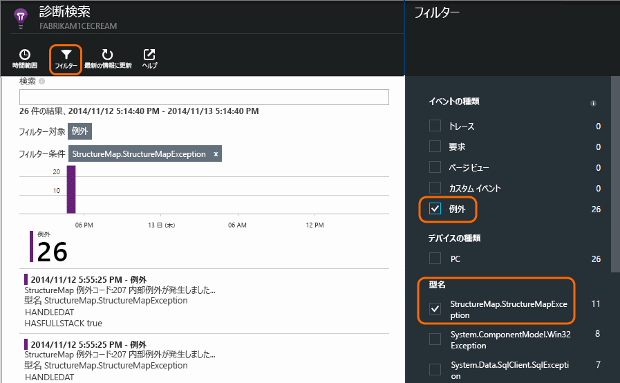

<properties 
	pageTitle="Application Insights での ASP.NET のログ、例外、カスタム診断" 
	description="要求、例外、(トレース、NLog、Log4Net を使用して生成された) ログを検索することにより、ASP.NET Web Apps の問題を診断します。" 
	services="application-insights" 
    documentationCenter=""
	authors="alancameronwills" 
	manager="douge"/>

<tags 
	ms.service="application-insights" 
	ms.workload="tbd" 
	ms.tgt_pltfrm="ibiza" 
	ms.devlang="na" 
	ms.topic="article" 
	ms.date="10/07/2015" 
	ms.author="awills"/>
 
# Application Insights での ASP.NET のログ、例外、カスタム診断

[Application Insights][start] の強力な[診断検索][diagnostic]ツールを使用すれば、Application Insights SDK によってアプリケーションから送信されたテレメトリを調査してドリルダウンすることができます。ユーザー ページ ビューなどの多数のイベントは、SDK によって自動的に送信されます。

You can also write code to send custom events, exception reports, and traces.And if you already use a logging framework such as log4J, log4net, NLog, or System.Diagnostics.Trace, you can capture those logs and include them in the search.このようにすると、ユーザーの操作、例外、その他のイベントをログ トレースと簡単に関連付けられるようになります。

## カスタム テレメトリを作成する前に

[プロジェクトに Application Insights をまだ設定していない場合][start]、今すぐ設定します。

アプリケーションを実行すると、アプリケーションがテレメトリを送信し、そのテレメトリが診断検索に表示されます。テレメトリには、サーバーが受信した要求、クライアント側で記録されたページ ビュー、キャッチされなかった例外などがあります。

診断検索を開くと、SDK から自動送信されたテレメトリが表示されます。

詳細は、アプリケーションの種類によって異なります。個々のイベントをクリックして詳細情報を表示できます。

##カスタム イベント

カスタム イベントは、[診断検索][diagnostic]と[メトリック エクスプローラー][metrics]の両方に表示されます。カスタム イベントは、デバイス、Web ページ、サーバー アプリケーションから送信できます。これらは、診断の目的にも、[使用状況のパターンを理解する][track]ためにも利用できます。

カスタム イベントには名前があり、プロパティを持つこともできるため、数値の測定値と共にフィルター処理をすることができます。

JavaScript at client

    appInsights.trackEvent("WinGame",
         // String properties:
         {Game: currentGame.name, Difficulty: currentGame.difficulty},
         // Numeric measurements:
         {Score: currentGame.score, Opponents: currentGame.opponentCount}
         );

C# at server

    // Set up some properties:
    var properties = new Dictionary <string, string> 
       {{"game", currentGame.Name}, {"difficulty", currentGame.Difficulty}};
    var measurements = new Dictionary <string, double>
       {{"Score", currentGame.Score}, {"Opponents", currentGame.OpponentCount}};

    // Send the event:
    telemetry.TrackEvent("WinGame", properties, measurements);

サーバー側の VB

    ' Set up some properties:
    Dim properties = New Dictionary (Of String, String)
    properties.Add("game", currentGame.Name)
    properties.Add("difficulty", currentGame.Difficulty)

    Dim measurements = New Dictionary (Of String, Double)
    measurements.Add("Score", currentGame.Score)
    measurements.Add("Opponents", currentGame.OpponentCount)

    ' Send the event:
    telemetry.TrackEvent("WinGame", properties, measurements)

### アプリを実行して結果を確認します。

診断検索を開きます。

カスタム イベントを選択し、特定のイベント名を選択します。

プロパティ値を検索用語として入力し、さらにデータをフィルター処理します。

個々のイベントにドリルダウンして詳細なプロパティを確認します。

## ページ ビュー

ページ ビュー テレメトリは、[Web ページ内に挿入した JavaScript のスニペット][usage]に含まれる trackPageView() 呼び出しによって送信されます。その主な目的は、概要ページに表示されるページ ビューの数に加えることです。

Usually it is called once in each HTML page, but you can insert more calls - for example, if you have a single-page app and you want to log a new page whenever the user gets more data.

    appInsights.trackPageView(pageSegmentName, "http://fabrikam.com/page.htm"); 

診断検索でフィルターとして使用できるプロパティをアタッチしておくと便利な場合があります。

    appInsights.trackPageView(pageSegmentName, "http://fabrikam.com/page.htm",
     {Game: currentGame.name, Difficulty: currentGame.difficulty});

## トレース テレメトリ

トレース テレメトリは、特に診断ログを作成するためだけに挿入するコードです。

たとえば、次のような呼び出しを挿入できます。

    var telemetry = new Microsoft.ApplicationInsights.TelemetryClient();
    telemetry.TrackTrace("Slow response - database01");

####  ログ記録フレームワークにアダプターをインストールする

log4Net、NLog、System.Diagnostics.Trace といった、ログ記録フレームワークで生成されたログの検索もできます。

1. log4Net または NLog を使用する場合は、プロジェクト内にインストールします。 
2. ソリューション エクスプローラーでプロジェクトを右クリックし、[**NuGet パッケージの管理**] を選択します。
3. [オンライン]、[すべて]、**[プレリリースを含める]** の順に選択し、"Microsoft.ApplicationInsights" を検索します。

    

4. 次のいずれかの適切なパッケージを選択します。
  + Microsoft.ApplicationInsights.TraceListener (to capture System.Diagnostics.Trace calls)
  + Microsoft.ApplicationInsights.NLogTarget
  + Microsoft.ApplicationInsights.Log4NetAppender

NuGet パッケージは、必要なアセンブリをインストールし、web.config や app.config も変更します。

#### 診断ログの呼び出しを挿入する

System.Diagnostics.Trace を使用する場合、通常の呼び出しは次のようになります。

    System.Diagnostics.Trace.TraceWarning("Slow response - database01");

If you prefer log4net or NLog:

    logger.Warn("Slow response - database01");

Run your app in debug mode, or deploy it.

トレース フィルターを選択すると、診断検索にメッセージが表示されます。

### 例外

Application Insights で例外レポートを取得すると、特に、失敗した要求と例外間をナビゲートして例外スタックを確認できるようになるため、非常に強力なエクスペリエンスが提供されます。

場合によっては、例外が自動的にキャッチされるように、[数行のコードを挿入][exceptions]する必要があります。

例外テレメトリを送信する明示的なコードの記述もできます。

JavaScript

    try 
    { ...
    }
    catch (ex)
    {
      appInsights.TrackException(ex, "handler loc",
        {Game: currentGame.Name, 
         State: currentGame.State.ToString()});
    }

C#

    var telemetry = new TelemetryClient();
    ...
    try 
    { ...
    }
    catch (Exception ex)
    {
       // Set up some properties:
       var properties = new Dictionary <string, string> 
         {{"Game", currentGame.Name}};

       var measurements = new Dictionary <string, double>
         {{"Users", currentGame.Users.Count}};

       // Send the exception telemetry:
       telemetry.TrackException(ex, properties, measurements);
    }

VB

    Dim telemetry = New TelemetryClient
    ...
    Try
      ...
    Catch ex as Exception
      ' Set up some properties:
      Dim properties = New Dictionary (Of String, String)
      properties.Add("Game", currentGame.Name)

      Dim measurements = New Dictionary (Of String, Double)
      measurements.Add("Users", currentGame.Users.Count)
  
      ' Send the exception telemetry:
      telemetry.TrackException(ex, properties, measurements)
    End Try

The properties and measurements parameters are optional, but are useful for filtering and adding extra information.For example, if you have an app that can run several games, you could find all the exception reports related to a particular game.必要な数だけ項目を各辞書に追加できます。

#### 例外の表示

概要ブレードに表示される例外の概要をクリックすると、詳細が表示されます。次に例を示します。

例外の種類をクリックすると、実際に発生した例外について表示されます。

診断検索を直接開き、例外でフィルター処理し、表示する例外の種類を選択することもできます。

### ハンドルされていない例外のレポート

Application Insights は可能な場合、[Status Monitor][usage] と [Application Insights SDK][redfield] のどちらでインストルメントされたかにかかわらず、デバイス、[Web ブラウザー][greenbrown]、Web サーバーから送信された、ハンドルされていない例外をレポートします。

ただし、.NET フレームワークが例外をキャッチする場合もあるため、必ずレポートされるというわけではありません。To make sure you see all exceptions, you therefore have to write a small exception handler.最良の対処方法は、テクノロジによって異なります。詳細については、[ASP.NET の例外テレメトリ][exceptions]に関するページをご覧ください。

### ビルドとの関連付け

診断ログを参照するとき、ソース コードは、現在のコードがデプロイされた後に変更されている可能性があります。

It's therefore useful to put build information, such as the URL of the current version, into a property along with each exception or trace.

Instead of adding the property separately to every exception call, you can set the information in the default context.

    // Telemetry initializer class
    public class MyTelemetryInitializer : IContextInitializer
    {
        public void Initialize (TelemetryContext context)
        {
            context.Properties["AppVersion"] = "v2.1";
        }
    }

アプリ初期化子 (Global.asax.cs など) 内:

    protected void Application_Start()
    {
        // ...
        TelemetryConfiguration.Active.ContextInitializers
        .Add(new MyTelemetryInitializer());
    }

### サーバー Web 要求

[Status Monitor を Web サーバーにインストールする][redfield]か、[Application Insights を Web プロジェクトに追加する][greenbrown]と、要求テレメトリが自動的に送信されます。また、このテレメトリは、メトリック エクスプローラーの要求と応答のタイムチャートや概要ページにもフィードされます。

その他のイベントを送信する場合は、TrackRequest() API を使用します。

## Q & A

### エラー「インストルメンテーション キーは空にできません」が発生しました

Application Insights をインストールしないでログ アダプターの Nuget パッケージをインストールした可能性があります。

ソリューション エクスプローラーで、`ApplicationInsights.config` を右クリックし、[**Application Insights の更新**] を選択します。Azure へのサインインを促すダイアログが表示されます。または、Application Insights のリソースを作成するか、既存のリソースを再利用します。これで問題は修正されます。

### 保持されるデータの量はどのくらいですか

各アプリケーションで、1 秒あたり 500 イベントまでです。イベントは 7 日間保持されます。

## 次のステップ

* [可用性と応答性のテストを設定する][availability]
* [トラブルシューティング][qna]

<!--Link references-->

[availability]: app-insights-monitor-web-app-availability.md
[diagnostic]: app-insights-diagnostic-search.md
[exceptions]: app-insights-web-failures-exceptions.md
[greenbrown]: app-insights-start-monitoring-app-health-usage.md
[metrics]: app-insights-metrics-explorer.md
[qna]: app-insights-troubleshoot-faq.md
[redfield]: app-insights-monitor-performance-live-website-now.md
[start]: app-insights-get-started.md
[track]: app-insights-api-custom-events-metrics.md
[usage]: app-insights-web-track-usage.md

 

<!---HONumber=Oct15_HO2-->