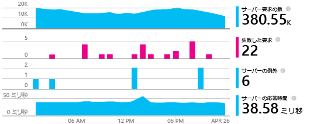
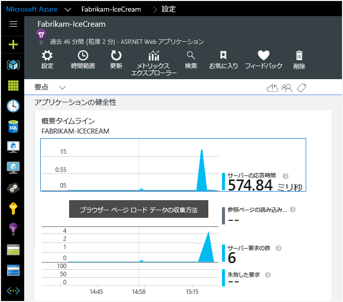

<properties 
	pageTitle="Application Insights SDK を追加して ASP.NET アプリを監視する" 
	description="オンプレミスまたは Microsoft Azure Web アプリケーションの使用状況、可用性、パフォーマンスを Application Insights で分析します。" 
	services="application-insights" 
    documentationCenter=".net"
	authors="alancameronwills" 
	manager="douge"/>

<tags 
	ms.service="application-insights" 
	ms.workload="tbd" 
	ms.tgt_pltfrm="ibiza" 
	ms.devlang="na" 
	ms.topic="article" 
	ms.date="07/08/2015" 
	ms.author="awills"/>

# Application Insights SDK を追加して ASP.NET アプリを監視する

*Application Insights はプレビュー段階です。*

[AZURE.INCLUDE [app-insights-selector-get-started](../../includes/app-insights-selector-get-started.md)]

Visual Studio Application Insights は、実行中のアプリケーションを監視し、[パフォーマンスの問題や例外の検出と診断][detect]、[アプリの使用方法の把握][knowUsers]に役立ちます。Application Insights は、さまざまな種類のアプリケーションで使用できます。Azure Web Apps に加えて、独自のオンプレミス IIS サーバーや Azure の仮想マシンでホストされているアプリに対しても機能します ([デバイス アプリと Java サーバーも対象になります][start])。

多くのアプリケーションの種類では、ほとんどの場合に通知されることなく、[Visual Studio によってアプリに Application Insights が追加されます](#ide)。ただし、この記事を読んで状況を把握できるように、ここでは手動による手順について説明します。

#### 開始する前に

必要なもの:

* [Microsoft Azure](http://azure.com) のサブスクリプションチームまたは組織で Azure サブスクリプションを取得している場合、所有者は [Microsoft アカウント](http://live.com)を使用してあなたを追加できます。
* Visual Studio 2013 以降

##  1.Application Insights リソースの作成

[Azure ポータル][portal]にサインインし、Application Insights の新しいリソースを作成します。アプリケーションの種類として ASP.NET を選択します。

![[新規]、[Application Insights] の順にクリックする](./media/app-insights-start-monitoring-app-health-usage/01-new-asp.png)

Azure の[リソース][roles]は、サービスのインスタンスです。このリソースでは、アプリのテレメトリが分析されて画面に表示されます。

アプリケーションの種類を選択すると、[リソース] ブレードの既定のコンテンツと[メトリックス エクスプローラー][metrics]に表示されるプロパティが設定されます。

####  インストルメンテーション キーをコピーします。

これはリソースを識別するキーです。データをリソースに送信するために SDK の後の手順でインストールします。

![[プロパティ] をクリックし、キーを選択して、Ctrl キーを押しながら C キーを押す](./media/app-insights-start-monitoring-app-health-usage/02-props-asp.png)

##  2.アプリケーションに SDK をインストールする

1. Visual Studio で、デスクトップ アプリ プロジェクトの NuGet パッケージを編集します。

    ![プロジェクトを右クリックし、[Nuget パッケージの管理] を選択する](./media/app-insights-start-monitoring-app-health-usage/03-nuget.png)

2. Web Apps 向け Application Insights SDK をインストールします。

    

3. (NuGet のインストールによって追加された) ApplicationInsights.config を編集します。次のコードを終了タグの直前に挿入します。

    `<InstrumentationKey>` *コピーしたインストルメンテーション キー* `</InstrumentationKey>`

    (または、アプリ内に[コードを記述してキーを設定][apikey]できます)。

#### 新しいバージョンの SDK にアップグレードするには

[SDK の新しいリリース](app-insights-release-notes-dotnet.md)にアップグレードするには、NuGet パッケージ マネージャーをもう一度開き、インストールされているパッケージに対してフィルターを実行します。[Microsoft.ApplicationInsights.Web]、[アップグレード] の順に選択します。

ApplicationInsights.config をカスタマイズしている場合は、アップグレードする前にコピーを保存しておき、後から新しいバージョンに変更をマージします。

##  3.プロジェクトの実行

F5 キーを使用してアプリケーションを実行して、試します。さまざまなページが開き、いくつかのテレメトリが生成されます。

Visual Studio で、送信されたイベント数が表示されます。

##  4.テレメトリの表示

[Azure ポータル][portal]に戻り、Application Insights のリソースを参照します。

概要グラフでデータを探します。最初、1 つまたは 2 つのポイントだけが表示されます。次に例を示します。

任意のグラフをクリックして、より詳細なメトリックを表示します。[メトリックの詳細についてはこちらをご覧ください。][perf]

ここで、アプリケーションをデプロイし、データ累積を確認します。

デバッグ モードで実行している場合、テレメトリはパイプラインにより時間が短縮されるので、数秒でデータが表示されます。アプリケーションをデプロイすると、データ累積速度は遅くなります。

#### データが表示されない場合

* [[検索]][diagnostic] タイルを開き、個々のイベントを表示します。
* アプリケーションを使用して、テレメトリがいくつか生成されるようにさまざまなページを開きます。
* 数秒待機してから [最新の情報に更新] をクリックします。
* [トラブルシューティング][qna]に関するページを参照します。

#### ビルド サーバーで問題が発生した場合

[このトラブルシューティング項目](app-insights-troubleshoot-faq.md#NuGetBuild)を参照してください。

## 依存関係の追跡を追加する

SDK によるデータへのアクセスでは、若干のサポートが必要です。具体的には、アプリからデータベース、REST API、またその他の外部コンポーネントへの呼び出しを自動的に測定するには、次の追加のステップが必要です。依存関係のメトリックは、パフォーマンスに関する問題の診断に非常に役立つ場合があります。

#### アプリが IIS サーバーで実行される場合

管理者権限でサーバーにログインし、[Application Insights Status Monitor](http://go.microsoft.com/fwlink/?LinkId=506648) をインストールします。

(Status Monitor は、SDK で構築されていない[既に実行中のアプリをインストルメント化](app-insights-monitor-performance-live-website-now.md)するためにも使用できます。)

#### アプリが Azure の Web アプリの場合

Azure の Web アプリのコントロール パネルで、Application Insights 拡張機能を追加します。

![Web アプリで、[設定]、[拡張機能]、[追加]、[Application Insights] の順に選択する](./media/app-insights-start-monitoring-app-health-usage/05-extend.png)

(この拡張機能は、SDK で構築されたアプリのみをサポートします。Status Monitor とは異なり、既存のアプリはインストルメント化できません。)

## クライアント側の監視を追加します。

アプリケーションのサーバー側からテレメトリ データを送信する SDK を既にインストールしています。このため、クライアント側の監視を追加することができます。これにより、ユーザー、セッション、ページ ビュー、およびクライアントで発生する例外やクラッシュに関するデータを入手できます。

また、独自のコードを記述して、ユーザーのアプリの操作をクリックやキーボード操作までの細部にわたって追跡できます。

#### クライアントが web ブラウザーの場合

アプリが Web ページに表示される場合は、JavaScript のスニペットをすべてのページを追加します。コードは次に示す Application Insights のリソースから取得できます。

![Web アプリでクイック スタートを開き、[Web ページを監視するコードを取得する] をクリックする](./media/app-insights-start-monitoring-app-health-usage/02-monitor-web-page.png)

コードにはアプリケーション リソースを識別するインストルメンテーション キーが含まれています。

[Web ページの追跡についてはこちら](app-insights-web-track-usage.md)をご覧ください。

#### クライアントがデバイス アプリの場合

アプリケーションがスマートフォンやその他のデバイスなどのクライアントに配信される場合は、デバイス アプリに[適切な SDK](app-insights-platforms.md) を追加します。

SDK クライアントをサーバーの SDK と同じインストルメンテーション キーで構成する場合、まとめて確認できるように 2 つのストリームが統合されます。

## インストールを完了する

アプリケーションを 360 度から表示するために実行できるいくつかの作業を次に示します。

* [Web テストを設定][availability]して、アプリケーションが動作していて応答できることを確認します。
* お気に入りのログ記録フレームワークから[ログ トレースをキャプチャ][netlogs]します。
* クライアント側とサーバー側 (またはそのいずれか) で[カスタム イベントとメトリックを追跡][api]して、アプリケーションの使用状況の詳細を確認します。

##  自動化された方法

Visual Studio で自動設定を行うのは簡単です。

[Visual Studio 2013 Update 3](http://go.microsoft.com/fwlink/?linkid=397827&clcid=0x409) (またはそれ以降) と [Microsoft Azure](http://azure.com) のアカウントが必要です。

#### 新しいプロジェクトの場合

Visual Studio に新しいプロジェクトを作成するとき、Application Insights が選択されていることを確認してください。

Visual Studio によって、Application Insights にリソースが作成され、プロジェクトに SDK が追加されて、キーが `.config` ファイルに配置されます。

プロジェクトに Web ページが含まれている場合は、[JavaScript SDK][client] がマスター Web ページに追加されます。

#### 既存のプロジェクトの場合

ソリューション エクスプローラーでプロジェクトを右クリックし、[Application Insights の追加] を選択します。

![[Application Insights の追加] を選択する](./media/app-insights-start-monitoring-app-health-usage/appinsights-03-addExisting.png)

Visual Studio によって、Application Insights にリソースが作成され、プロジェクトに SDK が追加されて、キーが `.config` ファイルに配置されます。

この場合、[JavaScript SDK][client] は Web ページに追加されません。この操作は、次の手順として行うことをお勧めします。

#### セットアップ オプション

初めての場合には、Microsoft Azure プレビュー版にログインまたはサインインするように求められます(Visual Studio Online アカウントとは異なります)。

このアプリがより大きなアプリケーションの一部である場合は、**[設定の構成]** を使用して、他のコンポーネントと同じリソース グループに配置することをお勧めします。

*Application Insights オプションはありせんか。 Visual Studio 2013 Update 3 以降を使用していること、[拡張機能と更新プログラム] で Application Insights Tools が有効になっていること、および作成しているのが Web プロジェクトであることを確認します。*

#### プロジェクトから Application Insights を開きます。

## ビデオ

> [AZURE.VIDEO getting-started-with-application-insights]

<!--Link references-->

[api]: app-insights-api-custom-events-metrics.md
[apikey]: app-insights-api-custom-events-metrics.md#ikey
[availability]: app-insights-monitor-web-app-availability.md
[azure]: ../insights-perf-analytics.md
[client]: app-insights-javascript.md
[detect]: app-insights-detect-triage-diagnose.md
[diagnostic]: app-insights-diagnostic-search.md
[knowUsers]: app-insights-overview-usage.md
[metrics]: app-insights-metrics-explorer.md
[netlogs]: app-insights-asp-net-trace-logs.md
[perf]: app-insights-web-monitor-performance.md
[portal]: http://portal.azure.com/
[qna]: app-insights-troubleshoot-faq.md
[redfield]: app-insights-monitor-performance-live-website-now.md
[roles]: app-insights-resources-roles-access-control.md
[start]: app-insights-get-started.md

 

<!---HONumber=July15_HO4-->