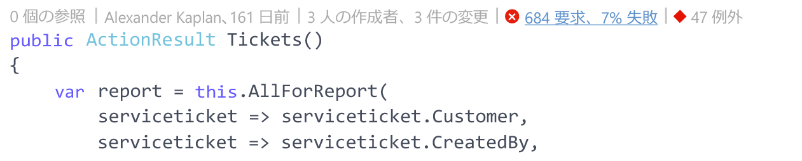
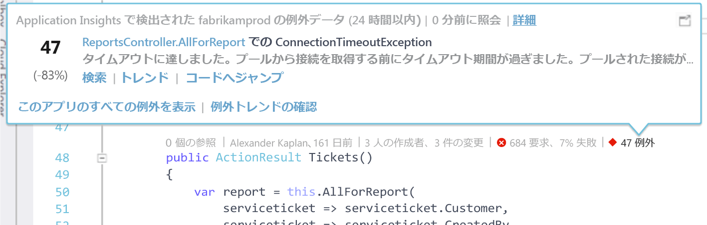
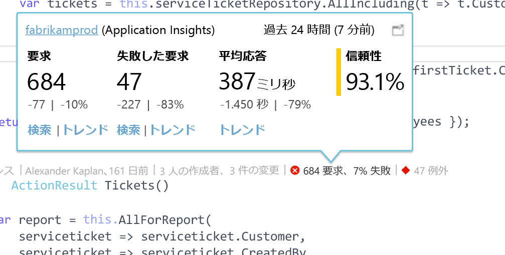

# Visual Studio の CodeLens における Application Insights テレメトリ
Web アプリのコード内のメソッドには、実行時の例外と要求の応答時間に関するテレメトリを注釈として付けることができます。 [ Application Insights](app-insights-overview.md) をアプリケーションにインストールすると、Visual Studio [CodeLens](https://msdn.microsoft.com/library/dn269218.aspx) にテレメトリが表示されます。CodeLens は、各関数の上部に表示される注記で、その関数を参照している場所の数や関数を最後に変更したユーザーなどの有用な情報が表示されます。

> [!NOTE]
> CodeLens の Application Insights は、Visual Studio 2015 Update 3 以降または [Developer Analytics Tools 拡張機能](https://visualstudiogallery.msdn.microsoft.com/82367b81-3f97-4de1-bbf1-eaf52ddc635a)の最新バージョンで利用できます。 CodeLens は、Visual Studio の Enterprise Edition および Professional Edition で利用できます。
> 
> 

## Application Insights データの検索場所
Application Insights テレメトリは、Web アプリケーションのパブリック要求メソッドの CodeLens インジケーターで探します。 CodeLens インジケーターは、C# および Visual Basic コード内のメソッドやその他の宣言の上に表示されます。 メソッドに Application Insights データを利用できる場合は、要求と例外のインジケーターが表示されます (例: "100 requests, 1% failed (100 件の要求、1% 失敗)" または "10 exceptions (10 件の例外)")。 CodeLens インジケーターをクリックすると、詳細が表示されます。 

> [!TIP]
> Application Insights の要求インジケーターと例外インジケーターは、他の CodeLens インジケーターが表示された後に読み込まれますが、さらに数秒かかる場合があります。
> 
> 

## CodeLens における例外

例外 CodeLens インジケーターは、このメソッドから提供された要求の処理中に、過去 24 時間にアプリケーションで最も頻繁に発生した 15 の例外の発生回数を表示します。

詳細を表示するには、例外 CodeLens インジケーターをクリックします。

* 直近の 24 時間の例外の数について、その前の 24 時間と比較した変化 (割合)
* 例外をスローしている関数のソース コードに移動するには、 **[コードに移動]** を選択します。
* 過去 24 時間に発生したこの例外のすべてのインスタンスを照会するには、 **[検索]** を選択します。
* 過去 24 時間におけるこの例外の発生に関する傾向の視覚化を表示するには、 **[傾向]** を選択します。
* 過去 24 時間に発生したすべての例外を照会するには、 **[このアプリのすべての例外を表示する]** を選択します。
* 過去 24 時間に発生したすべての例外に関する傾向の視覚化を表示するには、 **[例外の傾向を調べる]** を選択します。 

> [!TIP]
> CodeLens で "0 exceptions (0 件の例外)" と表示されても、例外が発生していることがわかっている場合は、CodeLens で適切な Application Insights リソースが選択されていることを確認してください。 他のリソースを選択するには、ソリューション エクスプローラーでプロジェクトを右クリックし、**[Application Insights]、[テレメトリのソースを選択]** の順に選択します。 CodeLens は、過去 24 時間にアプリケーションで最も頻繁に発生している 15 の例外のみについて表示されるため、発生頻度が 16 番目以降の例外については "0 exceptions (0 件の例外)" と表示されます。 ASP.NET ビューからの例外は、そのビューを生成したコントローラー メソッドに表示されない場合があります。
> 
> [!TIP]
> CodeLens に "? exceptions (? 件の例外)" と表示される場合は、Azure アカウントを Visual Studio に関連付ける必要があります。または、Azure アカウントの資格情報が期限切れになっている可能性があります。 どちらの場合も、? exceptions (? 件の例外) をクリックし、**アカウントの追加** を選択して資格情報を入力します。
> 
> 

## CodeLens における要求

要求 CodeLens インジケーターは、過去 24 時間にメソッドによって処理された HTTP 要求の数と、これらの要求が失敗した割合を示します。

詳細を表示するには、要求 CodeLens インジケーターをクリックします。

* 過去 24 時間における要求の数、失敗した要求、平均応答時間をその前の 24 時間と比較した場合の変化 (絶対値と割合)
* メソッドの信頼性。過去 24 時間に失敗しなかった要求の割合として計算されます。
* 過去 24 時間に発生したすべての (失敗した) 要求を照会するには、 **[検索]** を選択して要求または失敗した要求を検索します。
* 過去 24 時間における要求、失敗した要求、または平均応答時間の傾向の視覚化を表示するには、 **[傾向]** を選択します。
* CodeLens の詳細ビューの左上隅で Application Insights リソースの名前を選択して、CodeLens データのソースとなるリソースを変更します。

## 次のステップ
|  |  |
| --- | --- |
| **[Visual Studio での Application Insights の操作](app-insights-visual-studio.md)** テレメトリの検索、CodeLens でのデータの確認、Application Insights の構成。 いずれも Visual Studio で行うことができます。 |![プロジェクトを右クリックし、[Application Insights]、[検索] を選択する](./media/app-insights-visual-studio-codelens/34.png) |
| **[データの追加](app-insights-asp-net-more.md)** 使用状況、可用性、依存関係、例外の監視。 ログ記録フレームワークからのトレースを統合します。 カスタム テレメトリを記述します。 | |
| **[Application Insights ポータルの操作](app-insights-dashboards.md)** ダッシュボード、強力な診断および分析ツール、アラート、アプリケーションのリアルタイム依存関係マップ、テレメトリのエクスポート。 | |

