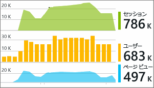

# Visual Studio の Azure Application Insights でアプリケーションをデバッグする
Visual Studio (2015 以降) では、[Azure Application Insights](app-insights-overview.md) からのテレメトリを使用して、ASP.NET Web アプリのパフォーマンスの分析と問題の診断を、デバッグ中と運用環境の両方において実行できます。

Visual Studio 2017 以降を使用して ASP.NET Web アプリを作成した場合は、Application Insights SDK が既に含まれています。 この操作をまだ行っていない場合は、[アプリに Application Insights を追加](app-insights-asp-net.md)してください。

実際の運用環境でアプリを監視するには、通常、[Azure Portal](https://portal.azure.com) で Application Insights のテレメトリを確認します。Azure Portal では、アラートを設定し、強力な監視ツールを適用できます。 ただし、デバッグを行う場合は、Visual Studio でテレメトリを検索して分析することもできます。 Visual Studio を使用したテレメトリの分析は、運用サイトからも、開発用コンピューターでのデバッグの実行からも行うことができます。 後者の場合、Azure Portal にテレメトリを送信するよう SDK をまだ構成していない場合でも、デバッグの実行を分析できます。 

##  プロジェクトのデバッグ
F5 キーを使用して、ローカル デバッグ モードで Web アプリを実行します。 ある程度のテレメトリを生成するために、複数のページを開きます。

Visual Studio では、プロジェクトの Application Insights モジュールによってログに記録されたイベント数を確認できます。

このボタンをクリックして、テレメトリを検索します。 

## Application Insights での検索
[Application Insights の検索] ウィンドウには、ログに記録されたイベントが表示されます  (Application Insights を設定する際に Azure にサインインした場合は、Azure Portal でも同じイベントを検索できます)。

![プロジェクトを右クリックし、[Application Insights]、[検索] を選択する](./media/app-insights-visual-studio/34.png)

> [!NOTE] 
> フィルターを選択または選択解除した後、テキスト検索フィールドの末尾にある [検索] ボタンをクリックしてください。
>

フリー テキスト検索は、イベント内の任意のフィールドに使用できます。 たとえば、ページの URL の一部や、クライアントの市区町村などのプロパティ値、トレース ログの特定の単語などを検索できます。

イベントをクリックすると、その詳細なプロパティが表示されます。

Web アプリに対する要求では、クリックしてコードを表示できます。

![[要求の詳細] でクリックしてコードを表示する](./media/app-insights-visual-studio/31.png)

関連する項目を開いて、失敗した要求や例外を診断することもできます。

![[要求の詳細] で下にスクロールし、関連する項目を表示する](./media/app-insights-visual-studio/41.png)

## 例外と失敗した要求を表示する
例外のレポートは、[検索] ウィンドウに表示されます  (古い種類の ASP.NET アプリケーションの一部では、フレームワークによって処理される例外が表示されるように、[例外の監視を設定する](app-insights-asp-net-exceptions.md)する必要があります)。

スタック トレースを取得するには、例外をクリックします。 Visual Studio でアプリのコードが開かれている場合は、コードの該当する行をスタック トレースからクリックできます。

## コードに要求と例外の概要を表示する
各ハンドラー メソッドの上にある CodeLens 行には、Application Insights によってログに記録された過去 24 時間の要求と例外の数が表示されます。

> [!NOTE] 
> CodeLens に Application Insights のデータが表示されるのは、[テレメトリを Application Insights ポータルに送信するようアプリを構成した](app-insights-asp-net.md)場合のみです。
>

[CodeLens での Application Insights の詳細については、こちらを参照してください。](app-insights-visual-studio-codelens.md)

## Trends
傾向とは、時間経過に伴うアプリの動作を視覚化するためのツールです。 

Application Insights のツール バー ボタンか [Application Insights の検索] ウィンドウから、 **[テレメトリの傾向を調べる]** を選択します。 5 つの一般的なクエリから 1 つ選択して開始します。 テレメトリの種類、時間範囲、およびその他のプロパティに基づき、さまざまなデータセットを分析できます。 

データ内の異常を見つけるには、[ビューの種類] ボックスでいずれかの異常オプションを選択します。 ウィンドウの下部にあるフィルター オプションを使用すると、テレメトリの特定の部分に対象を絞り込みやすくなります。

傾向について詳しくは、[こちら](app-insights-visual-studio-trends.md)を参照してください。

## ローカル監視
Visual Studio 2015 Update 2 以降、Application Insights ポータルにテレメトリを送信するように SDK を構成していない (ApplicationInsights.config にインストルメンテーション キーが存在しない) 場合、診断ウィンドウには、直近のデバッグ セッションからのテレメトリが表示されます。 

これは以前のバージョンのアプリを既に発行済みである場合に役立ちます。 デバッグ セッションから得られたテレメトリが、Application Insights ポータル上の発行済みアプリから得られたテレメトリと混同されるのは望ましくありません。

これは、ポータルにテレメトリを送信する前に、いくつかの [カスタム テレメトリ](app-insights-api-custom-events-metrics.md) をデバッグする場合にも役立ちます。

* *最初は、ポータルにテレメトリを送信するよう Application Insights を構成しましたが、今は、Visual Studio でテレメトリだけを表示したくなりました。*
  
  * アプリからポータルにテレメトリを送信している場合でも、[検索] ウィンドウの [設定] に用意されているオプションでローカルの診断を検索できます。
  * ポータルへのテレメトリの送信を中止するには、ApplicationInsights.config から `<instrumentationkey>...` 行をコメント アウトしてください。もう一度ポータルにテレメトリを送信する準備ができたら、コメント解除します。

## 次の手順
|  |  |
| --- | --- |
| **[データの追加](app-insights-asp-net-more.md)** 使用状況、可用性、依存関係、例外の監視。 ログ記録フレームワークからのトレースを統合します。 カスタム テレメトリを記述します。 | |
| **[Application Insights ポータルの操作](app-insights-dashboards.md)** ダッシュボード、強力な診断および分析ツール、アラート、アプリケーションのリアルタイム依存関係マップ、エクスポートされたテレメトリ データを表示します。 | |

