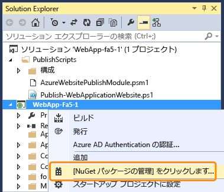
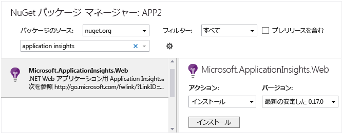
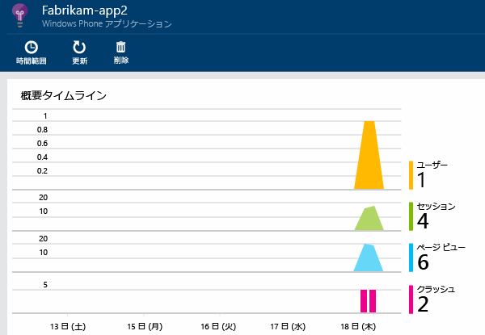
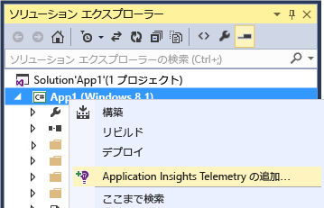

<properties 
	pageTitle="Windows Phone アプリとストア アプリ用の Application Insights" 
	description="Application Insights を使用して Windows デバイス アプリの使用状況とパフォーマンスを分析します。" 
	services="application-insights" 
    documentationCenter="windows"
	authors="alancameronwills" 
	manager="ronmart"/>

<tags 
	ms.service="application-insights" 
	ms.workload="tbd" 
	ms.tgt_pltfrm="ibiza" 
	ms.devlang="na" 
	ms.topic="article" 
	ms.date="05/12/2015" 
	ms.author="awills"/>

# Windows Phone アプリとストア アプリ用の Application Insights

*Application Insights はプレビュー段階です。*

[AZURE.INCLUDE [app-insights-selector-get-started](../../includes/app-insights-selector-get-started.md)]

Visual Studio Application Insights を使用すると、発行されたアプリケーションの次の内容を監視できます。

* [**使用状況**][windowsUsage] - ユーザーの数やユーザーがアプリで操作している内容を確認できます。
* [**クラッシュ**][windowsCrash] - クラッシュの診断レポートを取得し、ユーザーに与える影響を把握します。

多くのアプリケーションの種類では、ほとんどの場合に通知されることなく、[Visual Studio によってアプリに Application Insights が追加されます](#ide)。ただし、この記事を読んで状況を把握できるように、ここでは手動による手順について説明します。

必要なものは次のとおりです。

* [Microsoft Azure][azure] のサブスクリプション
* Visual Studio 2013 以降

## 1.Application Insights リソースの作成 

[Azure ポータル][portal]で、Application Insights の新しいリソースを作成します。

![[新規]、[開発者向けサービス]、[Application Insights] の順に選択する](./media/app-insights-windows-get-started/01-new.png)

Azure の[リソース][roles]は、サービスのインスタンスです。このリソースでは、アプリのテレメトリが分析されて画面に表示されます。

#### インストルメンテーション キーのコピー

このキーでリソースが識別されます。リソースへデータを送信ように SDK を構成するには、このキーがすぐに必要になります。

![[要点] ボックスのドロワを開き、インストルメンテーション キーを選択する](./media/app-insights-windows-get-started/02-props.png)

## 2.アプリへの Application Insights SDK の追加

Visual Studio で、適切な SDK をプロジェクトに追加します。

Windows ユニバーサル アプリの場合は、Windows Phone プロジェクトと Windows プロジェクトの両方に対してこの手順を繰り返します。

1. ソリューション エクスプローラーでプロジェクトを右クリックし、**[NuGet パッケージの管理]** をクリックします。

    

2. **[オンライン]**、**[プレリリースを含める]** の順に選択し、"Application Insights" を検索します。

    

3. **Windows Phone アプリケーション用の Application Insights** を選択します。

4. (NuGet のインストールによって追加された) ApplicationInsights.config を編集します。次のコードを終了タグの直前に挿入します。

    `<InstrumentationKey>`*コピーしたキー*`</InstrumentationKey>`

**Windows ユニバーサル アプリ**: Phone プロジェクトとストア プロジェクトの両方に対して手順を繰り返します。

## 3.アプリのネットワーク アクセスの有効化

アプリで[発信ネットワーク アクセスを要求](https://msdn.microsoft.com/library/windows/apps/hh452752.aspx)していない場合は、[必要な機能](https://msdn.microsoft.com/library/windows/apps/br211477.aspx)としてとしてそれをマニフェストに追加する必要があります。

## 4.プロジェクトの実行

[F5 キーを押してアプリケーションを実行](http://msdn.microsoft.com/library/windows/apps/bg161304.aspx)し、これを使用してテレメトリを生成します。

Visual Studio で、受け取ったイベント数を確認できます。

デバッグ モードでは、テレメトリは生成されるとすぐに送信されます。リリース モードでは、テレメトリはデバイスに格納され、アプリケーションの再開時にのみ送信されます。

## 5.監視データの表示

プロジェクトから Application Insights を開きます。

最初、1 つまたは 2 つのポイントだけが表示されます。次に例を示します。

大量のデータが予想される場合は、数秒後に [最新の情報に更新] をクリックします。

いずれかのグラフをクリックして、詳細を表示します。

## 5.ストアへのアプリケーションの発行

[アプリケーションを発行](http://dev.windows.com/publish)して、ユーザーがそのアプリケーションをダウンロードして使用すると累積されるデータを確認します。

## 次の手順

* [アプリのクラッシュの検出と診断][windowsCrash]
* [メトリックの詳細][metrics]
* [診断検索の詳細][diagnostic]

## 自動セットアップ

セットアップ手順を Visual Studio で自動実行したい場合は、Windows Phone、Windows ストアなどのさまざまな種類のアプリで自動実行することができます。

###新しい Windows アプリ プロジェクトを作成する場合

[新しいプロジェクト] ダイアログ ボックスで [Application Insights] を選択します。

サインインを求めるメッセージが表示されたら、Azure アカウント (Visual Studio Online アカウントとは異なります) の資格情報を使用します。

### 既存のプロジェクトの場合

ソリューション エクスプローラーから Application Insights を追加します。

## 次のステップ

[アプリのクラッシュの検出と診断][windowsCrash]

[診断ログのキャプチャと検索][diagnostic]

[アプリの使用状況の追跡][windowsUsage]

[API を使用したカスタム テレメトリの送信][api]

[トラブルシューティング][qna]

<!--Link references-->

[api]: app-insights-api-custom-events-metrics.md
[azure]: ../insights-perf-analytics.md
[diagnostic]: app-insights-diagnostic-search.md
[metrics]: app-insights-metrics-explorer.md
[portal]: http://portal.azure.com/
[qna]: app-insights-troubleshoot-faq.md
[roles]: app-insights-resources-roles-access-control.md
[windowsCrash]: app-insights-windows-crashes.md
[windowsUsage]: app-insights-windows-usage.md

 

<!---HONumber=62-->