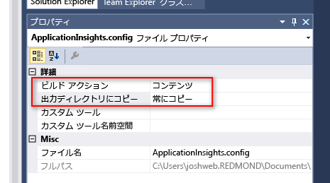

<properties
	pageTitle="Windows Phone アプリとストア アプリの分析 | Microsoft Azure"
	description="Windows デバイス アプリの使用状況とパフォーマンスを分析します。"
	services="application-insights"
    documentationCenter="windows"
	authors="alancameronwills"
	manager="douge"/>

<tags
	ms.service="application-insights"
	ms.workload="tbd"
	ms.tgt_pltfrm="ibiza"
	ms.devlang="na"
	ms.topic="get-started-article"
	ms.date="02/19/2016"
	ms.author="awills"/>

# Windows Phone アプリとストア アプリの分析

デバイスの devOps に関してマイクロソフトでは、2 つのソリューションを提供しています。クライアント側の分析を目的とした [HockeyApp](http://hockeyapp.net/) とサーバー側の分析を目的とした [Application Insights](app-insights-overview.md) です。

[HockeyApp](http://hockeyapp.net/) は、iOS、OS X、Android、Windows デバイスのアプリ、および Xamarin、Cordova、Unity に基づくクロス プラットフォーム アプリ用のモバイル開発運用ソリューションです。これを使用すると、ベータ テスト担当者にビルドを配布し、クラッシュ データを収集して、ユーザーからのフィードバックやメトリックを得ることができます。このソリューションは Visual Studio Team Services と統合されており、ビルドのデプロイメントや作業項目の統合を簡単に行うことができます。

参照先:

* [HockeyApp](http://support.hockeyapp.net/kb)
* [HockeyApp のブログ](http://hockeyapp.net/blog/)
* [Hockeyapp Preseason](http://hockeyapp.net/preseason/) に参加して最新リリースを入手する。

アプリにサーバー側がある場合は、[Application Insights](app-insights-overview.md) を使用して [ASP.NET](app-insights-asp-net.md) または [J2EE](app-insights-java-get-started.md) 上のアプリの Web サーバー側を監視できます。

## Windows デバイス用の Application Insights SDK

Windows デバイス アプリの[クラッシュ][windowsCrash]や[使用状況][windowsUsage]を監視する手段としては HockeyApp をお勧めしますが、以前のバージョンの Application Insights SDK を使用することもできます。

以前のデバイス SDK のサポートは段階的に廃止されるためご注意ください。


以前の SDK をインストールするための要件は次のとおりです。

* [Microsoft Azure][azure] のサブスクリプション
* Visual Studio 2013 以降


### 1\.Application Insights リソースを取得する 

[Azure ポータル][portal]で、Application Insights のリソースを作成します。

新しいリソースの作成:

![[新規]、[開発者向けサービス]、[Application Insights] の順に選択する](./media/app-insights-windows-get-started/01-new.png)

Azure の[リソース][roles]は、サービスのインスタンスです。このリソースでは、アプリのテレメトリが分析されて画面に表示されます。

#### インストルメンテーション キーのコピー

このキーでリソースが識別されます。リソースへデータを送信ように SDK を構成するには、このキーがすぐに必要になります。

![[要点] ボックスのドロワを開き、インストルメンテーション キーを選択する](./media/app-insights-windows-get-started/02-props.png)


### 2\.アプリへの Application Insights SDK の追加

Visual Studio で、適切な SDK をプロジェクトに追加します。


* C++ アプリの場合は、以下に示した NuGet パッケージではなく [C++ SDK](https://github.com/Microsoft/ApplicationInsights-CPP) を使用してください。

Windows ユニバーサル アプリの場合は、Windows Phone プロジェクトと Windows プロジェクトの両方に対して以下の手順を繰り返します。

1. ソリューション エクスプローラーでプロジェクトを右クリックし、**[NuGet パッケージの管理]** をクリックします。

    

2. 「Application Insights」を検索します。

    

3. **Windows アプリケーション用の Application Insights** を選択する

4. プロジェクトのルートに ApplicationInsights.config ファイルを追加し、ポータルでコピーしたインストルメンテーション キーを挿入します。この構成ファイルのサンプル xml を次に示します。

	```xml

		<?xml version="1.0" encoding="utf-8" ?>
		<ApplicationInsights>
			<InstrumentationKey>YOUR COPIED INSTRUMENTATION KEY</InstrumentationKey>
		</ApplicationInsights>
	```

    ApplicationInsights.config ファイルのプロパティを次のように設定します。[**ビルド アクション**] == [**コンテンツ**]、[**出力ディレクトリにコピー**] == [**常にコピーする**]。
	
	

5. 次の初期化コードを追加します。このコードを `App()` コンストラクターに追加することをお勧めします。他の場所にコピーすると、最初の PageViews のコレクションが失われることがあります。

```C#

	public App()
	{
	   // Add this initilization line. 
	   WindowsAppInitializer.InitializeAsync();
	
	   this.InitializeComponent();
	   this.Suspending += OnSuspending;
	}  
```

**Windows ユニバーサル アプリ**: Phone プロジェクトとストア プロジェクトの両方に対して手順を繰り返します。[Windows 8.1 ユニバーサル アプリの例](https://github.com/Microsoft/ApplicationInsights-Home/tree/master/Samples/Windows%208.1%20Universal)。

### <a name="network"></a>3.アプリのネットワーク アクセスの有効化

アプリで[発信ネットワーク アクセスを要求](https://msdn.microsoft.com/library/windows/apps/hh452752.aspx)していない場合は、[必要な機能](https://msdn.microsoft.com/library/windows/apps/br211477.aspx)としてとしてそれをマニフェストに追加する必要があります。

### <a name="run"></a>4.プロジェクトの実行

[F5 キーを押してアプリケーションを実行](http://msdn.microsoft.com/library/windows/apps/bg161304.aspx)し、これを使用してテレメトリを生成します。

Visual Studio で、受け取ったイベント数を確認できます。


デバッグ モードでは、テレメトリは生成されるとすぐに送信されます。リリース モードでは、テレメトリはデバイスに格納され、アプリケーションの再開時にのみ送信されます。


### <a name="monitor"></a>5.監視データの表示

プロジェクトから Application Insights を開きます。


最初、1 つまたは 2 つのポイントだけが表示されます。次に例を示します。


大量のデータが予想される場合は、数秒後に [最新の情報に更新] をクリックします。

いずれかのグラフをクリックして、詳細を表示します。


### <a name="deploy"></a>5.ストアへのアプリケーションの発行

[アプリケーションを発行](http://dev.windows.com/publish)して、ユーザーがそのアプリケーションをダウンロードして使用すると累積されるデータを確認します。

### テレメトリのカスタマイズ

#### コレクターの選択

Application Insights SDK には、さまざまな種類のデータをアプリから自動的に収集する、複数のコレクターが用意されています。既定では、これらはすべてアクティブになります。ただし、アプリ コンストラクターでどのコレクターを初期化するかを選択することができます。

    WindowsAppInitializer.InitializeAsync( "00000000-0000-0000-0000-000000000000",
       WindowsCollectors.Metadata
       | WindowsCollectors.PageView
       | WindowsCollectors.Session 
       | WindowsCollectors.UnhandledException);

#### 独自のテレメトリ データを送信する

[API][api] を使用して、イベント、メトリック、および診断データを Application Insights に送信します。概要:

```C#

 var tc = new TelemetryClient(); // Call once per thread

 // Send a user action or goal:
 tc.TrackEvent("Win Game");

 // Send a metric:
 tc.TrackMetric("Queue Length", q.Length);

 // Provide properties by which you can filter events:
 var properties = new Dictionary{"game", game.Name};

 // Provide metrics associated with an event:
 var measurements = new Dictionary{"score", game.score};

 tc.TrackEvent("Win Game", properties, measurements);

```

詳細については、[カスタムのイベントとメトリックに関する記事][api]を参照してください。

## 次の手順

* [アプリのクラッシュの検出と診断][windowsCrash]
* [メトリックの詳細][metrics]
* [診断検索の詳細][diagnostic]
* [アプリの使用状況の追跡][windowsUsage]
* [API を使用したカスタム テレメトリの送信][api]
* [トラブルシューティング][qna]

* [Use HockeyApp for crash analytics, beta distribution and feedback on your app (クラッシュ分析、ベータ版の配布、アプリのフィードバックに HockeyApp を使用する)](http://hockeyapp.net/)


<!--Link references-->

[api]: app-insights-api-custom-events-metrics.md
[azure]: ../insights-perf-analytics.md
[diagnostic]: app-insights-diagnostic-search.md
[metrics]: app-insights-metrics-explorer.md
[portal]: http://portal.azure.com/
[qna]: app-insights-troubleshoot-faq.md
[roles]: app-insights-resources-roles-access-control.md
[windowsCrash]: app-insights-windows-crashes.md
[windowsUsage]: app-insights-windows-usage.md

<!----HONumber=AcomDC_0224_2016-->