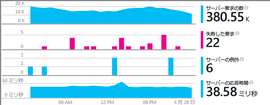
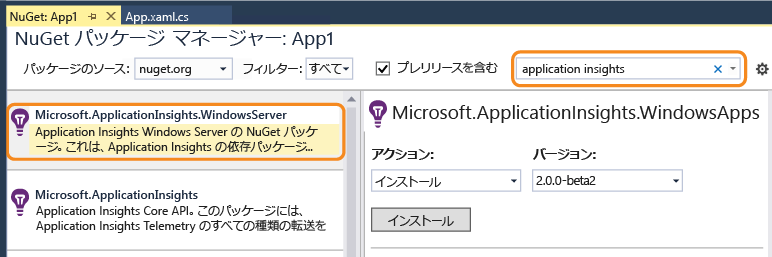
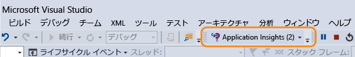
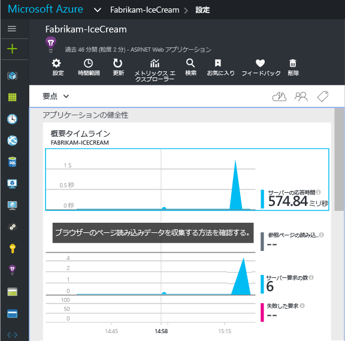
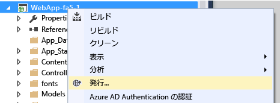

# Application Insights を ASP.NET 4 アプリケーション用に手動で構成する
[Application Insights](app-insights-overview.md) は、Web 開発者がライブ アプリケーションのパフォーマンスと使用状況を監視するための拡張可能なツールです。 このツールは、Windows サービス、worker ロール、その他の ASP.NET アプリケーションを監視するように手動で構成できます。 Web アプリの場合、手動による構成は、Visual Studio で提供される [自動セットアップ](app-insights-asp-net.md) に代わる方法となります。

#### 開始する前に
必要なもの:

* [Microsoft Azure](http://azure.com) サブスクリプション。 チームまたは組織で Azure サブスクリプションを取得している場合、所有者は [Microsoft アカウント](http://live.com)を使用してあなたを追加できます。
* Visual Studio 2013 以降

## 1.Application Insights リソースの作成
[Azure ポータル](https://portal.azure.com/)にサインインし、Application Insights の新しいリソースを作成します。 アプリケーションの種類として ASP.NET を選択します。

![[新規]、[Application Insights] の順にクリックする](./media/app-insights-windows-services/01-new-asp.png)

Azure の [リソース](app-insights-resources-roles-access-control.md) は、サービスのインスタンスです。 このリソースでは、アプリのテレメトリが分析されて画面に表示されます。

アプリケーションの種類を選択すると、[リソース] ブレードの既定のコンテンツと [メトリックス エクスプローラー](app-insights-metrics-explorer.md)に表示されるプロパティが設定されます。

#### インストルメンテーション キーのコピー
これはリソースを識別するキーです。データをリソースに送信するために SDK の後の手順でインストールします。

![[プロパティ] をクリックし、キーを選択して、Ctrl キーを押しながら C キーを押す](./media/app-insights-windows-services/02-props-asp.png)

新しいリソースを作成するために実行した手順は、任意のアプリケーションの監視を開始するための優れた方法です。 これで、データをリソースに送信できます。

## 2.アプリケーションに SDK をインストールする
Application Insights SDK のインストールと構成は、作業中のプラットフォームによって異なります。 ASP.NET アプリの場合は簡単です。

1. Visual Studio で、Web アプリ プロジェクトの NuGet パッケージを編集します。
   
    ![プロジェクトを右クリックし、[Nuget パッケージの管理] を選択する](./media/app-insights-windows-services/03-nuget.png)
2. Web Apps 向け Application Insights SDK をインストールします。
   
    
   
    *他のパッケージを使用することができますか。*
   
    はい。 独自のテレメトリを送信するためだけに API を使用する場合は、コア API (Microsoft.ApplicationInsights) を選択してください。 Windows Server パッケージには、コア API に加え、他にも多くのパッケージ (パフォーマンス カウンターや依存関係の監視など) が自動的に含まれます。 

#### 新しいバージョンの SDK にアップグレードするには
SDK の新しいバージョンは不定期でリリースされます。

[SDK の新しいリリース](https://github.com/Microsoft/ApplicationInsights-dotnet-server/releases/)にアップグレードするには、NuGet パッケージ マネージャーをもう一度開き、インストールされているパッケージに対してフィルターを実行します。 Select **Microsoft.ApplicationInsights.Web** and choose **Upgrade**.

ApplicationInsights.config をカスタマイズしている場合は、アップグレードする前にコピーを保存しておき、後から新しいバージョンに変更をマージします。

## 3.テレメトリを送信する
**コア API パッケージのみをインストールしている場合:**

* コードでインストルメンテーション キーを設定します (たとえば、 `main()`内)。 
  
    `TelemetryConfiguration.Active.InstrumentationKey = "` *自分のキー* `";` 
* [API を使用して独自のテレメトリを記述](app-insights-api-custom-events-metrics.md#ikey)します。

**他の Application Insights パッケージをインストールしている場合** 、必要に応じて .config ファイルを使用してインストルメンテーション キーを設定します。

* (NuGet のインストールによって追加された) ApplicationInsights.config を編集します。 次のコードを終了タグの直前に挿入します。
  
    `<InstrumentationKey>`*コピーしたインストルメンテーション キー* `</InstrumentationKey>`
* ソリューション エクスプローラーで ApplicationInsights.config のプロパティが **[ビルド アクション] = [コンテンツ]、[出力ディレクトリにコピー] = [コピー]**に設定されていることを確認します。

[複数のビルド構成でキーを切り替える](app-insights-separate-resources.md)場合は、コードでインストルメンテーション キーを設定すると便利です。 コードでキーを設定する場合は、`.config` ファイルで設定する必要がありません。

##  プロジェクトの実行
**F5** キーを使用してアプリケーションを実行します。さまざまなページを開いて、テレメトリを生成してみます。

Visual Studio で、送信されたイベント数が表示されます。

##  利用統計情報を表示する
[Azure ポータル](https://portal.azure.com/) に戻り、Application Insights のリソースを参照します。

概要グラフでデータを探します。 最初、1 つまたは&2; つのポイントだけが表示されます。 次に例を示します。

任意のグラフをクリックして、より詳細なメトリックを表示します。 [メトリックの詳細についてはこちらをご覧ください。](app-insights-web-monitor-performance.md)

#### データが表示されない場合
* アプリケーションを使用して、テレメトリがいくつか生成されるようにさまざまなページを開きます。
* [[検索]](app-insights-diagnostic-search.md) タイルを開き、個々のイベントを表示します。 メトリック パイプラインを経由すると、イベントの取得に少し時間がかかる場合があります。
* 数秒待機してから **[最新の情報に更新]**をクリックします。 グラフは周期的に自動で更新されますが、データの表示を待機している場合、手動で更新することもできます。
* [トラブルシューティング](app-insights-troubleshoot-faq.md)に関するページを参照します。

## アプリケーションの発行
ここで、アプリケーションをサーバーまたは Azure にデプロイし、データ累積を確認します。

デバッグ モードで実行している場合、テレメトリはパイプラインにより時間が短縮されるので、数秒でデータが表示されます。 リリース構成でアプリケーションをデプロイすると、データ累積速度は遅くなります。

#### サーバーに発行した後でデータはありませんか。
サーバーのファイアウォールで発信トラフィック用のこれらのポートを開きます。

* `dc.services.visualstudio.com:443`
* `f5.services.visualstudio.com:443`

#### ビルド サーバーで問題が発生した場合
[このトラブルシューティング項目](app-insights-asp-net-troubleshoot-no-data.md#NuGetBuild)を参照してください。

> [!NOTE]
> (ASP.NET SDK バージョン 2.0.0-beta3 以降を使用している状態で) アプリから大量のテレメトリが生成されると、アダプティブ サンプリング モジュールからイベントの代表的な部分のみが送信され、ポータルに送信されるデータ量が自動的に削減されます。 ただし、同じ要求に関連するイベントはグループ単位で選択または選択解除されるので、関連するイベントごとに操作できます。 
> [サンプリングについてはこちらを参照してください](app-insights-sampling.md)。
> 
> 

## ビデオ

> [!VIDEO https://channel9.msdn.com/events/Connect/2016/100/player]

## 次のステップ
* [他のテレメトリを追加](app-insights-asp-net-more.md) します。

