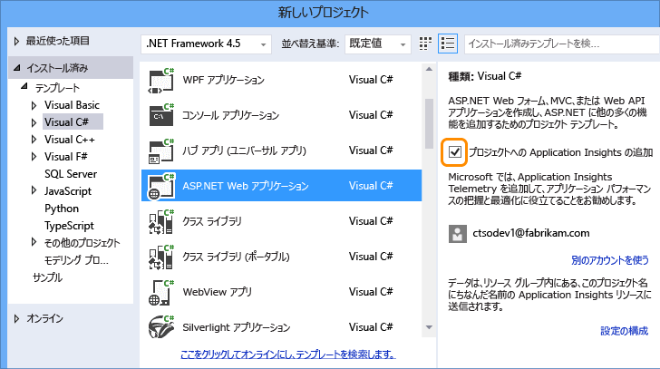
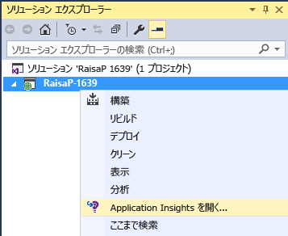
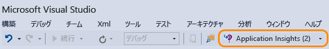

<properties 
	pageTitle="Application Insights を使用したアプリのパフォーマンスと使用状況の監視" 
	description="内部設置型または Microsoft Azure Web アプリケーションの使用状況、可用性、パフォーマンスを Application Insights で分析します。" 
	services="application-insights" 
    documentationCenter=""
	authors="alancameronwills" 
	manager="ronmart"/>

<tags 
	ms.service="application-insights" 
	ms.workload="tbd" 
	ms.tgt_pltfrm="ibiza" 
	ms.devlang="na" 
	ms.topic="article" 
	ms.date="04/26/2015" 
	ms.author="awills"/>

# Application Insights を使用したアプリのパフォーマンスと使用状況の監視

*Application Insights はプレビュー段階です。*

Visual Studio Application Insights は、実行中のアプリケーションを監視し、[パフォーマンスの問題や例外の検出と診断][detect]、[アプリの使用方法の把握][knowUsers]に役立ちます。これはさまざまなアプリケーションの種類で使用できます。たとえば、ASP.NET と Java Web アプリ、iOS、Android、Windows などのデバイスのアプリ、HTML と JavaScript アプリがあります。

この記事では、Visual Studio で開発されたアプリの種類に注目します。他の IDE 用の Application Insights 拡張機能もあります。

[Visual Studio 2013 Update 3](http://go.microsoft.com/fwlink/?linkid=397827&clcid=0x409) (またはそれ以降) と [Microsoft Azure](http://azure.com) のアカウントが必要です。

## プロジェクトへの Application Insights の追加

#### 新しいプロジェクトの場合

Visual Studio に新しいプロジェクトを作成するとき、Application Insights が選択されていることを確認してください。

Visual Studio によって、Application Insights にリソースが作成され、プロジェクトに SDK が追加されて、キーが `.config` ファイルに配置されます。

プロジェクトに Web ページが含まれている場合は、[JavaScript SDK][client] がマスター Web ページに追加されます。

#### 既存のプロジェクトの場合

ソリューション エクスプローラーでプロジェクトを右クリックし、[Application Insights の追加] を選択します。

![[Application Insights の追加] を選択する](./media/app-service-app-insights-get-started/appinsights-03-addExisting.png)

Visual Studio によって、Application Insights にリソースが作成され、プロジェクトに SDK が追加されて、キーが `.config` ファイルに配置されます。

この場合、[JavaScript SDK][client] は Web ページに追加されません。この操作は、次の手順として行うことをお勧めします。

#### セットアップ オプション

初めての場合には、Microsoft Azure プレビュー版にログインまたはサインインするように求められます(Visual Studio Online アカウントとは異なります)。

このアプリがより大きなアプリケーションの一部である場合は、**[設定の構成]** を使用して、他のコンポーネントと同じリソース グループに配置することをお勧めします。

*Application Insights オプションはありせんか。 一部の種類のプロジェクトでは、[SDK を手動で追加][windows]すると Application Insights を使用できます。*

#### プロジェクトから Application Insights を開きます。

##  3.プロジェクトの実行

F5 キーを使用してアプリケーションを実行して、試します。さまざまなページが開き、いくつかのテレメトリが生成されます。

Visual Studio で、送信されたイベント数が表示されます。

##  4.テレメトリの表示

[Azure ポータル][portal]に戻り、Application Insights のリソースを参照します。

概要グラフでデータを探します。最初、1 つまたは 2 つのポイントだけが表示されます。次に例を示します。

任意のグラフをクリックして、より詳細なメトリックを表示します。[メトリックの詳細についてはこちらをご覧ください。][perf]

ここで、アプリケーションをデプロイし、データ累積を確認します。

デバッグ モードで実行している場合、利用統計情報はパイプラインにより時間が短縮されるので、数秒でデータが表示されます。アプリケーションをデプロイすると、データ累積速度は遅くなります。

#### データが表示されない場合

* [[診断検索]][diagnostic] タイルを開き、個々のイベントを表示します。
* アプリケーションを使用して、テレメトリがいくつか生成されるようにさまざまなページを開きます。
* 数秒待機してから [最新の情報に更新] をクリックします。
* [トラブルシューティング][qna]に関するページを参照します。

## 次のステップ

これでアプリのサーバー側からデータを送信しているため、全体像を理解するための手順を次に示します。

* [Web テストを設定][availability]して、アプリケーションが動作していて応答できることを確認します。
* [Web ページに JavaScript SDK を追加][client]して、ページ ビュー数、ページの読み込み時間、スクリプトの例外などのブラウザー ベースのテレメトリを取得し、ページ スクリプトにカスタムのテレメトリを記述することができます。
* 依存関係の追跡を追加して、アプリで使用されるデータベースなどのコンポーネントが原因で発生した問題を診断します。 
 * [IIS サーバーでの依存関係の追跡の追加][redfield]
 * [Azure Web アプリでの依存関係の追跡の追加][azure]
* お気に入りのログ記録フレームワークから[ログ トレースをキャプチャ][netlogs]します。
* クライアント側とサーバー側 (またはそのいずれか) で[カスタム イベントとメトリックを追跡][api]して、アプリケーションの使用状況の詳細を確認します。

<!--Link references-->

[api]: app-insights-api-custom-events-metrics.md
[availability]: app-insights-monitor-web-app-availability.md
[azure]: ../insights-perf-analytics.md
[client]: app-insights-javascript.md
[detect]: app-insights-detect-triage-diagnose.md
[diagnostic]: app-insights-diagnostic-search.md
[knowUsers]: app-insights-overview-usage.md
[netlogs]: app-insights-asp-net-trace-logs.md
[perf]: app-insights-web-monitor-performance.md
[portal]: http://portal.azure.com/
[qna]: app-insights-troubleshoot-faq.md
[redfield]: app-insights-monitor-performance-live-website-now.md
[windows]: app-insights-windows-get-started.md

<!--HONumber=54--> 