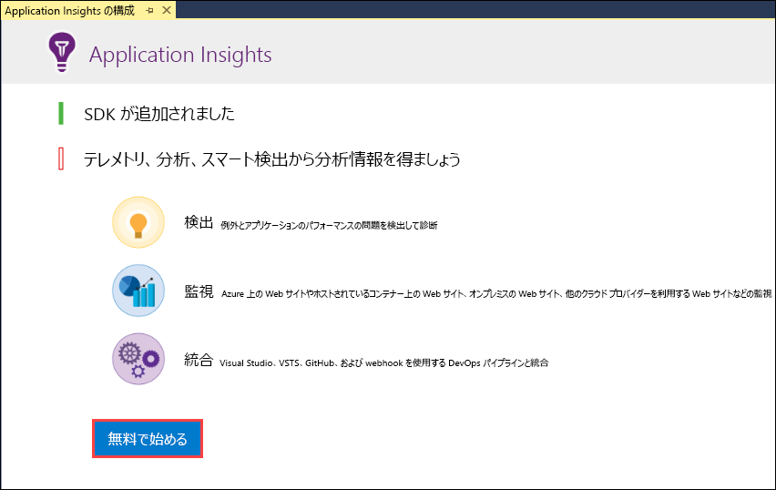
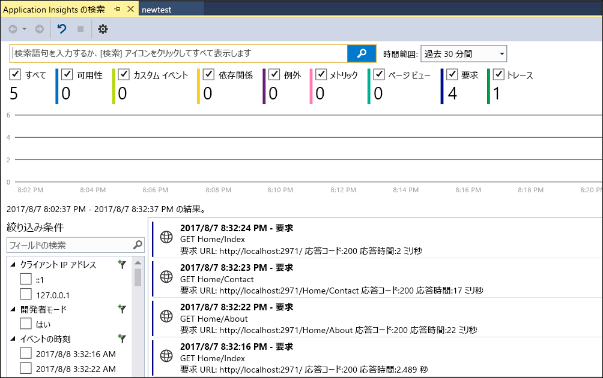
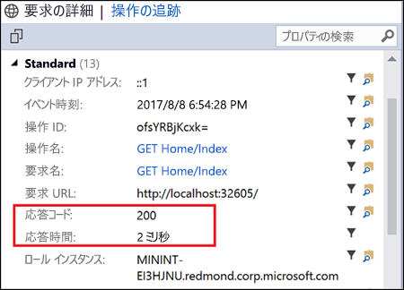
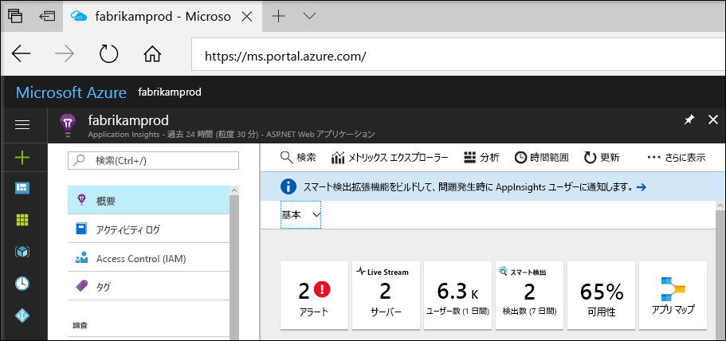
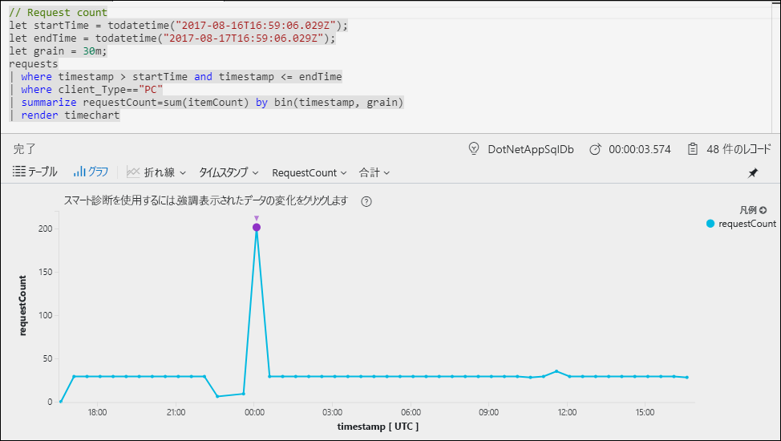
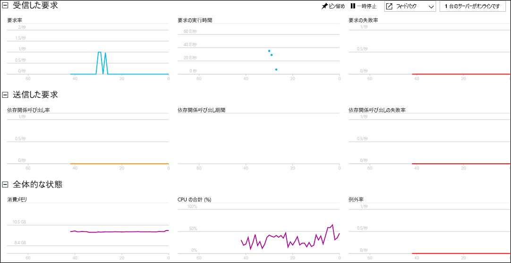

# ASP.NET Web アプリケーションの監視を開始する

Azure Application Insights を使うと、Web アプリケーションの可用性、パフォーマンス、利用状況を簡単に監視できます。  アプリケーションのエラーを、ユーザーからの報告を待つことなく、迅速に特定して診断することもできます。  Application Insights から収集したアプリのパフォーマンスと有効性に関する情報を使用することで、十分な情報に基づいて、アプリケーションのメンテナンスと改善に関する選択を行えます。

このクイックスタートでは、既存の ASP.NET Web アプリケーションに Application Insights を追加してライブ統計の分析を開始する方法を説明します。これは、アプリケーションの分析に使用できるさまざまな方法の中の 1 つです。 ASP.NET Web アプリケーションがない場合は、[ASP.NET Web アプリを作成するためのクイックスタート](../app-service-web/app-service-web-get-started-dotnet.md)に従って作成できます。

## 前提条件
このクイック スタートを完了するには、以下が必要です。

- 次のワークロードを使って、[Visual Studio 2017](https://www.visualstudio.com/downloads/) をインストールします。
    - ASP.NET および Web の開発
    - Azure の開発

Azure サブスクリプションをお持ちでない場合は、開始する前に[無料](https://azure.microsoft.com/free/)アカウントを作成してください。

## Application Insights を有効にする

1. Visual Studio 2017 でプロジェクトを開きます。
2. [プロジェクト] メニューの **[Application Insights の構成]** を選択します。 Visual Studio によって、Application Insights SDK がアプリケーションに追加されます。
3. **[開始 (無料)]** をクリックします。希望の料金プランを選択し、**[登録]** をクリックします。

    

4. **[デバッグ]** メニューの **[デバッグ開始]** をクリックするか、F5 キーを押して、アプリケーションを実行します。

## アプリの構成を確認する

Application Insights は、アプリケーションが実行されている場所に関係なく、アプリケーションのテレメトリ データを収集します。 このデータの表示を開始するには、次の手順を実行します。

1. **[プロジェクト]** -> **[Application Insights]** -> **[デバッグ セッション テレメトリの検索]** の順にクリックして、Application Insights を開きます。  現在のセッションのテレメトリが表示されます。  

2. リスト内の最初の要求 (この例では GET Home/Index) をクリックすると、この要求の詳細が表示されます。 要求に関する他の有益な情報と共に状態コードと応答時間の両方が含まれていることに注意してください。  

## Azure Portal で監視を開始する

Azure Portal で Application Insights を開いて、実行中のアプリケーションに関するさまざまな詳細情報を表示することができます。

1. ソリューション エクスプローラーで、**接続済みサービス Application Insights** フォルダーを右クリックし、**[Application Insights ポータルを開く]** をクリックします。  アプリケーションに関する情報とさまざまなオプションが表示されます。

    

2. **[App map]\(アプリ マップ\)** をクリックして、アプリケーション コンポーネント間の依存関係の視覚的レイアウトを取得します。  各コンポーネントには、負荷、パフォーマンス、障害、アラートなどの KPI が表示されます。

    

3. いずれかのアプリケーション コンポーネントで、**[アプリ分析]** アイコン ![[アプリケーション マップ]](media/quick-monitor-portal/app-analytics-icon.png) をクリックします。  これにより、Application Insights で収集されたすべてのデータを分析するための豊富なクエリ言語を備えた **Application Insights 分析**が開きます。  この場合は、要求の数をグラフとして描画するクエリが生成されます。  自分でクエリを作成して他のデータを分析することができます。

    

4. **[概要]** ページに戻り、**[ライブ ストリーム]** をクリックします。  これにより、実行中のアプリケーションに関するライブ統計が表示されます。  ここには、着信要求の数、要求の期間、発生したエラーなどの情報が含まれます。  また、プロセッサやメモリなどの重要なパフォーマンス メトリックを検査することもできます。

    

Azure でアプリケーションをホストする準備ができたら、すぐに公開することができます。 [ASP.NET Web アプリを作成するためのクイックスタート](../app-service/app-service-web-get-started-dotnet.md#update-the-app-and-redeploy)に記載されている手順に従います。

## 次のステップ
このクイックスタートでは、Azure Application Insights で監視できるようにアプリケーションを有効にしました。  チュートリアルを続けて、統計情報を監視してアプリケーションの問題を検出する方法を学習してください。

> [!div class="nextstepaction"]
> [Azure Application Insights チュートリアル](app-insights-tutorial-runtime-exceptions.md)
