# <a name="tutorial-enable-anomaly-notification-in-metrics-advisor"></a>チュートリアル: Metrics Advisor で異常通知を有効化する 

<!-- 2. Introductory paragraph 
Required. Lead with a light intro that describes, in customer-friendly language, 
what the customer will learn, or do, or accomplish. Answer the fundamental “why 
would I want to do this?” question. Keep it short.
-->


<!-- 3. Tutorial outline 
Required. Use the format provided in the list below.
-->

このチュートリアルでは、次の作業を行う方法について説明します。

> [!div class="checklist"]
> * Metrics Advisor でフックを作成する
> * Azure Logic Apps を使用して通知を送信する
> * Microsoft Teams 宛てに通知を送信する
> * SMTP サーバー経由で通知を送信する

<!-- 4. Prerequisites 
Required. First prerequisite is a link to a free trial account if one exists. If there 
are no prerequisites, state that no prerequisites are needed for this tutorial.
-->

## <a name="prerequisites"></a>前提条件
### <a name="create-a-metrics-advisor-resource"></a>Metrics Advisor リソースを作成する

Metrics Advisor の機能を利用するには、Azure portal で <a href="https://go.microsoft.com/fwlink/?linkid=2142156"  title="Metrics Advisor リソースを作成 "  target="_blank">Metrics Advisor リソースを作成</a>して、Metrics Advisor インスタンスをデプロイする必要があります。

### <a name="create-a-hook-in-metrics-advisor"></a>Metrics Advisor でフックを作成する
Metrics Advisor におけるフックとは、顧客がメトリックの異常にサブスクライブし、さまざまなチャンネルを介して通知を送信できるブリッジを指します。 Metrics Advisor には、次の 4 種類のフックがあります。 
    
- email hook
- Webhook
- Teams フック
- Azure DevOps フック

フックの種類は、それぞれ異常が通知される具体的なチャンネルに対応しています。 

<!-- 5. H2s
Required. Give each H2 a heading that sets expectations for the content that follows. 
Follow the H2 headings with a sentence about how the section contributes to the whole.
-->

## <a name="send-notifications-with-logic-apps-teams-and-smtp"></a>Logic Apps、Teams、および SMTP で通知を送信する

#### <a name="logic-apps"></a>[Logic Apps](#tab/logic)

### <a name="send-email-notification-by-using-azure-logic-apps"></a>Azure Logic Apps を使用して電子メール通知を送信する

<!-- Introduction paragraph -->
Metrics Advisor でサポートされている電子メール通知を送信する方法には、2 つの一般的なオプションがあります。 1 つは、Webhook と Azure Logic Apps を使用して電子メール アラートを送信する方法で、もう 1 つは、SMTP サーバーを設定し、それを使用して電子メール アラートを直接送信する方法です。 このセクションでは、使用できる SMTP サーバーをお持ちないお客様にとって使いやすい、最初のオプションに焦点を当てます。

**手順 1.** Metrics Advisor で Webhook を作成する

Webhook は、Metrics Advisor サービスから使用できるすべての情報のエントリ ポイントであり、アラートがトリガーされたときにユーザー指定の API を呼び出します。 アラートはすべて、Webhook を介してを送信できます。

Metrics Advisor のワークスペースで **[フック]** タブを選択し、 **[フックの作成]** ボタンを選択します。 フックの種類として、 **[Webhook]** を選択します。 必要なパラメーターを入力して、 **[OK]** を選択します。 詳しい手順については、[Webhook の作成](../how-tos/alerts.md#web-hook)に関するセクションを参照してください。

**エンドポイント** のパラメーターを 1 つ追加で入力する必要がありますが、これは以下の手順 3 を完了した後に行うことができます。 


**手順 2.** Logic Apps リソースを作成

[Azure portal](https://portal.azure.com) で、[[ロジック アプリを作成する]](../../../logic-apps/quickstart-create-first-logic-app-workflow.md) の手順に従って、空のロジック アプリを作成します。 **Logic Apps デザイナー** が表示されたら、このチュートリアルに戻ります。


**手順 3.** **[HTTP 要求の受信時]** のトリガーを追加します。

- Azure Logic Apps では、定義したワークフローをトリガーするために、さまざまなアクションが使用されます。 このユース ケースでは、 **[HTTP 要求の受信時]** というトリガーを使用します。 

- **[HTTP 要求の受信時]** のダイアログで、 **[サンプルのペイロードを使用してスキーマを生成する]** を選択します。

    ![[HTTP 要求の受信時] ダイアログ ボックスと [サンプルのペイロードを使用してスキーマを生成する] オプションが選択されたことを示すスクリーンショット。 ](../media/tutorial/logic-apps-generate-schema.png)

    次のサンプル JSON をテキスト ボックスにコピーして、 **[完了]** を選択します。

    ```json
    {
    "properties": {
        "value": {
            "items": {
                "properties": {
                    "alertInfo": {
                        "properties": {
                            "alertId": {
                                "type": "string"
                            },
                            "anomalyAlertingConfigurationId": {
                                "type": "string"
                            },
                            "createdTime": {
                                "type": "string"
                            },
                            "modifiedTime": {
                                "type": "string"
                            },
                            "timestamp": {
                                "type": "string"
                            }
                        },
                        "type": "object"
                    },
                    "alertType": {
                        "type": "string"
                    },
                    "callBackUrl": {
                        "type": "string"
                    },
                    "hookId": {
                        "type": "string"
                    }
                },
                "required": [
                    "hookId",
                    "alertType",
                    "alertInfo",
                    "callBackUrl"
                ],
                "type": "object"
            },
            "type": "array"
        }
    },
    "type": "object"
     }
    ```

- メソッドとして [POST] を選択し、 **[保存]** を選択します。 HTTP 要求トリガーの URL が表示されるようになりました。 コピー アイコンを選択してコピーし、手順 1 の **エンドポイント** に入力します。 

    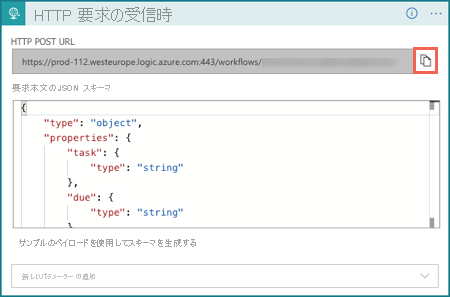

**ステップ 4.** [HTTP] アクションを使用して次の手順を追加する

Webhook を介してプッシュされるシグナルには、Timestamp、AlertID、ConfigurationID などの限られた情報だけが含まれます。詳細情報は、シグナルで指定されたコールバック URL を使用して照会する必要があります。 このステップでは、詳細なアラート情報に対してクエリを実行します。  

- メソッドとして [GET] を選択します。
- [URI] の [動的コンテンツ] リストから [CallBackURL] を選択します。
- [ヘッダー] にキーとして [Content-Type] を入力し、[application/json] の値を入力します
- [ヘッダー] にキーとして [x-api-key] を入力し、Metrics Advisor ワークスペース内の **[API キー]** タブをクリックしてこれを取得します。 このステップは、API を呼び出すための十分なアクセス許可がワークフローに付与されていることを確認するために必要です。

    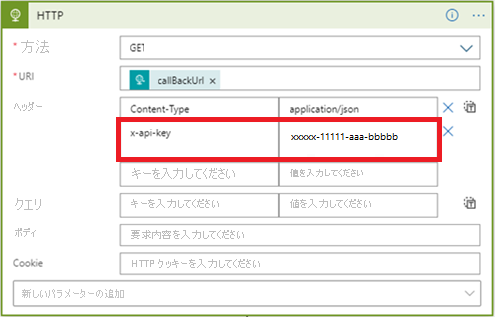

**ステップ 5.** [PARSE JSON] に次の手順を追加する 

電子メールの内容を簡単に書式設定するためには、API の応答を解析する必要があります。 
 
> [!NOTE] 
> このチュートリアルでは簡単な例のみを紹介するため、最終的な電子メールの形式 はさらに設計する必要があります。 

- [コンテンツ] の [動的なコンテンツ] リストから [本文] を選択します
- **[サンプルのペイロードを使用してスキーマを生成する]** を選択します。 次のサンプル JSON をテキスト ボックスにコピーして、 **[完了]** を選択します。

```json
{
    "properties": {
        "@@nextLink": {},
        "value": {
            "items": {
                "properties": {
                    "properties": {
                        "properties": {
                            "IncidentSeverity": {
                                "type": "string"
                            },
                            "IncidentStatus": {
                                "type": "string"
                            }
                        },
                        "type": "object"
                    },
                    "rootNode": {
                        "properties": {
                            "createdTime": {
                                "type": "string"
                            },
                            "detectConfigGuid": {
                                "type": "string"
                            },
                            "dimensions": {
                                "properties": {
                                },
                                "type": "object"
                            },
                            "metricGuid": {
                                "type": "string"
                            },
                            "modifiedTime": {
                                "type": "string"
                            },
                            "properties": {
                                "properties": {
                                    "AnomalySeverity": {
                                        "type": "string"
                                    },
                                    "ExpectedValue": {}
                                },
                                "type": "object"
                            },
                            "seriesId": {
                                "type": "string"
                            },
                            "timestamp": {
                                "type": "string"
                            },
                            "value": {
                                "type": "number"
                            }
                        },
                        "type": "object"
                    }
                },
                "required": [
                    "rootNode",
                    "properties"
                ],
                "type": "object"
            },
            "type": "array"
        }
    },
    "type": "object"
}
```

**ステップ 6.** [HTML テーブルの作成] に次の手順を追加する

API 呼び出しから多くの情報が返された場合でも、シナリオによってはすべての情報が有用とは限りません。 アラート 電子メールに含める、必要な項目を選択するようにしましょう。 

アラート 電子メールに含める [Timestamp]、[MetricGUID]、および [ディメンション] を選択する HTML テーブルの例を次に示します。

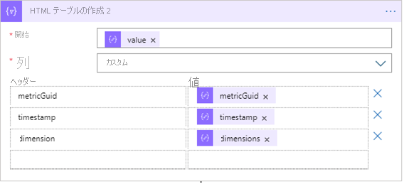

**ステップ 7.** 最後の手順を [電子メールの送信] に追加する

Microsoft によってホストされているものとサードパーティー オファリングの両方に、電子メールを送信するためのオプションがいくつかあります。 お客様は、選択したオプションのテナントまたはアカウントを持っている必要があります。 たとえば、サーバーとして [Office 365 Outlook] を選択する場合などです。 接続と認証を行うためのサインイン プロセスが実行されます。 電子メール サーバーを使用してアラートを送信するための API 接続が確立されます。 

電子メールの [本文]、[件名] に含める内容を入力し、[宛先] に電子メール アドレスを入力します。 

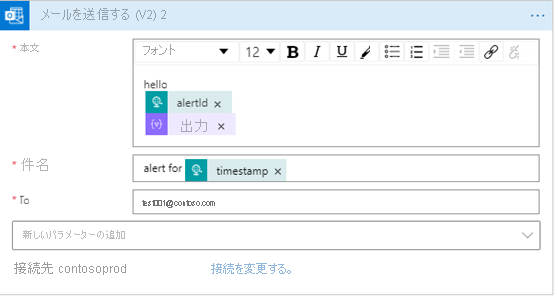
                                                                   
#### <a name="teams-channel"></a>[Teams チャンネル](#tab/teams)
                                           
### <a name="send-anomaly-notification-through-a-microsoft-teams-channel"></a>Microsoft Teams のチャンネルを介して異常通知を送信する                            
このセクションでは、Microsoft Teams チャンネルを通じて異常通知を送信する方法について説明します。 これにより、Metrics Advisor で検出された異常をチーム メンバーで協力して分析するシナリオを実現することができます。 このワークフローの構成は簡単で、前提条件も多くはありません。 
                                               


**手順 1.** Teams チャンネルに [受信 Webhook] コネクタを追加する

- 通知を送信する Teams チャンネルに移動し、[•••] (その他のオプション) を選択します。 
- ドロップダウン リストから、[コネクタ] を選択します。 新しいダイアログで [受信 Webhook] を検索し、[追加] をクリックします。

    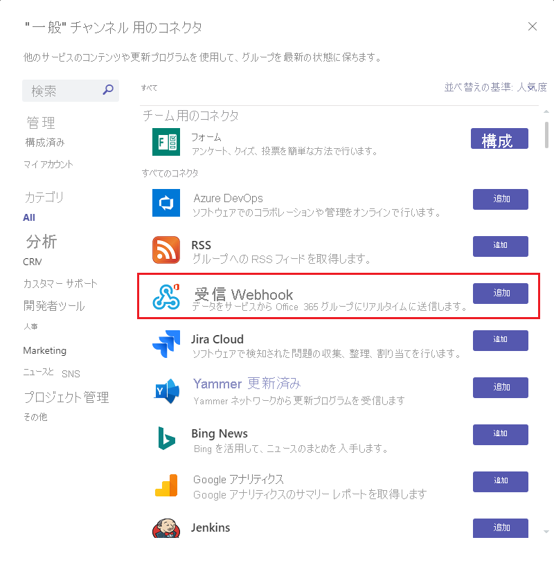    

- [コネクタ] オプションを表示できない場合は、Teams グループの所有者にお問い合わせください。 [チームの管理] を選択し、上部にある [設定] タブを選択し、[メンバーによるコネクタの作成、更新、削除を許可する] の設定がオンかどうかを確認します。

    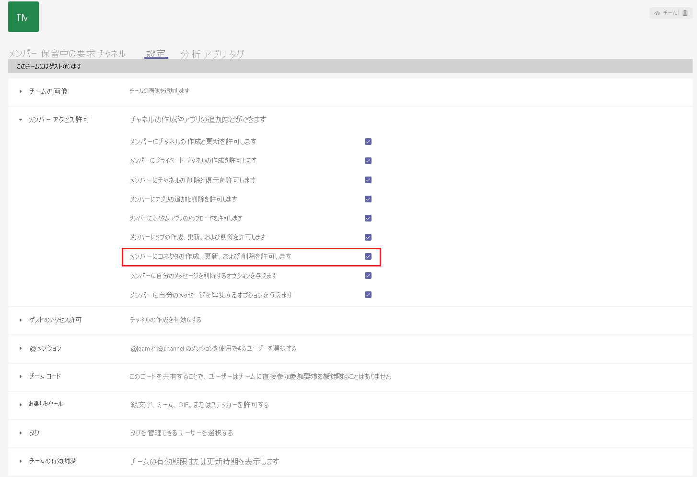    

- コネクタの名前を入力します。また、画像をアップロードしてアバターとして作成することもできます。 [作成] を選択すると、受信 Webhook コネクタがチャンネルに正常に追加されます。 ダイアログの下部に URL が生成されるため、**必ず [コピー] を選択し**、[完了] を選択してください。 

    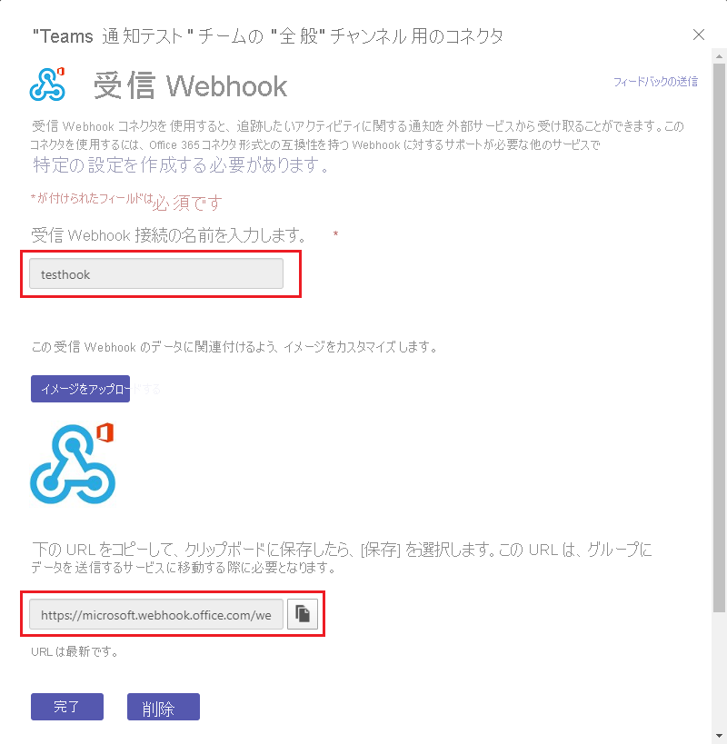 

**手順 2.** Metrics Advisor で新しい [Teams フック] を作成する

- 左側のナビゲーション バーで [フック] タブを選択し、ページの上部右にある [フックの作成] ボタンを選択します。 
- フックの種類として [Teams] を選択し、名前を入力して、上の手順からコピーした URL を貼り付けます。 
- [保存] を選択します。 

    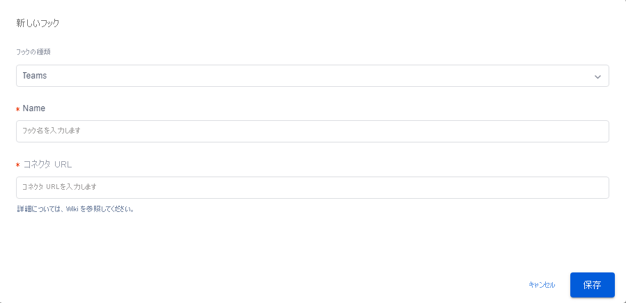 

**手順 3.** アラート構成に Teams フックを適用する

オンボードしたデータ フィードのいずれかを選択します。 フィード内のメトリックを選択し、メトリックの詳細ページを開きます。 [アラート構成] を作成して、検出された異常にサブスクライブし、Teams チャンネルを通じて通知することができます。 

[+] ボタンを選択して作成したフックを選択し、他のフィールドに入力して [保存] を選択します。 これで、Teams フックをアラート構成に適用するための準備が整いました。 新たな異常が発生した場合は、Teams チャンネルを通じて通知されます。

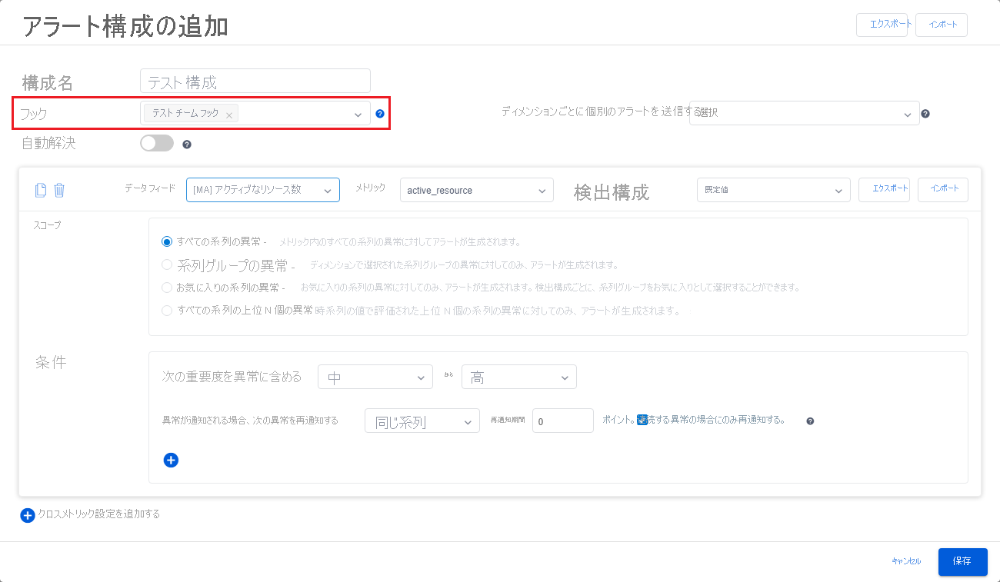


#### <a name="smtp-e-mail"></a>[SMTP 電子メール](#tab/smtp)

### <a name="send-email-notification-by-configuring-an-smtp-server"></a>SMTP サーバーを構成して電子メール通知を送信する

このセクションでは、SMTP サーバーを使用して、検出された異常に関する電子メール通知を送信する方法について説明します。 使用可能な SMTP サーバーがあり、アカウント名やパスワードなどのパラメーターを取得するための十分な権限があることを確認してください。

**手順 1.** アカウントを [Cognitive Service Metrics Advisor 管理者] ロールに割り当てる  

- サブスクリプション管理者またはリソース グループ管理者の権限を持つユーザーが、Azure portal で作成された Metrics Advisor リソースに移動し、アクセス制御 (IAM) タブを選択する必要があります。
- [ロールの割り当ての追加] を選択します。
- [Cognitive Services Metrics Advisor 管理者] のロールを選択し、下の画像のように自分のアカウントを選択します。
- [保存] ボタンを選択すると、Metrics Advisor リソースの管理者として正常に追加されます。 上記のアクションはすべて、サブスクリプション管理者またはリソース グループ管理者が実行する必要があります。 アクセス許可が反映されるまでに最大で 1 分かかる場合があります。 


**手順 2.** Metrics Advisor ワークスペースで SMTP サーバーを構成する

上記の手順を完了し、Metrics Advisor リソースの管理者として正常に追加されます。 アクセス許可が反映されるまで、数分間待機します。 次に Metrics Advisor ワークスペースにサインインすると、左側のナビゲーション パネルに [電子メール設定] という名前の新しいタブが表示されています。 それを選択し、構成を続行します。 

入力するパラメーター: 

- SMTP サーバー名 (**必須**): SMTP サーバー プロバイダーの名前を入力します。ほとんどのサーバー名は [smtp.domain.com] または [mail.domain.com] の形式で記述されます。 例として、Office 365 を使用する場合は、[smtp.office365.com] に設定する必要があります。 
- SMTP サーバー ポート (**必須**): ポート 587 は、現代の Web における SMTP 送信の既定のポートです。 他のポートを使用して送信することもできますが (詳細は後述します)、常にまずはポート 587 を既定として使用し、状況 (何らかの理由でポート 587 がホストでブロックされている場合など) に応じて、他のポートを使用するようにしてください。
- 電子メール送信者 (**必須**): これは、電子メールの送信を行う実際の電子メール アカウントです。 送信者のアカウント名とパスワードの入力が必要な場合があります。 1 つのアカウントに対して、1 分以内に送信されるアラート 電子メールの最大数のクォータしきい値を設定できます。 1 分間に送信されるアラートが大量になる可能性がある場合は複数の送信者を設定できますが、少なくとも 1 つのアカウントを設定する必要があります。 
- 代理送信 (省略可能): 複数の送信者を構成しているが、アラート 電子メールが 1 つのアカウントから送信されているように見せたい場合。 このフィールドを使用して、これらを調整することができます。 ただし、アカウントに代わって電子メールを送信することを許可するために、送信者にアクセス許可を付与する必要がある場合があります。  
- 既定の CC (省略可能): すべての電子メール アラートに CC として追加する既定の電子メールアドレスを設定します。 

構成された SMTP サーバーの例を次に示します。

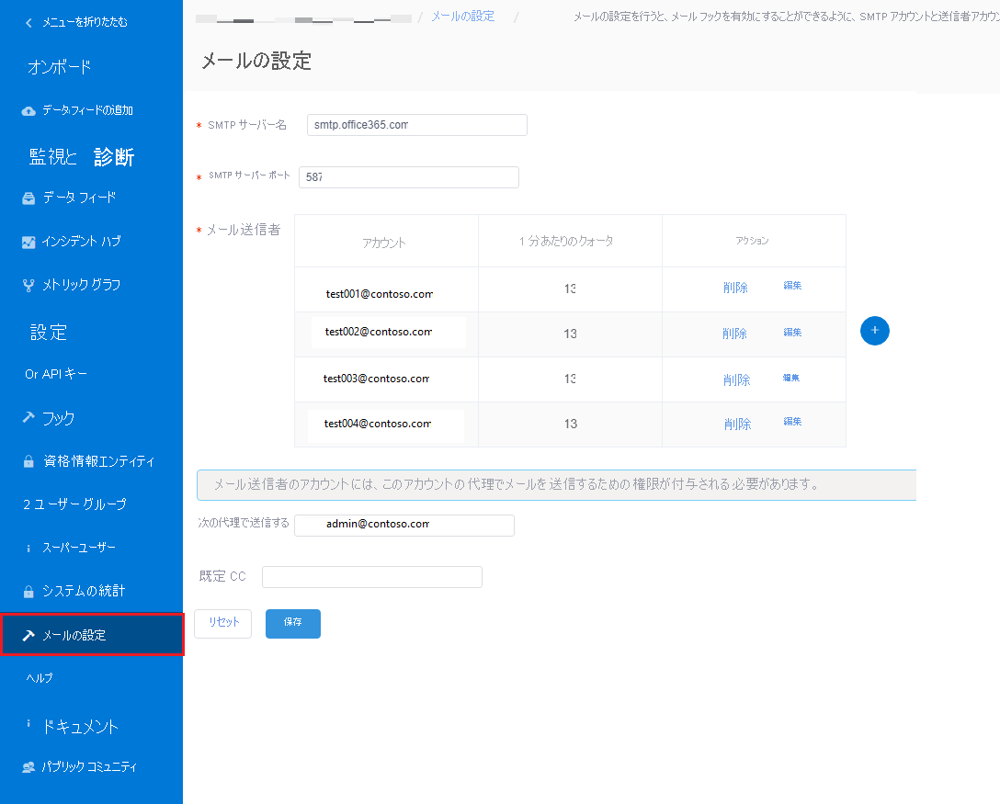

**手順 3.** Metrics Advisor で電子メール フックを作成する

SMTP サーバーの設定に成功したら、Metrics Advisor の [フック] タブで [電子メール フック] を作成する準備が整いました。 [電子メール フック] の作成の詳細については、[アラートに関する記事](../how-tos/alerts.md#email-hook)を参照し、手順に従って完了してください。

**ステップ 4.** アラート構成に電子メール フックを適用する

 オンボードしたデータ フィードの内 1 つを選択し、フィード内のメトリックを選択して、メトリックの詳細ページを開きます。 [アラート構成] を作成して、検出された電子メールで送信された異常にサブスクライブできます。 

[+] ボタンを選択して作成したフックを選択し、他のフィールドに入力して [保存] を選択します。 これで、カスタム アラート構成が行われた電子メール フックの設定が完了しました。これで、SMTP サーバーを使用し、フックを通じて新しい異常がエスカレートされるようになります。 

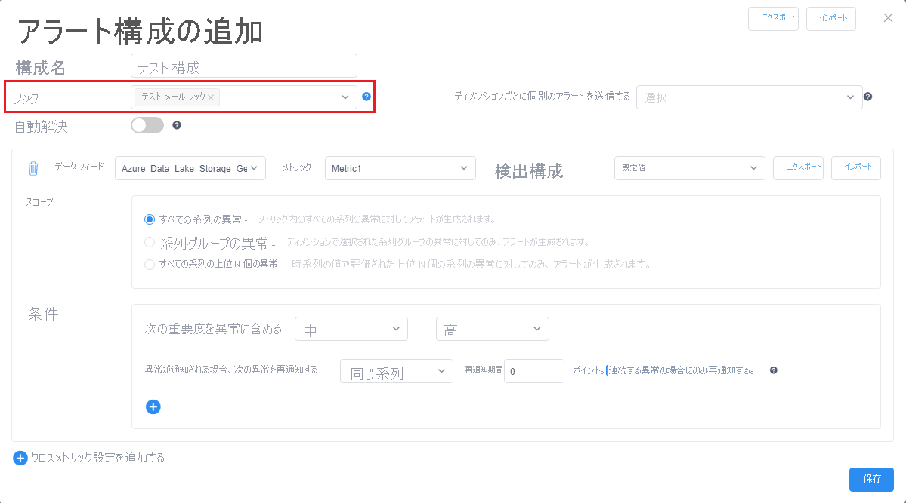

---

## <a name="next-steps"></a>次のステップ

次の記事に進み、作成方法を確認します。
> [!div class="nextstepaction"]
> [有効なクエリを作成する](write-a-valid-query.md)

<!--
Remove all the comments in this template before you sign-off or merge to the 
main branch.
-->
