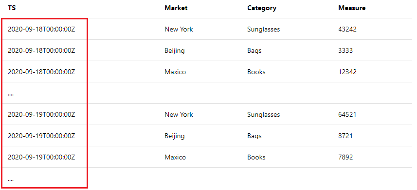
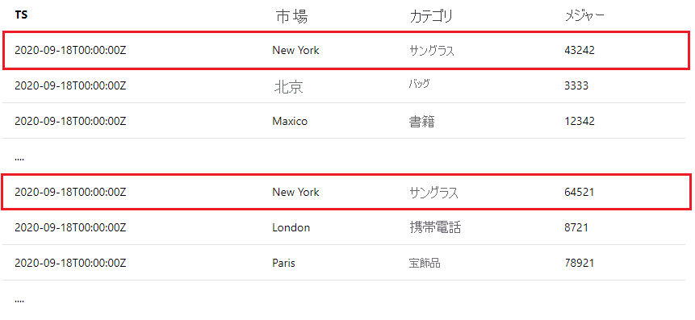

<!--
Remove all the comments in this template before you sign-off or merge to the 
main branch.
-->

<!--
This template provides the basic structure of a tutorial article.
See the [tutorial guidance](contribute-how-to-mvc-tutorial.md) in the contributor guide.

To provide feedback on this template contact 
[the templates workgroup](mailto:templateswg@microsoft.com).
-->

<!-- 1. H1 
Required. Start with "Tutorial: ". Make the first word following "Tutorial: " a 
verb.
-->

# <a name="tutorial-write-a-valid-query-to-onboard-metrics-data"></a>チュートリアル: メトリック データをオンボードするための有効なクエリを作成する

<!-- 2. Introductory paragraph 
Required. Lead with a light intro that describes, in customer-friendly language, 
what the customer will learn, or do, or accomplish. Answer the fundamental “why 
would I want to do this?” question. Keep it short.
-->


<!-- 3. Tutorial outline 
Required. Use the format provided in the list below.
-->

このチュートリアルでは、次の作業を行う方法について説明します。

> [!div class="checklist"]
> * 有効なデータ オンボード クエリを作成する方法
> * 一般的なエラーとその回避方法

<!-- 4. Prerequisites 
Required. First prerequisite is a link to a free trial account if one exists. If there 
are no prerequisites, state that no prerequisites are needed for this tutorial.
-->

## <a name="prerequisites"></a>前提条件

### <a name="create-a-metrics-advisor-resource"></a>Metrics Advisor リソースを作成する

Metrics Advisor の機能を利用するには、Azure portal で <a href="https://go.microsoft.com/fwlink/?linkid=2142156"  title="Metrics Advisor リソースを作成する"  target="_blank">Metrics Advisor リソースを作成して</a>、Metrics Advisor インスタンスをデプロイする必要があります。

<!-- 5. H2s
Required. Give each H2 a heading that sets expectations for the content that follows. 
Follow the H2 headings with a sentence about how the section contributes to the whole.
-->

## <a name="data-schema-requirements"></a>データ スキーマの要件
<!-- Introduction paragraph -->

[!INCLUDE [data schema requirements](../includes/data-schema-requirements.md)]


## <a name="span-idingestion-workhow-does-data-ingestion-work-in-metrics-advisorspan"></a><span id="ingestion-work">Metrics Advisor でのデータ インジェストのしくみ</span>

メトリックを Metrics Advisor にオンボードする場合、一般に次の 2 つの方法があります。
<!-- Introduction paragraph -->
- メトリックを予想されるスキーマに事前に集計し、データを特定のファイルに格納します。 オンボード中にパス テンプレートを入力すると、Metrics Advisor によりパスから新しいファイルが継続的に取得され、メトリックに対して検出が実行されます。 これは、Azure Data Lake や Azure Blob Storage のようなデータ ソースに対する一般的な方法です。
- Azure SQL Server、Azure Data Explorer、クエリ スクリプトの使用をサポートしているその他のソースなどのデータ ソースからデータを取り込む場合は、クエリが適切に構築されていることを確認する必要があります。 この記事では、メトリック データを想定どおりにオンボードする有効なクエリを作成する方法について説明します。 


### <a name="what-is-an-interval"></a>間隔とは

メトリックは、ビジネス要件に応じて特定の細分性で監視する必要があります。 たとえば、ビジネスの主要業績評価指標 (KPI) は、日単位の細分性で監視されます。 ただし、サービス パフォーマンス メトリックは、多くの場合、分単位または時間単位の細分性で監視されます。 そのため、ソースからメトリック データを収集する頻度は異なります。 

Metrics Advisor により各時間間隔で継続的にメトリック データが取得され、**その間隔はメトリックの細分性と等しくなります。** 作成したクエリが Metrics Advisor によって毎回実行され、この特定の間隔でデータが取り込まれます。 このデータ インジェスト メカニズムに基づいて、クエリ スクリプトは **データベースに存在するすべてのメトリック データを返すのではなく、結果を 1 つの間隔に限定する必要があります。**


## <a name="how-to-write-a-valid-query"></a>有効なクエリを作成する方法
<!-- Introduction paragraph -->
### <a name="span-iduse-parameters-use-intervalstart-and-intervalend-to-limit-query-resultsspan"></a><span id="use-parameters">@IntervalStart と @IntervalEnd を使用してクエリ結果を限定する</span>

 これを実現するために、クエリ内で使用する **@IntervalStart** と **@IntervalEnd** という 2 つのパラメーターが用意されています。 

クエリが実行されるたび、@IntervalStart と @IntervalEnd が自動的に最新の間隔のタイムスタンプに更新され、対応するメトリック データが取得されます。 @IntervalEnd は常に @IntervalStart + 1 の細分性で割り当てられます。 

Azure SQL Server でこれら 2 つのパラメーターを適切に使用する例を次に示します。 

```SQL
SELECT [timestampColumnName] AS timestamp, [dimensionColumnName], [metricColumnName] FROM [sampleTable] WHERE [timestampColumnName] >= @IntervalStart and [timestampColumnName] < @IntervalEnd;
```

この方法でクエリ スクリプトを作成することにより、クエリ結果ごとにメトリックのタイムスタンプが同じ間隔に収まります。 Metrics Advisor により、メトリックの細分性に合わせてタイムスタンプが自動的に調整されます。 

### <a name="span-iduse-aggregation-use-aggregation-functions-to-aggregate-metricsspan"></a><span id="use-aggregation">集計関数を使用してメトリックを集計する</span>

顧客のデータ ソース内に多くの列があるのは一般的なケースですが、それらのすべてを監視したり、ディメンションとして含めたりするのに意味があるわけではありません。 顧客は集計関数を使用してメトリックを集計し、意味のある列のみをディメンションとして含めることができます。

次に示す例では、顧客のデータ ソースに 10 を超える列がありますが、その中で意味のある列は数個しかなく、監視するメトリックに含めて集計する必要があります。 

| TS | Market | Device OS | カテゴリ | ... | Measure1 | Measure2 | Measure3 |
| ----------|--------|-----------|----------|-----|----------|----------|----------|
| 2020-09-18T12:23:22Z | ニューヨーク | iOS | サングラス | ...| 43242 | 322 | 54546|
| 2020-09-18T12:27:34Z | 北京 | Android | バッグ | ...| 3333 | 126 | 67677 |
| ...

顧客が **'Measure1'** を **1 時間単位の細分性** で監視したいと考え、ディメンションとして **'Market'** と **'カテゴリ'** を選択した場合、集計関数を適切に使用してこれを実現する方法の例を次に示します。 

- SQL サンプル: 

    ```sql
        SELECT dateadd(hour, datediff(hour, 0, TS),0) as NewTS
        ,Market
        ,Category
        ,sum(Measure1) as M1
        FROM [dbo].[SampleTable] where TS >= @IntervalStart and TS < @IntervalEnd
        group by Market, Category, dateadd(hour, datediff(hour, 0, TS),0)
    ```
- Azure Data Explorer サンプル:

    ```kusto
        SampleTable
        | where TS >= @IntervalStart and TS < @IntervalEnd
        | summarize M1 = sum(Measure1) by Market, Category, NewTS = startofhour(TS)
    ```    

> [!Note]
> 上記の場合、顧客は 1 時間単位の細分性でメトリックを監視したいと考えていますが、生のタイムスタンプ (TS) は調整されていません。 集計ステートメント内で、時間を合わせて、'NewTS' という新しいタイムスタンプ列を生成するように、**タイムスタンプの処理を行う必要があります**。 


## <a name="common-errors-during-onboarding"></a>オンボード中の一般的なエラー

- **エラー:** クエリ結果に複数のタイムスタンプ値が見つかりました

    これは、クエリ結果を 1 つの間隔で限定していない場合に発生する一般的なエラーです。 たとえば、日単位の細分性でメトリックを監視していて、クエリから次のような結果が返された場合、このエラーが発生します。 

    
    
    複数のタイムスタンプ値が含まれていますが、それらは同じメトリック間隔 (1 日) 内ではありません。 「[Metrics Advisor でのデータ インジェストのしくみ](#ingestion-work)」を確認し、Metrics Advisor がメトリック間隔ごとにメトリック データを取り込むことを理解してください。 その後、クエリで **@IntervalStart** と **@IntervalEnd** を使用して、1 つの間隔内に結果を限定してください。 詳細なガイダンスとサンプルについては、「[@IntervalStart と @IntervalEnd を使用してクエリ結果を限定する](#use-parameters)」を参照してください。 


- **エラー:** 1 つのメトリック間隔内に同じディメンションの組み合わせで重複するメトリック値が見つかりました
    
    1 つの間隔内では、Metrics Advisor は同じディメンションの組み合わせに対して 1 つのメトリック値しか含めることができません。 たとえば、日単位の細分性でメトリックを監視していて、クエリから次のような結果が返された場合、このエラーが発生します。

    

    詳細なガイダンスとサンプルについては、「[集計関数を使用してメトリックを集計する](#use-aggregation)」を参照してください。 

<!-- 7. Next steps
Required: A single link in the blue box format. Point to the next logical tutorial 
in a series, or, if there are no other tutorials, to some other cool thing the 
customer can do. 
-->

## <a name="next-steps"></a>次のステップ

次の記事に進み、作成方法を確認します。
> [!div class="nextstepaction"]
> [異常通知を有効にする](enable-anomaly-notification.md)

<!--
Remove all the comments in this template before you sign-off or merge to the 
main branch.
