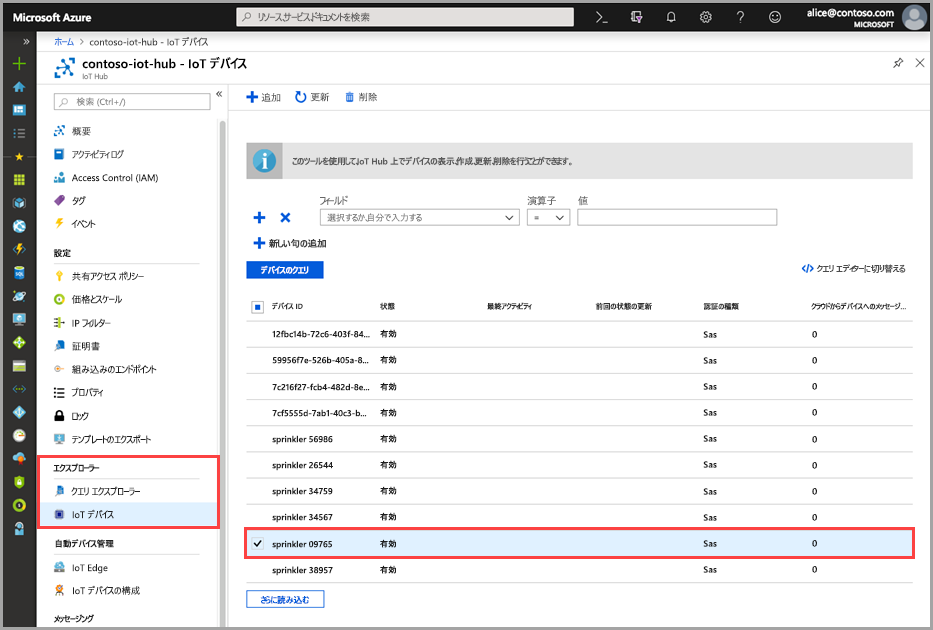
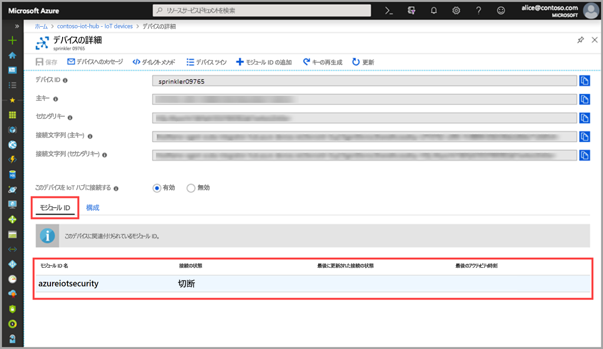

# クイック スタート:azureiotsecurity モジュール ツインを作成する

このクイックスタートでは、新しいデバイス用に個々の _azureiotsecurity_ モジュール ツインを作成する方法と、IoT Hub 内のすべてのデバイス用にモジュール ツインをバッチ作成する方法について説明します。  

## azureiotsecurity モジュール ツインについて 

Azure に構築された IoT ソリューションでは、デバイス ツインが、デバイスの管理とプロセスの自動化の両方で主要な役割を果たします。 

Azure Security Center for IoT は、既存の IoT デバイス管理プラットフォームと完全に統合されるため、デバイスのセキュリティ状態を管理したり、既存のデバイス制御機能を利用したりすることができます。
Azure Security Center for IoT の統合は、IoT Hub ツイン メカニズムを利用することによって実現されます。  

Azure IoT Hub でのモジュール ツインの一般的な概念の詳細については、[IoT Hub モジュール ツイン](https://docs.microsoft.com/azure/iot-hub/iot-hub-devguide-module-twins)に関するページを参照してください。 
 
Azure Security Center for IoT では、モジュール ツイン メカニズムを利用して、各デバイス用の _azureiotsecurity_ というセキュリティ モジュール ツインが管理されます。

セキュリティ モジュール ツインでは、各デバイスのデバイス セキュリティに関連するすべての情報が保持されます。 
 
Azure Security Center for IoT の機能を最大限に活用するには、サービス内のすべてのデバイスに対してこれらのセキュリティ モジュール ツインを作成、構成、および使用する必要があります。  

## azureiotsecurity モジュール ツインを作成する 

_azureiotsecurity_ モジュール ツインは、次の 2 つの方法で作成できます。
1. [モジュール バッチ スクリプト](https://aka.ms/iot-security-github-create-module) - 既定の設定を使用して、新しいデバイスまたはモジュール ツインのないデバイス用にモジュール ツインを自動的に作成します。
2. 各デバイス用の特定の構成を使用して、各モジュール ツインを個別に手動で編集します。

>[!NOTE] 
> バッチ方式を使用しても、既存の azureiotsecurity モジュール ツインは上書きされません。 バッチ方式を使用すると、まだセキュリティ モジュール ツインがないデバイス用の新しいモジュール ツインのみが作成されます。 

既存のモジュール ツインの構成を変更する方法については、[エージェントの構成](how-to-agent-configuration.md)に関するページを参照してください。 

デバイス用の新しい _azureiotsecurity_ モジュール ツインを手動で作成するには、次の手順を使用します。 

1. IoT Hub で、セキュリティ モジュール ツインの作成対象のデバイスを探して選択します。
1. デバイスをクリックし、 **[モジュール ID の追加]** をクリックします。
1. **[モジュール ID 名]** フィールドで、「**azureiotsecurity**」と入力します。

1. **[保存]** をクリックします。 

## モジュール ツインの作成の確認

特定のデバイスのセキュリティ モジュール ツインが存在するかどうかを確認するには、以下の操作を行います。

1. Azure IoT Hub で、 **[エクスプローラー]** メニューの **[IoT デバイス]** を選択します。    
1. デバイス ID を入力するか、 **[デバイスのクエリ] フィールド**のオプションを選択して、 **[デバイスのクエリ]** をクリックします。 
    
1. デバイスを選択するか、またはダブルクリックして、[デバイスの詳細] ページを開きます。 
1. **[モジュール ID]** メニューを選択し、デバイスに関連付けられているモジュール ID の一覧に **azureiotsecurity** モジュールが存在することを確認します。 
    

Azure Security Center for IoT モジュール ツインのプロパティに対するカスタマイズの詳細については、[エージェントの構成](how-to-agent-configuration.md)に関するページを参照してください。

## 次のステップ

次の記事に進んで、カスタム アラートの構成方法を学習してください。

> [!div class="nextstepaction"]
> [カスタム アラートを構成する](quickstart-create-custom-alerts.md)
