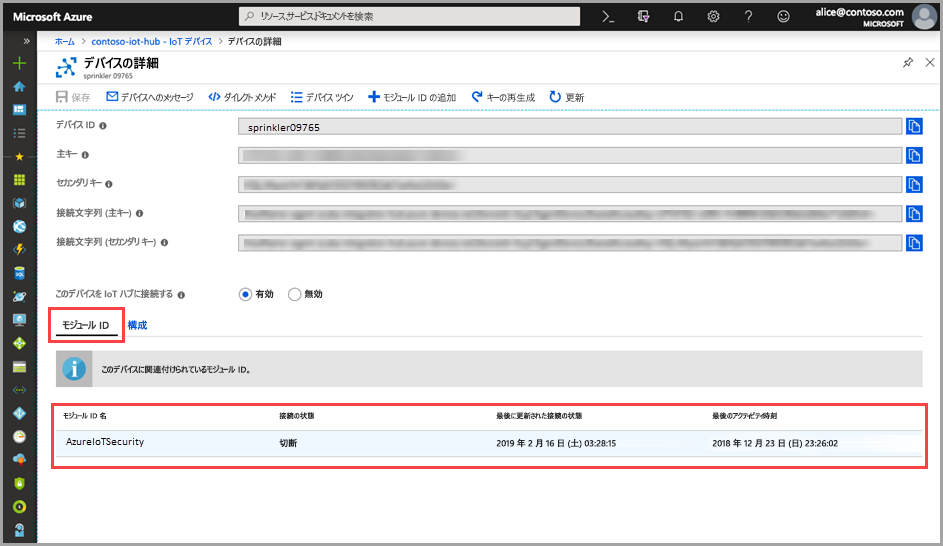

# クイック スタート:ASC for IoT モジュール ツインを作成する

> [!IMPORTANT]
> ASC for IoT は現在、パブリック プレビュー段階です。 このプレビュー バージョンはサービス レベル アグリーメントなしで提供されています。運用環境のワークロードに使用することはお勧めできません。 特定の機能はサポート対象ではなく、機能が制限されることがあります。 詳しくは、[Microsoft Azure プレビューの追加使用条件](https://azure.microsoft.com/support/legal/preview-supplemental-terms/)に関するページをご覧ください。

このクイック スタートでは、新しいデバイス用に個々の ASC for IoT モジュール ツインを作成する方法と、IoT Hub 内のすべてのデバイス用にモジュール ツインをバッチ作成する方法について説明します。  

## ASC for IoT モジュール ツインについて 

Azure に構築された IoT ソリューションで、デバイス ツインは、デバイスの管理とプロセスの自動化の両方で主要な役割を果たします。 

ASC for IoT は、既存の IoT デバイス管理プラットフォームと完全に統合されるため、デバイスのセキュリティ状態を管理したり、既存のデバイス制御機能を利用したりすることができます。 ASC for IoT の統合は、IoT Hub ツイン メカニズムを利用することによって実現されます。  

Azure IoT Hub でのモジュール ツインの一般的な概念の詳細については、[IoT Hub モジュール ツイン](https://docs.microsoft.com/azure/iot-hub/iot-hub-devguide-module-twins)に関するページを参照してください。 
 
ASC for IoT では、モジュール ツイン メカニズムを利用して、各デバイス用のセキュリティ モジュール ツインが管理されます。 セキュリティ モジュール ツインでは、各デバイスのデバイス セキュリティに関連するすべての情報が保持されます。 
 
ASC for IoT の機能を最大限に活用するには、サービス内のすべてのデバイスに対してこれらのセキュリティ モジュール ツインを作成、構成、および使用する必要があります。  

## ASC for IoT モジュール ツインの作成 

ASC for IoT モジュール ツインは、既定の構成を使用してバッチ モードで作成することも、デバイスごとに特定の構成で個別に作成することもできます。 新しいデバイス用またはモジュール ツインのないデバイス用にバッチ作成するには、[モジュール バッチ スクリプト](https://aka.ms/iot-security-github-create-module)を使用します。 

>[!NOTE] 
> バッチ方式を使用しても、既存のモジュール ツインは上書きされません。 バッチ方式を使用すると、まだモジュール ツインがないデバイス用の新しいモジュール ツインのみが作成されます。 

既存のモジュール ツインの構成を変更する方法については、「[Modify a security module twin (セキュリティ モジュール ツインの変更)](how-to-modify-security-module-twin.md)」を参照してください。 

デバイス用の新しい ASC for IoT モジュール ツインを作成するには、次の手順を使用します。 

1. IoT Hub で、セキュリティ モジュール ツインの作成対象のデバイスを探して選択します。 
1. **[Microsoft Identity Name]\(Microsoft ID 名\)** フィールドで、「**ascforiotsecurity**」と入力します。
1. **[Save]** をクリックします。 

## モジュール ツインの作成の確認

特定のデバイスのセキュリティ モジュール ツインが存在するかどうかを確認するには、以下の操作を行います。

1. Azure IoT Hub で、**[エクスプローラー]** メニューの **[IoT デバイス]** を選択します。    
1. デバイス ID を入力するか、**[デバイスのクエリ] フィールド**のオプションを選択して、**[デバイスのクエリ]** をクリックします。 
    
1. デバイスを選択するか、またはダブルクリックして、[デバイスの詳細] ページを開きます。 
1. **[モジュール ID]** メニューを選択し、デバイスに関連付けられているモジュール ID の一覧で、**ascforiotsecurity** モジュールが存在することと、**[接続状態]** が **[接続中]** であることを確認してください。 
    

ASC for IoT モジュール ツインのプロパティに対するカスタマイズの詳細については、「[Agent configuration (エージェントの構成)](concept-agent-configuration.md)」を参照してください。

## 次の手順

次の記事に進んで、カスタム アラートの構成方法を学習してください。

> [!div class="nextstepaction"]
> [カスタム アラートを構成する](quickstart-create-custom-alerts.md)
