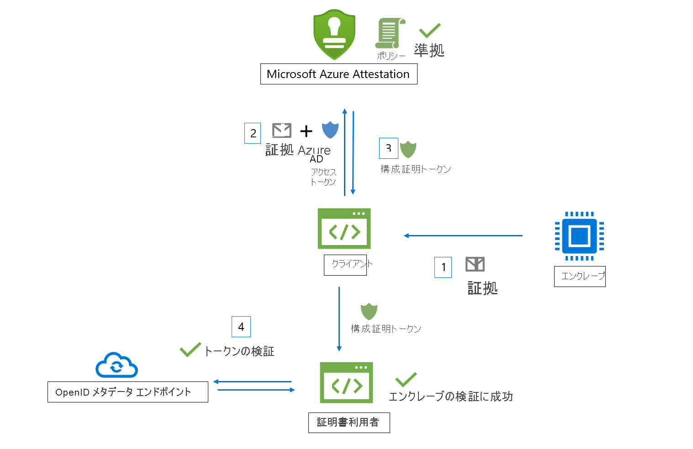
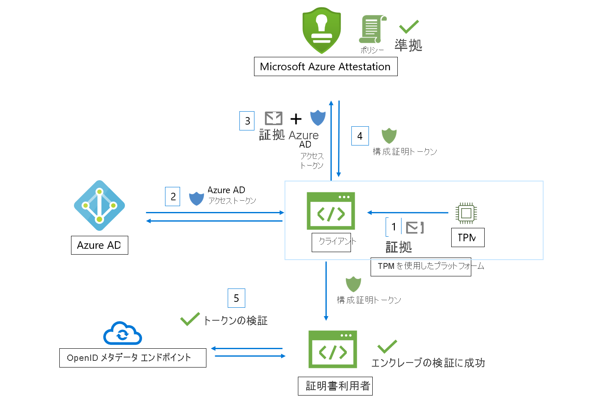

# ワークフロー

Microsoft Azure Attestation は、エンクレーブから証拠を受け取り、それを Azure セキュリティ ベースラインおよび構成可能なポリシーに照らして評価します。 検証に成功すると、エンクレーブの信頼性を裏付ける構成証明トークンが Azure Attestation によって生成されます。

Azure Attestation のワークフローに関係するアクターは次のとおりです。

- **証明書利用者**: Azure Attestation を利用してエンクレーブの信頼性を検証するコンポーネントです。 
- **クライアント**: エンクレーブから情報を収集して Azure Attestation に要求を送信するコンポーネントです。 
- **Azure Attestation**: クライアントからエンクレーブの証拠を受け取ってそれを検証し、構成証明トークンをクライアントに返すコンポーネントです。

## Intel® Software Guard Extensions (SGX) エンクレーブ検証ワークフロー

Azure Attestation を使用した標準的な SGX エンクレーブ構成証明ワークフローの大まかなステップは次のとおりです。

1. クライアントがエンクレーブから証拠を収集します。 証拠とは、エンクレーブ環境に関する情報とエンクレーブ内で実行されているクライアント ライブラリに関する情報です。
1. クライアントは、Azure Attestation のインスタンスを参照する URI を把握しています。 クライアントは Azure Attestation に証拠を送信します。 プロバイダーに送信される厳密な情報は、エンクレーブのタイプによって異なります。
1. Azure Attestation が、送信された情報を検証し、それを構成済みのポリシーに照らして評価します。 検証に成功した場合、Azure Attestation が構成証明トークンを発行してクライアントに返します。 このステップに失敗した場合、Azure Attestation からクライアントにエラーがレポートされます。 
1. クライアントが証明書利用者に構成証明トークンを送信します。 証明書利用者が Azure Attestation の公開キー メタデータ エンドポイントを呼び出して署名証明書を取得します。 その後、証明書利用者は、構成証明トークンの署名を検証してエンクレーブの信頼性を保証します。 

> [!Note]
> [2018-09-01-preview](https://github.com/Azure/azure-rest-api-specs/tree/master/specification/attestation/data-plane/Microsoft.Attestation/stable/2018-09-01-preview) API バージョンで構成証明要求を送信する場合、クライアントは Azure AD アクセス トークンと共に証拠を Azure Attestation に送信する必要があります。

## トラステッド プラットフォーム モジュール (TPM) のエンクレーブ検証ワークフロー

Azure Attestation を使用した標準的な TPM エンクレーブ構成証明ワークフローの大まかなステップは次のとおりです。

1.  デバイスまたはプラットフォームのブート時に、TPM によって裏付けられたイベントが各種のブート ローダーとブート サービスによって測定され、安全に格納されます (TCG ログ)。
2.  クライアントが、構成証明の証拠の役割を果たす TPM のクォートとデバイスから TCG ログを収集します。
3.  クライアントは、Azure Attestation のインスタンスを参照する URI を把握しています。 クライアントは Azure Attestation に証拠を送信します。 プロバイダーに送信される厳密な情報はプラットフォームによって異なります。
4.  Azure Attestation が、送信された情報を検証し、それを構成済みのポリシーに照らして評価します。 検証に成功した場合、Azure Attestation が構成証明トークンを発行してクライアントに返します。 このステップに失敗した場合、Azure Attestation からクライアントにエラーがレポートされます。 クライアントと構成証明サービスとの間の通信は、Azure Attestation の TPM プロトコルによって規定されます。
5.  その後、クライアントが証明書利用者に構成証明トークンを送信します。 証明書利用者が Azure Attestation の公開キー メタデータ エンドポイントを呼び出して署名証明書を取得します。 その後、証明書利用者は、構成証明トークンの署名を検証してプラットフォームの信頼性を保証します。

## 次のステップ
- [構成証明ポリシーを作成して署名する方法](author-sign-policy.md)
- [PowerShell を使用して Azure Attestation を設定する](quickstart-powershell.md)
