<properties
	pageTitle="Azure Automation の概要 | Microsoft Azure"
	description="Azure でオートメーション ジョブをインポートして実行する方法について説明します。"
	services="automation"
	documentationCenter=""
	authors="bwren"
	manager="stevenka"
	editor=""/>

<tags
	ms.service="automation"
	ms.workload="tbd"
	ms.tgt_pltfrm="na"
	ms.devlang="na"
	ms.topic="hero-article" 
	ms.date="09/08/2015"
	ms.author="bwren"/>

# Azure オートメーションの使用

## Azure Automation とは

ユーザーは Microsoft Azure オートメーションを使用すると、クラウド環境で一般的に実行される、手動で実行時間が長く、エラーが起こりやすく、頻繁に繰り返されるタスクを自動化する手段を入手できます。You can create, monitor, manage, and deploy resources in your Azure environment using runbooks, which are based on Windows PowerShell workflows.In this article, you will go through a tutorial for running a simple example runbook.次に、サービスのより高度な機能を探るためのリソースを紹介します。

## チュートリアル
このチュートリアルでは、オートメーション アカウントを作成し、Azure Automation にサンプルの「Hello World」Runbook をインポートし、その Runbook を実行して、出力を表示する手順について説明します。

このチュートリアルを完了するには、Azure サブスクリプションが必要です。まだお持ちでない場合は、[MSDN サブスクライバーの特典を有効にする](../pricing/member-offers/msdn-benefits-details/)か、[無料評価版にサインアップ](../pricing/free-trial.md)</a>してください。

[AZURE.INCLUDE [automation-note-authentication](../../includes/automation-note-authentication.md)]

## ビデオ チュートリアル

以下は、このチュートリアルのガイドです。

[AZURE.VIDEO get-started-with-azure-automation]

## オートメーション アカウントの作成

オートメーション アカウントは、Azure Automation リソースのコンテナーで、環境の分離や、ワークフローの詳細な整理のための方法を提供します。詳細については、Automation ライブラリの「[Automation アカウント](http://aka.ms/runbookauthor/azure/automationaccounts)」を参照してください。オートメーション アカウントを既に作成している場合は、次の手順を省略できます。

1.	[Azure ポータル](http://manage.windowsazure.com)にログインします。

2.	Azure ポータルで、**[オートメーション アカウントの作成]** をクリックします。

	

3.	**[新しいオートメーション アカウントの追加]** ページで、名前を入力し、アカウントのリージョンを選択します。リージョンでは、アカウントの Automation リソースが格納される場所を指定します。This will not affect the functionality of your account, but your runbooks may execute faster if your account region is near where your other Azure resources are stored.準備ができたら、チェック マークをクリックします。

	

## Runbook ギャラリーからの Runbook のインポート

[Runbook ギャラリー](http://aka.ms/runbookgallery)には、Azure Automation アカウントに直接インポートできるサンプルの Runbook が含まれており、これによって、他の Azure Automation および PowerShell ユーザーの作業を活用できます。この手順では、ギャラリーを使用して「Hello World」サンプル Runbook をインポートします。

4.	**[オートメーション]** ページで、作成した新しいアカウントをクリックします。

	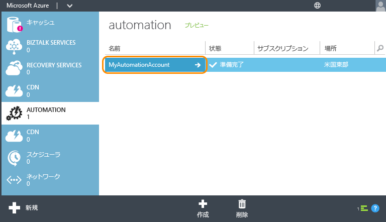

5.	**[Runbook]** をクリックします。

	![[Runbook] タブ](./media/automation-create-runbook-from-samples/automation_04_RunbooksTab.png)

6.	**[新規]** > **[Runbook]** > **[ギャラリーから]** の順にクリックします。

	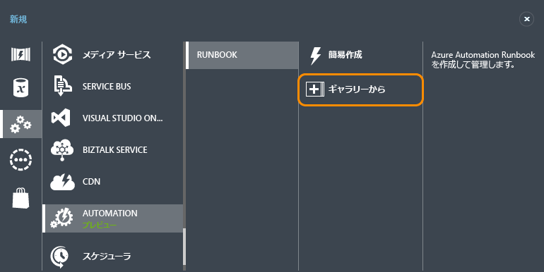

7.  **[チュートリアル]** カテゴリを選択し、**[Hello World for Azure Automation]** を選択します。右矢印ボタンをクリックします。

	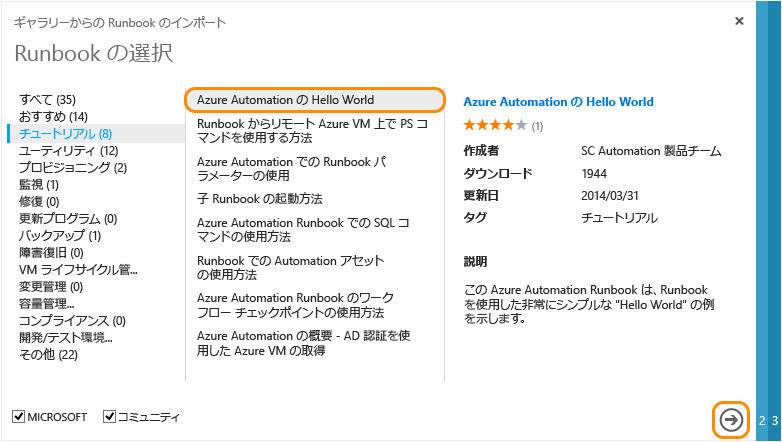

8.  Runbook の内容を確認し、右矢印ボタンをクリックします。

	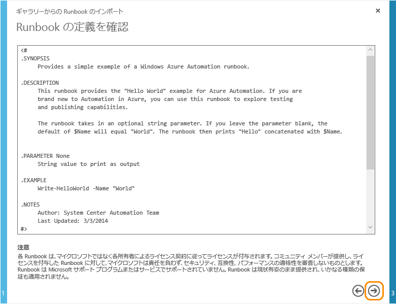

8.	Runbook の詳細を確認し、チェック マーク ボタンをクリックします。

	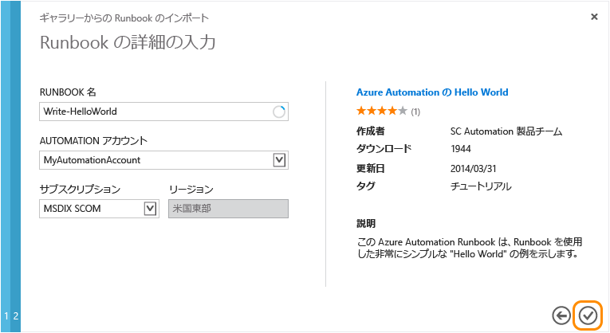

## Runbook の発行

Runbook は、まずドラフト モードでインポートされます。This means you can continue to do work on it before authorizing it as a new version that can be run.このサンプルの Runbook は追加の構成を必要としないため、そのまますぐに発行できます。詳細については、「[Runbook の発行](http://aka.ms/runbookauthor/azure/publishrunbook)」を参照してください。

9.	Runbook のインポートが完了したら、**[Write-HelloWorld]** をクリックします。

	

9.	**[作成者]** をクリックし、**[ドラフト]** をクリックします。

	ドラフト モードでは、Runbook の内容を変更できます。この Runbook に対して、どのような変更も加える必要はありません。

	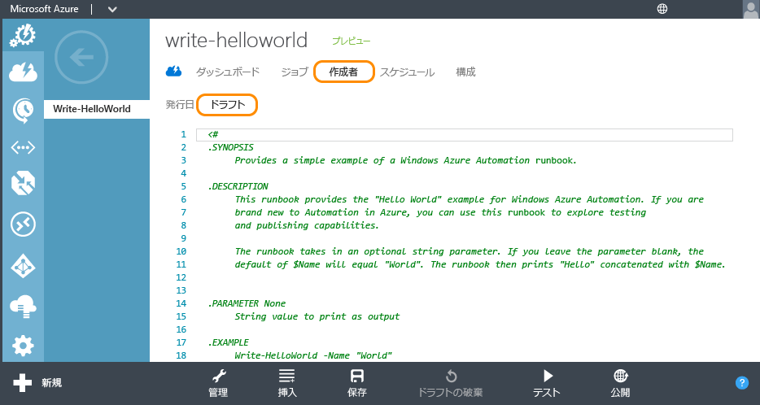

10.	**[発行]** をクリックして Runbook を昇格し、運用環境で使用する準備をします。

	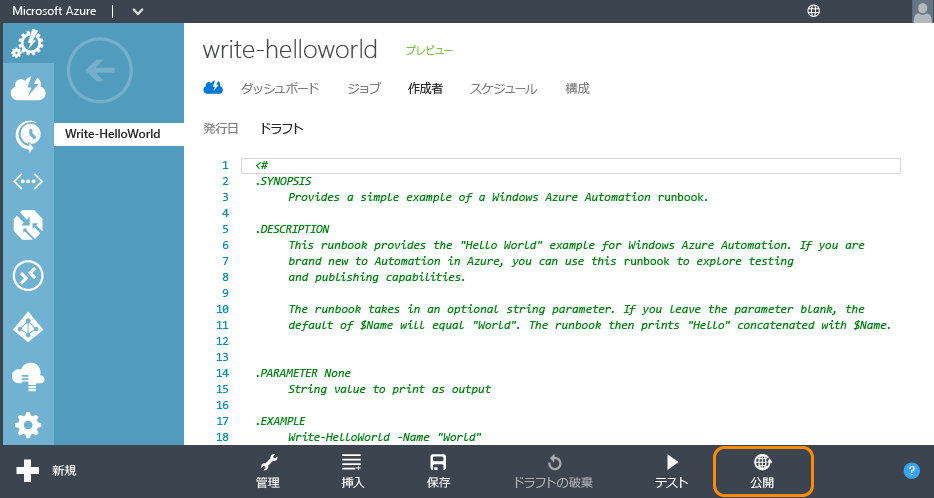

11.	確認を求められたら、**[はい]** をクリックします。

	

## Runbook の開始

Runbook をインポートし、発行したら、それを実行して、出力を調べます。詳細については、「[Runbook の開始](http://aka.ms/runbookauthor/azure/startrunbook)」および「[Runbook の出力とメッセージ](http://aka.ms/runbookauthor/azure/runbookoutput)」を参照してください。

12.	**[Write-HelloWorld]** の Runbook が開いた状態で **[開始]** をクリックします。

	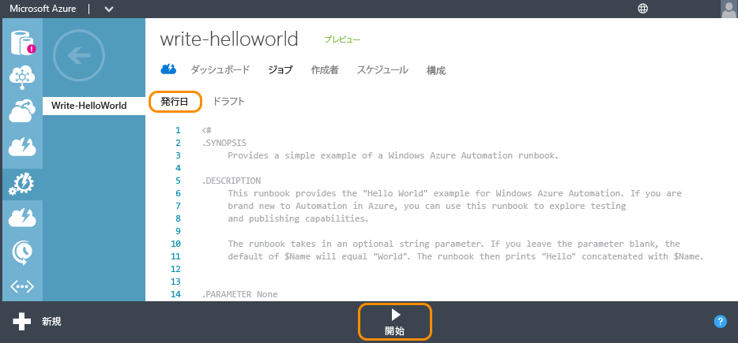

13.	**[Runbook パラメーターの値を指定します]**ページで、Write-HelloWorld.ps1 スクリプトの入力パラメーターとして使用される **[名前]** を入力し、チェック マークをクリックします。

	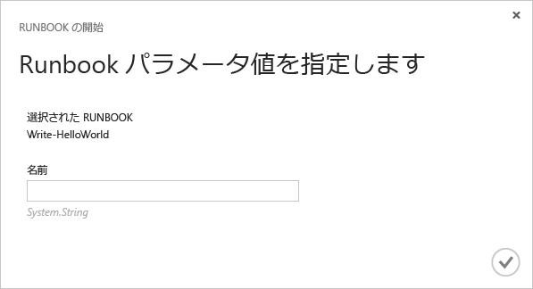

14.	**[ジョブ]** をクリックして、開始した Runbook ジョブの状態を確認し、**[ジョブ開始]** 列にあるタイムスタンプをクリックしてジョブの概要を表示します。

	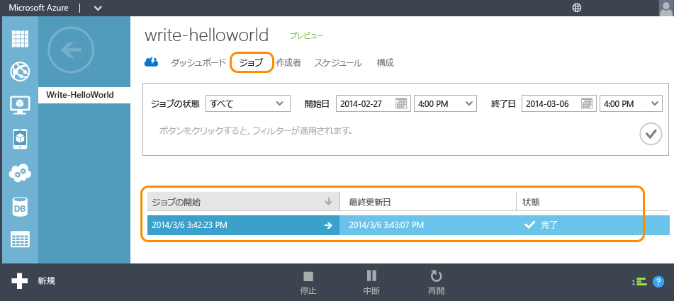

15.	**[概要]** ページで、ジョブの概要、入力パラメーター、出力を表示できます。

	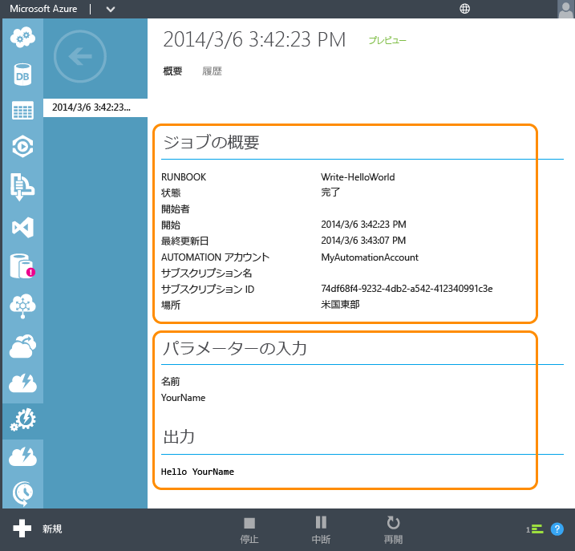

ご利用ありがとうございます。 チュートリアルが完了しました。

## 次のステップ
1. このチュートリアルの単純な Runbook では、*Azure サービスを管理できません*。ほとんどの Runbook では [Azure コマンドレット](http://msdn.microsoft.com/library/jj156055.aspx)を使ってこれを行います。このためには、Azure サブスクリプションに対する認証が必要です。「[Runbook での管理用の Azure の構成](http://aka.ms/azureautomationauthentication)」の手順に従って、Azure サブスクリプションをこれらのコマンドレットを操作するように構成します。  
2. Azure Automation の機能の詳細については、以下に示された[リソース](#resources)を参照してください。
3. [Azure Automation ブログ](http://azure.microsoft.com/blog/tag/azure-automation)をサブスクライブすると、Azure Automation チームにより常に最新の情報を把握できます。

## リソース

その他にも、Azure Automation や、独自の Runbook の作成方法の詳細を確認できる多数のリソースが用意されています。

- [Azure Automation ライブラリ](http://go.microsoft.com/fwlink/p/?LinkId=392860)では、Azure Automation の構成や管理、また独自の Runbook の作成に関する完全なドキュメントもご利用いただけます。
- [Azure PowerShell コマンドレット](http://msdn.microsoft.com/library/jj156055.aspx)では、Windows PowerShell を使用した Azure のオートメーション操作に関する情報が提供されます。Runbook ではこれらのコマンドレットを使用して Azure リソースを操作します。
- [Azure Automation ブログ](http://azure.microsoft.com/blog/tag/azure-automation)には、マイクロソフトからの Azure Automation に関する最新の情報が掲載されています。
- [Automation フォーラム](http://go.microsoft.com/fwlink/p/?LinkId=390561)では Azure Automation に関する質問を投稿でき、マイクロソフトや Automation コミュニティから回答を取得できます。

## サンプル Runbook とユーティリティ Runbook

マイクロソフトおよび Azure Automation コミュニティが提供するサンプル Runbook を使うと、独自のソリューションを作成できます。また、ユーティリティ Runbook は大きめのオートメーション タスクの構成ブロックとして使用できます。これらの Runbook は[スクリプト センター](http://azure.microsoft.com/documentation/scripts/)からダウンロードするか、[Runbook ギャラリー](http://aka.ms/runbookgallery)を使用して Azure Automation に直接インポートできます。

## フィードバック

**フィードバックの送信** Azure Automation の Runbook ソリューションや統合モジュールを探索している場合は、スクリプト センターにスクリプトの要求を投稿することができます。Azure Automation に関するフィードバックや機能に関するご要望は、[User Voice](http://feedback.windowsazure.com/forums/34192--general-feedback) にお寄せください。よろしくお願いいたします。

<!---HONumber=Sept15_HO4-->