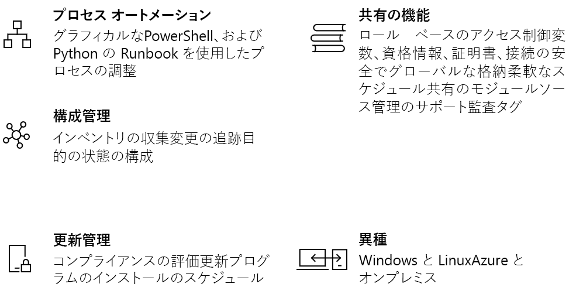

# Azure Automation の概要

Azure Automation は、Azure 環境と非 Azure 環境を一貫性をもって管理するクラウド ベースのオートメーションと構成サービスを提供します。 それは、プロセスの自動化、更新の管理、および構成機能で構成されます。 Azure Automation は、ワークロードとリソースの展開、運用、および使用停止を完全に制御します。
この記事では、Azure Automation の概要を説明し、よく寄せられる質問に回答します。 さまざまな機能の詳細については、この概要に含まれているリンクを参照してください。

## Azure Automation の機能

### プロセスの自動化

Azure Automation は、頻繁に発生し、時間がかかり、エラーが発生しやすいクラウド管理タスクを自動化できるようにします。 この自動化を利用して、ビジネスの価値を高める作業に集中できます。 また、エラーを減らして効率性を向上できるため、運用コストの削減にも役立ちます。 エンドツーエンド プロセスを展開、構成、および管理するために必要な Azure サービスとその他のパブリック システムを統合できます。 このサービスでは、[Runbook の作成](automation-runbook-types.md)をグラフィカルに行うか、PowerShell または Python を使用して実行できます。 ハイブリッド Runbook ワーカーを使用して、オンプレミス環境間で調整することで管理を一元化できます。 [Webhook](automation-webhooks.md) は、要求を実行する方法を提供し、ITSM、DevOps、および監視システムからオートメーションをトリガーすることによって継続的デリバリーと連続動作を保証します。

### 構成管理

Azure Automation [Desired State Configuration](automation-dsc-overview.md) は PowerShell DSC 用のクラウド ベースのソリューションであり、エンタープライズ環境に必要なサービスを備えています。 DSC リソースを Azure Automation で管理し、Azure クラウド内の DSC プル サーバーからの構成を仮想マシンおよび物理コンピューターに適用します。 それは、割り当てられている構成からノードが逸脱した場合などの重要なイベントをユーザーに通知する豊富なレポートを提供します。 クラウドやオンプレミスにある物理マシンや仮想マシン (Windows または Linux) の構成を監視し、自動的に更新できます。

ゲスト リソースに関するインベントリを取得して、インストール済みのアプリケーションやその他の構成アイテムを可視化できます。 豊富なレポートと検索機能を使用して、詳細な情報をすばやく検索し、オペレーティング システムの構成内容を理解できます。 サービス、デーモン、ソフトウェア、レジストリ、およびファイル間の変更を追跡して、何が問題を引き起こしている可能性があるかを迅速に識別できます。 さらに、DSC は、環境内での不要な変更が発生したときにそれを診断し、アラートを発生させることができます。

### 更新管理

Azure Automation を使用して、ハイブリッド環境で Windows システムと Linux システムを更新します。 Azure、オンプレミス、および他のクラウド間での更新プログラムの準拠を可視化できます。 展開スケジュールを作成して、定義済みのメンテナンス期間中に更新プログラムがインストールされるように調整できます。 更新プログラムをコンピューターにインストールする必要がない場合は、それらの更新プログラムを展開から除外できます。

### 共有リソース

Azure Automation は、環境を大きな規模で容易に自動化して構成できるようにする一連の共有リソースで構成されます。

* **[スケジュール](automation-schedules.md)** - オートメーションを事前に定義した時間にトリガーするためにサービス内で使用されます。
* **[モジュール](automation-integration-modules.md)** - モジュールは、Azure と他のシステムを管理するために使用されます。 Microsoft、サード パーティ、コミュニティ、カスタム定義コマンドレット、および DSC リソース用の Automation アカウントにインポートします。
* **[モジュール ギャラリー](automation-runbook-gallery.md)** - Runbook を表示し、それらを Automation アカウントにインポートするための PowerShell ギャラリーへのネイティブな統合。
* **[Python 2 パッケージ](python-packages.md)** - Python Runbook で使用する Automation アカウントに Python 2 パッケージを追加します。
* **[資格情報](automation-credentials.md)** - Runbook と構成で実行時に使用される可能性がある秘匿性の高い情報を安全に格納します。
* **[接続](automation-connections.md)** - 接続リソース内のシステムに接続するときに、一般的な情報を含む情報の名前/値ペアを格納します。 接続は、Runbook と構成の実行時に使用するためにモジュールの作成者によって定義されます。
* **[証明書](automation-certificates.md)** - 証明書を格納し、実行時に認証と展開されるリソースのセキュリティ保護で使用できるようにします。
* **[変数](automation-variables.md)** - Runbook と構成間で使用できるコンテンツを保持する方法を提供します。 Runbook とそれらを参照する構成を変更することなく、値を変更できます。

### ソース管理の統合

Azure Automation には、Runbook または構成をソース管理システムにチェックインできるところでは構成をコードとして昇格させる[ソース コントロールとの統合](source-control-integration.md)機能があります。

### ロールベースのアクセス制御

Azure Automation では、Automation アカウントとそのリソースへのアクセスを制御するロール ベースのアクセス制御がサポートされています。Automation アカウント、Runbook、およびジョブに関する RBAC の構成について詳しくは、「[Azure Automation におけるロールベースのアクセス制御](automation-role-based-access-control.md)」をご覧ください。

### Windows および Linux

Azure Automation は、ハイブリッド クラウド環境で動作し、Windows と Linux でも動作するように設計されています。 展開されるワークロードと、それらが実行されるオペレーティング システムを、一貫性のある方法で自動化して構成します。

### コミュニティ ギャラリー

Runbook とモジュールの [Automation ギャラリー](automation-runbook-gallery.md) を参照して、PowerShell ギャラリーと Microsoft スクリプト センターからプロセスの統合と作成をすぐに開始できます。

## Automation の一般的なシナリオ

Azure Automation は、インフラストラクチャとアプリケーションのライフサイクル全体を管理します。 組織がワークロードを提供して管理する方法に関する知識をシステムに移行してください。 PowerShell、Desired State Configuration、Python、グラフィカル Runbook などの一般的な言語で作成してください。 ターゲット、レポ―ト、およびコンプライアンス用に展開されるリソースの完全なインベントリを取得してください。 構成エラーを引き起こす可能性がある変更を識別し、運用上のコンプライアンスを向上させてください。

* **リソースをビルド/展開する** - Runbook と Azure Resource Manager テンプレートを使用して、ハイブリッド環境全体に ＶＭ を展開します。 Jenkins や Azure DevOps などの開発ツールに統合します。
* **VM を構成する** - インフラストラクチャとアプリケーションにとって望ましい構成で Windows コンピューターと Linux コンピューターを構成します。
* **監視** - 問題の原因となっているコンピューターの変更を特定し、修復するか管理システムにエスカレートします。
* **保護** - セキュリティ警告が発生した場合に VM を検疫します。 ゲスト要件を設定します。
* **設定** - チーム用のロールベースのアクセス制御を設定します。 未使用のリソースを回収します。

## Automation の価格

Azure Automation の価格は、[価格](https://azure.microsoft.com/pricing/details/automation/)ページで確認できます。

## 次の手順

> [!div class="nextstepaction"]
> [Automation アカウントを作成する](automation-quickstart-create-account.md)
