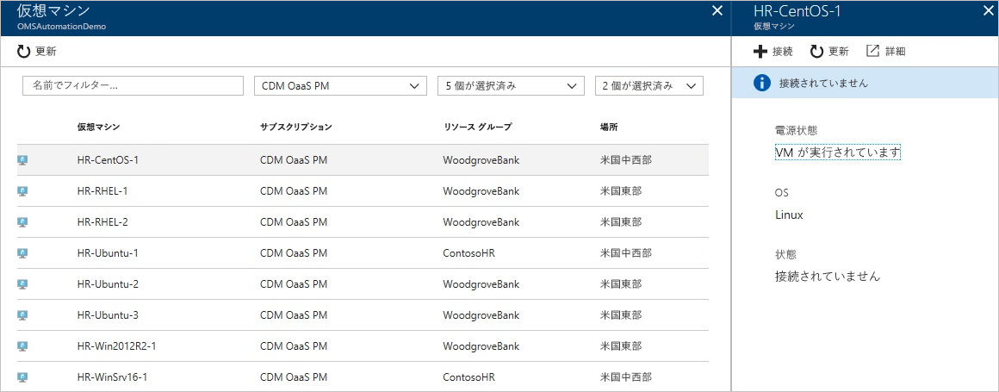
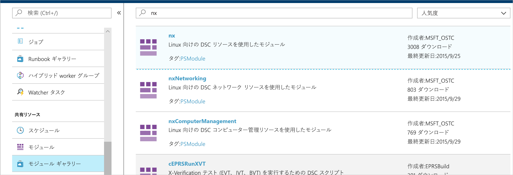
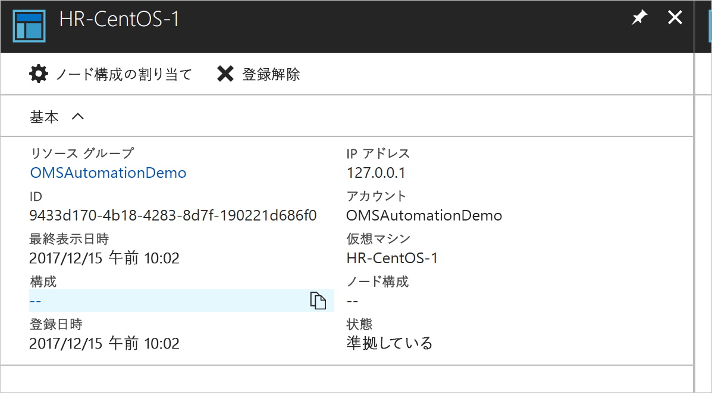
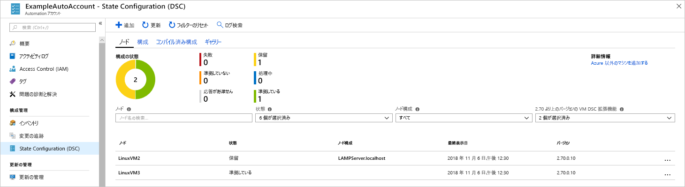

# <a name="configure-a-linux-virtual-machine-with-desired-state-configuration"></a>Desired State Configuration を使用して Linux 仮想マシンを構成する

Desired State Configuration (DSC) を有効にすると、Windows および Linux サーバーの構成を管理および監視できます。 目的の構成から外れている構成を特定し、自動修正することができます。 このクイックスタートでは、Linux VM をオンボードし、DSC を使用して LAMP スタックをデプロイする手順について説明します。

## <a name="prerequisites"></a>前提条件

このクイック スタートを完了するには、次のものが必要です。

* Azure サブスクリプション。 Azure サブスクリプションをお持ちでない場合は、[無料アカウントを作成](https://azure.microsoft.com/free/)してください。
* Azure Automation アカウント。 Azure Automation 実行アカウントの作成手順については、 [Azure 実行アカウント](automation-sec-configure-azure-runas-account.md)に関するページをご覧ください。
* Red Hat Enterprise Linux、CentOS、または Oracle Linux を実行している (クラシックではなく) Azure Resource Manager VM。 VM の作成手順については、「[Azure Portal で Linux 仮想マシンを作成する](../virtual-machines/linux/quick-create-portal.md)」を参照してください。

## <a name="log-in-to-azure"></a>Azure にログインする
Azure にサインインします ( https://portal.azure.com ) 。

## <a name="onboard-a-virtual-machine"></a>仮想マシンをオンボードする
マシンをオンボードし、Desired State Configuration を有効にするには、さまざまな方法があります。 このクイックスタートでは、Automation アカウントを使用してオンボードする方法について説明します。 [オンボード](https://docs.microsoft.com/azure/automation/automation-dsc-onboarding)の記事を読むと、マシンを Desired State Configuration にオンボードするさまざまな方法を理解できます。

1. Azure Portal の左ウィンドウで **[Automation アカウント]** を選択します。 左側のウィンドウに表示されていない場合は、**[すべてのサービス]** をクリックして、結果ビューから探します。
1. 一覧で Automation アカウントを選択します。
1. Automation アカウントの左側のウィンドウで **[DSC ノード]** を選択します。
1. **[Azure VM の追加]** のメニュー オプションをクリックします
1. DSC を有効にする仮想マシンを探します。 検索フィールドとフィルター オプションを使用して、特定の仮想マシンを検索することができます。
1. 仮想マシンをクリックし、**[接続]** を選択します。
1. 仮想マシンに適した DSC 設定を選択します。 構成を既に準備している場合は、*[ノード構成名]* として指定できます。 [構成モード](https://docs.microsoft.com/powershell/dsc/metaconfig)を設定して、マシンの構成動作を制御することができます。
1. **[OK]**



Desired State Configuration 拡張機能が仮想マシンにデプロイされている場合は、"*接続中*" と表示されます。

## <a name="import-modules"></a>モジュールをインポートする

モジュールには DSC リソースが含まれており、多くは [PowerShell ギャラリー](https://www.powershellgallery.com)にあります。 コンパイルする前に、構成で使用されているリソースを Automation アカウントにインポートする必要があります。 このチュートリアルでは、**nx** というモジュールが必要です。

1. Automation アカウントの左側のウィンドウで、([共有リソース] の下の) **[モジュール ギャラリー]** を選択します。
1. 名前の一部「*nx*」を入力してインポートするモジュールを検索します。
1. インポートするモジュールをクリックします
1. **[インポート]** をクリックします。



## <a name="import-the-configuration"></a>構成をインポートする

このクイックスタートでは、マシンで Apache HTTP Server、MySQL、および PHP を構成する DSC 構成を使用します。

構成の構成については、「[DSC 構成](https://docs.microsoft.com/powershell/dsc/configurations)」をご覧ください。

テキスト エディターで次のように入力し、`LAMPServer.ps1` としてローカルに保存します。

```powershell-interactive
configuration LAMPServer {
   Import-DSCResource -module "nx"

   Node localhost {

        $requiredPackages = @("httpd","mod_ssl","php","php-mysql","mariadb","mariadb-server")
        $enabledServices = @("httpd","mariadb")

        #Ensure packages are installed
        ForEach ($package in $requiredPackages){
            nxPackage $Package{
                Ensure = "Present"
                Name = $Package
                PackageManager = "yum"
            }
        }

        #Ensure daemons are enabled
        ForEach ($service in $enabledServices){
            nxService $service{
                Enabled = $true
                Name = $service
                Controller = "SystemD"
                State = "running"
            }
        }
   }
}
```

構成をインポートするには：

1. Automation アカウントの左側のウィンドウで **[DSC 構成]** を選択します。
1. **[構成の追加]** のメニュー オプションをクリックします
1. 前の手順で保存した*構成ファイル*を選択します
1. **[OK]**

## <a name="compile-a-configuration"></a>構成をコンパイルする

ノードに割り当てる前に、DSC 構成をノード構成 (MOF ドキュメント) にコンパイルする必要があります。 コンパイルでは構成が検証されます。また、パラメーター値を入力できます。 構成のコンパイルの詳細については、「[Azure Automation DSC での構成のコンパイル](https://docs.microsoft.com/azure/automation/automation-dsc-compile)」を参照してください。

構成をコンパイルするには：

1. Automation アカウントの左側のウィンドウで **[DSC 構成]** を選択します。
1. 前の手順でインポートした構成 ("LAMPServer") を選択しします
1. メニュー オプションから **[コンパイル]** をクリックし、**[はい]** をクリックします
1. [構成] ビューに、キューに格納されている新しい*コンパイル ジョブ*が表示されます。 ジョブが正常に完了すると、次の手順に進むことができます。 失敗した場合は、コンパイル ジョブをクリックして詳細を確認します。



## <a name="assign-a-node-configuration"></a>ノード構成を割り当てる

コンパイル済みの*ノード構成*を DSC ノードに割り当てることができます。 割り当てによって構成がマシンに適用され、その構成から外れている点が監視 (または自動修正) されます。

1. Automation アカウントの左側のウィンドウで **[DSC ノード]** を選択します
1. 構成を割り当てるノードを選択します
1. **[ノード構成の割り当て]** をクリックします
1. *[ノード構成]* - **[LAMPServer.localhost]** を選択して割り当て、**[OK]** をクリックします。
1. コンパイルされた構成がノードに割り当てられ、ノードの状態は*保留中*に変わります。 次回の定期的なチェックで、ノードは構成を取得して適用し、状態を報告します。 ノードの設定に応じて、ノードが構成を取得するまでに最大 30 分かかることがあります。 即時のチェックを強制するには、Linux 仮想マシンのローカルで次のコマンドを実行します。`sudo /opt/microsoft/dsc/Scripts/PerformRequiredConfigurationChecks.py`


## <a name="viewing-node-status"></a>ノードの状態を表示する

Automation アカウントの **[DSC ノード]** ビューで、すべての管理対象ノードの状態を確認できます。 状態、ノード構成、または名前の検索で表示を絞り込むことができます。 



## <a name="next-steps"></a>次の手順

このクイックスタートでは、Linux VM を DSC にオンボードし、LAMP スタックの構成を作成し、VM に配置しました。 Automation DSC を使用して継続的配置を有効にする方法については、次の記事を参照してください。

> [!div class="nextstepaction"]
> [DSC と Chocolatey を使用した VM への継続的配置](./automation-dsc-cd-chocolatey.md)

* PowerShell Desired State Configuration の詳細については、「[Windows PowerShell Desired State Configuration の概要](https://docs.microsoft.com/powershell/dsc/overview)」を参照してください。
* PowerShell から Automation DSC を管理する方法の詳細については、[Azure PowerShell](https://docs.microsoft.com/powershell/module/azurerm.automation/?view=azurermps-5.0.0) に関するページを参照してください。
* レポートとアラートのために DSC レポートを Log Analytics に転送する方法については、[DSC レポートを Log Analytics に転送する方法](https://docs.microsoft.com/azure/automation/automation-dsc-diagnostics)に関するページを参照してください。 
