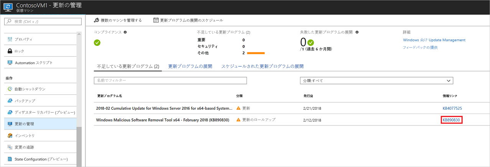
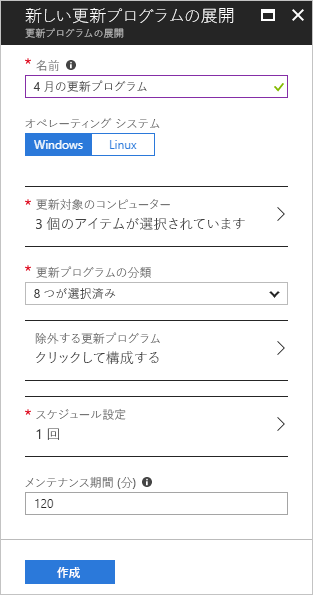
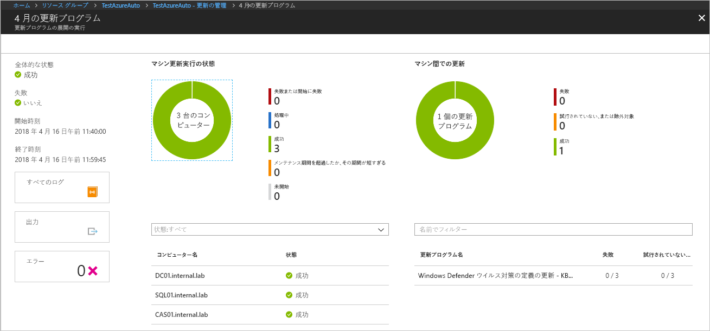

# Azure VM の更新プログラムとパッチの管理

Update Management のソリューションを使用すると、仮想マシンの更新プログラムとパッチを管理できます。 このチュートリアルでは、利用可能な更新プログラムの状態の評価、必要な更新プログラムのインストールのスケジュール設定、展開の結果の確認、更新プログラムが正常に適用されたことを確認するアラートの作成を迅速に行う方法について説明します。

価格情報については、[Update Management の Automation の価格](https://azure.microsoft.com/pricing/details/automation/)に関するページをご覧ください。

このチュートリアルでは、以下の内容を学習します。

> [!div class="checklist"]
> * Update Management のために VM をオンボードする
> * 更新の評価を表示する
> * アラートを構成する
> * 更新プログラムのデプロイをスケジュールする
> * デプロイの結果を表示する

## 前提条件

このチュートリアルを完了するには、次のものが必要です。

* Azure サブスクリプション。 まだお持ちでない場合は、[Visual Studio サブスクライバー向けの月単位の Azure クレジットをアクティブにする](https://azure.microsoft.com/pricing/member-offers/msdn-benefits-details/)か、[無料アカウント](https://azure.microsoft.com/free/?WT.mc_id=A261C142F)にサインアップしてください。
* 監視およびアクションの Runbook と監視タスクを保持する、[Azure Automation アカウント](automation-offering-get-started.md)。
* オンボードする[仮想マシン](../virtual-machines/windows/quick-create-portal.md)。

## Azure へのサインイン

Azure Portal ( https://portal.azure.com ) にサインインします。

## Update Management の有効化

まず、このチュートリアル用に VM の Update Management を有効にします。

1. [[Azure portal]](https://portal.azure.com) メニューで **[仮想マシン]** を選択するか、 **[ホーム]** ページから **[仮想マシン]** を検索して選択します。
1. Update Management を有効にする VM を選択します。
1. VM のページで、 **[操作]** 、 **[更新の管理]** を選択します。 **[更新管理の有効化]** ウィンドウが開きます。

この VM で Update Management が有効になっているかどうかを確認する検証が行われます。 この検証では、Azure Log Analytics ワークスペースの確認、リンクされた Automation アカウントの確認、およびワークスペースで Update Management ソリューションが有効になっているかどうかの確認が行われます。

[Log Analytics](../azure-monitor/platform/data-platform-logs.md) ワークスペースは、Update Management のような機能およびサービスによって生成されるデータを収集するために使用されます。 ワークスペースには、複数のソースからのデータを確認および分析する場所が 1 つ用意されています。

また、検証プロセスでは、VM に Log Analytics エージェントと Automation Hybrid Runbook Worker がプロビジョニングされているかどうかも確認されます。 このエージェントは、Azure Automation と通信し、更新の状態に関する情報を取得するために使用されます。 エージェントでは、Azure Automation サービスと通信したり、更新プログラムをダウンロードしたりするために、ポート 443 を開く必要があります。

オンボード中に次の前提条件のいずれかを満たしていないことがわかった場合は、自動的に追加されます。

* [Log Analytics](../azure-monitor/platform/data-platform-logs.md) ワークスペース
* [Automation アカウント](./automation-offering-get-started.md)
* [Hybrid Runbook Worker](./automation-hybrid-runbook-worker.md) (VM 上で有効になっている)

**Update Management** で、使用する場所、Log Analytics ワークスペース、Automation アカウントを設定します。 その後、 **[有効化]** を選択します。 これらのオプションを使用できない場合は、その VM で別の Automation ソリューションが有効になっていることを意味します。 この場合、同じワークスペースおよび Automation アカウントを使用する必要があります。

![[Update Management の有効化] ソリューション ウィンドウ](./media/automation-tutorial-update-management/manageupdates-update-enable.png)

ソリューションの有効化には、最大数分かかることがあります。 この処理中はブラウザーのウィンドウを閉じないでください。 ソリューションが有効になると、VM 上の不足している更新プログラムの情報が Azure Monitor ログに送られます。 データの分析に使用できるようになるまでに、30 分から 6 時間かかる場合があります。

## 更新の評価を確認する

Update Management が有効になると、 **[更新の管理]** ウィンドウが開きます。 更新プログラムが不足していると識別された場合は、 **[不足している更新プログラム]** タブに、足りない更新プログラムの一覧が表示されます。

**[情報リンク]** で更新プログラムのリンクを選択すると、更新プログラムのサポート記事が表示されます。 更新プログラムに関する重要情報を確認できます。

更新プログラムの別の場所をクリックすると、選択した更新プログラムの **[ログ検索]** ウィンドウが開きます。 その更新プログラムについて、ログ検索のクエリが事前に定義されています。 このクエリを変更するか、独自のクエリを作成して、環境に展開されている更新プログラムまたは不足している更新プログラムに関する詳細情報を確認できます。

## アラートを構成する

この手順では、更新プログラムの展開の状態を通知するアラートの設定について説明します。

### アラートの条件

お使いの Automation アカウントで、 **[監視]** の **[アラート]** に移動し、 **[+ 新しいアラート ルール]** をクリックします。

お使いの Automation アカウントは、リソースとしてあらかじめ選択されています。 これを変更したい場合は、 **[選択]** をクリックし、 **[リソースの選択]** ページの **[リソースの種類でフィルター]** ドロップダウンで **[Automation アカウント]** を選択してください。 お使いの Automation アカウントを選択して、 **[完了]** を選択します。

**[条件の追加]** をクリックして、お客様の更新プログラムの展開に適したシグナルを選択します。 次の表は、更新プログラムの展開に使用できる 2 つのシグナルの詳細を示しています。

|シグナル名|Dimensions|説明|
|---|---|---|
|**Total Update Deployment Runs (更新プログラムの展開の合計実行回数)**|- Update Deployment Name (更新プログラムの展開の名前) - Status (状態)|このシグナルは、更新プログラムの展開の全体的な状態を通知するために使用されます。|
|**Total Update Deployment Machine Runs (更新プログラムの展開マシンの合計実行回数)**|- Update Deployment Name (更新プログラムの展開の名前) - Status (状態) - Target Computer (ターゲット コンピューター) - Update Deployment Run ID (更新プログラムの展開の実行 ID)|このシグナルは、特定のマシンを対象とした更新プログラムの展開の状態を通知するために使用されます。|

ディメンションの値には、一覧から有効な値を選択します。 探している値が一覧に見つからない場合は、ディメンションの横にある **\+** 記号をクリックしてカスタム名を入力します。 その後、お客様が探したい値を選択できます。 ディメンションのすべての値を選択したい場合は、 **[選択]\*** ボタンをクリックします。 ディメンションの値を選択しなかった場合、そのディメンションは評価中に無視されます。

**[アラート ロジック]** の **[しきい値]** に「**1**」を入力します。 完了したら、 **[完了]** をクリックします。

### [アラートの詳細]

**[2. アラートの詳細を定義します]** で、アラートの名前と説明を入力します。 成功した実行の場合 **[重大度]** を **[Informational(Sev 2)]\(情報 (重大度 2)\)** に設定し、失敗した実行の場合 **[Informational(Sev 1)]\(情報 (重大度 1)\)** に設定します。

**[アクション グループ]** の **[新規作成]** を選択します。 アクション グループとは、複数のアラートで使用できるアクションのグループです。 アクションには、電子メール通知、Runbook、webhook などがありますが、これらに限定されるわけではありません。 アクション グループの詳細については、[アクション グループの作成および管理](../azure-monitor/platform/action-groups.md)に関するページを参照してください。

**[アクション グループ名]** ボックスに、アラートの名前と短い名前を入力します。 短い名前は、通知がこのグループを使用して送信されるときに長い名前の代わりに使用されます。

**[アクション]** に、**電子メール通知**などの、アクションの名前を入力します。 **[アクションの種類]** で、 **[電子メール/SMS/プッシュ/音声]** を選びます。 **[詳細]** で、 **[詳細の編集]** を選択します。

**[電子メール/SMS/プッシュ/音声]** ウィンドウで、名前を入力します。 **[電子メール]** チェック ボックスをオンにして、有効な電子メール アドレスを入力します。

**[電子メール/SMS/プッシュ/音声]** ウィンドウで、 **[OK]** を選択します。 **[アクション グループの追加]** ウィンドウで、 **[OK]** を選択します。

アラートの電子メールの件名をカスタマイズするには、 **[ルールの作成]** の **[アクションをカスタマイズする]** で、 **[電子メールの件名]** を選択します。 完了したら、 **[アラート ルールの作成]** を選択します。 このアラートにより、更新プログラムの展開が成功したことと、その更新プログラムの展開の実行対象となったコンピューターが通知されます。

## 更新プログラムのデプロイをスケジュールする

次に、リリース スケジュールとサービス期間に従って展開をスケジュールし、更新プログラムをインストールします。 デプロイに含める更新の種類を選択できます。 たとえば、緊急更新プログラムやセキュリティ更新プログラムを追加し、更新プログラムのロールアップを除外できます。

>[!NOTE]
>更新プログラムのデプロイをスケジュールすると、対象マシンへの更新プログラムのデプロイを処理する **Patch-MicrosoftOMSComputers** Runbook にリンクされた[スケジュール](shared-resources/schedules.md) リソースが作成されます。 デプロイの作成後に Azure portal または PowerShell を使用してこのスケジュール リソースを削除した場合、スケジュールされた更新プログラムのデプロイが壊れ、ポータルから再構成しようとするとエラーが発生します。 スケジュール リソースは、対応するデプロイ スケジュールを削除することによってのみ削除することができます。  
>

VM の新しい更新プログラムの展開をスケジュールするには、 **[更新の管理]** に移動し、 **[更新プログラムの展開のスケジュール]** を選択します。

**[新しい更新プログラムの展開]** で、次の情報を指定します。

* **Name**:更新プログラムの展開に一意の名前を入力します。

* **[オペレーティング システム]** :更新プログラムの展開の対象となる OS を選択します。

* **[更新するグループ (プレビュー)]** :サブスクリプション、リソース グループ、場所、およびタグの組み合わせに基づいてクエリを定義し、デプロイに含める Azure VM の動的グループを構築します。 詳しくは、[動的グループ](automation-update-management-groups.md)に関するページをご覧ください。

* **[更新するマシン]** :保存した検索条件、インポートしたグループを選択するか、ドロップダウンから [マシン] を選択し、個別のマシンを選択します。 **[マシン]** を選択すると、マシンの準備状況が **[エージェントの更新の準備]** 列に示されます。 Azure Monitor ログでコンピューター グループを作成するさまざまな方法については、[Azure Monitor ログのコンピューター グループ](../azure-monitor/platform/computer-groups.md)に関するページを参照してください

* **[更新プログラムの分類]** :更新プログラムのデプロイに含めることのできるサポート対象更新プログラムの分類を製品ごとに選択します。 このチュートリアルでは、すべての種類を選択したままにします。

  分類の種類は次のとおりです。

   |OS  |種類  |
   |---------|---------|
   |Windows     | 緊急更新プログラム セキュリティ更新プログラム 更新プログラムのロールアップ Feature Pack Service Pack 定義の更新 ツール 更新プログラム        |
   |Linux     | 緊急更新プログラムとセキュリティ更新プログラム 他の更新プログラム       |

   分類の種類の詳細については、「[Update classifications (更新プログラムの分類)](automation-view-update-assessments.md#update-classifications)」をご覧ください。

* **[Updates to include/exclude]\(含める/除外する更新プログラム\)** : **[Include/Exclude]\(含める/除外する\)** ページが開きます。 含めるまたは除外する更新プログラムは別のタブに表示されます。

> [!NOTE]
> 包含より除外の方が優先されることを知っておく必要があります。 たとえば、除外ルール `*` を定義した場合、修正プログラムまたはパッケージはすべて除外されるためインストールされません。 除外されたパッチは、マシンに不足しているものとして表示されます。 Linux マシンでは、包含されているパッケージに除外された依存パッケージがある場合、パッケージはインストールされません。

> [!NOTE]
> 更新プログラムのデプロイ内容に、古い更新プログラムを指定することはできません。
>

* **[スケジュール設定]** : **[スケジュール設定]** ウィンドウが開きます。 既定の開始時刻は、現在の時刻の 30 分後です。 開始時刻は、10 分後以降の将来の任意の時点に設定できます。

   展開を 1 回行うか、定期的なスケジュールを設定するかを指定することもできます。 **[繰り返し]** で **[1 回]** を選択します。 既定値の 1 日のままにし、 **[OK]** を選択します。 これで定期的なスケジュールが設定されます。

* **[事前スクリプトと事後スクリプト]** :デプロイの前後に実行するスクリプトを選択します。 詳細については、[事前および事後スクリプトの管理](pre-post-scripts.md)に関するページを参照してください。

* **[メンテナンス期間 (分)]** :既定値をそのまま使用します。 メンテナンス期間によって、更新プログラムをインストールするために許容される時間を制御します。 メンテナンス期間を指定するときは、次の点を考慮してください。

  * メンテナンス期間によって、インストールを試みる更新プログラムの数が制御されます。
  * メンテナンス期間の終了が近づいている場合でも、Update Management では、新しい更新プログラムのインストールは停止されません。
  * メンテナンス期間を超過した場合でも、Update Management では、進行中の更新は終了されません。
  * Windows でメンテナンス期間が超過する理由は、多くの場合、Service Pack の更新プログラムのインストールに時間がかかるためです。

  > [!NOTE]
  > Ubuntu でメンテナンス期間外に更新プログラムが適用されないようにするには、無人アップグレード パッケージを再構成して自動更新を無効にします。 パッケージの構成方法については、[Ubuntu サーバー ガイドの自動更新に関するトピック](https://help.ubuntu.com/lts/serverguide/automatic-updates.html)をご覧ください。

* **[再起動のオプション]** : この設定によって、再起動の処理方法が決まります。 使用できるオプションは次のとおりです。
  * 必要に応じて再起動 (既定値)
  * 常に再起動
  * 再起動しない
  * Only reboot - will not install updates (再起動のみ - 更新プログラムをインストールしない)

> [!NOTE]
> **[再起動制御]** が **[再起動しない]** に設定されている場合、[[Registry keys used to manage restart]\(再起動の管理に使用するレジストリ キー\)](/windows/deployment/update/waas-restart#registry-keys-used-to-manage-restart) に一覧表示されているレジストリ キーにより再起動イベントが発生する場合があります。

スケジュールの構成が完了したら、 **[作成]** を選択します。

状態ダッシュボードに戻ります。 **[スケジュールされた更新プログラムの展開]** を選択して、作成した展開スケジュールを表示します。

> [!NOTE]
> Update Management では、ファースト パーティの更新プログラムの展開と、修正プログラムの事前ダウンロードをサポートしています。 このためには、修正プログラムの適用対象システムでの変更が必要になります。お使いのシステムでこれらの設定を構成する方法については、[ファースト パーティと事前ダウンロードのサポート](automation-configure-windows-update.md)に関するセクションを参照してください。

**更新プログラムのデプロイ**はプログラムで作成することもできます。 REST API を使用して**更新プログラムのデプロイ**を作成する方法については、「[ソフトウェア更新プログラムの構成 - 作成](/rest/api/automation/softwareupdateconfigurations/create)」を参照してください。 週単位の**更新プログラムのデプロイ**を作成するために使用できるサンプル Runbook もあります。 この Runbook について詳しくは、「[Create a weekly update deployment for one or more VMs in a resource group](https://gallery.technet.microsoft.com/scriptcenter/Create-a-weekly-update-2ad359a1)」(リソース グループ内の VM に対して週単位の更新プログラムのデプロイを作成する) をご覧ください。

## 更新プログラムのデプロイの結果を確認する

スケジュールされた展開の開始後、 **[更新の管理]** の **[更新プログラムの展開]** タブに、展開の状態が表示されます。 展開が現在実行中の場合、状態は **[処理中]** と表示されます。 展開が完了すると、成功した場合は、状態が **[成功]** に変わります。 展開時に 1 つ以上の更新プログラムでエラーが発生した場合、状態は **[部分的に失敗]** になります。

完了した更新プログラムのデプロイを選択すると、その更新プログラムのデプロイ用のダッシュボードが表示されます。

**[更新プログラムを実行した結果]** には、VM 上の更新プログラムの合計数と展開結果が表示されます。 右側の表には、各更新プログラムとインストールの結果の詳細が示されます。

使用できる値の一覧を次に示します。

* **試行されていません**:メンテナンス期間として定義された時間が十分ではなかったため、更新プログラムがインストールされませんでした。
* **[成功]** : 更新できました。
* **[失敗]** : 更新できませんでした。

展開によって作成されたログ エントリをすべて表示するには、 **[すべてのログ]** を選択します。

ターゲット VM での更新プログラムの展開を管理する Runbook のジョブ ストリームを確認するには、 **[出力]** を選択します。

展開で発生したエラーの詳細情報を確認するには、 **[エラー]** を選択します。

更新プログラムの展開が成功すると、次の例のような電子メールが送信され、展開が成功したことが示されます。

## 次のステップ

このチュートリアルでは、以下の内容を学習しました。

> [!div class="checklist"]
> * Update Management のために VM をオンボードする
> * 更新の評価を表示する
> * アラートを構成する
> * 更新プログラムのデプロイをスケジュールする
> * デプロイの結果を表示する

更新の管理ソリューションの概要に進みます。

> [!div class="nextstepaction"]
> [更新の管理ソリューション](../operations-management-suite/oms-solution-update-management.md?toc=%2fazure%2fautomation%2ftoc.json)

