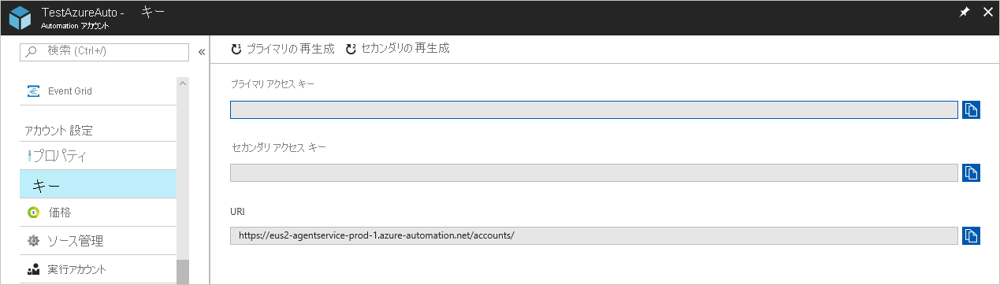

# <a name="deploy-a-windows-hybrid-runbook-worker"></a>Windows Hybrid Runbook Worker をデプロイする

Azure Automation の Hybrid Runbook Worker 機能を使う、ロールをホスティングしているコンピューター上で環境内のリソースに対して Runbook を直接実行して、これらのローカル リソースを管理できます。 Azure Automation によって Runbook が格納および管理された後、1 つ以上の指定されたコンピューターに配信されます。 この記事では、Windows コンピューターに Hybrid Runbook Worker をデプロイする方法について説明します。

Runbook Worker が正常にデプロイされたら、「[Hybrid Runbook Worker での Runbook の実行](automation-hrw-run-runbooks.md)」を参照して、オンプレミスのデータセンターや他のクラウド環境のプロセスを自動化するように Runbook を構成する方法を確認します。

[!INCLUDE [azure-monitor-log-analytics-rebrand](../../includes/azure-monitor-log-analytics-rebrand.md)]

>[!NOTE]
>この記事は、新しい Azure PowerShell Az モジュールを使用するために更新されました。 AzureRM モジュールはまだ使用でき、少なくとも 2020 年 12 月までは引き続きバグ修正が行われます。 Az モジュールと AzureRM の互換性の詳細については、「[Introducing the new Azure PowerShell Az module (新しい Azure PowerShell Az モジュールの概要)](https://docs.microsoft.com/powershell/azure/new-azureps-module-az?view=azps-3.5.0)」を参照してください。 Hybrid Runbook Worker での Az モジュールのインストール手順については、「[Azure PowerShell モジュールのインストール](https://docs.microsoft.com/powershell/azure/install-az-ps?view=azps-3.5.0)」を参照してください。 Automation アカウントについては、「[Azure Automation の Azure PowerShell モジュールを更新する方法](automation-update-azure-modules.md)」に従って、モジュールを最新バージョンに更新できます。

## <a name="windows-hybrid-runbook-worker-installation-and-configuration"></a>Windows Hybrid Runbook Worker のインストールと構成

Windows Hybrid Runbook Worker をインストールして構成するには、次の方法のいずれかを使用します。

* Azure VM の場合、[Windows 用仮想マシン拡張機能](../virtual-machines/extensions/oms-windows.md)を使用して、Windows 用 Log Analytics エージェントをインストールします。 この拡張機能では、Azure 仮想マシンに Log Analytics エージェントがインストールされ、Azure Resource Manager テンプレートまたは PowerShell を使用して仮想マシンが既存の Log Analytics ワークスペースに登録されます。 エージェントがインストールされたら、Automation アカウントの Hybrid Runbook Worker グループに VM を追加できます。 [手動展開](#manual-deployment)セクションのステップ 3 と 4 を参照してください。

* Automation Runbook を使用して、Windows コンピューターを構成するプロセスを完全に自動化します。 データセンターまたは他のクラウド環境のマシンの場合、この方法をお勧めします。

* 手順に従って、非 Azure VM に Hybrid Runbook Worker ロールを手動でインストールして構成します。

> [!NOTE]
> Hybrid Runbook Worker ロールをサポートするサーバーの構成を Desired State Configuration (DSC) を使用して管理するには、サーバーを DSC ノードとして追加する必要があります。

### <a name="minimum-requirements-for-windows-hybrid-runbook-worker"></a>Windows Hybrid Runbook Worker の最小要件

Windows Hybrid Runbook Worker の最小要件は次のようになります。

* Windows Server 2012 またはそれ以降
* Windows PowerShell 5.1 以降 ([WMF 5.1 をダウンロード](https://www.microsoft.com/download/details.aspx?id=54616))
* .NET Framework 4.6.2 以降。
* 2 コア
* 4 GB の RAM
* ポート 443 (送信)

### <a name="network-configuration"></a>ネットワーク構成

Hybrid Runbook Worker のその他のネットワーク要件については、[ネットワークの構成](automation-hybrid-runbook-worker.md#network-planning)に関するページを参照してください。

### <a name="server-onboarding-for-management-with-automation-dsc"></a>Automation DSC を使用した管理のためのサーバーのオンボード

DSC による管理のためのサーバーのオンボードについては、[Azure Automation DSC による管理のためのマシンのオンボード](automation-dsc-onboarding.md)に関するページを参照してください。

[Update Management ソリューション](../operations-management-suite/oms-solution-update-management.md)を有効にすると、このソリューションに含まれている Runbook をサポートするために、Log Analytics ワークスペースに接続された Windows コンピューターはすべて Hybrid Runbook Worker として自動的に構成されます。 ただし、このワーカーは、Automation アカウントで既に定義されている Hybrid Runbook Worker グループには登録されません。

### <a name="addition-of-the-computer-to-a-hybrid-runbook-worker-group"></a>Hybrid Runbook Worker グループへのコンピューターの追加

ワーカー コンピューターを、Automation アカウントの Hybrid Runbook Worker グループに追加できます。 ソリューションと Hybrid Runbook Worker グループ メンバーシップの両方に同じアカウントを使用している場合、Automation Runbook をサポートする必要があることに注意してください。 この機能は、Hybrid Runbook Worker のバージョン 7.2.12024.0 に追加されました。

## <a name="automated-deployment"></a>自動化されたデプロイ

ターゲット マシン上で、Windows Hybrid Worker ロールのインストールと構成を自動化するために、次の手順を実行します。

### <a name="step-1---download-the-powershell-script"></a>手順 1 - PowerShell スクリプトをダウンロードする

[PowerShell ギャラリー](https://www.powershellgallery.com/packages/New-OnPremiseHybridWorker)から **New-OnPremiseHybridWorker.ps1** スクリプトをダウンロードします。 ダウンロードは、Hybrid Runbook Worker ロールが実行されているコンピューターまたは環境内の別のコンピューターから直接行う必要があります。 スクリプトをダウンロードしたら、それをワーカーにコピーします。 **New-OnPremiseHybridWorker.ps1** スクリプトでは、実行中に以下で説明するパラメーターが使用されます。

| パラメーター | Status | 説明 |
| --------- | ------ | ----------- |
| `AAResourceGroupName` | Mandatory | Automation アカウントに関連付けられているリソース グループの名前。 |
| `AutomationAccountName` | Mandatory | Automation アカウントの名前。
| `Credential` | 省略可能 | Azure 環境にログインするときに使用する資格情報。 |
| `HybridGroupName` | Mandatory | このシナリオをサポートしている Runbook のターゲットとして指定する Hybrid Runbook Worker グループの名前。 |
| `OMSResourceGroupName` | 省略可能 | Log Analytics ワークスペース用のリソース グループの名前。 このリソース グループが指定されていない場合、`AAResourceGroupName` の値が使用されます。 |
| `SubscriptionID` | Mandatory | お使いの Automation アカウントに関連付けられている Azure サブスクリプションの識別子。 |
| `TenantID` | 省略可能 | Automation アカウントに関連付けられているテナント組織の識別子。 |
| `WorkspaceName` | 省略可能 | Log Analytics ワークスペース名。 Log Analytics ワークスペースがない場合は、スクリプトがこれを作成して構成します。 |

> [!NOTE]
> ソリューションを有効にすると、Azure Automation では、Log Analytics ワークスペースと Automation アカウントのリンクに特定のリージョンのみがサポートされます。 サポートされているマッピング ペアの一覧については、[Automation アカウントと Log Analytics ワークスペースのリージョン マッピング](how-to/region-mappings.md)に関する記事をご覧ください。

### <a name="step-2---open-windows-powershell-command-line-shell"></a>手順 2 - Windows PowerShell コマンド ウィンドウを開く

**スタート**画面から、管理者モードで **Windows PowerShell** を開きます。

### <a name="step-3---run-the-powershell-script"></a>手順 3 - PowerShell スクリプトを実行する

PowerShell コマンドライン シェルで、ダウンロードしたスクリプトがあるフォルダーを参照します。 パラメーター `AutomationAccountName`、`AAResourceGroupName`、`OMSResourceGroupName`、`HybridGroupName`、`SubscriptionID`、および `WorkspaceName`の値を変更します。 その後、スクリプトを実行します。

スクリプトの実行後、Azure での認証が求められます。 サブスクリプション管理ロールのメンバーかつサブスクリプションの共同管理者であるアカウントを使用してサインインする必要があります。

```powershell-interactive
.\New-OnPremiseHybridWorker.ps1 -AutomationAccountName <NameofAutomationAccount> -AAResourceGroupName <NameofResourceGroup>`
-OMSResourceGroupName <NameofOResourceGroup> -HybridGroupName <NameofHRWGroup> `
-SubscriptionID <AzureSubscriptionId> -WorkspaceName <NameOfLogAnalyticsWorkspace>
```

### <a name="step-4---install-nuget"></a>手順 4 - NuGet をインストールする

NuGet をインストールし、Azure 資格情報で認証するように求められます。 最新の NuGet バージョンをお持ちでない場合は、[使用可能な NuGet ディストリビューション バージョン](https://www.nuget.org/downloads)から入手できます。

### <a name="step-5---verify-the-deployment"></a>手順 5 - デプロイを検証する

スクリプトが完了すると、[ハイブリッド Worker グループ] ページに、新しいグループとメンバーの数が表示されます。 既存のグループの場合は、メンバーの数が増分されます。 [ハイブリッド worker グループ] ページ上にあるリストからグループを選択し、 **[ハイブリッド Worker]** タイルを選択できます。 [ハイブリッド Worker] ページでは、グループの各メンバーの一覧を見ることができます。

## <a name="manual-deployment"></a>手動デプロイ

ターゲット マシンで、最初の 2 つの手順を Automation 環境に対して 1 回実行します。 その後、各ワーカー コンピューターに対して残りの手順を実行します。

### <a name="step-1---create-a-log-analytics-workspace"></a>手順 1 - Log Analytics ワークスペースを作成する

Log Analytics ワークスペースがまだない場合は、ワークスペースを作成する前に、[Azure Monitor ログの設計ガイダンス](../azure-monitor/platform/design-logs-deployment.md)を確認してください。

### <a name="step-2---add-the-automation-solution-to-the-log-analytics-workspace"></a>手順 2 - Log Analytics ワークスペースに Automation ソリューションを追加する

Automation ソリューションは、Hybrid Runbook Worker のサポートなど、Azure Automation 用の機能を追加します。 ソリューションを Log Analytics ワークスペースに追加すると、次の手順で説明するように、インストールするワーカー コンポーネントがエージェント コンピューターに自動的にプッシュされます。

ワークスペースに Automation ソリューションを追加するには、次の PowerShell コマンドレットを実行します。

```powershell-interactive
Set-AzOperationalInsightsIntelligencePack -ResourceGroupName <logAnalyticsResourceGroup> -WorkspaceName <LogAnalyticsWorkspaceName> -IntelligencePackName "AzureAutomation" -Enabled $true -DefaultProfile <IAzureContextContainer>
```

### <a name="step-3---install-the-log-analytics-agent-for-windows"></a>手順 3 - Windows 用 Log Analytics エージェントをインストールする

Windows 用 Log Analytics エージェントにより、コンピューターが Azure Monitor Log Analytics ワークスペースに接続されます。 コンピューターにエージェントをインストールし、ワークスペースに接続すると、Hybrid Runbook Worker に必要なコンポーネントが自動的にダウンロードされます。

コンピューターにエージェントをインストールするには、[Azure Monitor ログへの Windows コンピューターの接続](../log-analytics/log-analytics-windows-agent.md)に関する記事の手順に従います。 コンピューターごとにこのプロセスを繰り返して、複数の worker を環境に追加できます。

エージェントが Log Analytics ワークスペースに正常に接続されたら、数分後に次のクエリを実行して、ワークスペースにハートビート データが送信されていることを確認できます。

```kusto
Heartbeat 
| where Category == "Direct Agent" 
| where TimeGenerated > ago(30m)
```

検索結果には、コンピューターのハートビート レコードが表示されます。これにより、エージェントがサービスに接続され、レポートが送信されていることが示されます。 既定では、各エージェントからその割り当て済みのワークスペースにハートビート レコードが転送されます。 

エージェントのインストールとセットアップを完了するには、次の手順を使用します。

1. ソリューションを有効にしてエージェントマシンをオンボードできるようにします。 「[ワークスペースでのマシンの配布準備](https://docs.microsoft.com/azure/automation/automation-onboard-solutions-from-automation-account#onboard-machines-in-the-workspace)」を参照してください。
2. エージェントにより Automation ソリューションが正しくダウンロードされたことを確認します。 
3. Hybrid Runbook Worker のバージョンを確認するには、**C:\Program Files\Microsoft Monitoring Agent\Agent\AzureAutomation** を参照し、**version** サブフォルダーをメモします。

### <a name="step-4---install-the-runbook-environment-and-connect-to-azure-automation"></a>手順 4 - Runbook 環境をインストールして、Azure Automation に接続する

Log Analytics ワークスペースにレポートを送信するようにエージェントを構成すると、Automation ソリューションは、`Add-HybridRunbookWorker` cmdlet コマンドレットを含む `HybridRegistration` PowerShell モジュールをプッシュダウンします。 コンピューターに Runbook 環境をインストールして、Azure Automation に登録する場合は、このコマンドレットを使用します。

管理者モードで PowerShell セッションを開き、次のコマンドを実行してモジュールをインポートします。

```powershell-interactive
cd "C:\Program Files\Microsoft Monitoring Agent\Agent\AzureAutomation\<version>\HybridRegistration"
Import-Module .\HybridRegistration.psd1
```

次に、次の構文を使用して `Add-HybridRunbookWorker` コマンドレットを実行します。

```powershell-interactive
Add-HybridRunbookWorker –GroupName <String> -EndPoint <Url> -Token <String>
```

このコマンドレットに必要な情報は、Azure portal の [キーの管理] ページから取得できます。 このページを開くには、Automation アカウントの [設定] ページで **[キー]** を選択します。



* `GroupName` パラメーターには、Hybrid Runbook Worker グループの名前を使用します。 Automation アカウントにこのグループが既に存在する場合は、現在のコンピューターがそれに追加されます。 このグループが存在しない場合は、追加されます。
* `EndPoint` パラメーターには、[キーの管理] ページの **[URL]** エントリを使用します。
* `Token` パラメーターには、[キーの管理] ページの **[プライマリ アクセス キー]** エントリを使用します。
* 必要に応じて、`Verbose` パラメーターを設定して、インストールの詳細を取得します。

### <a name="step-5----install-powershell-modules"></a>手順 5 - PowerShell モジュールをインストールする

Runbook は、Azure Automation 環境にインストールされているモジュールで定義されているアクティビティとコマンドレットをすべて使用できます。 これらのモジュールはオンプレミス コンピューターに自動的に配置されないため、手動でインストールする必要があります。 Azure モジュールは例外です。 このモジュールは既定でインストールされ、すべての Azure サービスのコマンドレットと Azure Automation のアクティビティにアクセスできます。

Hybrid Runbook Worker 機能の主な目的はローカル リソースを管理することであるため、ほとんどの場合、これらのリソースをサポートするモジュール (特に `PowerShellGet` モジュール) をインストールする必要があります。 Windows PowerShell モジュールのインストールについては、「[Windows PowerShell](https://docs.microsoft.com/powershell/scripting/developer/windows-powershell)」を参照してください。

インストールされるモジュールは `PSModulePath` 環境変数によって参照されている場所に置き、ハイブリッド worker が自動的にインポートできるようにする必要があります。 詳細については、「[PSModulePath にモジュールをインストールする](https://docs.microsoft.com/powershell/scripting/developer/module/installing-a-powershell-module?view=powershell-7)」を参照してください。

## <a name="next-steps"></a>次のステップ

* オンプレミスのデータセンターや他のクラウド環境のプロセスを自動化するように Runbook を構成する方法を学習するには、「[Hybrid Runbook Worker での Runbook の実行](automation-hrw-run-runbooks.md)」をご覧ください。
* Hybrid Runbook Worker を削除する方法については、「[Hybrid Runbook Worker の削除](automation-hybrid-runbook-worker.md#remove-a-hybrid-runbook-worker)」をご覧ください。
* Hybrid Runbook Worker をトラブルシューティングする方法については、[Windows Hybrid Runbook Worker のトラブルシューティング](troubleshoot/hybrid-runbook-worker.md#windows)に関する記事を参照してください。
* Update Management の問題のトラブルシューティングに関する追加手順については、[Update Management のトラブルシューティング](troubleshoot/update-management.md)に関するページをご覧ください。
