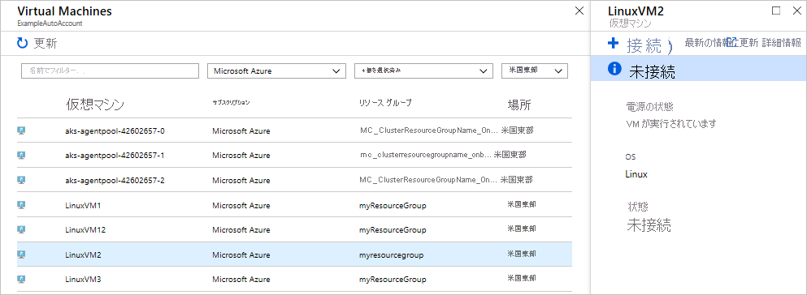
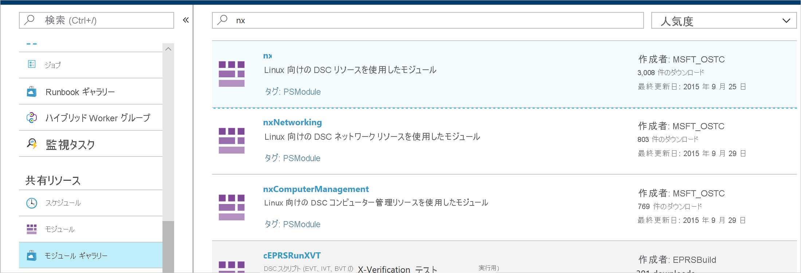
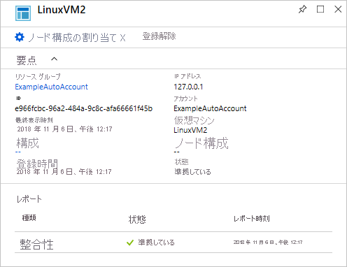
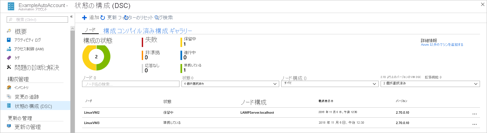

# <a name="configure-a-vm-with-desired-state-configuration"></a>Desired State Configuration を使用して VM を構成する

Azure Automation State Configuration を有効にすると、Desired State Configuration (DSC) を使用して、Windows および Linux サーバーの構成を管理および監視できます。 目的の構成から外れている構成を特定し、自動修正することができます。 このクイックスタートでは、Azure Linux VM を有効にし、Azure Automation の State Configuration を使用して LAMP スタックをデプロイする手順について説明します。

## <a name="prerequisites"></a>前提条件

このクイック スタートを完了するには、次のものが必要です。

* Azure サブスクリプション。 Azure サブスクリプションをお持ちでない場合は、[無料アカウントを作成](https://azure.microsoft.com/free/)してください。
* Azure Automation アカウント。 Azure Automation 実行アカウントの作成手順については、 [Azure 実行アカウント](../manage-runas-account.md)に関するページをご覧ください。
* Red Hat Enterprise Linux、CentOS、または Oracle Linux を実行している Azure Resource Manager 仮想マシン。 VM の作成手順については、「[Azure Portal で Linux 仮想マシンを作成する](../../virtual-machines/linux/quick-create-portal.md)」を参照してください。

## <a name="sign-in-to-azure"></a>Azure へのサインイン
https://portal.azure.com で Azure にサインインします。

## <a name="enable-a-virtual-machine"></a>仮想マシンを有効にする

Automation State Configuration は、マシンでさまざまな方法で有効にできます。 このクイックスタートでは、Automation アカウントを使用して Azure VM でこの機能を有効にする方法について説明します。 State Configuration をお使いのコンピューターで有効にするさまざまな方法については、[Azure Automation State Configuration でのマシンの管理の有効化](../automation-dsc-onboarding.md)に関する記事を参照してください。

1. Azure portal で、 **[Automation アカウント]** に移動します。
1. Automation アカウントの一覧から、アカウントを選択します。
1. Automation アカウントの左ペインから、 **[State Configuration (DSC)]** を選択します。
2. **[追加]** をクリックして、 **[VM の選択]** ページを開きます。
3. DSC を有効にする仮想マシンを探します。 検索フィールドとフィルター オプションを使用して、特定の仮想マシンを検索することができます。
4. 仮想マシンをクリックし、 **[接続]** をクリックします。
5. 仮想マシンに適した DSC 設定を選択します。 構成を既に準備している場合は、`Node Configuration Name` として指定できます。 [構成モード](/powershell/scripting/dsc/managing-nodes/metaConfig)を設定して、マシンの構成動作を制御することができます。
6. **[OK]** をクリックします。 DSC 拡張機能が仮想マシンにデプロイされている場合は、その状態が `Connecting` と報告されます。



## <a name="import-modules"></a>モジュールをインポートする

モジュールには DSC リソースが含まれており、多くは [PowerShell ギャラリー](https://www.powershellgallery.com)にあります。 コンパイルする前に、構成で使用されているリソースを Automation アカウントにインポートする必要があります。 このクイックスタートでは、**nx** というモジュールが必要です。

1. Automation アカウントの左ペインから、 **[共有リソース]** の下の **[モジュール ギャラリー]** を選択します。
1. 名前の一部「`nx`」を入力してインポートするモジュールを検索します。
1. インポートするモジュールの名前をクリックします。
1. **[インポート]** をクリックします。



## <a name="import-the-configuration"></a>構成をインポートする

このクイックスタートでは、マシンで Apache HTTP Server、MySQL、および PHP を構成する DSC 構成を使用します。 「[DSC 構成](/powershell/scripting/dsc/configurations/configurations)」を参照してください。

テキスト エディターで次のように入力し、**AMPServer.ps1** としてローカルに保存します。

```powershell-interactive
configuration 'LAMPServer' {
   Import-DSCResource -module "nx"

   Node localhost {

        $requiredPackages = @("httpd","mod_ssl","php","php-mysql","mariadb","mariadb-server")
        $enabledServices = @("httpd","mariadb")

        #Ensure packages are installed
        ForEach ($package in $requiredPackages){
            nxPackage $Package{
                Ensure = "Present"
                Name = $Package
                PackageManager = "yum"
            }
        }

        #Ensure daemons are enabled
        ForEach ($service in $enabledServices){
            nxService $service{
                Enabled = $true
                Name = $service
                Controller = "SystemD"
                State = "running"
            }
        }
   }
}
```

構成をインポートするには：

1. Automation アカウントの左側のウィンドウで **[状態の構成 (DSC)]** を選択し、 **[構成]** タブをクリックします。
2. **[+ 追加]** をクリックします。
3. 前の手順で保存した構成ファイルを選択します。
4. **[OK]** をクリックします。

## <a name="compile-a-configuration"></a>構成をコンパイルする

DSC 構成をノードに割り当てるには、先に DSC 構成をノードの構成 (MOF ドキュメント) としてコンパイルする必要があります。 コンパイルでは構成が検証されます。また、パラメーター値を入力できます。 構成のコンパイルの詳細については、[State Configuration での構成のコンパイル](../automation-dsc-compile.md)に関するページを参照してください。

1. Automation アカウントの左側のウィンドウで **[状態の構成 (DSC)]** を選択し、 **[構成]** タブをクリックします。
1. 構成 `LAMPServer` を選択します。
1. メニュー オプションから **[コンパイル]** を選択し、 **[はい]** をクリックします
1. [構成] ビューに、キューに格納されている新しいコンパイル ジョブが表示されます。 ジョブが正常に完了すると、次の手順に進むことができます。 失敗した場合は、コンパイル ジョブをクリックして詳細を確認できます。

## <a name="assign-a-node-configuration"></a>ノード構成を割り当てる

コンパイルしたノード構成は、DSC ノードに割り当てることができます。 割り当てによって構成がマシンに適用され、その構成から外れている点が監視または自動修正されます。

1. Automation アカウントの左ペインで **[状態の構成 (DSC)]** を選択し、 **[ノード]** タブをクリックします。
1. 構成の割り当て先となるノードを選択します。
1. **[ノード構成の割り当て]** をクリックします
1. ノードの構成 `LAMPServer.localhost` を選択し、 **[OK]** をクリックします。 コンパイルされた構成が State Configuration によってノードに割り当てられ、ノードの状態が `Pending` に変わります。 次回の定期的なチェックで、ノードは構成を取得して適用し、状態をレポートします。 ノードの設定に応じて、ノードが構成を取得するまでに最大 30 分かかることがあります。 
1. 即時のチェックを強制するには、Linux 仮想マシンのローカルで次のコマンドを実行します。`sudo /opt/microsoft/dsc/Scripts/PerformRequiredConfigurationChecks.py`



## <a name="view-node-status"></a>ノードの状態を表示する

State Configuration によって管理されるすべてのノードの状態は、Automation アカウントで確認できます。 **[状態の構成 (DSC)]** を選択し、 **[ノード]** タブをクリックすると情報が表示されます。状態、ノード構成、または名前の検索で表示を絞り込むことができます。



## <a name="next-steps"></a>次のステップ

このクイックスタートでは、Azure Linux VM で State Configuration を有効にし、LAMP スタックの構成を作成して VM にデプロイしました。 Azure Automation State Configuration を使用して継続的デプロイを有効にする方法については、次の記事を参照してください。

> [!div class="nextstepaction"]
> [Chocolatey を使用して継続的デプロイを設定する](../automation-dsc-cd-chocolatey.md)
