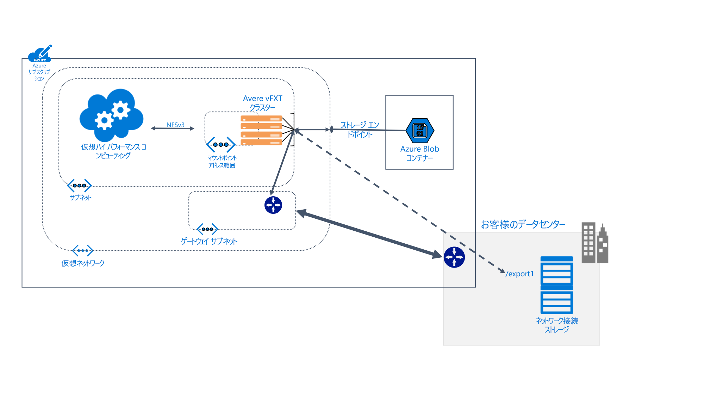

# Avere vFXT for Azure とは

Avere vFXT for Azure は、データ集約型のハイ パフォーマンス コンピューティング (HPC) タスク向けのファイルシステム キャッシュ ソリューションです。 これを使用すると、クラウド コンピューティングのスケーラビリティを活かして、データがお客様のオンプレミス ハードウェアに格納されている場合であっても、必要なときに必要な場所でデータにアクセスできるようになります。

Avere vFXT でサポートされる一般的なコンピューティング シナリオは以下のとおりです。

* ハイブリッド クラウド アーキテクチャ - Avere vFXT for Azure ではハードウェア ストレージ システムと連携できるため、ファイルを移動せずにクラウド コンピューティングを利用できます。

* クラウド バースト - Avere vFXT for Azure は、お客様が単一のプロジェクトでデータをクラウドに移行するのに役立ちます。または、ワークフロー全体を完全に "リフトアンドシフト" するのに役立ちます。

Avere vFXT for Azure は、以下の場合に最も適しています。

* HPC ワークロードでの読み取り負荷の高い操作
* 一般的な NFS プロトコルを使用したアプリケーション
* 1,000 から 40,000 CPU コアのコンピューティング ファーム
* オンプレミス ハードウェア NAS、Azure Blob Storage、またはその両方との統合

詳細については、<https://azure.microsoft.com/services/storage/avere-vfxt/> にアクセスしてください

## Avere vFXT for Azure のユーザー

Avere vFXT は、各種の読み取り集中型コンピューティング タスクに役立ちます。

### 視覚効果のレンダリング

メディアとエンターテイメントの分野では、Avere vFXT クラスターによって、タイムクリティカルなレンダリング プロジェクトでデータ アクセスをスピードアップできます。 Azure でより多くのキャッシュ領域とコンピューティング ノードを追加できるので、大規模なプロジェクトに効率的に対処できる柔軟性が得られます。

### ライフ サイエンス

Avere vFXT を使用すると、研究者は Azure コンピューティングで二次的な分析ワークフローを実行して、場所に関係なくゲノム データにアクセスできます。

Avere vFXT クラスターは、医薬品研究において、薬と標的の相互作用を予測して研究データを分析する研究者を支援し、創薬を迅速化することができます。

### 金融サービスの分析

Avere vFXT クラスターは定量分析の計算をスピードアップするのに役立ちます。これにより、金融サービス会社はより優れた分析情報を得て戦略的な決定を行えます。

## 機能と仕様

Avere vFXT システムは 3 つ以上の仮想エッジ ファイラー ノードから成り、クラスターで構成されます。 これはクライアント マシンの近くに配置できます。クライアント マシンではストレージが直接マウントされるのではなく、クラスターがマウントされます。

Avere vFXT は、ファイルが要求されたときにそれらをキャッシュします。 繰り返しの要求は、80% を超える時間、キャッシュから提供できます。

### 互換性

* NetApp または Dell EMC Isilon のハードウェア NAS システムとの互換性
* Azure BLOB との互換性
* NFSv3 または SMB2 のプロトコルを使用

Avere vFXT for Azure では次の Azure リソースが使用されます。

|Azure のコンポーネント|   |
|----------|-----------|
|仮想マシン|3 つ以上の E32s_v3|
|Premium SSD ストレージ|200 GB の OS スペース、およびノードあたり 1 から 4 TB のキャッシュ |
|ストレージ アカウント (オプション) |v2|
|データ バックエンド ストレージ (オプション) | 1 つの空の LRS BLOB コンテナー |

## 次のステップ

次の記事を読んで、独自の Avere vFXT for Azure デプロイを計画、作成します。

* [システムの計画](avere-vfxt-deploy-plan.md)
* [デプロイの概要](avere-vfxt-deploy-overview.md)
* [vFXT の作成](avere-vfxt-deploy.md)
