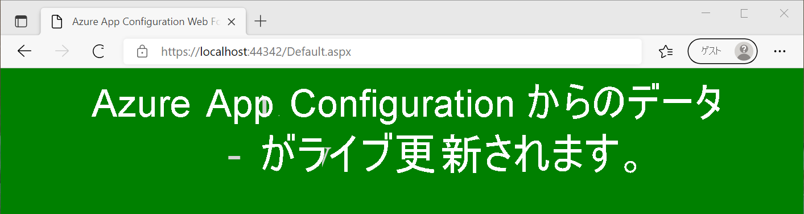

# <a name="tutorial-use-dynamic-configuration-in-an-aspnet-web-application-net-framework"></a>チュートリアル: ASP.NET Web アプリケーション (.NET Framework) で動的構成を使用する

App Configuration からのデータは、.NET Framework アプリケーションでアプリ設定として読み込むことができます。 詳細については、[クイックスタート](./quickstart-dotnet-app.md)を参照してください。 ただし、.NET Framework の設計により、アプリ設定はアプリケーションの再起動時にのみ更新できます。 App Configuration .NET プロバイダーは、.NET Standard ライブラリです。 アプリケーションの再起動なしで、構成の動的なキャッシュと更新がサポートされます。 このチュートリアルでは、ASP.NET Web Forms アプリケーションに、構成の動的更新を実装する方法について説明します。 .NET Framework MVC アプリケーションにも同じ手法が適用されます。

このチュートリアルでは、次の作業を行う方法について説明します。

> [!div class="checklist"]
> * App Configuration ストアへの変更に合わせて構成を更新するように ASP.NET Web アプリケーションを設定する。
> * 最新の構成をアプリケーションへの要求に挿入する。

## <a name="prerequisites"></a>前提条件

- Azure サブスクリプション - [無料アカウントを作成する](https://azure.microsoft.com/free/)
- [Visual Studio](https://visualstudio.microsoft.com/vs)
- [.NET Framework 4.7.2 以降](https://dotnet.microsoft.com/download/dotnet-framework)

## <a name="create-an-app-configuration-store"></a>App Configuration ストアを作成する

[!INCLUDE[Azure App Configuration resource creation steps](../../includes/azure-app-configuration-create.md)]

7. **[操作]**  >  **[構成エクスプローラー]**  >  **[作成]**  >  **[キー値]** の順に選択して、次のキーと値を追加します。

    | キー                                | 値                               |
    |------------------------------------|-------------------------------------|
    | *TestApp:Settings:BackgroundColor* | *白*                             |
    | *TestApp:Settings:FontColor*       | *Black*                             |
    | *TestApp:Settings:FontSize*        | *40*                                |
    | *TestApp:Settings:Message*         | *Azure App Configuration からのデータ* |
    | *TestApp:Settings:Sentinel*        | *v1*                                |

    **[ラベル]** と **[コンテンツの種類]** は空のままにしておきます。

## <a name="create-an-aspnet-web-application"></a>ASP.NET Web アプリケーションを作成する

1. Visual Studio を開始し、 **[新しいプロジェクトの作成]** を選択します。

1. プロジェクト テンプレートの一覧から C# の **[ASP.NET Web アプリケーション (.NET Framework)]** を選択し、 **[次へ]** をクリックします。

1. **[新しいプロジェクトの構成]** で、プロジェクト名を入力します。 **[フレームワーク]** で、 **.NET Framework 4.7.2** 以上を選択します。 **[作成]** をクリックします。

1. **[新しい ASP.NET Web アプリケーションを作成する]** で、 **[Web Forms]** を選択します。 **[作成]** をクリックします。

## <a name="reload-data-from-app-configuration"></a>App Configuration からデータを再度読み込む

1. プロジェクトを右クリックし、 **[NuGet パッケージの管理]** を選択します。 **[参照]** タブで、次の NuGet パッケージの最新バージョンを検索し、プロジェクトに追加します。

   *Microsoft.Extensions.Configuration.AzureAppConfiguration*

1. *Global.asax.cs* ファイルを開き、次の名前空間を追加します。
    ```csharp
    using Microsoft.Extensions.Configuration;
    using Microsoft.Extensions.Configuration.AzureAppConfiguration;
    ```

1. 次の静的メンバー変数を `Global` クラスに追加します。
    ```csharp
    public static IConfiguration Configuration;
    private static IConfigurationRefresher _configurationRefresher;
    ```

1. `Application_Start` メソッドを `Global` クラスに追加します。 メソッドが既に存在する場合は、次のコードを追加します。
    ```csharp
    protected void Application_Start(object sender, EventArgs e)
    {
        ConfigurationBuilder builder = new ConfigurationBuilder();
        builder.AddAzureAppConfiguration(options =>
        {
            options.Connect(Environment.GetEnvironmentVariable("ConnectionString"))
                    // Load all keys that start with `TestApp:`.
                    .Select("TestApp:*")
                    // Configure to reload configuration if the registered key 'TestApp:Settings:Sentinel' is modified.
                    .ConfigureRefresh(refresh => 
                    {
                        refresh.Register("TestApp:Settings:Sentinel", refreshAll:true);
                               .SetCacheExpiration(new TimeSpan(0, 5, 0));
                    });
            _configurationRefresher = options.GetRefresher();
        });

        Configuration = builder.Build();
    }
    ```
    `Application_Start` メソッドは、Web アプリケーションへの最初の要求時に呼び出されます。 アプリケーションのライフ サイクル中に 1 回だけ呼び出されます。 そのため、`IConfiguration` オブジェクトを初期化し、App Configuration からデータを読み込むのに適しています。

    `ConfigureRefresh` メソッドでは、変更の監視のために App Configuration ストア内のキーが登録されます。 `Register` メソッドの `refreshAll` パラメーターは、登録されているキーが変更された場合に、すべての構成値を更新する必要があることを示します。 この例では、*TestApp:Settings:Sentinel* キーは、他のすべてのキーの変更を完了した後に更新する "*センチネル キー*" です。 変更が検出されると、アプリケーションによって構成の値がすべて更新されます。 この方法は、すべてのキーの変更を監視する場合と比べると、アプリケーションの構成の一貫性を確保するのに役立ちます。
    
    `SetCacheExpiration` メソッドでは、構成の変更を確認するために新しい要求が App Configuration に対して行われるまでに経過する必要がある最小時間を指定します。 この例では、代わりに 5 分を指定し、既定の有効期限である 30 秒をオーバーライドしています。 これにより、App Configuration ストアに対して行われる可能性のある要求の数が少なくなります。


1. `Application_BeginRequest` メソッドを `Global` クラスに追加します。 メソッドが既に存在する場合は、次のコードを追加します。
    ```csharp
    protected void Application_BeginRequest(object sender, EventArgs e)
    {
        _ = _configurationRefresher.TryRefreshAsync();
    }
    ```
    `ConfigureRefresh` メソッドを単独で呼び出しても、構成は自動的に更新されません。 すべての要求の最初に `TryRefreshAsync` メソッドを呼び出して、更新を通知します。 この設計により、要求がアクティブに受信されている場合にのみ、アプリケーションが App Configuration に要求を送信するようになります。 
    
    `TryRefreshAsync` の呼び出しは、構成されたキャッシュの有効期限が過ぎる前には操作を実行しないので、パフォーマンスへの影響は最小限になります。 App Configuration に対する要求が行われたときに、タスクを待機しないと、現在の要求の実行をブロックせずに、構成が非同期的に更新されます。 現在の要求では更新された構成値が取得されない場合がありますが、それ以降の要求では行われます。

    何らかの理由で呼び出し `TryRefreshAsync` が失敗した場合、アプリケーションではキャッシュされた構成が引き続き使用されます。 構成されたキャッシュの有効期限が再度切れて、アプリケーションに対して `TryRefreshAsync` 呼び出しが新しい要求によってトリガーされると、もう 1 回試行されます。

## <a name="use-the-latest-configuration-data"></a>最新の構成データを使用する

1. *Default.aspx* を開いて、その内容を次のマークアップに置き換えてください。 *Inherits* 属性が、アプリケーションの名前空間とクラス名に一致していることを確認します。
    ```xml
    <%@ Page Language="C#" AutoEventWireup="true" CodeBehind="Default.aspx.cs" Inherits="WebFormApp.Default" %>

    <!DOCTYPE html>

    <html xmlns="http://www.w3.org/1999/xhtml">
    <head runat="server">
        <title>Azure App Configuration Web Forms Demo</title>
    </head>
    <body id="body" runat="server">
        <form id="form1" runat="server">
            <div style="text-align: center">
                <asp:Label ID="message" runat="server" />
            </div>
        </form>
    </body>
    </html>
    ```

1. *Default.aspx.cs* を開き、次のコードで更新します。
    ```cs
    using System;
    using System.Web.UI.WebControls;

    namespace WebFormApp
    {
        public partial class Default : System.Web.UI.Page
        {
            protected void Page_Load(object sender, EventArgs e)
            {
                // Read configuration from the IConfiguration object loaded from Azure App Configuration
                string messageText = Global.Configuration["TestApp:Settings:Message"] ?? "Please add the key \"TestApp:Settings:Message\" in your Azure App Configuration store.";
                string messageFontSize = Global.Configuration["TestApp:Settings:FontSize"] ?? "20";
                string messageFontColor = Global.Configuration["TestApp:Settings:FontColor"] ?? "Black";
                string backgroundColor = Global.Configuration["TestApp:Settings:BackgroundColor"] ?? "White";

                message.Text = messageText;
                message.Font.Size = FontUnit.Point(int.Parse(messageFontSize));
                message.ForeColor = System.Drawing.Color.FromName(messageFontColor);
                body.Attributes["bgcolor"] = backgroundColor;
            }
        }
    }
    ```

## <a name="build-and-run-the-application"></a>アプリケーションのビルドと実行

1. **ConnectionString** という名前の環境変数を、App Configuration ストアの作成中に取得した読み取り専用のキー接続文字列に設定します。

    Windows コマンド プロンプトを使用する場合は、次のコマンドを実行します。
    ```console
    setx ConnectionString "connection-string-of-your-app-configuration-store"
    ```

    Windows PowerShell を使用する場合は、次のコマンドを実行します。
    ```powershell
    $Env:ConnectionString = "connection-string-of-your-app-configuration-store"
    ```

1. 変更を有効にするために、Visual Studio を再起動します。 

1. Ctrl + F5 キーを押して Web アプリケーションをビルドし、実行します。

    

1. Azure portal で、App Configuration ストアの **[構成エクスプローラー]** に移動し、次のキーの値を更新します。 最後に必ずセンチネル キー *TestApp:Settings:Sentinel* を更新してください。

    | キー                                | 値                                                        |
    |------------------------------------|--------------------------------------------------------------|
    | *TestApp:Settings:BackgroundColor* | *緑*                                                      |
    | *TestApp:Settings:FontColor*       | *LightGray*                                                  |
    | *TestApp:Settings:Message*         | *Data from Azure App Configuration - now with live updates!* |
    | *TestApp:Settings:Sentinel*        | *v2*                                                         |

1. ブラウザー ページを最新の情報に更新して新しい構成設定を確認します。 変更を反映するために複数回の更新が必要になる場合があります。または、キャッシュの有効期限を 5 分未満に変更します。 

    

> [!NOTE]
> このチュートリアルで使用したコード例は、[Azure App Configuration の GitHub リポジトリ](https://github.com/Azure/AppConfiguration/tree/main/examples/DotNetFramework/WebFormApp)からダウンロードできます。

## <a name="clean-up-resources"></a>リソースをクリーンアップする

[!INCLUDE [azure-app-configuration-cleanup](../../includes/azure-app-configuration-cleanup.md)]

## <a name="next-steps"></a>次の手順

このチュートリアルでは、App Configuration から動的に構成設定を更新できるように ASP.NET Web Forms アプリケーションを設定しました。 .NET Framework アプリで動的構成を有効にする方法については、次のチュートリアルに進んでください。

> [!div class="nextstepaction"]
> [.NET Framework アプリで動的な構成を有効にする](./enable-dynamic-configuration-dotnet.md)

App Configuration へのアクセスを効率化する Azure マネージド ID を使用する方法については、次のチュートリアルに進んでください。

> [!div class="nextstepaction"]
> [マネージド ID の統合](./howto-integrate-azure-managed-service-identity.md)
