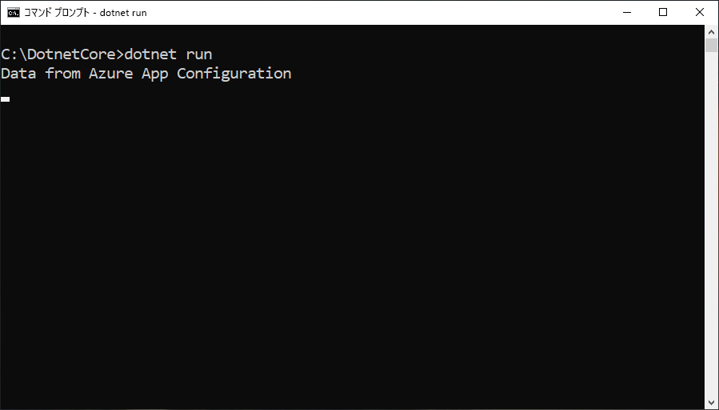

# <a name="tutorial-use-dynamic-configuration-in-a-net-core-app"></a>チュートリアル:.NET Core アプリで動的な構成を使用する

App Configuration .NET Core クライアント ライブラリでは、アプリケーションを再起動させることなく必要に応じて構成設定のセットを更新できます。 これは、最初に構成プロバイダーのオプションから `IConfigurationRefresher` のインスタンスを取得した後、コード内の任意の場所でそのインスタンスの `Refresh` を呼び出すことによって実装できます。

設定の更新を維持しながら、構成ストアの呼び出しが多くなりすぎないようにするため、キャッシュが各設定に使用されます。 設定のキャッシュされた値の有効期限が切れるまで、構成ストアの値が変更された場合でも、更新操作で値は更新されません。 各要求の既定の有効期間は 30 秒ですが、必要な場合はオーバーライドできます。

このチュートリアルでは、自分が作成するコードに、構成の動的更新を実装する方法について説明します。 これは、クイック スタートで紹介されているアプリに基づいています。 先に進む前に、[App Configuration を使用した .NET Core アプリの作成](./quickstart-dotnet-core-app.md)を完了しておいてください。

このチュートリアルの手順は、任意のコード エディターを使用して実行できます。 推奨のエディターは [Visual Studio Code](https://code.visualstudio.com/) です (Windows、macOS、および Linux プラットフォームで使用できます)。

このチュートリアルでは、以下の内容を学習します。

> [!div class="checklist"]
> * App Configuration ストアへの変更に合わせて構成を更新するように .NET Core アプリを設定する。
> * 最新の構成をアプリケーションに取り込む。

## <a name="prerequisites"></a>前提条件

このチュートリアルを実行するには、[.NET Core SDK](https://dotnet.microsoft.com/download) をインストールします。

[!INCLUDE [quickstarts-free-trial-note](../../includes/quickstarts-free-trial-note.md)]

## <a name="reload-data-from-app-configuration"></a>App Configuration からデータを再度読み込む

*Program.cs* を開いてファイルを更新します。`System.Threading.Tasks` 名前空間の参照を追加し、`AddAzureAppConfiguration` メソッドに更新の構成を指定し、`Refresh` メソッドを使用して手動更新をトリガーするようにします。

```csharp
using System;
using System.Threading.Tasks;

namespace TestConsole
{
class Program
{
    private static IConfiguration _configuration = null;
    private static IConfigurationRefresher _refresher = null;

    static void Main(string[] args)
    {
        var builder = new ConfigurationBuilder();
        builder.AddAzureAppConfiguration(options =>
        {
            options.Connect(Environment.GetEnvironmentVariable("ConnectionString"))
                    .ConfigureRefresh(refresh =>
                    {
                        refresh.Register("TestApp:Settings:Message")
                               .SetCacheExpiration(TimeSpan.FromSeconds(10));
                    });
                    
                    _refresher = options.GetRefresher();
        });

        _configuration = builder.Build();
        PrintMessage().Wait();
    }

    private static async Task PrintMessage()
    {
        Console.WriteLine(_configuration["TestApp:Settings:Message"] ?? "Hello world!");

        // Wait for the user to press Enter
        Console.ReadLine();

        await _refresher.Refresh();
        Console.WriteLine(_configuration["TestApp:Settings:Message"] ?? "Hello world!");
    }
}
}
```

更新操作がトリガーされたときに、構成データを App Configuration ストアで更新するために使用する設定を指定するには、`ConfigureRefresh` メソッドを使います。 `AddAzureAppConfiguration` メソッドに提供されたオプションで `GetRefresher` メソッドを呼び出すことによって `IConfigurationRefresher` のインスタンスを取得でき、このインスタンスの `Refresh` メソッドを使ってコード内の任意の場所で更新操作をトリガーできます。
    
> [!NOTE]
> 構成設定の既定のキャッシュ有効期限は 30 秒ですが、`ConfigureRefresh` メソッドへの引数として渡されるオプション初期化子で `SetCacheExpiration` メソッドを呼び出すことにより、オーバーライドできます。

## <a name="build-and-run-the-app-locally"></a>アプリをビルドしてローカルで実行する

1. **ConnectionString** という名前の環境変数に、App Configuration ストアへのアクセス キーを設定します。 Windows コマンド プロンプトを使用する場合は、次のコマンドを実行してコマンド プロンプトを再起動し、変更が反映されるようにします。

        setx ConnectionString "connection-string-of-your-app-configuration-store"

    Windows PowerShell を使用する場合は、次のコマンドを実行します。

        $Env:ConnectionString = "connection-string-of-your-app-configuration-store"

    macOS または Linux を使用する場合は、次のコマンドを実行します。

        export ConnectionString='connection-string-of-your-app-configuration-store'

1. 次のコマンドを実行して、コンソール アプリをビルドします。

        dotnet build

1. ビルドが正常に完了したら、次のコマンドを実行して、アプリをローカルで実行します。

        dotnet run

    

1. [Azure portal](https://portal.azure.com) にサインインする **[すべてのリソース]** を選択し、クイック スタートで作成した App Configuration ストア インスタンスを選択します。

1. **[Configuration Explorer]\(構成エクスプローラー)** を選択して次のキーの値を更新します。

    | Key | 値 |
    |---|---|
    | TestApp:Settings:Message | Azure App Configuration からのデータ - 更新済み |

1. Enter キーを押して更新をトリガーし、コマンド プロンプト ウィンドウまたは PowerShell ウィンドウに更新された値を表示します。

    
    
    > [!NOTE]
    > 更新操作の構成を指定するときに `SetCacheExpiration` メソッドを使ってキャッシュの有効期限を 10 秒に設定したため、構成設定の値は、その設定の前回の更新から少なくとも 10 秒が経過した場合にのみ更新されます。

## <a name="clean-up-resources"></a>リソースをクリーンアップする

[!INCLUDE [azure-app-configuration-cleanup](../../includes/azure-app-configuration-cleanup.md)]

## <a name="next-steps"></a>次のステップ

このチュートリアルでは、App Configuration から動的に構成設定を更新できるように .Net Core アプリを設定しました。 App Configuration へのアクセスを効率化する Azure マネージド ID を使用する方法については、次のチュートリアルに進んでください。

> [!div class="nextstepaction"]
> [マネージド ID の統合](./howto-integrate-azure-managed-service-identity.md)
